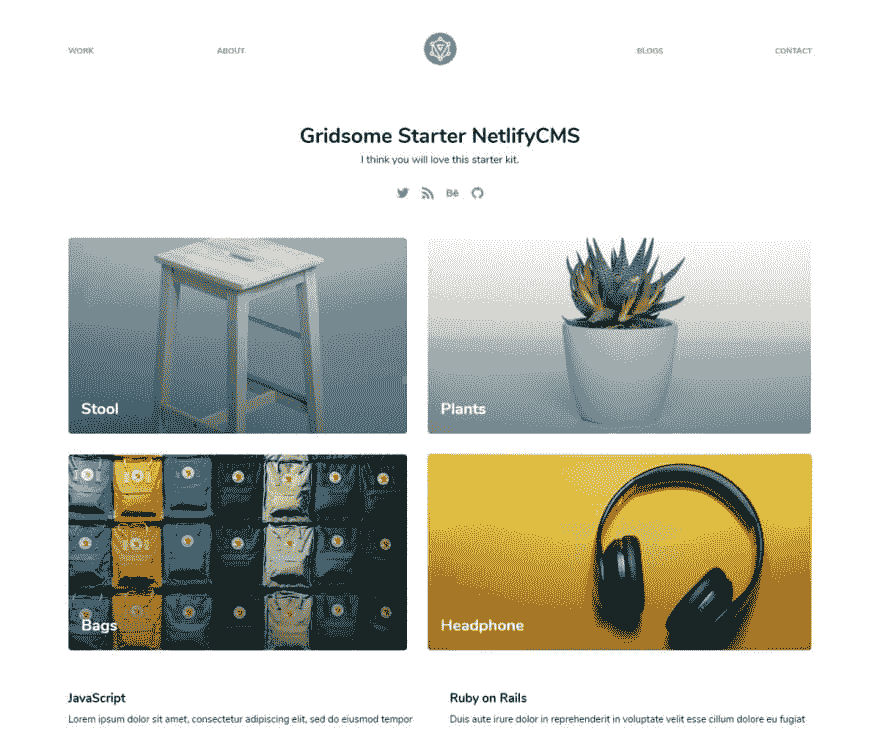

# 如何将 Netlify CMS 与 Gridsome 整合？

> 原文：<https://dev.to/mittalyashu/how-to-integrate-netlify-cms-with-gridsome-188a>

Gridsome 太棒了🤘🏻和与其他工具集成的可能性是无限的...

让我们开始学习如何将 Netlify CMS 与 Gridsome 集成。

> 没关系，如果你不想跟随，你可以开始使用这个[grid some Starter NetlifyCMS Kit](https://github.com/mittalyashu/gridsome-starter-netlifycms)、 *easy peasy* 。对吗？😲

* * *

Netlify CMS 可以处理存储在 GitHub、GitLab 或 BitBucket 上的 git 存储库中的各种文件格式`markdown`、`JSON`、`YAML`或`TOML`。包含两个文件的静态`admin`文件夹，在您的 repo 的`/static`目录下运行 Netlify CMS。

在`admin`目录中，所有的🌟神奇的事情发生了，你将创建两个文件:

```
admin
 ├ index.html
 └ config.yml 
```

第一个文件`admin/index.html`是🚪Netlify CMS 管理界面的入口点。这意味着您可以导航到`yoursite.com/admin/`来访问它。在代码方面，这是一个加载 Netlify CMS JavaScript 文件的基本 HTML 起始页面。

```
<!doctype html>
<html>
<head>
  <meta charset="utf-8" />
  <meta name="viewport" content="width=device-width, initial-scale=1.0" />
  Content Manager
</head>
<body>
  <!-- Include the script that builds the page and powers Netlify CMS -->
  <script src="https://unpkg.com/netlify-cms@^2.0.0/dist/netlify-cms.js"></script>
</body>
</html> 
```

第二个文件`admin/config.yml`，是 Netlify CMS 的核心，有点复杂。添加本节中的所有代码片段，转到您的`admin/config.yml`文件。

## 后端

我们将使用 Netlify 来托管和🙈认证，所以后端配置相当简单。

```
backend:
  name: github
  branch: master # Branch to update (optional; defaults to master) 
```

## 媒体和公共文件夹

Netlify CMS 允许您直接在编辑器中上传🖼图像。为此，CMS 需要知道在哪里保存它们。如果在您的`static`目录中已经有一个`images`文件夹，您可以使用它的路径，可能创建一个`uploads`子文件夹，例如:

```
# This line should *not* be indented
media_folder: "images/uploads" # Media files will be stored in the repo under images/uploads 
```

如果你为上传的媒体创建一个新的文件夹，你需要知道你的 Gridsome 期望静态文件在哪里。您可以将媒体文件夹放在与管理文件夹相同的位置。

注意，`media_folder`文件路径是相对于项目根目录的。

```
# These lines should *not* be indented
media_folder: "statimg/uploads" # Media files will be stored in the repo under statimg/uploads
public_folder:img/uploads" # The src attribute for uploaded media will begin witimg/uploads 
```

上面的配置增加了一个新设置`public_folder`。`media_folder`指定上传的文件保存在 repo 中的什么位置，`public_folder`指出它们在发布站点中的什么位置。Image `src`属性使用这个路径，这个路径相对于调用它的文件。由于这个原因，路径通常从站点根目录开始，使用开头的`/`。

如果未设置`public_folder`，则 Netlify CMS 默认为与`media_folder`相同的值，如果未包括 T2，则添加一个开口`media_folder`。

## 收藏

收集💭为静态站点上的不同内容类型定义结构。

假设你的站点有一个博客，文章存储在`blog`目录中，文件以日期标题格式保存，比如`2018-11-20-goosebumps.md`。每篇文章都以 yaml 格式的前题开始，比如:

```
---
layout: blog
title: "Goosebumps"
date: 2018-11-20 23:42:14 -0700
thumbnail:img/ghost.jpg"
---

This is the body content, where I write anything as long as I want, but it has to be in the markdown format, that's the only condition. 😉 
```

在这个例子中，我们的集合设置在您的 Netlify CMS config.yml 文件中应该是这样的:

```
collections:
  - name: "blog" # Used in routes, e.g., /admin/collections/blog
    label: "Blog" # Used in the UI
    folder: "blog" # The path to the folder where the documents are stored
    create: true # Allow users to create new documents in this collection
    slug: "{{year}}-{{month}}-{{day}}-{{slug}}" # Filename template, e.g., YYYY-MM-DD-title.md
    fields: # The fields for each document, usually in front matter
      - {label: "Layout", name: "layout", widget: "hidden", default: "blog"}
      - {label: "Title", name: "title", widget: "string"}
      - {label: "Publish  Date", name: "date", widget: "datetime"}
      - {label: "Featured  Image", name: "thumbnail", widget: "image"}
      - {label: "Body", name: "body", widget: "markdown"} 
```

Netlify CMS 提供了更多的东西，比如过滤器、认证、Git 网关等等🤯。

这是如何与 Gridsome 和 Netlify CMS 集成的初步介绍，要深入了解，请考虑阅读 [Netlify CMS 文档](https://www.netlifycms.org)。

我已经为你建立了一个简单的初学者工具包，很容易上手👇🏻。

[T2】](https://res.cloudinary.com/practicaldev/image/fetch/s---haRW0XZ--/c_limit%2Cf_auto%2Cfl_progressive%2Cq_auto%2Cw_880/https://thepracticaldev.s3.amazonaws.com/i/5kevhchpwd1d8ndt1gx0.jpg)

## 引用

*   [NetlifyCMS Docs](https://www.netlifycms.org/docs/add-to-your-site)
*   [Gridsome 网站](https://gridsome.org)
*   [Gridsome 社区聊天](https://discord.gg/7znJUkH)

觉得这篇文章有趣？考虑给我买杯咖啡。
[T3】](https://www.buymeacoffee.com/mittalyashu)