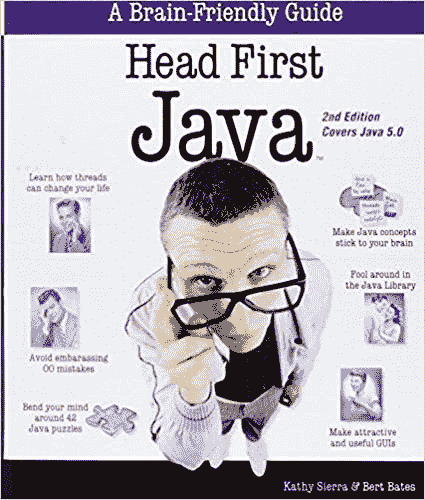
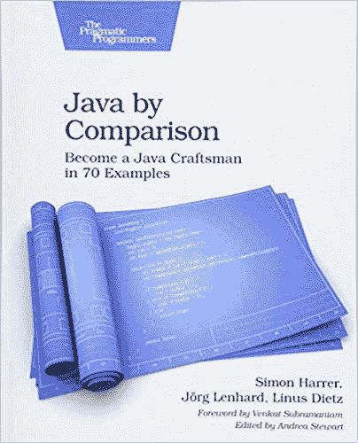
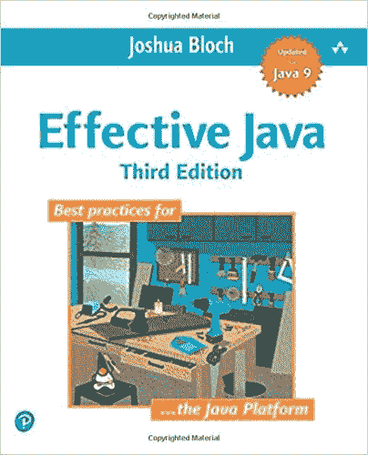

# 如何学习 Java

> 原文：<https://dev.to/simonharrer/how-to-learn-java-1n2j>

<figure> 

<figcaption>照片由[约翰·施诺布里](https://unsplash.com/photos/2FPjlAyMQTA?utm_source=unsplash&utm_medium=referral&utm_content=creditCopyText)上[下](https://unsplash.com/search/photos/learn?utm_source=unsplash&utm_medium=referral&utm_content=creditCopyText)</figcaption>

</figure>

经常有人问我:*嗨，西蒙，如何学习 Java？*以下是我通常推荐的五大资源。快乐阅读。快乐学习！

#### Top 1:头先 Java

<figure> 

<figcaption>头头爪哇由卡西塞拉和伯特贝茨</figcaption>

</figure>

我推荐从 *Head First Java* 开始。13 年前我也是这样做的，现在我仍然认为这是开始学习 Java 的最佳书籍。这不是你通常的教科书，所以准备好享受学习 Java 的乐趣吧。看完那本书后，你会惊讶地发现自己知道了多少。

#### Top 2: Java 相比之下

<figure> 

<figcaption></figcaption>

</figure>

接下来，我大言不惭地推荐阅读我合著的书: *Java by Comparison* 。我们在大学教了六年多的 Java，从这段经历中，我们写了 *Java。我们心目中的受众是学生，他们知道足够多的 Java 来编写简单的程序，但缺乏实践，也没有导师来指导他们编写更干净、更易读的代码。它有一个独特的前/后方法来比较坏的代码和更好的代码，所以你可以一步一步地学习如何将代码转换成更好的代码。这是我读完 *Head First Java* 时希望拥有的书。*

#### Top 3:有效 Java

<figure> 

<figcaption>有效 Java:第三版作者约书亚·布洛赫</figcaption>

</figure>

现在，我们继续看关于 Java 的书*，这是一本经典的条目式书籍，提供了无数关于如何正确使用 Java 的见解:*有效的 Java* 。看看这个。当你想称自己为专业的 Java 开发人员时，这是强制性的。*

#### Top 4:头先设计图案

<figure> 

<figcaption>头像图案首先由埃里克·弗里曼和伊丽莎白·罗布森设计</figcaption>

</figure>

当你的程序变得越来越大时，当你在方法、类和包中组织你的代码时，你会开始感到痛苦。这时候你就需要学习软件设计了。我从 *Head First 设计模式*开始了我的旅程。它的学习风格与 *Head First Java* 相似，但重点在于如何设计你的类。

#### Top 5:函数式编程 Java 8

[https://www.youtube.com/embed/15X0qFtBqiQ](https://www.youtube.com/embed/15X0qFtBqiQ)

最后但同样重要的是，随着越来越多的人在 Java 和其他地方采用更函数式的编程风格，我推荐观看独特的文卡特·苏布拉马年解释如何在 Java 8 中以函数式方式编程。看的开心！

#### showtolerant . de

这些[学习 Java 的 5 大资源最初出现在 howtolearn.de](https://howtolearn.de/books/videos/java/beginner/java) 上。请[随意浏览那里的所有其他话题](https://howtolearn.de/)。