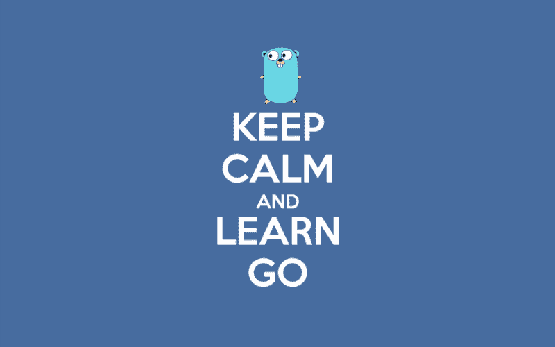

# 如何让 OOP 世界和 golang 心态潜水？

> 原文：<https://dev.to/gsvaldevieso/how-to-let-oop-world-and-dive-in-golang-mindset--14am>

 
各位好。

我已经开始使用 golang，我来自 PHP(一种很好的面向对象语言)。但是我对 golang 的世界有一些疑问。我们有一些好的实践，可以在一些文章、博客帖子和官方页面中找到。但是，构建可维护应用程序的指导方针/良好实践是什么，就像我们在 OOP 世界中的 DDD、CQRS、事件源、SOLID 和其他概念一样。我知道我们不需要忘记所有这些事情，但是我们如何改变它以适应 golang 范式和结构。

我找到了一些回复，但我并不完全满意:

[https://github.com/roblaszczak/go-cleanarch](https://github.com/roblaszczak/go-cleanarch)
T3】https://github.com/CaptainCodeman/clean-go