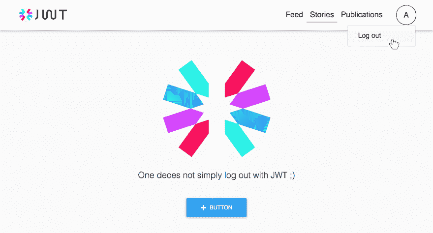

# 使用 JWT 时如何注销

> 原文：<https://dev.to/_arpy/how-to-log-out-when-using-jwt-4ajm>

[T2】](https://res.cloudinary.com/practicaldev/image/fetch/s--kXXo_Ky8--/c_limit%2Cf_auto%2Cfl_progressive%2Cq_auto%2Cw_880/https://thepracticaldev.s3.amazonaws.com/i/13vklhgjviq6pp6bbqy2.jpg)

### JSON Web 令牌的奇妙之处

JSON Web 令牌(JWT)是一种无状态处理用户认证的方式。这是什么意思？JWT 有助于组织身份验证，而无需将身份验证状态存储在任何存储中，无论是会话还是数据库。因此，在检查用户的身份验证状态时，您不需要访问会话或执行数据库查询。相反，您可以根据您选择的用户有效负载生成一个令牌，并在来自客户端的请求中使用它来标识服务器上的用户。🛂

因此，基本上，无论何时创建令牌，它都可以永远使用，或者直到过期。JWT 生成器可以选择在指定时间后使令牌失效。

但是，如果您想使一个现有的令牌无效，该怎么办呢？当用户选择注销，或者说更改密码时，你实际上需要做什么？🤔

### 我们注销吧

好的，通常，当使用 JWT 身份验证时，客户端会将令牌存储在某个地方，并将其附加到每个需要身份验证的请求上。因此，注销时要做的第一件事就是删除您存储在客户端(即浏览器本地存储)上的令牌。在这种情况下，客户端将没有令牌放入请求中，从而导致未经授权的响应状态。但这就够了吗？好吧，那个特定的客户端(浏览器，应用程序)将不再被认证，但是令牌仍然存在于某个地方并且仍然有效！如果有人之前已经从请求中复制了令牌，他/她仍然能够代表用户执行请求！👾你可以很容易地自己尝试一下。

"好的，让我们从后端注销用户！"你会说。但是要控制住马匹。对 JWT 来说没那么简单。您不能删除会话或 cookie 就开始工作。

实际上，JWT 服务于与会话不同的目的，并且不可能强制删除现有令牌或使其无效。

### 令牌过期？

是的，令牌可以过期。不，你不能随叫随到。

为 JWT 的用户有效负载签名时，您可以向其传递到期时间。您可以在有效负载中提供一个名为 **exp** 的字段，如下所示:

```
{  "sub":  "1234567890",  "name":  "John Doe",  "iat":  1516234022,  "exp":  1516239022  } 
```

Enter fullscreen mode Exit fullscreen mode

自 Unix 纪元开始以来,“到期”字段占用毫秒数。因为这里的 iat 字段代表“颁发于”,所以该令牌被设置为在其颁发后 5 秒过期。⏰

***注意:*** 如果你正在使用这里列出的[的 JWT 库之一，很可能你也可以在签名方式选项中传递一个到期时间。](https://jwt.io/#libraries)

如果你不想拥有永远有效的令牌，你应该在你的 JWT 上设置一个合理的到期时间。时间的长短真的取决于你的应用。我们将在这里使用 ***某一天*** 令牌，并在我们的登录操作中生成它们。对于 NodeJS 应用程序，代码应该是这样的:

```
const jwt = require('jsonwebtoken');

const payload = {
  "sub": "1234567890",
  "name": "John Doe",
  "iat": 1516234022
}

const token = jwt.sign(payload, 'your-secret', {expiresIn: '1d'}) 
```

Enter fullscreen mode Exit fullscreen mode

因此，当令牌过期时，验证器将返回一个错误，并且您的后端将在收到需要授权的请求时立即以未授权的响应状态进行响应。通常，您将从客户端取消设置令牌，并将用户重定向到登录页面。因此，在本例中，所有用户在使用你的应用 1 天后将自动注销。

### “酷，但我还是想注销！”➡️

如前所述，您不能在创建令牌后手动使其过期。因此，您实际上无法在服务器端用 JWT 注销🙀或者，除非，你可以…

据说使用 JWT 应该是无状态的，这意味着您应该在有效载荷中存储您需要的一切，并跳过对每个请求执行 DB 查询。但是，如果您计划拥有严格的注销功能，即使您已经从客户端清理了令牌，也不能等待令牌自动过期，那么您可能需要忽略无状态逻辑并进行一些查询。

一种实现可能是存储所有不再有效且尚未过期的令牌的所谓“黑名单”。您可以在文档上使用带有 TTL 选项的 DB，该选项将被设置为令牌过期前的剩余时间。Redis 是一个很好的选择，它允许在内存中快速访问列表。然后，在某种运行在每个授权请求上的中间件中，你应该检查提供的令牌是否在**黑名单中。🕵️‍** 如果是，你应该抛出一个未授权的错误。如果不是，让它去，JWT 验证将处理它并识别它是否过期或仍然有效。

### 结论

<figure>[](https://res.cloudinary.com/practicaldev/image/fetch/s--5F6dVY3f--/c_limit%2Cf_auto%2Cfl_progressive%2Cq_auto%2Cw_880/https://cdn-images-1.medium.com/max/568/1%2AQp_2RBl4GgCn022OZFpkfQ.jpeg) 

<figcaption>一个人不跟 JWT 简单注销……</figcaption>

</figure>

看起来，在使用 JSON Web 令牌时创建一个干净的注销流并不是那么简单。如果您希望在用户注销时限制令牌的使用，您应该让令牌处于活动状态，直到其自行过期，或者选择为注销的令牌使用存储。总结起来，简单地遵循这 4 个要点:

1.  为令牌设置合理的到期时间
2.  注销时从客户端删除存储的令牌
3.  拥有不再活动的令牌的数据库，这些令牌仍有一些生存时间
4.  在每个授权请求中，根据黑名单查询提供的令牌

 **<figure>[](https://res.cloudinary.com/practicaldev/image/fetch/s--EZaghuY1--/c_limit%2Cf_auto%2Cfl_progressive%2Cq_auto%2Cw_880/https://cdn-images-1.medium.com/max/879/1%2Ao-17hHqSjIGvsGU3zaGyXw.png) 

<figcaption>图片来源:cartermatt.com</figcaption>

</figure>**