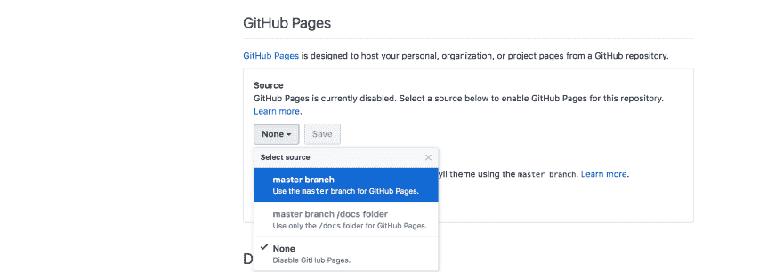
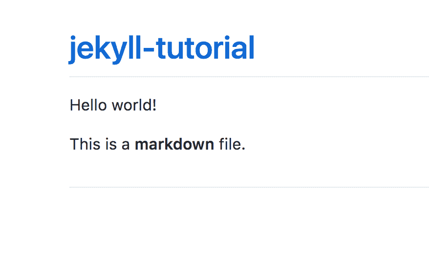
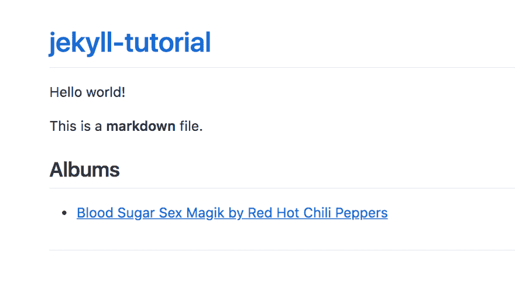
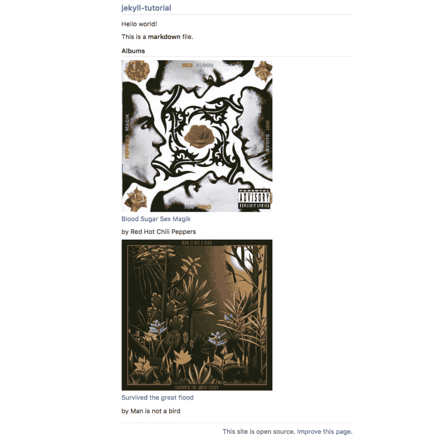
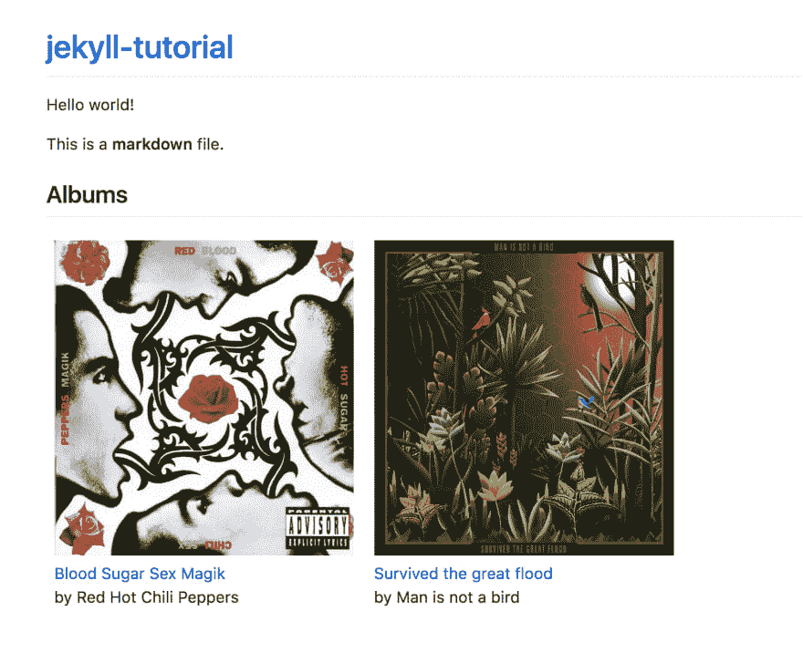

# 如何使用 Jekyll 和 Github 页面在线维护音乐专辑集

> 原文：<https://dev.to/adrienjoly/how-to-maintain-a-collection-of-music-albums-online-using-jekyll-and-github-pages-3hd6>

我喜欢列清单。

任务清单、要读的书清单、我去过的城市清单、我想去的地方清单、我最喜欢的巴黎餐厅清单、最值得推荐的自由职业者清单...

事实上，我很确定至少有一半的商业和生产力应用程序是用来帮助我们维护列表的。

# 动机

我的清单中有一个是我非常珍视的。这是我收藏的音乐专辑。

在过去，它通常由一堆磁带来实现。然后，它变成了一个放 CD 的架子。然后，它变成了一个装满 MP3 文件的文件夹列表，存储在我电脑的硬盘上。

最近，由于 Spotify 这样的服务，直接从互联网上播放音乐变得更加方便，而不必拥有任何东西。最终，我收藏的专辑变成了一长串播放列表，堆在我的 Spotify 窗口的左边，没有封面...

我在便利性、节省房间空间和减少对丢失(或损坏)材料记录的恐惧方面肯定有所收获。但是，在欣赏美丽的封面艺术的同时，随意浏览我的收藏又有什么乐趣呢？失落。

让我们解决这个问题。让我们再次找回拥有一个美丽音乐收藏的喜悦吧！

# 已有解决方案

有许多方法可以保存相册收藏。

首先，Spotify 确实允许我*添加*一张专辑到我的收藏中，以后可以在“专辑”页面找到它。但不幸的是，这个列表还包括包含我在 Spotify 上喜欢过的每首歌曲的专辑，尽管我并不关心这张专辑的其余部分...所以最终，它看起来并不像是精选的专辑。

所以我们来问问谷歌:“相册收藏在线”。第一个结果是[discogs.com](https://www.discogs.com)。这个网站允许创建一个个人资料和添加专辑到我的收藏，封面艺术！但它显然是为黑胶唱片收藏家设计的，因为每张专辑都有不同的版本和不同的曲目列表，你必须从其中选择*一张*才能将其添加到你的收藏中。对我来说太麻烦了...此外，我没有找到任何方法来播放专辑在一个点击从那里。

如果我使用一个更通用的服务来以可视化的方式维护我的集合会怎么样？Pinterest 似乎是一个不错的候选人！不幸的是，Pinterest 只为每张图片提供了一个全文描述字段，因此无法按艺术家或流派浏览相册...

也许我应该把我的收藏保存在一个数据库里，并安装一个软件来维护它？一个有几个插件和一个好主题的内容管理系统(比如 Wordpress)可能会起作用。但是代价是什么呢？我需要在一个 PHP 服务器上托管它，运行软件更新，调整别人制作的插件和主题，可能还要为托管付费。这似乎太复杂了。

如何用简单的 CSS 样式将我的列表保存在一个静态 HTML 文件中，使它看起来像一个素材相册集？那肯定不那么复杂，出版成本也低！但也很容易预测其局限性:每次我想添加专辑时都必须编辑 HTML 代码，必须添加 JavaScript / DOM 操作才能让艺术家浏览和搜索...

如果我可以在一个文本文件中维护我的相册列表，并从中自动生成 HTML 文件，会怎么样？🤔

这不就是 Github Pages 免费支持的 Jekyll 的承诺吗？

就是这样！我终于找到了一个学习使用 Jekyll 的好借口！

# 设计解决方案

让我们回顾一下我对自己专辑的期望:

1.  在美丽的画廊展示封面艺术
2.  从 Spotify 或其他网站一键播放专辑
3.  按艺术家或流派浏览
4.  快速简单的 CRUD 操作(即创建、检索、更新和删除相册)
5.  快速搜索
6.  数据丢失或损坏的风险低
7.  在线提供，让全世界都可以看到！
8.  易于分叉，适用于希望创建自己的集合的其他开发人员。

我知道对我来说，构建一个 HTML+CSS 网页来涵盖第 1 点和第 2 点是非常容易的。

我了解到 Jekyll 可以基于用 YAML 表示的数据文件生成静态 HTML 页面，这是一种类似于 Markdown 的几乎纯文本的结构化标记格式。这可以涵盖第 3 点和第 4 点。

我也知道 Github Pages 是我最喜欢的免费发布网页的方式，它支持 Jekyll 开箱即用。这意味着，如果我将 Jekyll 文件放入我的存储库中，Github 将自动生成结果 HTML 页面。当然，我也可以在笔记本电脑上离线运行 Jekyll。这将涵盖第 6 至第 8 点。

[T2】](https://pages.github.com/)

快速搜索呢？哦，等等！我为 Algolia 工作，我的一个同事做了一个插件，可以让任何 Jekyll 网站都可以被搜索到: [Jekyll-Algolia](https://community.algolia.com/jekyll-algolia/) ！

那听起来像是一个现实而令人兴奋的计划！让我们把这变成现实吧！

# 第一步。初始化 Github 页面上的 Jekyll 页面

首先，让我们为自己设定一个简单的目标:让 Github Pages 从一个简单的 Markdown 文件呈现并发布一个 HTML 文件。

我假设您有一个 Github 存储库(无论是否是新的)来存放您的 Jekyll 文件。如果没有，请创建一个，并确保您能够从您的计算机提交和推送文件到它。我会跟进那部电影的每一步:[github.com/adrienjoly/jekyll-tutorial](https://github.com/adrienjoly/jekyll-tutorial)。

让我们在存储库的`master`分支的根目录下添加一个`index.md`文件，内容如下:

```
Hello world!

This is a **markdown** file. 
```

现在，我们请 Github Pages 将其渲染并发布为网站。为此，进入你的库的设置页面(我的:[https://github.com/adrienjoly/jekyll-tutorial/settings](https://github.com/adrienjoly/jekyll-tutorial/settings)，在“GitHub Pages”部分选择`master`分支作为“Source”:

[T2】](https://res.cloudinary.com/practicaldev/image/fetch/s--_YvyPNar--/c_limit%2Cf_auto%2Cfl_progressive%2Cq_auto%2Cw_880/https://github.com/adrienjoly/album-shelf/raw/master/docs/github-repo-pages.png)

然后点击“保存”。

现在，您应该能够通过在 web 浏览器中打开 URL `https://<your_username>.github.com/<your_repo_name>`来查看您的索引。如果一切顺利的话，多亏了 Jekyll，Github Pages 一定已经用 HTML 呈现出来了，看起来像这样:

[T2】](https://res.cloudinary.com/practicaldev/image/fetch/s--9IlyoXaU--/c_limit%2Cf_auto%2Cfl_progressive%2Cq_auto%2Cw_880/https://thepracticaldev.s3.amazonaws.com/i/181lwcjbezci8pql3vha.png)

干得好！

# 第二步。使用 Jekyll 呈现一个简单列表

现在，让我们将一个简单的列表集成到页面中。

为此，我们将:

1.  在`_data`文件夹中创建一个`.yaml`文件，
2.  并添加一个模板来整合其在`index.md`中的数据。

在我的例子中，我将创建一个包含以下内容的`_data/albums.yaml`文件:

```
- title: Blood Sugar Sex Magik
  artist: Red Hot Chili Peppers
  img: https://i.scdn.co/image/5a6a1c6514398dc4004c6348a83d77694a3883d4
  url: https://open.spotify.com/album/30Perjew8HyGkdSmqguYyg 
```

然后，我将下面的模板添加到`index.md`:

```
## Albums


- [{{ album.title }} by {{ album.artist }}]({{ album.url }})
 
```

该模板将为来自`_data/albums.yaml`的每个项目呈现一个 HTML 列表项目。每个项目都将呈现为一个超链接，显示专辑的标题和艺术家，并链接到其 Spotify 页面。

来刷新一下`https://<your_username>.github.com/<your_repo_name>`。给 Github 几秒钟时间重新渲染网站后，结果页面应该是这样的:

[T2】](https://res.cloudinary.com/practicaldev/image/fetch/s--sacd-KTw--/c_limit%2Cf_auto%2Cfl_progressive%2Cq_auto%2Cw_880/https://thepracticaldev.s3.amazonaws.com/i/q7m3720s0ja6vhpjaljs.png)

我们取得了一些进展！

当然，你可以在`_data/albums.yaml`中添加任意多的物品！

有关 YAML 格式语法的更多信息，请阅读[YAML 格式(Symfony Docs)](https://symfony.com/doc/current/components/yaml/yaml_format.html) 。

# 第三步。让它看起来更好

现在我们知道了如何在 YAML 创建一个列表，以及如何在 Markdown 中呈现它，让我们让它看起来像一个合适的相册集合！

首先缺少的是封面艺术。

为了显示图像，我们当然可以使用 Markdown 语法:``。但是，为了在设计我们的列表时获得更大的灵活性，我们将使用一些好的旧 HTML 来代替。是的，Jekyll 支持降价文件中的 HTML 标记。

让我们用这个模板替换我们在上一步中集成的模板:

```

  <article>
    <a href="{{ album.url }}">
      
      <p>{{ album.title }}</p>
    </a>
    <p>by {{ album.artist }}</p>
    
      <span class="release-date">{{ album.release_date | date: "%b %-d, %Y" }}</span>
    
  </article>
 
```

假设您在列表中至少添加了第二本专辑，结果页面可能看起来像这样:

[T2】](https://res.cloudinary.com/practicaldev/image/fetch/s--lIE_tQvR--/c_limit%2Cf_auto%2Cfl_progressive%2Cq_auto%2Cw_880/https://thepracticaldev.s3.amazonaws.com/i/sragw5z78zqfqpg1mr3u.png)

当然，我们可以通过在`index.css`中添加一些样式来做得更好:

```
* {
  box-sizing: border-box;
}

article {
  display: inline-block;
  width: 320px;
  height: 420px;
  padding: 8px;
  overflow: hidden;
}

article img {
  width: 320px;
  height: 320px;
}

.markdown-body article p {
  margin-bottom: 0;
}

.release-date {
  color: gray;
  font-size: 90%;
} 
```

但是，即使在刷新结果页面之后，您也会看到这个样式表没有被 Jekyll 自动选取...

现在我们知道 Markdown 支持 HTML 标记，让我们在`index.md`的顶部添加一个`<link>`元素，来加载我们的样式表:

```
<link rel="stylesheet" href="index.css" /> 
```

刷新页面后，您将有望看到一些 UI 改进:

[T2】](https://res.cloudinary.com/practicaldev/image/fetch/s--NB6SGhqq--/c_limit%2Cf_auto%2Cfl_progressive%2Cq_auto%2Cw_880/https://thepracticaldev.s3.amazonaws.com/i/oc4k59snx3shnyeslcjc.png)

看起来不错！

现在，请随意清理我们的旧测试。(例如“hello world”)

# 进度总结

为了说明我们的进展，让我们更新我在本文开始时提出的需求列表:

1.  ~~在美丽的画廊展示封面艺术~~ ✅
2.  ~~一键播放来自 Spotify 或其他~~ ✅的专辑
3.  按艺术家或流派浏览
4.  ~~快速简单的 CRUD 操作(即创建、检索、更新和删除相册)~~ ✅ ( *改进空间*
5.  快速搜索
6.  ~~数据丢失或损坏的风险低~~ ✅
7.  ~~在线发布，让全世界都可以看到！~~ ✅
8.  ~~易于分叉，适用于其他想要制作自己的收藏的开发人员。~~ ✅

哇，我们用这么少的代码行和这么少的努力做了很多！✊

# 下一步

那么我们能做些什么来让我们的收藏变得更好呢？

首先，我们还没有实现任何按艺术家或流派浏览的方法。有很多方法可以做到这一点，我相信这将是这篇文章的有趣后续！

你看到了在 YAML 维持收藏是很容易的。但是我们可以做得更好。如果只输入名字就能自动填充相册数据，那就太棒了。也许我们可以通过构建一个命令行界面来查询 Spotify 的 API 并自动更新`albums.yaml`来实现这一点！

搜索也欠缺。像我之前提议的那样，尝试一下杰基尔-阿尔戈莉亚会很有趣。

还有一件事:如果我想在离线时使用我的相册集怎么办？更糟糕的是，Github Pages 死了怎么办？我们可以自己运行 Jekyll，从我们的`index.md`模板和`albums.yaml`数据文件生成 HTML 网站吗？是的，我们可以！我们只需要在电脑上安装一些软件工具，并在 Jekyll 网站上添加一些配置。这是我们可以在下一篇文章中一起探讨的另一个主题。

# 结论

我希望这篇文章能让你相信 Jekyll 和 Github 页面是一个强大的(但易于使用的)组合，可以在线维护漂亮而灵活的列表。

作为一个网络爱好者，我希望更多的列表以这种方式维护，并且我们更少地依赖关闭的应用程序来保存我们的数据。这篇文章旨在为推动 DIY(*DIY yourself*)哲学成为我们管理事物列表的方式做出微薄的贡献，更一般地说，是我们管理数据的方式。

读完这篇文章后，我很想看看你的反馈、想法和建议。请让我知道你希望我接下来写什么！