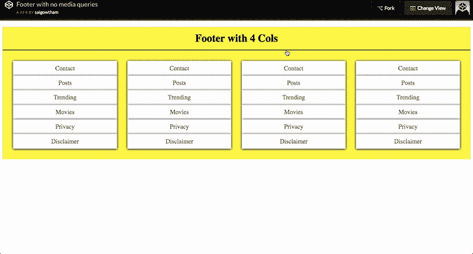

# 如何制作一个没有媒体询问的回应性页脚🗺

> 原文：<https://dev.to/sait/how-to-make-a--4-column-footer-with-no-media-queries--352j>

## 页脚无媒体查询和页边距。

我已经厌倦了为简单的事情编写更多的代码，今天我将展示如何用更少的代码编写更多的功能。我再次使用网格来实现这些。

网格是 css3 中的一个新东西，它是二维的，网格中的主要内容是很容易用更少的时间和代码来制作布局。

[T2】](https://res.cloudinary.com/practicaldev/image/fetch/s--m2-LjYf7--/c_limit%2Cf_auto%2Cfl_progressive%2Cq_66%2Cw_880/https://thepracticaldev.s3.amazonaws.com/i/8dpziaekb3rsuwd2u0c8.gif)

**一行代码做所有事情**

```
 grid-template-columns:repeat(auto-fit,minmax(200px,1fr)); 
```

Enter fullscreen mode Exit fullscreen mode

## 使用自动适应和最小-最大功能。

我将解释最小最大值是什么，最小最大值有两个参数，第一个是最小值，第二个是最大值。

自动适应帮助我们用给定的列覆盖可用空间。

### 在代码笔中检查演示&代码

[https://codepen.io/saigowthamr/embed/yjNLMz?height=600&default-tab=result&embed-version=2](https://codepen.io/saigowthamr/embed/yjNLMz?height=600&default-tab=result&embed-version=2)