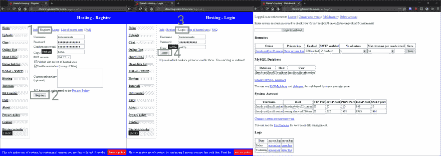

# 如何制作一个洋葱网站

> 原文：<https://dev.to/ahmet/how-to-make-a-onion-site-2l56>

Tor 浏览器是一个强大的免费匿名浏览互联网的工具，它还能以。洋葱地址。如果你拥有或正在创建一个网站，你可能想学习如何创建一个. onion 网站来保护你自己和你的访问者。

## 我如何创建一个. onion 域名？

[T2】](https://res.cloudinary.com/practicaldev/image/fetch/s--9puuR2Al--/c_limit%2Cf_auto%2Cfl_progressive%2Cq_auto%2Cw_880/https://ahmetcadirci.com.img/galeri/onion-hosting-bilgileri.png)

**第一步**。Tor 浏览器开启后将地址[http://dhosting 4 okcs 22v . onion](http://dhosting4okcs22v.onion/register.php)复制到 url 行。
**第二步**。在打开的页面上接受用户名、密码、确认密码、副本和使用协议。
**第三步**。成为会员后，您会收到一条警告消息。将生成 fzrcdjvzulfpczfd.onion 等随机域名。
**第四步**。您可以在[http://dhosting4okcs22v.onion/login.php](http://dhosting4okcs22v.onion/login.php)输入您的用户名和密码登录。
**第五步**。执行输入过程后，控制面板将会显示。

### HTML(演示)网站设置和配置

[ Site Setup and Configuration")T2】](https://res.cloudinary.com/practicaldev/image/fetch/s--9puuR2Al--/c_limit%2Cf_auto%2Cfl_progressive%2Cq_auto%2Cw_880/https://ahmetcadirci.com.img/galeri/onion-hosting-bilgileri.png)

**第一步**。单击控制面板中的文件管理器链接。新标签将会打开。
**第二步**。在弹出页面上输入您的密码。
**第三步**。单击 www 文件夹。
**第四步**。选择 index.hosting.html 文件，然后按下 Delete 键。
**第五步**。下载文件 [tor.zip](https://github.com/ahmetcadirci25/tor/archive/tor.zip) 并选择浏览按钮，点击上传。
**第六步**。选择 [tor.zip](https://github.com/ahmetcadirci25/tor/archive/tor.zip) 并通过按 Unzip 导出我们制作的 html 文件。
**第七步**。 [fzrcdjvzulfpczfd.onion](http://fzrcdjvzulfpczfd.onion) 查看我们上传的 html 文件。

##  [阿赫默德卡特 25 ](https://github.com/ahmetcadirci25) / [托](https://github.com/ahmetcadirci25/tor)

### 如何安装洋葱路由网站？

<article class="markdown-body entry-content" itemprop="text">

# TOR HTML(演示)网站

您可以从连结取得安装详细资料。

[预览](https://ahmetcadirci.com.tr/tor/?utm_source=github&utm_medium=readme&utm_campaign=tor-html-demo-site-onizleme)[设置](https://ahmetcadirci.com.tr/2018/onion-uzantili-tor-sitesi-nasil-kurulur/?utm_source=github&utm_medium=readme&utm_campaign=tor-html-demo-site-kurulum)

</article>

[View on GitHub](https://github.com/ahmetcadirci25/tor)

#### 来源:

[https://ahmetcaddy . com/2018/洋葱延伸 tor 网站-如何安装](https://ahmetcadirci.com.tr/2018/onion-uzantili-tor-sitesi-nasil-kurulur/?utm_source=devto&utm_medium=link&utm_campaign=.ONION%20Uzant%C4%B1l%C4%B1%20Tor%20Sitesi%20Nas%C4%B1l%20Kurulur%3F)