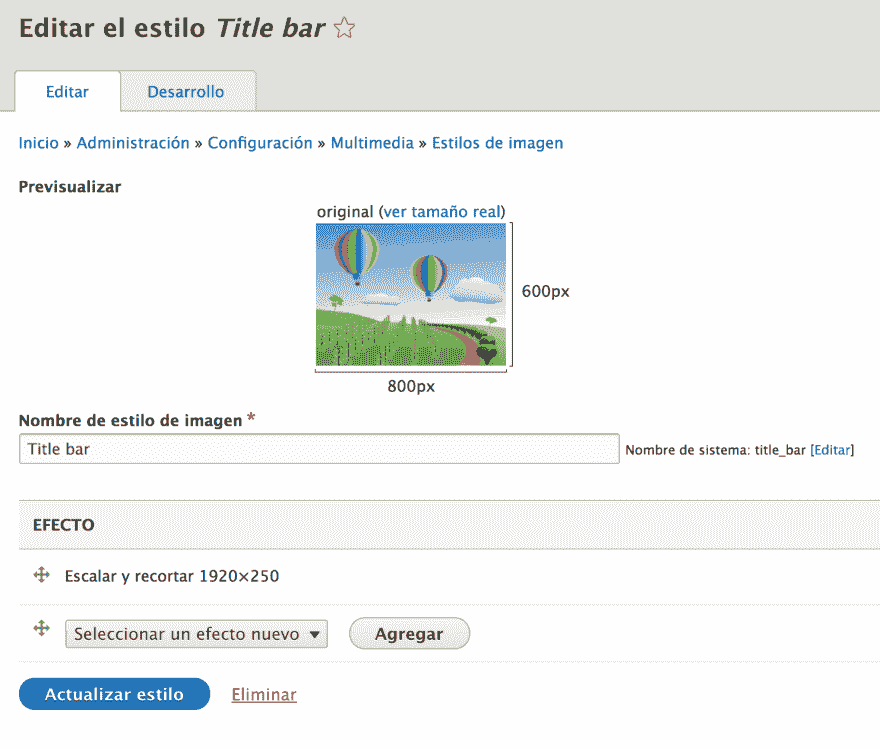
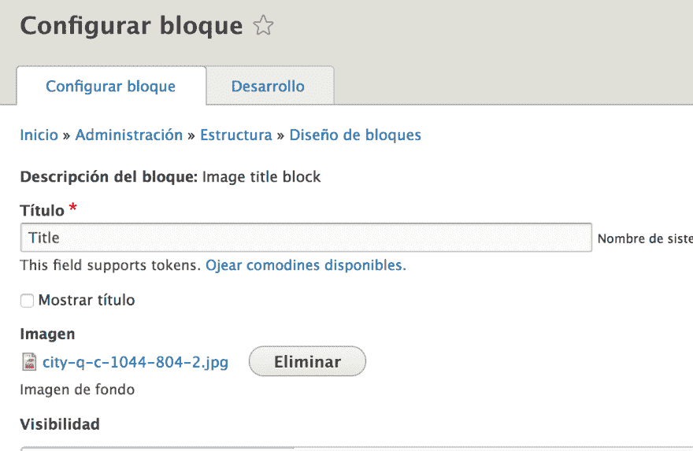

# 如何制作带有自定义背景的标题栏

> 原文：<https://dev.to/arturolinares/how-to-make-a-title-block-with-a-custom-background-41jc>

# 如何制作带有自定义背景的标题栏

最近在 Drupal 中构建站点时，我收到的一个常见请求是让页面标题的背景可配置，以允许用户上传和更改它。

[T2】](https://res.cloudinary.com/practicaldev/image/fetch/s--gg0JK6_N--/c_limit%2Cf_auto%2Cfl_progressive%2Cq_auto%2Cw_880/https://d2mxuefqeaa7sj.cloudfront.net/s_58B000CCEE244A0B10193C36972405EDDB99EDFC2E3CC8B2EF3D6B543327D95C_1520443205424_image.png)

当然，这可以用一个新的具有两个字段的块类型来解决，一个用于图像，一个用于标题。但是接下来我们需要为每一页添加我们想要显示标题的块。

Drupal 如何处理页面标题？在块管理页面，我发现它实际上是一个块。嗯，我们需要在新的模块中使用相同的功能。

所以在寻找包含块机器名 *page_title_block* 的类时，我找到了实现`TitleBlockPluginInterface`的`Drupal\Core\Block\Plugin\Block\PageTitleBlock`。这是所有的界面:

```
 interface TitleBlockPluginInterface extends BlockPluginInterface {

      /**
       * Sets the title.
       *
       * @param string|array $title
       *   The page title: either a string for plain titles or a render array for
       *   formatted titles.
       */
      public function setTitle($title);

    } 
```

Enter fullscreen mode Exit fullscreen mode

搜索什么使用那个接口，我发现`BlockPageVariant`用它给它分配一个标题:

```
 foreach ($this->blockRepository->getVisibleBlocksPerRegion($cacheable_metadata_list) as $region => $blocks) {
          /** @var $blocks \Drupal\block\BlockInterface[] */
          foreach ($blocks as $key => $block) {
            $block_plugin = $block->getPlugin();
            if ($block_plugin instanceof MainContentBlockPluginInterface) {
              $block_plugin->setMainContent($this->mainContent);
              $main_content_block_displayed = TRUE;
            }
            elseif ($block_plugin instanceof TitleBlockPluginInterface) {
              $block_plugin->setTitle($this->title);
            }
      //... 
```

Enter fullscreen mode Exit fullscreen mode

这意味着如果我创建一个实现了`TitleBlockPluginInterface`的定制块，我将自动获得页面标题(感谢`BlockPageVariant`)？显然，是的。

让我们开始编写扩展`PageTitleBlock`的定制块，以使用标题字段实现:

```
 /**
     * @Block(
     *   id = "my_image_title_block",
     *   admin_label = "Image title block"
     * )
     */
    class ImageTitleBlock extends PageTitleBlock {

      /**
       * The image field.
       *
       * @var mixed
       */
      protected $image;

      public function defaultConfiguration() {
        return [
          'image' => [
            'value' => '',
          ],
          'label_display' => FALSE,
        ] + parent::defaultConfiguration();
      }

      /**
       * {@inheritdoc}
       */
      public function build() {
        $build = [];

        if (isset($this->configuration['image'])
          && !empty($this->configuration['image'])) {

          $image_field = $this->configuration['image'];
          $image_uri = File::load($image_field[0]);

          $build['image'] = [
            'uri' => ImageStyle::load('title_bar')->buildUrl($image_uri->getFileUri()),
          ];
        } else {
          $build['image']['#markup'] = '[' . t('Picture') . ']';
        }

        return $build + parent::build();
      }

      /**
       * {@inheritdoc}
       */
      public function blockForm($form, FormStateInterface $form_state) {

        $form['image'] = array(
          '#type' => 'managed_file',
          '#upload_location' => 'publicimg/',
          '#title' => $this->t('Image'),
          '#description' => $this->t("Background image"),
          '#default_value' => $this->configuration['image'],
          '#upload_validators' => array(
            'file_validate_extensions' => array('gif png jpg jpeg'),
            'file_validate_size' => array(25600000),
          ),
          '#states' => array(
            'visible' => array(
              ':input[name="image_type"]' => array('value' => t('Upload New Image')),
            )
          )
        );

        return $form;
      }

      public function validateConfigurationForm(array &$form, FormStateInterface $form_state) {
        if (!$form_state->getValue('image')) {
          $form_state->setError($form['image'], $this->t('Select an image'));
        }
      }

      /**
       * {@inheritdoc}
       */
      public function blockSubmit($form, FormStateInterface $form_state) {
        /* Fetch the array of the file stored temporarily in database */
        $image = $form_state->getValue('image');

        $this->configuration['image'] = $image;

        /* Load the object of the file by it's fid */
        $file = \Drupal\file\Entity\File::load($image[0]);

        /* Set the status flag permanent of the file object */
        $file->setPermanent();

        /* Save the file in database */
        $file->save();
      }
    } 
```

Enter fullscreen mode Exit fullscreen mode

在清空 Drupal 缓存后，你会在 *Add block* 列表中发现新的闪亮块在等着你。build 方法返回经过处理的图像 URL(使用 *title_bar* 样式)而不是图像的渲染数组，这样我们以后就可以使用它了。

让我们创建 *title_bar* 图像样式并相应地配置它(在我的例子中，调整大小并裁剪到预定义的大小就可以了)。

[T2】](https://res.cloudinary.com/practicaldev/image/fetch/s--1xpSlm2C--/c_limit%2Cf_auto%2Cfl_progressive%2Cq_auto%2Cw_880/https://d2mxuefqeaa7sj.cloudfront.net/s_58B000CCEE244A0B10193C36972405EDDB99EDFC2E3CC8B2EF3D6B543327D95C_1520464421443_image.png)

然后，更新你的主题，确保图片 url 显示在一个`style`属性中，或者如果你使用 javascript 加载图片，显示在一个`data-*`属性中。

*block—image-title-block . html . twig*

```
 <div{{ attributes.setAttribute('style',
        'background: #787c8a url(' ~ content.image.uri ~ ') no-repeat center;') }}>
      {{ title_prefix }}
      
        <h2{{ title_attributes }}>{{ label }}</h2>
      
      {{ title_suffix }}
      
        {{ content }}
      
    </div>
    ... 
```

Enter fullscreen mode Exit fullscreen mode

让我们测试一下！

[](https://res.cloudinary.com/practicaldev/image/fetch/s--HDz_EbG4--/c_limit%2Cf_auto%2Cfl_progressive%2Cq_auto%2Cw_880/https://d2mxuefqeaa7sj.cloudfront.net/s_58B000CCEE244A0B10193C36972405EDDB99EDFC2E3CC8B2EF3D6B543327D95C_1520465614212_image.png)
[](https://res.cloudinary.com/practicaldev/image/fetch/s--LPmb7rp1--/c_limit%2Cf_auto%2Cfl_progressive%2Cq_auto%2Cw_880/https://d2mxuefqeaa7sj.cloudfront.net/s_58B000CCEE244A0B10193C36972405EDDB99EDFC2E3CC8B2EF3D6B543327D95C_1520465649359_image.png)
[](https://res.cloudinary.com/practicaldev/image/fetch/s--PTSGpHRE--/c_limit%2Cf_auto%2Cfl_progressive%2Cq_auto%2Cw_880/https://d2mxuefqeaa7sj.cloudfront.net/s_58B000CCEE244A0B10193C36972405EDDB99EDFC2E3CC8B2EF3D6B543327D95C_1520465716498_image.png)