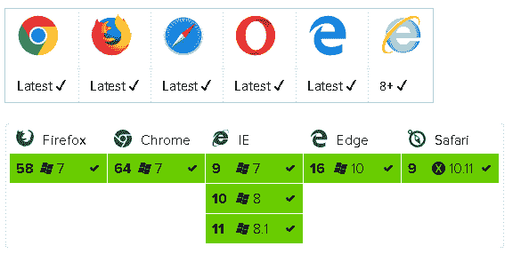

# 如何发出 ajax 请求

> 原文：<https://dev.to/tailomateus/how-to-make-ajax-requests--2nd>

不久前，人们将 JQuery 库添加到他们的项目中。在一些(仍然常见的)情况下，只能使用 ajax()函数。

```
$.ajax({
    url:"https://api.github.com/users/tailomateus/repos",
    dataType: 'json',
    success: function(response){
  console.log(response);
    }
}); 
```

Enter fullscreen mode Exit fullscreen mode

除了这个函数，JavaScript 还有一个方法， [XMLHttpRequest](https://developer.mozilla.org/pt-BR/docs/Web/API/XMLHttpRequest) 也可以发出请求。然而，要达到预期的效果需要很多步骤。这个问题导致了 Fetch 和 Axios APIs 的创建，它们具有更灵活的特性，包括请求和响应概念。

Fetch 和 Axios APIs 使用承诺的概念。您可以通过以下链接了解更多信息:

JavaScript 承诺:简介

[利用承诺](https://developer.mozilla.org/en-US/docs/Web/JavaScript/Guide/Using_promises)

## 获取 API -工作原理

下面是 Github API 的一个例子。

```
fetch('https://api.github.com/users/tailomateus/repos')
  .then(response => response.json())
  .then(data => console.log('data is', data))
  .catch(error => console.log('error is', error)); 
```

Enter fullscreen mode Exit fullscreen mode

如果你想深入研究这个问题，我建议:

[取物介绍](https://developers.google.com/web/updates/2015/03/introduction-to-fetch)

[使用 fetch - CSS 技巧](https://css-tricks.com/using-fetch/)

[使用 fetch - Mozilla](https://developer.mozilla.org/en-US/docs/Web/API/Fetch_API/Using_Fetch)

### 支持

我个人认为最大的问题是没有 IE 11 的支持。

[T2】](https://res.cloudinary.com/practicaldev/image/fetch/s--2jZ5xY4H--/c_limit%2Cf_auto%2Cfl_progressive%2Cq_auto%2Cw_880/https://tailomateus.github.img/support_fetch.png)

## Axios -如何使用

API 基本上是一个 http 客户端，它在浏览器和 nodejs 服务器上工作。

如果要在浏览器中使用，导入 cdn:

```
<script src="https://unpkg.com/axios/dist/axios.min.js"></script> 
```

Enter fullscreen mode Exit fullscreen mode

或者使用 npm 安装:

```
npm install axios 
```

Enter fullscreen mode Exit fullscreen mode

导入包:

```
ES5: var axios = require('axios'); 
ES6: import axios from 'axios'; 
```

Enter fullscreen mode Exit fullscreen mode

安装完成后，下面的代码能够模拟对 Github API 的 get 请求。

```
axios.get('https://api.github.com/users/tailomateus/repos').then(function(response){
    console.log(response.data); 
}); 
```

Enter fullscreen mode Exit fullscreen mode

要使用 post 方法，还需要一个参数，指示发送到服务器的数据:

```
axios.post('/save', { firstName: 'Teste', lastName: 'Testes' })
  .then(function(response){
    console.log('Saved successfully')
}); 
```

Enter fullscreen mode Exit fullscreen mode

### 支持

大多数使用的浏览器都支持它。

[T2】](https://res.cloudinary.com/practicaldev/image/fetch/s--u9j2-CjD--/c_limit%2Cf_auto%2Cfl_progressive%2Cq_auto%2Cw_880/https://tailomateus.github.img/support_axios.png)

要了解有关 Axios API 的更多信息:

[Axios NPM](https://www.npmjs.com/package/axios)

[开始使用 Axios](https://medium.com/codingthesmartway-com-blog/getting-started-with-axios-166cb0035237)

## 结论

在本文中，我们演示了发出请求的方法(JQuery、Fetch API、Axios)。还有许多其他的方法，也没有一种是适合所有情况的最佳方法。重要的是始终为每个项目选择最适合的。

审查人:[马科斯·戈比](https://github.com/MacPardo)