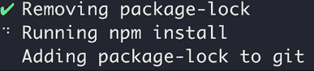

# 如何用 Node 制作漂亮简单的 CLI 应用程序

> 原文：<https://dev.to/hugo__df/how-to-make-beautiful-simple-cli-apps-with-node-c1b>

引导你的内心，使用 Node 发布一个简单漂亮的 CLI 应用程序。

命令行应用程序是打包重复性任务的好方法。这将带你浏览一些对构建 CLI 应用有用的工具。

*   [这个想法💡](https://codewithhugo.com/how-to-make-beautiful-simple-cli-apps-with-node#the-idea)
*   [管道到命令行🚇](https://codewithhugo.com/how-to-make-beautiful-simple-cli-apps-with-node#piping-to-the-command-line)
*   [处理顺序动作✨](https://codewithhugo.com/how-to-make-beautiful-simple-cli-apps-with-node#dealing-with-sequential-actions)
*   [可执行的 JavaScript 文件🦅](https://codewithhugo.com/how-to-make-beautiful-simple-cli-apps-with-node#executable-javascript-files)
*   [添加包二进制文件📦](https://codewithhugo.com/how-to-make-beautiful-simple-cli-apps-with-node#adding-package-binaries)
*   [向国家预防机制发布🚀](https://codewithhugo.com/how-to-make-beautiful-simple-cli-apps-with-node#publishing-to-npm)

[订阅](https://buttondown.email/hugo)在你的收件箱里获得最新的帖子(比任何人都要早)。

## 想法💡

当合并/重定基础时，似乎总是引起麻烦的文件是包锁。我们将介绍如何创建一个简单的实用程序来删除 package-lock.json 文件，重新生成它(npm install)并将其添加到 git 索引中。

你可以在这里找到它:[https://github.com/HugoDF/fix-package-lock](https://github.com/HugoDF/fix-package-lock)，并使用`npx fix-package-lock`运行它。

## 管道到命令行🚇

首先，我们将利用 Sindre Sohrus 的一个包，`execa`，它被描述为“一个更好的`child_process`”。要让下面的代码片段工作，运行`npm install --save execa`:

`index.js`

```
const execa = require('execa');

execa('ls').then(result => console.log(result.stdout)); 
```

Enter fullscreen mode Exit fullscreen mode

```
node index.js
index.js
node_modules
package-lock.json
package.json 
```

Enter fullscreen mode Exit fullscreen mode

## 处理顺序动作✨

要重新生成`package-lock`，我们需要首先删除它，然后运行一个`npm install`。

为此，我们可以使用 [Listr](https://github.com/SamVerschueren/listr) ，它允许我们做看起来像是:

[T2】](https://res.cloudinary.com/practicaldev/image/fetch/s--6XvdIaAd--/c_limit%2Cf_auto%2Cfl_progressive%2Cq_66%2Cw_880/https://raw.githubusercontent.com/HugoDF/fix-package-lock/master/fix-package-lock.gif)

运行`npm install --save listr`并添加杠杆列表，如下所示:

`index.js` :

```
const execa = require('execa');
const Listr = require('listr');

new Listr([
  {
    title: 'Removing package-lock',
    task: () => execa('rm', ['package-lock.json'])
  },
  {
    title: 'Running npm install',
    task: () => execa('npm', ['install'])
  },
  {
    title: 'Adding package-lock to git',
    task: (ctx, task) =>
        execa('git', ['add', 'package-lock.json'])
        .catch(() => task.skip())
  }
]).run(); 
```

Enter fullscreen mode Exit fullscreen mode

现在`node index.js`的输出看起来如下:
[](/img/20180619-running-screenshot.jpeg)

[Listr](https://github.com/SamVerschueren/listr) 在你有一个返回承诺的
长时间运行的任务时给你一个加载状态(就像`npm install`的`execa`调用)。

也可以使用观察值显示变化的信息，更多信息参见[列表文件](https://github.com/SamVerschueren/listr)

## 可执行的 JavaScript 文件🦅

能够使用`./index.js`而不是`node index.js`来执行我们的脚本是最理想的。

为此，我们需要该文件在 UNIX 系统上是可执行的，即:`chmod +x`。所以

```
chmod +x index.js 
```

Enter fullscreen mode Exit fullscreen mode

然后我们需要通知系统它应该如何运行这个文件，使用下面的 hashbang:

```
#!/usr/bin/env node 
```

Enter fullscreen mode Exit fullscreen mode

如果我们把它加到`index.js`上，我们得到:

```
#!/usr/bin/env node const execa = require('execa');
const Listr = require('listr');

new Listr([
  {
    title: 'Removing package-lock',
    task: () => execa('rm', ['package-lock.json'])
  },
  {
    title: 'Running npm install',
    task: () => execa('npm', ['install'])
  },
  {
    title: 'Adding package-lock to git',
    task: (ctx, task) =>
        execa('git', ['add', 'package-lock.json'])
        .catch(() => task.skip())
  }
]).run(); 
```

Enter fullscreen mode Exit fullscreen mode

我们现在可以使用:
来运行它

```
./index.js 
```

Enter fullscreen mode Exit fullscreen mode

## 添加包二进制文件

npm 有一个`bin`字段，我们可以像下面这样使用它(在`package.json` ):

```
{
  "name": "beautiful-cli",
  "version": "1.0.0",
  "description": "A simple CLI",
  "main": "index.js",
  "bin": {
    "fix-package-json": "./index.js"
  }
  "dependencies": {
    "execa": "^0.10.0",
    "listr": "^0.14.1"
  }
} 
```

Enter fullscreen mode Exit fullscreen mode

## 发布到 npm🚀

这留给读者作为练习，虽然使用了 [np](https://github.com/sindresorhus/np)
包，它超级简单。

提示:在你想要发布的包中运行`npx np`

你可以在这里找到完整的软件包:[https://github.com/HugoDF/fix-package-lock](https://github.com/HugoDF/fix-package-lock)并使用`npx fix-package-lock`运行它。

[订阅](https://buttondown.email/hugo)在你的收件箱里获得最新的帖子(比任何人都要早)。