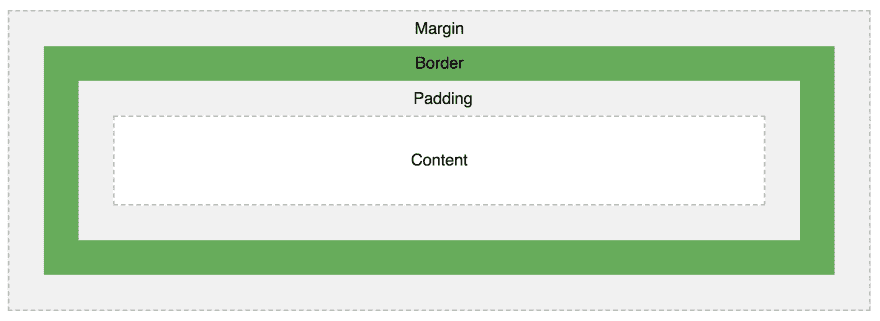

# 如何在 React Native 中创建标签选择视图

> 原文：<https://dev.to/onmyway133/how-to-make-tag-selection-view-in-react-native-24j>

[T2】](https://res.cloudinary.com/practicaldev/image/fetch/s--btj6zj47--/c_limit%2Cf_auto%2Cfl_progressive%2Cq_auto%2Cw_880/https://cdn-images-1.medium.com/max/1600/0%2AUzcJm9V69NwGBSXF.jpg)

除了 React 风格的编程， [Yoga](https://github.com/facebook/yoga) 是 React Native 的另一个很酷的功能。它是一个跨平台的布局引擎，实现了 Flexbox，所以我们对两个平台使用相同的布局代码。

作为一个在 iOS 中使用自动布局和在 Android 中使用约束布局的人，我起初觉得 Flexbox 有点难用，但有许多任务 Flexbox 做得很好，它们是空间和流动布局中的分布元素。在这篇文章中，我们将使用 Flexbox 构建一个只使用 Javascript 代码的标签选择视图。这很容易做到，所以我们不需要安装额外的依赖项。

[T2】](https://res.cloudinary.com/practicaldev/image/fetch/s--5MgR1gjY--/c_limit%2Cf_auto%2Cfl_progressive%2Cq_auto%2Cw_880/https://cdn-images-1.medium.com/max/2000/1%2AxLD0YbzaepgAuz7ED-lLGA.png)

我们的标签视图将支持多重选择和排他选择。首先，我们需要一个自定义按钮。

## 带背景的按钮

按钮是 React Native 中的基本元素，但如果我们想在按钮中有自定义内容，例如文本、图像和背景，它会有一些限制

```
import { Button } from 'react-native'
...

<Button
  onPress={onPressLearnMore}
  title="Learn More"
  color="#841584"
  accessibilityLabel="Learn more about this purple button"
/> 
```

Enter fullscreen mode Exit fullscreen mode

### [触地不透明度](https://facebook.github.io/react-native/docs/touchableopacity)

幸运的是，我们有 [TouchableOpacity](https://facebook.github.io/react-native/docs/touchableopacity) ，这是一个让视图正确响应触摸的包装器。按下时，包裹视图的不透明度降低，使其变暗。

要在我们的标签视图中实现按钮，我们需要一个背景为复选图像的按钮。创建名为 BackgroundButton.js 的文件

```
import React from 'react'
import { TouchableOpacity, View, Text, StyleSheet, Image } from 'react-native'
import R from 'res/R'

export default class BackgroundButton extends React.Component {
  render() {
    const styles = this.makeStyles()
    return (
      <TouchableOpacity style={styles.touchable} onPress={this.props.onPress}>
        <View style={styles.view}>
          {this.makeImageIfAny(styles)}
          <Text style={styles.text}>{this.props.title}</Text>
        </View>
      </TouchableOpacity>
    )
  }

makeImageIfAny(styles) {
    if (this.props.showImage) {
      return <Image style={styles.image} source={R.images.check} />
    }
  }

makeStyles() {
    return StyleSheet.create({
      view: {
        flexDirection: 'row',
        borderRadius: 23,
        borderColor: this.props.borderColor,
        borderWidth: 2,
        backgroundColor: this.props.backgroundColor,
        height: 46,
        alignItems: 'center',
        justifyContent: 'center',
        paddingLeft: 16,
        paddingRight: 16
      },
      touchable: {
        marginLeft: 4,
        marginRight: 4,
        marginBottom: 8
      },
      image: {
        marginRight: 8
      },
      text: {
        fontSize: 18,
        textAlign: 'center',
        color: this.props.textColor,
        fontSize: 16
      }
    })
  }
} 
```

Enter fullscreen mode Exit fullscreen mode

### 动态样式

通常我们使用 const styles = style sheet . create({ })但是因为我们希望我们的按钮是可配置的，所以我们将样式放入一个函数中，所以在每次渲染时，我们都会得到一个具有适当配置的新样式。我们支持的属性有 borderColor、textColor、backgroundColor 和 showImage

在 makeImageIfAny 中，如果视图被选中，我们只需要返回图像。我们没有 else 的情况，所以在 if showImage 为 false 的情况下，返回 undefined，React 不会呈现任何元素

```
makeImageIfAny(styles) {
  if (this.props.showImage) {
    return <Image style={styles.image} source={R.images.check} />
  }
} 
```

Enter fullscreen mode Exit fullscreen mode

### 填充和边距

要了解填充和边距，请访问 [CSS 盒模型](https://www.w3schools.com/css/css_boxmodel.asp)。基本上，填充意味着清除内容周围的区域，填充是透明的，而边距意味着清除边框之外的区域，边距也是透明的。

[T2】](https://res.cloudinary.com/practicaldev/image/fetch/s--okfFf31d--/c_limit%2Cf_auto%2Cfl_progressive%2Cq_auto%2Cw_880/https://cdn-images-1.medium.com/max/4572/1%2AA98Em4msrGqOAWSRq3Njjw.png)

注意款式。我们有可触摸的空白，这样每个标签按钮在彼此之外都有一点空白。

```
touchable: {
  marginLeft: 4,
  marginRight: 4,
  marginBottom: 8
} 
```

Enter fullscreen mode Exit fullscreen mode

在视图中，我们需要 flexDirection 作为行，因为 React Native 默认将 flexDirection 作为列。一行意味着我们在按钮内水平并排放置图像和文本。我们还使用 alignItems 和 justifyContent 在主轴和横轴上居中对齐元素。填充用于在内部文本和视图之间留出一些空间。

```
view: {
  flexDirection: 'row',
  height: 46,
  alignItems: 'center',
  justifyContent: 'center',
  paddingLeft: 16,
  paddingRight: 16
} 
```

Enter fullscreen mode Exit fullscreen mode

## 标签视图

创建一个名为 TagsView.js 的文件，在这里我们解析标签并显示一组 BackgroundButton

```
import React from 'react'
import { View, StyleSheet, Button } from 'react-native'
import R from 'res/R'
import BackgroundButton from 'library/components/BackgroundButton'
import addOrRemove from 'library/utils/addOrRemove'

export default class TagsView extends React.Component {
  constructor(props) {
    super(props)
    this.state = {
      selected: props.selected
    }
  }

render() {
    return (
      <View style={styles.container}>
        {this.makeButtons()}
      </View>
    )
  }

onPress = (tag) => {
    let selected
    if (this.props.isExclusive) {
      selected = [tag]
    } else {
      selected = addOrRemove(this.state.selected, tag)
    }

this.setState({
      selected
    })
  }

makeButtons() {
    return this.props.all.map((tag, i) => {
      const on = this.state.selected.includes(tag)
      const backgroundColor = on ? R.colors.on.backgroundColor : R.colors.off.backgroundColor
      const textColor = on ? R.colors.on.text : R.colors.off.text
      const borderColor = on ? R.colors.on.border : R.colors.off.border

return (
        <BackgroundButton
          backgroundColor={backgroundColor}
          textColor={textColor}
          borderColor={borderColor}
          onPress={() => {
            this.onPress(tag)
          }}
          key={i}
          showImage={on}
          title={tag} />
      )
    })
  }
}

const styles = StyleSheet.create({
  container: {
    flex: 1,
    flexDirection: 'row',
    flexWrap: 'wrap',
    padding: 20
  }
}) 
```

Enter fullscreen mode Exit fullscreen mode

我们解析一组标签来构建 BackgroundButton。我们保持所选数组的状态，因为它在 TagsView 组件中发生了变异。如果它是 isExclusive，则新选择的仅包含新选择的标签。如果是多重选择，那么我们把新选择的标签添加到选择的数组中。

addOrRemove 是一个我们自己开发的实用函数，如果数组中不存在某个项，就将其添加到数组中；如果存在，就使用高阶过滤器函数将其移除。

```
const addOrRemove = (array, item) => {
  const exists = array.includes(item)

if (exists) {
    return array.filter((c) => { return c !== item })
  } else {
    const result = array
    result.push(item)
    return result
  }
} 
```

Enter fullscreen mode Exit fullscreen mode

### 柔性缠绕

注意风格

```
const styles = StyleSheet.create({
  container: {
    flex: 1,
    flexDirection: 'row',
    flexWrap: 'wrap',
    padding: 20
  }
}) 
```

Enter fullscreen mode Exit fullscreen mode

这里的主角是 flexWrap，它指定了灵活的项目是否应该包装。查看 [CSS flex-wrap](https://www.w3schools.com/cssref/css3_pr_flex-wrap.asp) 属性以了解其他选项。因为我们将主轴作为一行，所以如果没有足够的空间，元素将换行到下一行。这就是我们如何实现一个漂亮的标签视图。

### 使用标签视图

那么使用 TagsView 就像在 render 中声明它一样简单

```
const selected = ['Swift', Kotlin]

const tags = ['Swift', 'Kotlin', 'C#', 'Haskell', 'Java']

return(
<tags view
all = { tags }
selected = { selected }
is exclusive = { false }
/>
) 
```

Enter fullscreen mode Exit fullscreen mode

### 
  
学习 Flexbox

学习 Flebox 对于有效使用 React 和 React Native 至关重要。学习它的最好地方是 Mozzila 的 w3school CSS Flexbox 和 T2 Flexbox 的基本概念。
[**flexbox 的基本概念**
* flexbox 模块，通常被称为 flexbox，被设计为一维布局模型，并作为…*developer.mozilla.org](https://developer.mozilla.org/en-US/docs/Web/CSS/CSS_Flexible_Box_Layout/Basic_Concepts_of_Flexbox)

这里展示了所有可能的 Flexbox 属性
[**完整的 React 原生布局备忘单**
*简单的可视化指南，包含所有主要 React 原生布局属性的实时示例*medium.com](https://medium.com/@drorbiran/the-full-react-native-layout-cheat-sheet-a4147802405c)

Yoga 在 CocoaPods 上发布了自己的 YogaKit，你可以在 iOS
[**中用原生代码学习它 Yoga 教程:使用跨平台布局引擎**
*了解 Yoga，脸书的跨平台布局引擎，它可以帮助开发人员以类似于…*www.raywenderlich.com](https://www.raywenderlich.com/530-yoga-tutorial-using-a-cross-platform-layout-engine) 的风格编写更多布局代码

当我们使用 flexbox 时，我们应该组合元素而不是硬编码值，例如，我们可以使用另一个带有 justifyContent: flex-end 的视图来向下移动屏幕上的按钮。这遵循了 flexbox 的风格，并防止僵化的代码。
[**在 React Native 中使用 Flexbox 在屏幕底部定位元素**
*React Native 使用 Yoga 来实现 Flexbox 风格的布局，这有助于我们以一种声明式的简单方式设置布局。*medium.com](https://medium.com/react-native-training/position-element-at-the-bottom-of-the-screen-using-flexbox-in-react-native-a00b3790ca42)

## 何去何从

我希望你在这篇文章中学到一些有用的东西。更多信息请参考官方指南[Flexbox 布局](https://facebook.github.io/react-native/docs/flexbox)和[布局-道具](https://facebook.github.io/react-native/docs/layout-props)了解所有可能的 Flexbox 属性。

原帖[https://hacker noon . com/how-to-make-tag-selection-view-in-react-native-b 6 f 8 b 0 ADC 891](https://hackernoon.com/how-to-make-tag-selection-view-in-react-native-b6f8b0adc891)