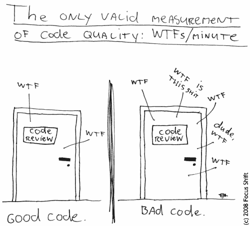
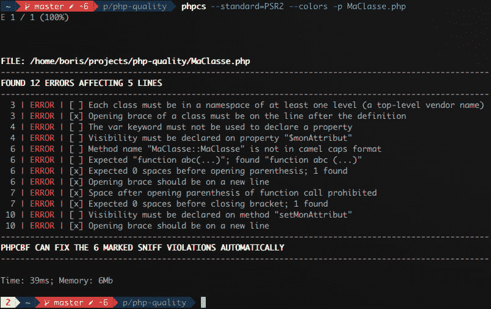
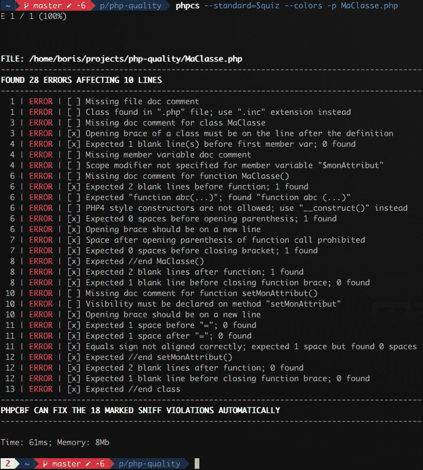
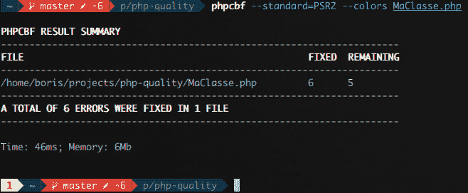
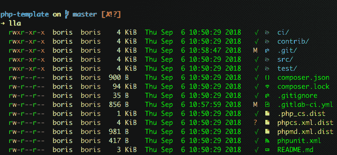

# 🚥如何用 PHP 编写干净的代码🐘

> 原文：<https://dev.to/biros/how-to-master-your-code-through-your-project-lifecycle-12-4ke3>

这是关于代码质量的两篇文章的第一部分。
这个主要是关于 **PHP** 的，但是等等，不要跑路！如果你用某种严肃的语言编写代码，你可能仍然会感兴趣。

* * *

[T2】](https://res.cloudinary.com/practicaldev/image/fetch/s--8N47COR1--/c_limit%2Cf_auto%2Cfl_progressive%2Cq_auto%2Cw_880/https://thepracticaldev.s3.amazonaws.com/i/u8djzx1ow0iuwsq8r3kx.png)

> 我们为什么要关心代码质量？

为什么不使我们的代码按照它应该的那样工作呢？其实这取决于你的 app 的用途，取决于你的目标。如果你正在开发一个一次性的应用程序，为了一个演示，或者仅仅是为了你，你显然不会把时间花在质量上。但如果是更严重的事情，它将成为强制性的。

对你的代码的易读性，对可维护性，对你和你的队友的健康都是强制性的。

对于你们中最没有耐心的人，我在 gitlab.com 上创建了一个[模板项目](https://gitlab.com/mamyn0va/php-template),允许你们用现成的质量工具快速启动一个 PHP 项目。

* * *

> 哦等等！你在说质量？真的吗？用 PHP？

PHP 名声不好，可能是因为它是一种被没有经验的开发人员使用的非常放纵的语言。它的动态类型机制经常被误用，在版本 5 和引入 OOP 范例之前，它非常混乱。最重要的是，大多数用 PHP 开发的应用程序只是网站、博客、论坛或任何其他 CMS，如 drupal、wordpress、joomla、prestashop...

今天，PHP 生态系统中的情况有了很大的不同。它的依赖管理器 [composer](https://getcomposer.org/) 已经被大多数项目维护人员大量采用，并帮助 PHP 成为重要后端应用程序的可靠选择。
此外，PHP7 通过增强操作码缓存和 Zend 引擎，为 PHP 的性能带来了突破性的变化。现在，有了[类型函数的参数和返回值](http://php.net/manual/en/migration70.new-features.php)的可能性。结合[严格类型模式](http://php.net/manual/en/functions.arguments.php#functions.arguments.type-declaration.strict)，现在可以在你的 IDE 中检测到很多隐藏的运行时错误。

* * *

我不会在这里涵盖代码质量的所有方面(测试，审查，TDD，...)但是我将把重点放在最基础的东西上:编码标准/风格&静态分析。

当然，要清楚的是，工具本身从来没有保证过任何软件的质量，但是它们有助于保证质量。假设它们让我们有心情不断地寻求改进我们的代码。但是这并不妨碍我们进行单元测试和代码审查！

## ✔️代码静态分析工具

PHP-FIG 联盟发布了一套 T2 建议，旨在规范 PHP 的使用并促进其互操作性。其中三个关注编码风格和自动加载、编码等内容:

*   PSR1 : [基本编码标准](https://www.php-fig.org/psr/psr-1/)
*   PSR2 : [编码风格指南](https://www.php-fig.org/psr/psr-2/)
*   PSR12(审查中):[扩展编码风格指南](https://github.com/php-fig/fig-standards/blob/master/proposed/extended-coding-style-guide.md)

> 下面列出的工具被 PHP 社区广泛采用，并得到了积极的支持和维护。

### [PHP_CodeSniffer](https://github.com/squizlabs/PHP_CodeSniffer) (又名 phpcs)

幸运的是，我们不需要知道 PSR 规范的所有细节(即使它会更好)，因为一些工具可以为我们做(一部分)工作。我的意思是，美化代码，使其符合 PSR 并检测违规。随着时间的推移和经验的积累，这对你来说会变得很自然。

PHP_CodeSniffer 检测 PSR1/PSR2 违规，Squiz 标准检查了 130 条规则(PS R1 7 条，PSR 2 42 条),也适用于 CSS 和 JS。既然如此，从 PSR2 标准开始，然后从 PSR2 创建您自己的标准(又名 ruleset ),并使用您需要的 Squiz 规则来丰富它，这是一个很好的折衷方案。

#### 💡phpcs 安装

这将添加 phpcs 作为项目依赖:

```
composer require "squizlabs/php_codesniffer" 
```

Enter fullscreen mode Exit fullscreen mode

要在项目之外使用它，你应该全局安装它并将`vendor/bin`添加到你的`PATH` :

```
composer global require "squizlabs/php_codesniffer"
export PATH=$PATH:~/path/to/composer/vendor/bin 
```

Enter fullscreen mode Exit fullscreen mode

#### 🆘phpcs 使用

现在，考虑下面包含一些违规的 PHP 示例...

```
<?php
class MaClasse{
    var $monAttribut;

    public function MaClasse ($monAttribut){
        $this->setMonAttribut( $monAttribut );
    }

    function setMonAttribut($monAttribut){
        $this->monAttribut=$monAttribut;
    }
} 
```

Enter fullscreen mode Exit fullscreen mode

...看看如果我们将 phpcs 与 PSR2 标准一起使用会发生什么:

[T2】](https://res.cloudinary.com/practicaldev/image/fetch/s--QRqZLUQd--/c_limit%2Cf_auto%2Cfl_progressive%2Cq_auto%2Cw_880/https://thepracticaldev.s3.amazonaws.com/i/ad5961j64i00uu8n6ooe.png)

该工具检测到 12 个错误，其中 6 个可以自动修复。

让我们看看如果用 Squiz 标准重新运行该工具会发生什么:

[T2】](https://res.cloudinary.com/practicaldev/image/fetch/s--cV9I6kK5--/c_limit%2Cf_auto%2Cfl_progressive%2Cq_auto%2Cw_880/https://thepracticaldev.s3.amazonaws.com/i/ievvzmjqb59bs1jjnz7b.png)

该工具检测到 28 个错误，其中 18 个可以自动修复。我对 Squiz 标准的看法是有点太啰嗦了。因此，我用所有 PSR2 规则创建了自己的规则集，并添加了一些对我有意义的 Squiz 规则。

为了更进一步，您可以查看一下 [phpcs_psr2](https://gitlab.com/mamyn0va/php-template/blob/master/phpcs_psr2.xml.dist) 和 [phpcs_squiz](https://gitlab.com/mamyn0va/php-template/blob/master/phpcs_squiz.xml.dist) 规则集。

### PHP 代码美化器和修复器(又名 phpcbf)

嗯，检测违规是不错，但如果能自动纠正就更好了，对吧？幸运的是， **PHP_CodeSniffer** 附带了另一个修复主要 PSR1 和 PSR2 违规的实用程序: **PHP 代码美化器和修复器**(又名 phpcbf)。只需在 PHP 文件或代码库上运行它，它就会扫描所有文件并尝试自动修复违规情况:

[T2】](https://res.cloudinary.com/practicaldev/image/fetch/s--_a9Ilbqn--/c_limit%2Cf_auto%2Cfl_progressive%2Cq_auto%2Cw_880/https://thepracticaldev.s3.amazonaws.com/i/5ltf1nn9grveodqbgrk4.png)

当使用 PSR2 标准在`MaClasse.php`上使用它时，它修复了 12 个违规中的 6 个:

```
<?php

class MaClasse
{
    var $monAttribut;

    public function MaClasse($monAttribut)
    {
        $this->setMonAttribut($monAttribut);
    }

    function setMonAttribut($monAttribut)
    {
        $this->monAttribut=$monAttribut;
    }
} 
```

Enter fullscreen mode Exit fullscreen mode

现在该轮到你使用它了，创建你自己的规则集来满足你、你的队友和你的项目的需要。当然，这个**必须**与其他开发人员共享，以便有一个同质的代码库，并且能够一起工作。

### [PHP 垃圾检测器](https://phpmd.org/)(又名 phpmd)

和 Java 及其 [PMD](https://pmd.github.io/) 一样，PHP 也有自己的垃圾检测工具。通过一个规则集机制(比如 PHP_CodeSniffer)，这个工具将检测许多违反*干净代码*原则的行为:

*   可能的错误
*   次优代码
*   过于复杂的表达式
*   未使用的参数、方法、属性
*   ...

#### 💡phpmd 安装

```
composer require phpmd/phpmd 
```

Enter fullscreen mode Exit fullscreen mode

然后，您需要为 phpmd 提供一个文件或目录，并指定一种输出格式(文本、XML 或 HTML)和一个或多个规则集。

#### 🆘phpmd 用法

让我们以之前固定的 phpcbf/PSR2 为例，在其中添加一个未使用的变量:

```
<?php
class MaClasse
{
    var $monAttribut;

    public function MaClasse($monAttribut)
    {
        $this->setMonAttribut($monAttribut);
    }

    function setMonAttribut($monAttribut)
    {
        $test;
        $this->monAttribut=$monAttribut;
    }
} 
```

Enter fullscreen mode Exit fullscreen mode

现在，用 phpmd 和所有可用的规则集检查它:

```
phpmd MaClasse.php text cleancode,codesize,controversial,design,naming,unusedcode 
```

Enter fullscreen mode Exit fullscreen mode

phpmd 的输出:

```
MaClasse.php:6    The method MaClasse is not named in camelCase.
MaClasse.php:6    Classes should not have a constructor method with the same name as the class
MaClasse.php:12    Avoid unused local variables such as '$test'. 
```

Enter fullscreen mode Exit fullscreen mode

如您所见，该工具是 PHP_CodeSniffer 的补充，因为它发现了三个以前没有检测到的有趣的新违规。当然，如果您运行它通过一个完整的代码库，它也将提出许多或多或少有用的违规，可能是嘈杂的，并阻止您看到有意义的信息。因此，正如我之前对 PHP_CodeSniffer 说过的，我建议你基于现有的创建自己的规则集。您需要在项目的根目录下创建一个名为`phpmd.xml.dist`的文件，您将能够在终端、编辑器/IDE 和管道中使用它。

请在此处找到[使用所有现有规则的规则集](https://gitlab.com/mamyn0va/php-template/blob/master/phpmd.xml.dist)。

但是和 phpcs 一样，我建议你从最小规则集`unusedcode`开始迭代进行，并逐渐加入对你和你的项目有意义的新规则。

请在下面找到一个自定义规则集，您可以用它来启动 phpmd:

```
<?xml version="1.0"?>
<ruleset name="Custom rule set used in pre-commit git hook"
         xmlns="http://pmd.sf.net/ruleset/1.0.0"
         xmlns:xsi="http://www.w3.org/2001/XMLSchema-instance"
         xsi:schemaLocation="http://pmd.sf.net/ruleset/1.0.0 http://pmd.sf.net/ruleset_xml_schema.xsd"
         xsi:noNamespaceSchemaLocation="http://pmd.sf.net/ruleset_xml_schema.xsd">
    <description>
        Custom rule set used in pre-commit git hooks
    </description>

    <!-- Import the entire unused code rule set -->
    <rule ref="rulesets/unusedcode.xml" />
    <!-- Import a part of design code rule set -->
    <rule ref="rulesets/design.xml">
        <exclude name="NumberOfChildren" />
        <exclude name="DepthOfInheritance" />
        <exclude name="CouplingBetweenObjects" />
    </rule>
</ruleset> 
```

Enter fullscreen mode Exit fullscreen mode

### [PHP 编码标准固定器](https://github.com/FriendsOfPhp/PHP-CS-Fixer)(又名 php-cs-fixer)

> 如果我们以另一种工具结束呢？如果你只能选择一个工具，那就是这个。

它做的事情和 phpcbf 做的几乎一样，也就是修改 PSR 规则，但是它做的更好更深入。像 phpcbf 一样，它也允许你从一系列 [172 条规则](https://github.com/FriendsOfPhp/PHP-CS-Fixer#usage)中添加一些其他规则。另一件很酷的事情是规则集文件的创建，它是一个 PHP 文件，而不是冗长的 XML。

#### 💡PHP-cs-固定器安装

```
composer require friendsofphp/php-cs-fixer 
```

Enter fullscreen mode Exit fullscreen mode

#### 🆘php-cs 固定用法

```
php-cs-fixer --verbose fix MaClasse.php
Loaded config default from "~/.php_cs.dist".
Using cache file ".php_cs.cache".
Paths from configuration file have been overridden by paths provided as command arguments.
F
Legend: ?-unknown, I-invalid file syntax, file ignored, S-Skipped, .-no changes, F-fixed, E-error
   1) MaClasse.php (class_attributes_separation, no_spaces_inside_parenthesis, declare_strict_types, blank_line_after_opening_tag, array_syntax, class_definition, 
function_declaration, visibility_required, declare_equal_normalize, binary_operator_spaces, braces)

Checked all files in 0.008 seconds, 8.000 MB memory used 
```

Enter fullscreen mode Exit fullscreen mode

下面是带有自定义规则集的 MaClasse.php 的输出:

```
declare(strict_types = 1);
class MaClasse
{
    public $monAttribut = [];

    public function __construct($monAttribut)
    {
        $this->setMonAttribut($monAttribut);
    }

    public function setMonAttribut($monAttribut)
    {
        $this->monAttribut = $monAttribut;
        $test = 1;
    }
} 
```

Enter fullscreen mode Exit fullscreen mode

这是我的自定义规则集(。php_cs.dist) :

```
$finder = PhpCsFixer\Finder::create()
    ->exclude('vendor')
    ->exclude('output')
    ->exclude('releases')
    ->in(__DIR__)
;

return PhpCsFixer\Config::create()
    ->setRiskyAllowed(true)
    ->setRules([
        '@PSR2' => true,
        'declare_strict_types' => true,
        'align_multiline_comment' => ['comment_type' => 'phpdocs_only'],
        'binary_operator_spaces' => true,
        'blank_line_after_opening_tag' => true,
        'cast_spaces' => true,
        'class_attributes_separation' => true,
        'compact_nullable_typehint' => true,
        'concat_space' => ['spacing' => 'one'],
        'declare_equal_normalize' => ['space' => 'single'],
        'function_typehint_space' => true,
        'no_blank_lines_after_class_opening' => true,
        'no_blank_lines_after_phpdoc' => true,
        'no_extra_consecutive_blank_lines' => true,
        'no_mixed_echo_print' => true,
        'no_php4_constructor' => true,
        'no_unused_imports' => true,
        'no_useless_else' => true,
        'no_useless_return' => true,
        'no_whitespace_before_comma_in_array' => true,
        'no_whitespace_in_blank_line' => true,
        'object_operator_without_whitespace' => true,
        'ordered_class_elements' => true,
        'ordered_imports' => true,
        'phpdoc_align' => true,
        'phpdoc_indent' => true,
        'yoda_style' => true,
        'protected_to_private' => true,
        'return_type_declaration' => true,
        'self_accessor' => true,
        'single_blank_line_before_namespace' => true,
        'single_quote' => true,
        'ternary_operator_spaces' => true,
        'ternary_to_null_coalescing' => true,
        'whitespace_after_comma_in_array' => true,
        'array_syntax' => ['syntax' => 'short'],
    ])
    ->setFinder($finder)
; 
```

Enter fullscreen mode Exit fullscreen mode

其中一些规则被称为*风险*，因为它们会影响 PHP 的运行时，所以要小心使用！在我的项目中，我使用了其中的两个:

*   `declare_strict_types`(打字模式设置为`strict`而不是`weak`)
*   `no_php4_constructor`(建造者**必须**命名为`__construct`)

您可以使用设置器`setRiskyAllowed(false)`禁用此功能。

`declare_strict_types`规则特别有趣，因为它在每个 PHP 文件的头中添加了下面一行:`declare(strict_types = 1);`

这个 PHP7 语句允许对标量类型(int，array，string，bool，...).这意味着如果你用一个`string`而不是一个预期的`int`来提供一个函数，它将抛出一个错误而不是将`string`强制转换为`int`(例如“7 次”= > 7)。

* * *

最后，您必须将工具视为应用程序不可或缺的一部分，也就是说，一方面，它们列在项目的依赖项中，另一方面，它们的配置文件和规则集也是您的代码库的一部分:

[T2】](https://res.cloudinary.com/practicaldev/image/fetch/s--wTT6cqfJ--/c_limit%2Cf_auto%2Cfl_progressive%2Cq_auto%2Cw_880/https://thepracticaldev.s3.amazonaws.com/i/kxwp91bkwtg2mz2rxwf2.png)

这对 PHP 来说是正确的，但对任何一种语言来说也是如此。随着时间的推移，这是在你的团队中拥有*同质代码库*的唯一方法。

### 🛠️走得更远

*   phan :强大的代码静态分析器
*   [phpstan](https://github.com/phpstan/phpstan) : PHP 静态分析工具
*   (又一个)PHP 静态分析器，输出一些用户友好的报告
*   PHP 复制/粘贴检测器(又名 phpcpd):一个重复代码检测器
*   sonar PHP:sonar cube 和 SonarLint 的静态 PHP 代码分析器
*   phploc :一个给你 PHP 项目统计数据的工具

* * *

🌟关于这个话题，请随时问我任何问题！

⏭️:在下一部分，我们将讨论在项目的生命周期中集成这些工具(git，editor/IDE，CI)。

* * *

有用的链接:

*   [PHP 标准建议](https://www.php-fig.org/psr)
*   [PHP:正确的方法](https://www.phptherightway.com)