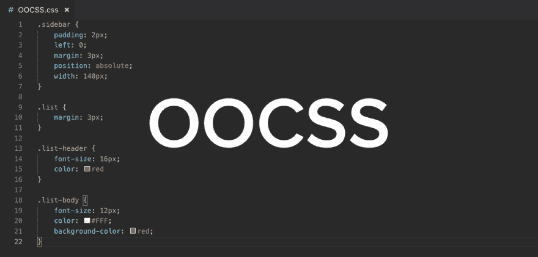
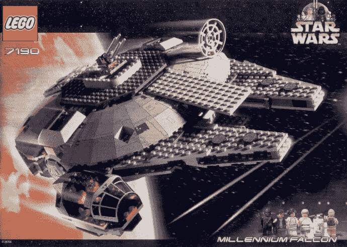

# 如何用模块化架构组织你的 CSS

> 原文：<https://dev.to/couellet/how-to-organize-your-css-with-a-modular-architecture-oocss-bem-smacss-3gk0>

[T2】](https://res.cloudinary.com/practicaldev/image/fetch/s--5rg_f6Ud--/c_limit%2Cf_auto%2Cfl_progressive%2Cq_auto%2Cw_880/https://snipcart.com/media/203929/oocss-css-architecture.png)

> 这是蒙特利尔的前端设计师克劳迪奥·门东萨在我们博客上的客座博文。他真的做了扎实的工作，所以我想给它一些曝光在这里！享受吧。🙇‍♂️

我喜欢乐高积木。

它们是迄今为止我最喜欢的玩具——有很多！

我是个设计师，设计师的儿子。乐高积木是我们的第一个创意沙盒:它们允许我们组装各种疯狂的东西。

我不知道为什么我那么爱他们。但现在我知道了。

这不是他们的颜色，或他们的 7K 件千年隼。没有。

[T2】](https://res.cloudinary.com/practicaldev/image/fetch/s--GCeuP1s3--/c_limit%2Cf_auto%2Cfl_progressive%2Cq_auto%2Cw_880/https://snipcart.com/media/203928/millennium-falcon-lego-2000.jpg)

这就是每一部分如何以各种可能的方式完美地组合在一起。

如果我们能创造出更像乐高积木的界面会怎么样？

这将加速我们的前端开发，使它更健壮，更有组织性。我们的 HTML 会变得更小，我们的 CSS 会变得更易于管理。

在这篇文章中，我将向你展示如何将你的 CSS 架构组织成 HTML/CSS 块，其行为更像乐高积木。

为此，我将介绍三种重要的模块化 CSS 方法:

*   OOCSS
*   嗯
*   SMACSS

这些将帮助我们创建更容易理解、维护和重用的界面组件。

我打赌这些将成为你工作流程的一部分，不管你用的是什么前端框架。 [*如果*](https://snipcart.com/blog/learn-vanilla-javascript-before-using-js-frameworks) 你在用一个，那就是。

## 知道你的缩写(OOCSS，BEM，SMACSS)

> 古老的 CSS 笑话-两个 CSS 规则进入一个酒吧。一个瓶子落在完全不同的酒吧里。

### 什么是 OOCSS？

[T2】](https://res.cloudinary.com/practicaldev/image/fetch/s--5rg_f6Ud--/c_limit%2Cf_auto%2Cfl_progressive%2Cq_auto%2Cw_880/https://snipcart.com/media/203929/oocss-css-architecture.png)

面向对象的 CSS(OOCSS)——以及伴随这种范式转变而来的一切——是更好的界面设计和开发的概念基础。它指出接口是由多个组件组成的，应该尽可能地重用这些组件。

[...]

→点击阅读全文