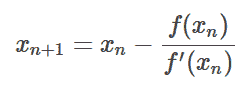

# 如何在 F#中解析、化简、微分和求值/求解(使用牛顿法)方程和表达式？

> 原文：<https://dev.to/elemarjr/how-to-parse-simplify-differentiate-and-evaluatesolve-using--newtons-method-equations-and-expressions-in-f--24n1>

这最初是在我的[博客](http://www.elemarjr.com/en/2018/03/how-to-parse-simplify-differentiate-and-evaluate-solve-using-newtons-method-equations-and-expressions-in-f/)上发布的

# 对象模型

解析表达式和方程的第一步是创建一个“足够好”的对象模型。

```
type Expr =
  | X
  | Const of value: double
  | Add   of Expr * Expr
  | Sub   of Expr * Expr
  | Mult  of Expr * Expr
  | Div   of Expr * Expr
  | Pow   of Expr * Expr
  | Neg   of Expr

// 2 + 2 / 2
let sample = Add(Const(2.), Div(Const(2.), Const(2.)) 
```

Enter fullscreen mode Exit fullscreen mode

使用 F#的时候是多么的简单。

# 解析

在这个实现中，我使用 F#主动模式来进行解析。

```
open System

let (|Digit|_|) = function
    | x::xs when Char.IsDigit(x) ->
        Some(Char.GetNumericValue(x), xs)
    | _ -> None

let (|IntegerPart|_|) input =
    match input with
    | Digit(h, t) ->
        let rec loop acc = function
            | Digit(x, xs) -> loop ((acc * 10.) + x) xs
            | xs -> Some(acc, xs)
        loop 0. input
    | _ -> None

"10" |> List.ofSeq |> (|IntegerPart|_|)

let (|FractionalPart|_|) = function
    | '.'::t->
        let rec loop acc d = function
            | Digit(x, xs) -> loop ((acc * 10.) + x) (d * 10.) xs
            | xs -> (acc/d, xs)
        Some(loop 0. 1. t)
    | _ -> None

"10" |> List.ofSeq |> (|FractionalPart|_|)
".34" |> List.ofSeq |> (|FractionalPart|_|)

let (|Number|_|) = function
    | IntegerPart(i, FractionalPart(f, t)) -> Some(i+f, t)
    | IntegerPart(i, t) -> Some(i, t)
    | FractionalPart(f, t) -> Some(f, t)
    | _ -> None

"10" |> List.ofSeq |> (|Number|_|)
".35" |> List.ofSeq |> (|Number|_|)
"10.35" |> List.ofSeq |> (|Number|_|)

let parse (expression) =
    let rec (|Expre|_|) = function
        | Multi(e, t) ->
            let rec loop l = function
                | '+'::Multi(r, t) -> loop (Add(l, r)) t
                | '-'::Multi(r, t) -> loop (Sub(l, r)) t
                | [] -> Some(l, [])
                | _ -> None
            loop e t
        | _ -> None
    and (|Multi|_|) = function
        | Atom(l, '*'::Powi(r, t)) -> Some(Mult(l, r), t)
        | Atom(l, '/'::Powi(r, t)) -> Some(Div(l, r), t)
        | Powi(e, t) -> Some(e, t)
        | _ -> None
    and (|Powi|_|) = function
        | '+'::Atom(e, t) -> Some(e, t)
        | '-'::Atom(e, t) -> Some(Neg(e), t)
        | Atom(l, '^'::Powi(r, t)) -> Some(Pow(l, r), t)
        | Atom(e, t) -> Some(e, t)
        | _ -> None
    and (|Atom|_|) = function
        | 'x'::t -> Some(X, t)
        | Number(e, t) -> Some(Const(e), t)
        | '('::Expre(e, ')'::t) -> Some(e, t)
        | _ -> None

    let parsed = (expression |> List.ofSeq |> (|Expre|_|))

    match parsed with 
        | Some(result, _) -> result
        | None -> failwith "failed to parse expression"

parse "2+2"  // Add(Const(2.), Const(2.))
exec 0. (parse "2+2") // 4
exec 2. (parse "x^3") 
parse "x^2-3" // Sub(Pow(X, Const(2.)), Const(3.) 
```

Enter fullscreen mode Exit fullscreen mode

# 简化和评估

下面的代码可以简化方程/表达式，去掉求解的步骤。

```
let rec simplify e =
  let result =
      match e with
      // add
      | Add(Const(0.), r) -> simplify r
      | Add(l, Const(0.)) -> simplify l
      | Add(Const(l), Const(r)) -> Const (l + r)
      | Add(l, r) -> (Add(simplify l, simplify r))
      // sub
      | Sub(Const(0.), r) -> Neg (simplify r)
      | Sub(l, Const(0.)) -> l
      | Sub(Const(l), Const(r)) -> Const (l - r)
      | Sub(X, r) -> Sub (X, simplify r)
      | Sub(l, X) -> Sub (simplify l, X)
      | Sub(l, r) -> (Sub(simplify l, simplify r))
      // mult
      | Mult(Const(0.), _) -> Const(0.)
      | Mult(_, Const(0.)) -> Const(0.)
      | Mult(Const(1.), r) -> r
      | Mult(l, Const(1.)) -> l
      | Mult(Const(l), Const(r)) -> Const (l * r)
      | Mult(l, r) when l = r -> (Pow (simplify l, Const(2.)))
      | Mult(Pow(b, p), r) when b = r -> Pow (simplify b, (simplify (Add((simplify p), Const(1.)))))
      | Mult(X, r) -> Mult (X, simplify r)
      | Mult(l, X) -> Mult (simplify l, X)
      | Mult(l, r) -> (Mult(simplify l, simplify r))
      // div
      | Div(Const(0.), _) -> Const(0.)
      | Div(l, Const(1.)) -> l
      | Div(Const(l), Const(r)) -> Const (l / r)
      | Div(X, r) -> Div (X, simplify r)
      | Div(l, X) -> Div (simplify l, X)
      | Div(l, r) -> simplify (Div(simplify l, simplify r))
      // pow
      | Pow(_, Const(0.)) -> Const(1.)
      | Pow(b, Const(1.)) -> simplify b
      | Pow(Const(l), Const(r)) -> Const(System.Math.Pow(l, r))
      | Pow(X, r) -> Pow (X, simplify r)
      | Pow(l, X) -> Pow (simplify l, X)
      | Pow(b, p) -> (Pow(simplify b, simplify p))
      // neg
      | Neg(Const(k)) -> Const (-k)
      | Neg(X) -> Neg(X)
      | Neg(x) -> (Neg(simplify x))
      //
      | other -> other

  if (result = e)
      then result
      else simplify result

simplify (Mult(Mult(X, X), X))
simplify (Pow(Const(2.), Const(3.)))
simplify (Mult(Const(2.), X))
simplify (Add(Const(2.), Div(Const(2.), Const(2.) )))

I love local functions! The simplification process works as an evaluator for expressions. With equations, the process will stop when there are no more possible simplification steps to take.

let exec x expr = 
    let rec replaceX = function 
        | Add(l, r)  -> Add(replaceX l, replaceX r)
        | Sub(l, r)  -> Sub(replaceX l, replaceX r)
        | Mult(l, r) -> Mult(replaceX l, replaceX r)
        | Div(l, r)  -> Div(replaceX l, replaceX r)
        | Pow(l, r)  -> Pow(replaceX l, replaceX r)
        | Neg(e)     -> Neg(replaceX e)
        | Const(v)   -> Const(v)
        | X          -> Const(x)

    match simplify (replaceX expr) with 
    | Const(result) -> result
    | _ -> failwith "impossible to execute"

// resulta 8
Pow(Const(2.), X) |> exec 3. 
```

Enter fullscreen mode Exit fullscreen mode

# 区分

牛顿的方法需要导数才能起作用。所以，还是生产吧。

```
let rec deriv = function 
    | X          -> Const(1.)
    | Const(_)   -> Const(0.)
    | Add(l, r)  -> Add(deriv l, deriv r)
    | Sub(l, r)  -> Sub(deriv l, deriv r)
    | Mult(l, r) -> Add(Mult(deriv l, r), Mult(l, deriv r))
    | Neg(v)     -> Neg(deriv v)
    | Pow(b, e)  -> Mult(e, simplify (Pow(b, Sub(e, Const(1.)))))
    | _          -> failwith "expression not supported."

deriv (Pow(X, Const(3.))) 
```

Enter fullscreen mode Exit fullscreen mode

# 欢迎光临，牛顿先生

我们现在已经有了用牛顿法解方程所需的所有元素。

[T2】](https://res.cloudinary.com/practicaldev/image/fetch/s--T5ZjVVAw--/c_limit%2Cf_auto%2Cfl_progressive%2Cq_auto%2Cw_880/http://www.elemarjr.com/wp-content/uploads/2018/03/newton.png)

下面是我的实现。

```
let newton expr guess error maxdepth =
    let o = parse expr
    let d = deriv o
    let eq = Sub(X, Div(o, d))

    let rec iter g depth =
        if depth > maxdepth
        then failwith "maxdepth exceeded."
        else 
            let newg = exec g eq
            printfn "%A" g

            if (abs (newg - g) < error)  
            then newg 
            else iter newg (depth + 1)

    iter guess 0

newton "x^3-27" 5. 0.000001 100 // 3 
```

Enter fullscreen mode Exit fullscreen mode

参数是我们需要求解的方程、一个解的猜测、一个可接受的误差和迭代次数。

我们可以让它使用起来更简单:

```
let solve expr = 
    newton expr 100. 0.00001 100

solve "x^2-9"        // 3
solve "3*x^2-4*x+1"  // 1 
```

Enter fullscreen mode Exit fullscreen mode

好了

写这个帖子只是为了好玩。我是为了学 F#才做的。你喜欢吗？我能做些不同的事情吗？请给我你的反馈。