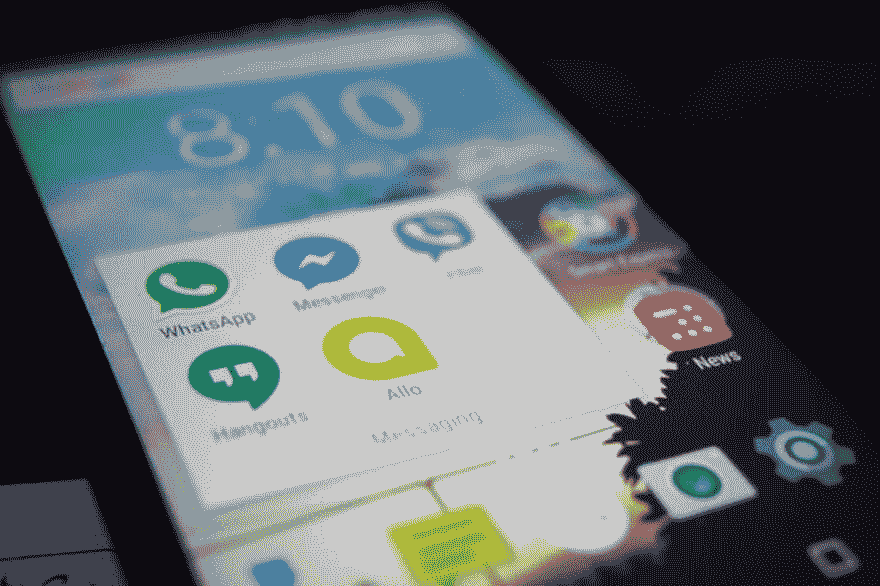

# 如何防止你的应用程序变得过时？

> 原文：<https://dev.to/mobileappsindia/how-to-prevent-your-application-from-becoming-obsolete-1bk9>

移动应用程序正在成为必需品，能够提供最佳服务的应用程序正在被用户采用。只有用户持续使用应用程序，应用程序才能成功。当开发的应用程序比以前的应用程序工作得更好时，该应用程序可能会过时和无用。

有时，甚至应用程序本身也可能是导致关闭的问题。很多时候，开发者未能添加市场上流行的不同的最新特征，并且当另一个应用程序将这些特征集成到他们的应用程序中时，先前的应用程序变得过时并因此被废弃。这些是开发人员面临的关于应用程序过时和过时的几个问题。

任何移动应用程序都有无限的潜力，如果获得了关于应用程序开发和营销的适当知识，就可以利用和影响这些潜力。这里有一些想法和计划，可以帮助您防止应用程序过时。

[T2】](https://res.cloudinary.com/practicaldev/image/fetch/s--adpdBZ6O--/c_limit%2Cf_auto%2Cfl_progressive%2Cq_auto%2Cw_880/https://cdn-images-1.medium.com/max/1024/1%2ANZqr7NWQFwgY5bXRSnYz-Q.jpeg)

**追赶新技术**

防止你的应用程序最终成为应用程序坟墓的最重要和主要的提示。用户对他们使用的产品变得更加聪明和警惕，如果你不能提供足够的输出，那么用户可能会开始使用不同的应用程序。应用程序中灵活敏捷的特性可以帮助您吸引更多的用户，同时保持现有用户对您的应用程序的忠诚度。

**关注所有开发阶段**

许多开发人员专注于特定的开发阶段，这将有助于他们取得成功。实际上，开发者应该关注所有的开发阶段，比如设计和测试。许多开发人员只关注开发，而忽略了设计和测试阶段，这可能会给你一个不完整的应用程序结果。因此，要关注所有的开发阶段，这样应用程序才能长期持续，不会过时。

**对碎片化的应用开发说不**

应用程序的碎片化只能让您访问有限的受众，如果他们没有找到在其他设备上正常工作的确切应用程序，他们就可以离开应用程序。有许多工具和功能可以帮助您结束应用程序的碎片化，从而为您提供一个灵活的应用程序，可以在多种类型的设备上工作。如果你遵循最新的应用程序开发指南，有许多条款可以在开发过程中结束应用程序的碎片化。

**增强的 UX/用户界面设计**

如果你能够借助复杂的设计提供高端的用户体验，你就有机会开发一个长期可用的应用程序，被许多用户采用。一个增强的 UX/用户界面设计可以吸引一个合适的用户群，对你的应用程序的发展产生积极的影响。随着越来越多的用户采用和使用你的应用程序，这个应用程序就会越来越受欢迎。当应用程序变得流行时，该应用程序变得过时的可能性很低。因此，关注应用程序的设计是至关重要的。

为您的应用程序提供未来保障是一个持续的过程，需要尽善尽美，容不得半点差错。防止您的应用程序过时的主要方面是为您的应用程序建立可靠的声誉，并采用有效的策略来开发您的应用程序。只有为数不多的 [**移动** **App 开发** **在** **印度**](https://www.mobile-app-development-india.com/) 、美国、英国、澳洲等公司提供高效的开发解决方案，可以让你的应用不至于过时。