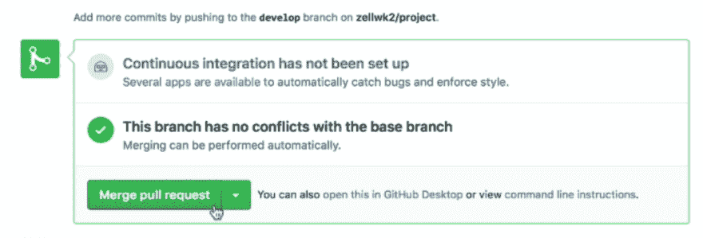
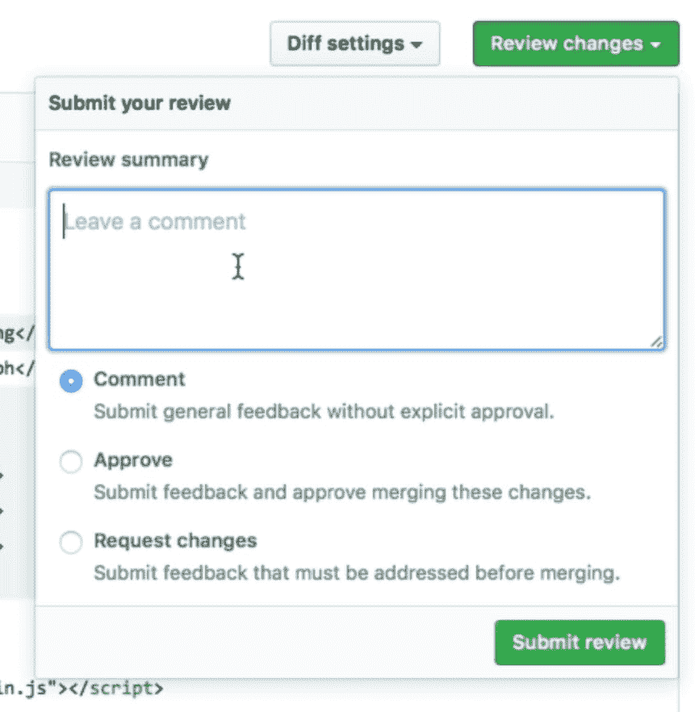
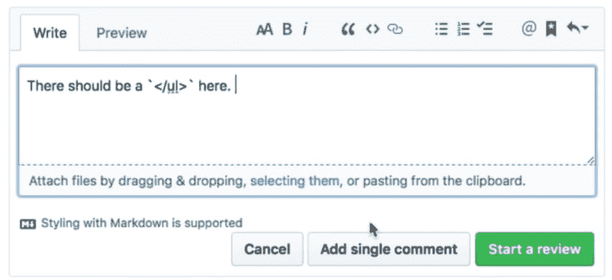
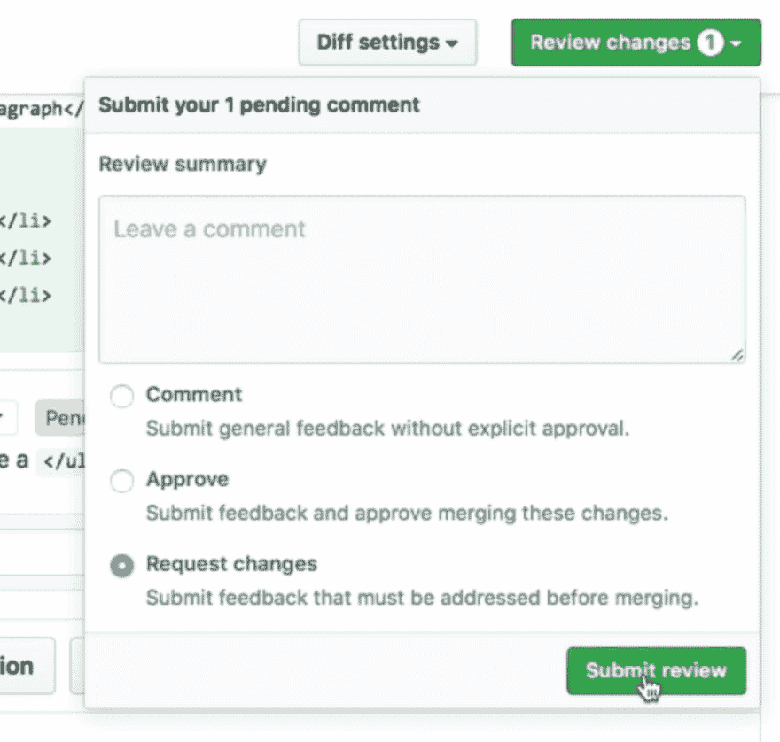
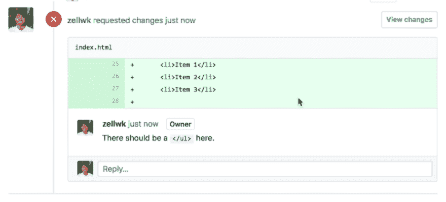
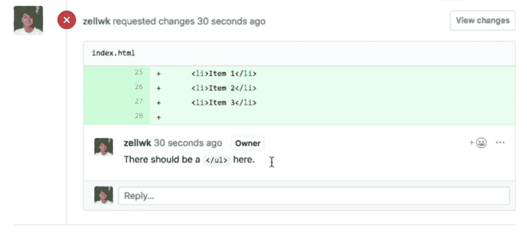
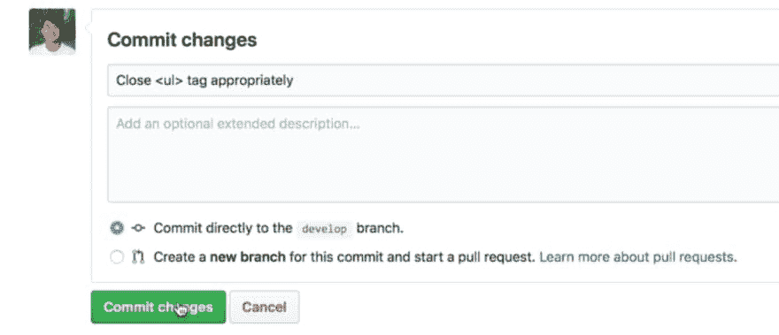

# 如何查看和编辑拉式请求

> 原文：<https://dev.to/zellwk/how-to-review-and-edit-a-pull-request-e5p>

[https://www.youtube.com/embed/UpBpb0j7IKA](https://www.youtube.com/embed/UpBpb0j7IKA)

当您提交拉动请求时，协作者将有权审阅您的拉动请求。他们将决定是否接受你的拉请求。如果他们接受您的拉请求，您的代码将被合并到您所请求的分支中。

您将从两个角度了解审核流程的情况:

1.  审查流程的人
2.  提交审核的人

## 合并拉取请求

在本课中，我将使用以下帐户:

1.  `zellwk`作为审核人
2.  `zellwk2`作为提交拉取请求的人

作为审核者，如果您向下滚动到页面底部，您会看到一个绿色按钮，上面写着“合并拉取请求”。您看到这一点是因为您拥有对存储库的写访问权限。

如果您想要合并拉取请求，您可以单击绿色按钮，这样就完成了。

[T2】](https://res.cloudinary.com/practicaldev/image/fetch/s--srR88PhU--/c_limit%2Cf_auto%2Cfl_progressive%2Cq_auto%2Cw_880/https://zellwk.cimg/2018/edit-pr/merge.png)

如果您没有对存储库的写访问权限，您将看不到显示“合并拉取请求”的按钮。

[T2】](https://res.cloudinary.com/practicaldev/image/fetch/s--wcidH4f---/c_limit%2Cf_auto%2Cfl_progressive%2Cq_auto%2Cw_880/https://zellwk.cimg/2018/edit-pr/no-merge.png)

## 审核拉取请求

作为审阅者，您需要单击“文件已更改”选项卡。这将告诉您哪些文件发生了更改。

[T2】](https://res.cloudinary.com/practicaldev/image/fetch/s--gJd7PKGH--/c_limit%2Cf_auto%2Cfl_progressive%2Cq_auto%2Cw_880/https://zellwk.cimg/2018/edit-pr/files-changed-tab.png)

您将看到一个包含两组代码的页面:

1.  左边一组是当前代码
2.  正确的设置是建议的代码

您可以在这个视图中看到添加或删除了哪些代码。绿线表示添加的代码。红线表示被删除的代码。

[T2】](https://res.cloudinary.com/practicaldev/image/fetch/s--5lKyl0It--/c_limit%2Cf_auto%2Cfl_progressive%2Cq_auto%2Cw_880/https://zellwk.cimg/2018/edit-pr/diff.png)

### 评论、批准或请求变更

审阅者可以在他们认为合适的时候对变更进行评论、批准或请求。为此，他们可以单击右上角的“审阅变更”按钮。

如果您单击“审阅变更”按钮，您将看到三个选项:

1.  评论
2.  赞同
3.  请求更改

[T2】](https://res.cloudinary.com/practicaldev/image/fetch/s--l2C78huE--/c_limit%2Cf_auto%2Cfl_progressive%2Cq_auto%2Cw_880/https://zellwk.cimg/2018/edit-pr/review-change-button.png)

### 更好的复习方式

审查代码的一个更好的方法是在需要反馈的代码行上提供反馈。

您可以将鼠标悬停在您想要提供反馈的行上。当你这样做时，你会看到一个蓝色的`+`按钮。

[T2】](https://res.cloudinary.com/practicaldev/image/fetch/s--WGpjauNV--/c_limit%2Cf_auto%2Cfl_progressive%2Cq_auto%2Cw_880/https://zellwk.cimg/2018/edit-pr/plus-button.png)

当你点击蓝色的`+`按钮时，你会看到一个编辑器。您可以在此处注释该行代码。

[T2】](https://res.cloudinary.com/practicaldev/image/fetch/s--xWIM7GhJ--/c_limit%2Cf_auto%2Cfl_progressive%2Cq_auto%2Cw_880/https://zellwk.cimg/2018/edit-pr/the-editor.png)

有两种选择:

1.  添加单个注释
2.  开始复习

如果您点击添加单个评论，评论将立即生效。

如果你点击“开始评论”,你将有机会在发送之前写更多评论。要结束审核，您需要单击“审核更改”按钮并选择“提交审核”。

[T2】](https://res.cloudinary.com/practicaldev/image/fetch/s--_EALsSJK--/c_limit%2Cf_auto%2Cfl_progressive%2Cq_auto%2Cw_880/https://zellwk.cimg/2018/edit-pr/submit-review.png)

提交审核后，拉动式请求将根据您的更改进行更新:

[T2】](https://res.cloudinary.com/practicaldev/image/fetch/s--G-rSmdQl--/c_limit%2Cf_auto%2Cfl_progressive%2Cq_auto%2Cw_880/https://zellwk.cimg/2018/edit-pr/pr-updated.png)

## 处理拉式请求

提交拉取请求的人也可以看到评论。

[T2】](https://res.cloudinary.com/practicaldev/image/fetch/s--5I00Bcdt--/c_limit%2Cf_auto%2Cfl_progressive%2Cq_auto%2Cw_880/https://zellwk.cimg/2018/edit-pr/pr-updated-2.png)

如果您正在处理 pull 请求，您必须进行必要的更改。为此，您需要返回分叉的存储库，并更新用于提交拉请求的同一个分支。

在这种情况下，这将是开发分支。我继续在`index.html`文件中添加了结束的`<ul>`标签。我还将提交消息设置为`closing <ul> appropriately`。

[T2】](https://res.cloudinary.com/practicaldev/image/fetch/s--0yNRP3Cl--/c_limit%2Cf_auto%2Cfl_progressive%2Cq_auto%2Cw_880/https://zellwk.cimg/2018/edit-pr/edit-pr.png)

一旦提交者推入分叉的存储库，Github 将使用新的更改更新 pull 请求。

[T2】](https://res.cloudinary.com/practicaldev/image/fetch/s--hOtZj7vj--/c_limit%2Cf_auto%2Cfl_progressive%2Cq_auto%2Cw_880/https://zellwk.cimg/2018/edit-pr/pr-updated-after-edit.png)

审核者现在可以通过单击“合并拉取请求”按钮来合并请求。

## 合并后

在代码被合并到主存储库之后，您可以删除分叉的存储库(或者您用于 pull 请求的分支)。不再需要它们了。

## 包装完毕

在本课中，您学习了如何复查和编辑拉式请求。

要编辑一个拉请求，您可以将新的变更推入用于拉请求的同一个分支。Github 会自动更新其他所有东西。

* * *

感谢阅读。这篇文章最初发表在我的博客上。如果你想要更多的文章来帮助你成为一个更好的前端开发者，请注册[我的时事通讯](https://zellwk.com)。