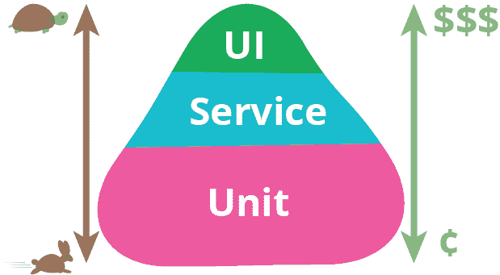

# 如何使用 AWS CodeBuild 在 CI/CD 管道中通过 Cypress 运行浏览器测试

> 原文：<https://dev.to/kylegalbraith/how-to-run-browser-tests-via-cypress-in-your-cicd-pipeline-with-aws-codebuild-7ej>

最近，我开通了自己的博客。在这个过程中，我对如何自动测试我的新博客的质量产生了兴趣。我不想要一个重型框架。我不想进行深度测试，因为我博客上的功能不是很详细。

我想测试的一个基本东西是我的博客的移动视图和平板电脑/桌面视图。我经常犯这样的错误，改变 CSS 类或 HTML 元素，以某种我没有想到的方式破坏移动布局。

因此，我开始考虑如何简化我的浏览器测试。在选择框架时，我想考虑一些事情。

*   我希望它是轻量级的，理想情况下一个`npm install`将是理想的。
*   它需要易于集成到我的 [AWS CodePipelie CI/CD 管道](https://blog.kylegalbraith.com/2018/05/14/creating-a-cicd-pipeline-with-a-git-repository-in-~30-seconds-using-terraform-and-aws/)中。
*   测试设置、断言和框架组件应该是合理的。

对这些产品的快速评估让我选择了经典的 Selenium 而不是 T1，因为我发现上次使用时它体积太大了。然而，我喜欢通过浏览器测试组件的想法，但我更喜欢它是轻量级的。

### 进入舞台右侧: [Cypress.io](https://www.cypress.io/?ref=kylegalbraith)

去年，我第一次在肯特·多兹的推特上看到赛普拉斯。

> 肯特 c .多兹[@肯特多兹](https://dev.to/kentcdodds)[@ okonetchnikov](https://twitter.com/okonetchnikov)[@ cpojer](https://twitter.com/cpojer)[@ Cypress _ io](https://twitter.com/Cypress_io)令人惊叹。看不下去了2017 年 2 月 26 日下午 17:01[](https://twitter.com/intent/tweet?in_reply_to=835897600263892992)[](https://twitter.com/intent/retweet?tweet_id=835897600263892992)[](https://twitter.com/intent/like?tweet_id=835897600263892992)

如果你读了这个帖子，你会发现这是对用户遇到浏览器问题的回应，而单元测试并没有发现这些问题。在这种情况下，用户使用 Jest 编写他们的测试，但是当他们进入生产时发现浏览器问题。

单元测试棒极了，是前端和后端服务的必备。但是如果我们回忆一下马丁·福勒的测试金字塔。

[T2】](https://res.cloudinary.com/practicaldev/image/fetch/s--DjMj0R6y--/c_limit%2Cf_auto%2Cfl_progressive%2Cq_auto%2Cw_880/https://thepracticaldev.s3.amazonaws.com/i/udhv9d2k7o8nsrfkgopv.png)

我们看到单元测试是最大的斑点。它们应该又快又便宜。

但是，其他 blobs、服务和 UI 也很重要。

上面的推文强调的是，单元测试是馅饼的一大块，但不是整个馅饼。

在我看来，这就是柏树发挥作用的地方。

我可以使用我最喜欢的框架来编写我的单元测试，不管是 NUnit、Mocha、Pyunit 等等。但是对于像我的基于 React 的博客这样的前端服务，我需要添加 UI 测试或端到端测试来测试功能或事物的显示方式。

### 撰写《柏考》

Cypress 的入门非常简单。我们可以将它作为开发依赖项安装在我们的项目中。

```
$ npm install cypress --save-dev 
```

Enter fullscreen mode Exit fullscreen mode

安装后，我们可以创建一些新的目录和我们的第一个测试夹具。

```
$ mkdir cypress/integration/blog-verify
$ touch landing.spec.js 
```

Enter fullscreen mode Exit fullscreen mode

对于我的博客登录页面，我将在`landing.spec.js`中编写下面的 cypress 测试。

```
/// <reference types="Cypress" />

context('Landing', () => {
    beforeEach(() => {
        cy.visit('https://blog.kylegalbraith.com')
    })

    it('center header on small screens', () => {
        cy.get('.container > div')
            .should('have.css', 'text-align')
            .and('match', /left/);

        cy.viewport('iphone-6+');

        cy.get('.container > div')
            .should('have.css', 'text-align')
            .and('match', /center/);
    });
}); 
```

Enter fullscreen mode Exit fullscreen mode

这里我有一个简单的 cypress 测试，它验证一些标题文本在我的博客登录页面上的位置。请注意，在`beforeEach`中，我们在每次测试前都会导航到我的博客。

然后在测试`center header on small screen`中我用柏库与柴一样的断言来验证我的结果。首先，我用一个正常大小的浏览器检查我的头部的 CSS 是否设置为`text-align: left;`。然后，我将浏览器宽度设置为移动视图`cy.viewport('iphone-6+');`，以验证文本更改为`center`。

这是在 cypress 的一个基本测试。这只是触及了可以做的事情的表面，所以如果你想检查更复杂的场景，请查看关于如何与各种元素交互的[文档。](https://docs.cypress.io/guides/core-concepts/interacting-with-elements.html#Additionally-an-element-is-considered-hidden-if)

现在要运行测试，我们可以从我们的`node_modules`文件夹中执行 Cypress。

```
$ node_modules/.bin/cypress run
Running: blog-verify/landing.spec.js...                                                

  Landing
    √ center header on small screens (4524ms)

  1 passing (7s)

  ┌───────────────────────────────────────────┐
  │ Tests:        1                           │
  │ Passing:      1                           │
  │ Failing:      0                           │
  │ Pending:      0                           │
  │ Skipped:      0                           │
  │ Screenshots:  0                           │
  │ Video:        true                        │
  │ Duration:     7 seconds                   │
  │ Spec Ran:     blog-verify/landing.spec.js │
  └───────────────────────────────────────────┘ 
```

Enter fullscreen mode Exit fullscreen mode

一旦测试运行完成，您还可以在位于您的`cypress`目录中的`videos`目录中查看每个测试的视频记录。

[T2】](https://res.cloudinary.com/practicaldev/image/fetch/s--IJ3-q3dt--/c_limit%2Cf_auto%2Cfl_progressive%2Cq_66%2Cw_880/https://thepracticaldev.s3.amazonaws.com/i/d9w2oj858wp9vnb7yytn.gif)

很酷吧？没有 Selenium，没有 Chrome 浏览器，也没有庞大的启动设置。安装一个包，编写一个测试并运行。

当然，这是一个可以用柏树做什么的基本例子。我鼓励你探索添加覆盖用户用例的集成测试。这些例子包括:

*   登录和注销应用程序。
*   保存和加载应用程序数据。
*   检查数据可以在不同大小的浏览器中查看。
*   验证具有特定权限的用户不能访问应用程序的其他部分。

最后，让我们探索一下如何将这些测试整合到 AWS 中的持续集成和部署管道中。

### 将 Cypress 并入 AWS 代码管道和代码构建

如果你还记得以前的博客文章，[我开发了一个 Terraform 模块，提供 Git repo、AWS CodePipeline 和 AWS CodeBuild 项目](https://blog.kylegalbraith.com/2018/05/14/creating-a-cicd-pipeline-with-a-git-repository-in-~30-seconds-using-terraform-and-aws/)，这样我就可以为我所有的新项目提供一个完整的端到端 CI/CD 管道。对于我的博客，我使用了这个模块，这样我就可以用任何对`master`的新提交来持续部署我的博客。

为了运行这些新的测试，我只需要更新我的存储库中的`buildspec.yml`文件。这个 YAML 文件告诉 AWS CodeBuild 如何构建、测试和部署我的静态网站。

这是在我更新它来运行我的测试之前我的`buildspec.yml`文件的样子。

```
version: 0.2
phases:
  install:
    commands:
      - echo "install cypress dependencies..."
      - npm install -g gatsby-cli
      - npm install -g purgecss
  pre_build:
    commands:
      - echo "pre_build step"
  build:
    commands:
      - cd src
      - cd new-gatsby-blog
      - npm install
      - npm run-script build
      - aws s3 cp public/ "s3://blog.kylegalbraith.com/" --recursive --cache-control 'public, max-age=2628000'
      - aws cloudfront create-invalidation --distribution-id E3SMHPICHT13MG --paths '/*'
  post_build:
    commands:
      - echo "post_build step" 
```

Enter fullscreen mode Exit fullscreen mode

为了运行我们的测试，我将更新`install`部分，添加一些 Cypress 依赖的依赖项。在我们将站点部署到 S3 并使 CloudFront 缓存失效后，我还将更新`build`部分来运行我们的测试。因此，可以将这些测试视为*部署后*验证。

下面是进行这些更改后的`buildspec.yml`文件。

```
version: 0.2
phases:
  install:
    commands:
      - echo "install cypress dependencies..."
      - npm install -g gatsby-cli
      - npm install -g purgecss
      - apt-get update
      - apt-get install -y libgtk2.0-0 libnotify-dev libgconf-2-4 libnss3 libxss1 libasound2 xvfb
  pre_build:
    commands:
      - echo "pre_build step"
  build:
    commands:
      - cd src
      - cd new-gatsby-blog
      - npm install
      - npm run-script build
      - aws s3 cp public/ "s3://blog.kylegalbraith.com/" --recursive --cache-control 'public, max-age=2628000'
      - aws cloudfront create-invalidation --distribution-id E3SMHPICHT13MG --paths '/*'
      - node_modules/.bin/cypress run
  post_build:
    commands:
      - echo "post_build step" 
```

Enter fullscreen mode Exit fullscreen mode

请注意我们正在运行的`install`步骤的内部:

```
apt-get install -y libgtk2.0-0 libnotify-dev libgconf-2-4 libnss3 libxss1 libasound2 xvfb 
```

Enter fullscreen mode Exit fullscreen mode

这是为了安装 Cypress 需要的必要的依赖项，以便在 CodeBuild 项目中运行。

然后在`build`步骤中，我们执行测试:

```
node_modules/.bin/cypress run 
```

Enter fullscreen mode Exit fullscreen mode

现在，当我签入更改时，我的 AWS 代码管道将被触发。

构建完成后，我可以检查我的 AWS CodeBuild 日志，查看执行的测试和构建是否成功。

```
 Running: blog-verify/landing.spec.js...                              (2 of 2) 

  Landing

    ✓ center header on small screens (697ms)

  1 passing (2s)

  (Results)

  ┌───────────────────────────────────────────┐
  │ Tests:        1                           │
  │ Passing:      1                           │
  │ Failing:      0                           │
  │ Pending:      0                           │
  │ Skipped:      0                           │
  │ Screenshots:  0                           │
  │ Video:        true                        │
  │ Duration:     2 seconds                   │
  │ Spec Ran:     blog-verify/landing.spec.js │
  └───────────────────────────────────────────┘

  (Video)

  - Started processing:   Compressing to 32 CRF
  - Finished processing:  /codebuild/output/src459391942/src/src/new-gatsby-blog/cypress/videos/blog-verify/landing.spec.js.mp4 (1 second)

================================================================================

  (Run Finished)

      Spec                                    Tests  Pass…  Fail…  Pend…  Skip… 
  ┌────────────────────────────────────────────────────────────────────────────┐
  │ ✔ blog-verify/individual_post.…   00:02      1      1      -      -      - │
  ├────────────────────────────────────────────────────────────────────────────┤
  │ ✔ blog-verify/landing.spec.js     00:02      1      1      -      -      - │
  └────────────────────────────────────────────────────────────────────────────┘
    All specs passed!                 00:05      2      2      -      -      -  

[?25h
[Container] 2018/08/12 00:59:08 Phase complete: BUILD Success: true
[Container] 2018/08/12 00:59:08 Phase context status code:  Message: 
[Container] 2018/08/12 00:59:08 Entering phase POST_BUILD
[Container] 2018/08/12 00:59:08 Running command echo "post_build step - run cypress"
post_build step - run cypress

[Container] 2018/08/12 00:59:08 Phase complete: POST_BUILD Success: true 
```

Enter fullscreen mode Exit fullscreen mode

您可以看到我们得到了测试执行的详细分解。如果我们愿意，我们甚至可以从代码构建运行中复制视频文件。非常酷！

### 结论

在这篇文章中，我们讨论了为什么端到端或者集成测试是重要的。没有人说你应该全身心投入到集成/UI 测试中，但是你至少应该用它们覆盖应用程序的主要功能。它们不是伟大的单元测试的替代品，但是它们是优秀的补充。

我们只是触及了柏树的皮毛。我打算进一步探索它，测试更多我的复杂应用程序。希望这已经向您介绍了 UI 测试，并展示了如何将它轻松地整合到您的 CI/CD 管道中。

一如既往，如果你有任何问题，请随时给我留下评论或联系我 [Twitter](https://twitter.com/kylegalbraith) 。

### 您是否渴望了解更多关于亚马逊网络服务的信息？

想了解更多关于 AWS 的知识？我最近发布了一个电子书和视频课程，穿越了信息的海洋。它着重于在 AWS 上托管、保护和部署静态网站。目标是在您使用服务时了解与此问题相关的服务。如果你一直想学习 AWS，但不知道从哪里开始，那么看看我的课程。