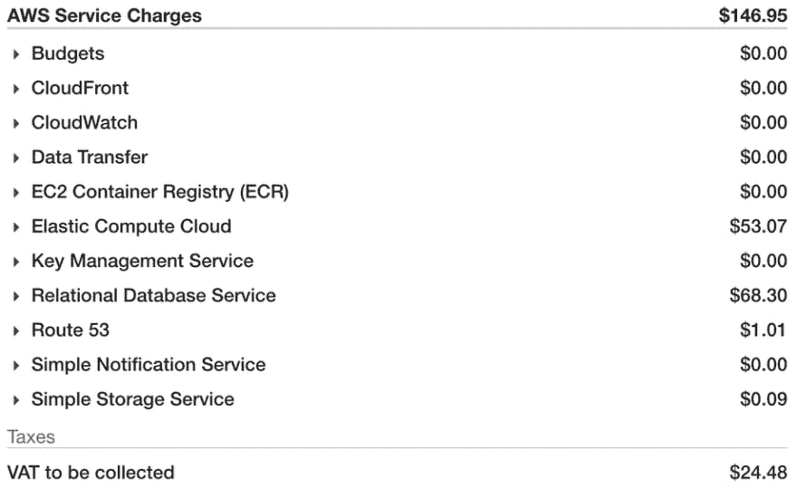

# 在 AWS 上托管如何省钱

> 原文：<https://dev.to/alexhyettdev/how-to-save-money-when-hosting-on-aws-5a24>

当我开始我的第一次创业 [GrowRecruit](https://www.growrecruit.com) 时，我使用了推荐的设置。但是，我很快发现，对于一个自举式的创业公司来说，推荐的东西其实是相当昂贵的。

如果你的产品仍然处于 MVP 阶段(最低可行产品)，你还没有客户，你希望避免在 AWS 主机上花费大量资金。

我的初始设置包括以下内容:

*   带有公共和私有子网以及 NAT 网关的 VPC
*   2 个 t2 .小型实例 RDS 数据库集群(一个读取，一个写入)，
*   2 个 t2.micro 实例，一个用于 WordPress，另一个用于我的 API
*   2 个 S3 水桶
*   53 号公路

对于自举 SaaS 来说，这是一个相当小的设置，我本来想用一个更小的 RDS 实例，但是，t2.small 是提供加密的最小可用实例。

每月总费用 146.95 美元！不完全是我寻找的便宜的自举价格。

## 第一步:削减不用的服务

要开始计划你需要削减什么，你需要看看你的账单。这是我的样子:

[T2】](///static/9997ab006d5dde7dcfd797519ee157ec/78363/aws-charges.png)

如您所见，支出主要集中在 3 个领域:弹性计算云、关系数据库服务和增值税。

### 弹性计算云

我有两个 EC2 实例，都是 t2.micro，一个用于我的 API，另一个用于我的营销网站的 WordPress 安装。

其中一个实例包含在 Amazon 的免费层中，运行这些实例的成本是 3.65 美元。这本来是 9.23 美元，但我选择了保留的实例。我将在下面介绍保留的实例。

那么，这另外 49.42 美元究竟是从哪里来的呢？

*   NAT 网关-35.72 美元
*   弹性负载平衡器-13.68 美元
*   EBS-0.02 美元

所以我花了 35.72 美元买了一个 NAT 网关。那么什么是 NAT 网关，你需要它吗？

#### NAT 网关

NAT 网关的目的是允许专用子网中的实例访问互联网，但阻止互联网访问这些实例。

在我的情况下，我的私有子网中唯一的东西是我的数据库，它不需要互联网接入。因此，我摆脱了 NAT 网关，每月为自己节省了 35 美元。

如果你确实需要一个 NAT 网关，你可以[建立一个 NAT 实例](https://docs.aws.amazon.com/vpc/latest/userguide/VPC_NAT_Instance.html#NATInstance),这可能对你来说更便宜。

#### 弹性负载平衡器

第二大开销是弹性负载平衡器(ELB)。现在，我使用 Elastic Beanstalk 运行我的 API，在我的 API 端点上，SSL 需要 ELB。所以没办法摆脱它。

## 步骤 2:承诺付款或选择实例类型

AWS 有两种省钱的方法，保留实例和现场实例。

#### 保留实例

如果您打算长期保留服务器，保留实例是省钱的好方法。

Amazon 有 3 种不同的方式可以预订实例。

*   **所有前期费用** -这显然有最高的前期费用，但从长远来看你节省最多。
*   **部分预付** -在这种情况下，你先支付一部分，然后在剩余期限内按小时支付折扣费率。
*   **无需预付** -顾名思义，你不需要预付任何费用，但是你要保证在学期期间每个月都有固定的支出。

在我的 EC2 实例中，我选择了预付 43 美元的部分费用，这使我的月费用降到了上面看到的 3.65 美元。

我对我的 RDS 实例做了同样的事情，但是这次我选择了不预付，这使我的数据库成本从 68.30 美元下降到大约 53 美元。然而，我不推荐这个选项，因为它会将你束缚在一份至少一年的合同中。

#### 光斑实例

降低成本的另一个选择是点实例。使用 spot 实例，您可以在 EC2 实例上节省大量资源，但这是以牺牲可靠性为代价的。

使用 Spot 实例，您可以获得多余的计算能力，否则这些能力会被浪费掉。当你建立一个 spot 实例时，你可以指定你愿意花费的最大金额和你想要的实例类型。

对于偶尔不运行的容错后台进程，Spot 实例是一个很好的选择。

它们也是测试环境的一个很好的选择，尽管要确保 QA 知道在测试你的软件时要考虑到这一点。

## 第三步:转向更便宜的选择

如果你目前的配置已经没有选择了，那就值得考虑 AWS 更便宜的配置。

### S3 储

亚马逊 S3 存储非常便宜。我目前运行 3 个博客(包括这个)和 GrowRecruit 的前端，每月 0.05 美元。

为了节省更多的钱，我使用 [WP 静态站点生成器插件](https://wordpress.org/plugins/static-html-output-plugin/)创建了一个运行在 EC2 实例上的我的 Wordpress 博客的静态副本，并把它放在一个 S3 桶中，上面有 CloudFront。

我使用的 Wordpress 主题过于臃肿，需要一段时间才能加载。我把这个换成了超快的盖茨比博客，就像这个。

### 去无服务器

如果你的应用程序没有被频繁使用，你可以通过无服务器化节省很多钱。亚马逊提供一系列无服务器技术，包括 [Aurora 无服务器](https://aws.amazon.com/rds/aurora/serverless/)和 [Lambda 功能](https://docs.aws.amazon.com/lambda/latest/dg/welcome.html)。

如果我要重写我的创业，我肯定会考虑使用无服务器技术。你只要确保关注成本就行了。如果你开始有大量的流量，你可能要考虑走实例路线。

## 结论

通过上面的调整，我设法将 AWS 的成本降低了近一半，现在每月支付大约 75 美元。

然而，如果我使用的是 Aurora 无服务器服务器，这只是其中的一小部分。

不幸的是，当我建立 GrowRecruit 时，Aurora Serverless 还没有推出，我现在被一年期的合同束缚住了！这是一个惨痛的教训。