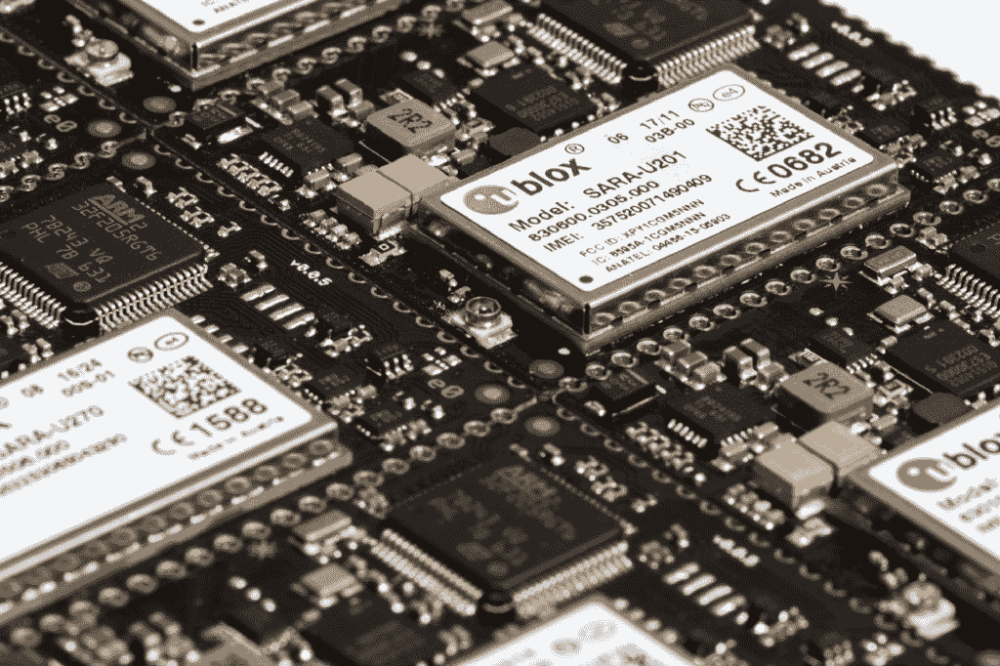
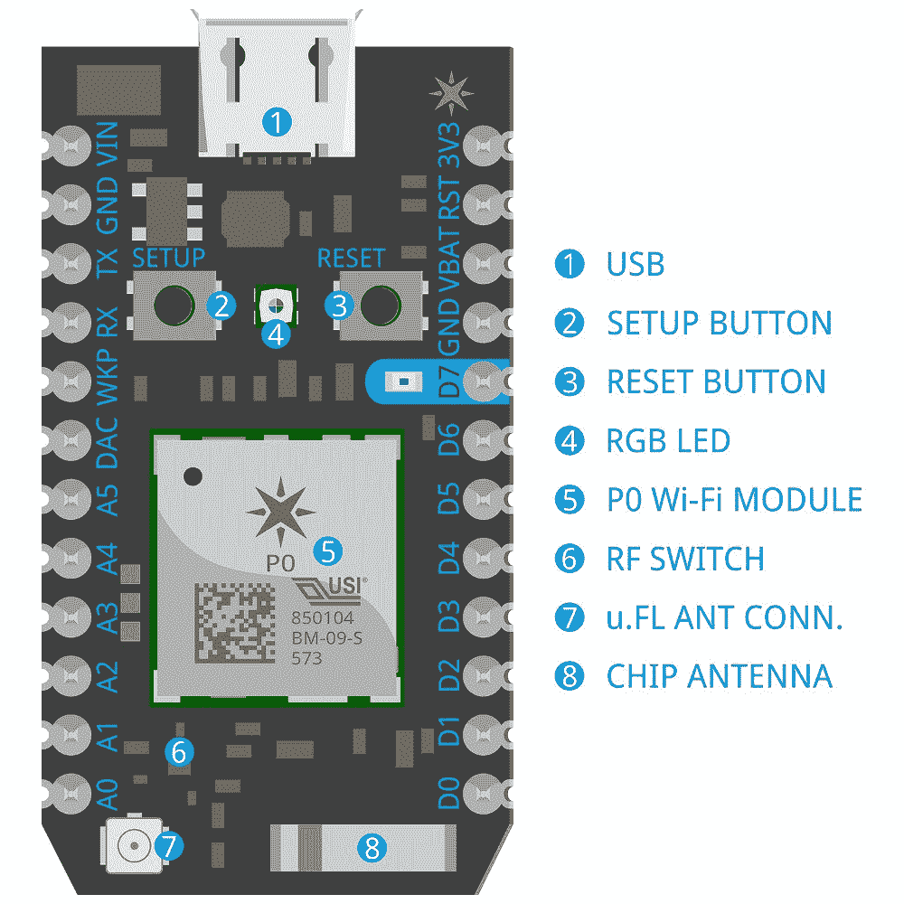
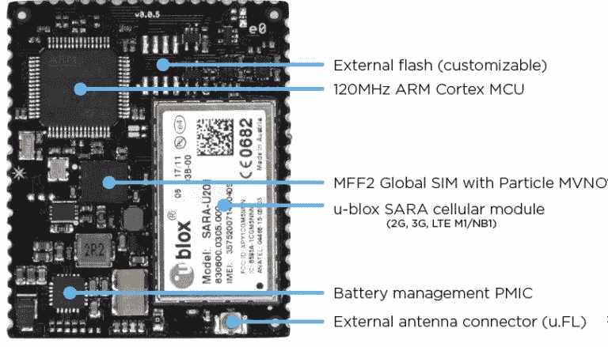
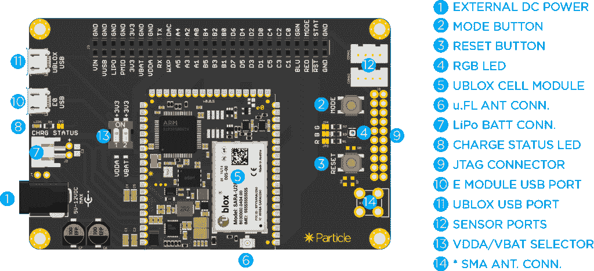

# 如何选择合适的物联网硬件:从原型到生产

> 原文：<https://dev.to/particle/how-to-select-the-right-iot-hardware-from-prototype-to-production-8f8>

#### 探索物联网开发套件、MPM 套件和量产模块之间差异的全面指南

[T2】](https://cdn-images-1.medium.com/max/1024/1*YH_uDaxpOcaod2LBIhrGGg.jpeg)

物联网开发板和模块是每个互联产品的核心。随着物联网的发展，这些主板的种类和技术能力只会变得更加复杂。当构建物联网产品时，您可能希望从简单的原型开发套件开始，但随着硬件开发和设计流程的进展，您将需要投资用于扩展和制造的硬件板。

但是原型制作和生产硬件有什么区别呢？本文旨在清理一些噪音，让您更容易为您的物联网产品选择正确的硬件解决方案。

### 原型制作和生产硬件有什么区别？

一般来说，您可以根据以下特征轻松区分原型硬件和生产硬件:

原型硬件针对以下方面进行了优化:

*   **灵活性** —通常为电路板，并有一个开放的 SIM 卡插槽
*   **可负担性** —低成本
*   **模块化** —与其他硬件生态系统兼容
*   **易用性** —可在几分钟内完成设置，并附带工具
*   **初学者受众** —针对初学者优化的内容和示例

大规模生产硬件针对以下方面进行了优化:

*   **可靠性** —采用 SMT(表面贴装技术)组件，能够承受极端温度，并附带硬件保修
*   **可制造性** —拾取并放置机器准备就绪
*   **大批量** —可以通过可靠的分销合作伙伴批量购买
*   **易于集成** —应具有完整的产品认证
*   **高级受众** —全面的数据手册和应用笔记

### 原型&生产硬件实例

例如， [Particle](https://www.particle.io/) 生产三种基本的硬件——开发套件(dk)、评估套件(evk)和大规模生产模块(MPM)。这些定义如下:

[T2】](https://cdn-images-1.medium.com/max/1000/0*ZAtehe3M2aiVPVrL.jpg)

### 开发套件(dk)

开发套件是试验板友好的，并针对可扩展性、模块化和易用性进行了优化。因此，它们可用于根据使用情形和应用进行扩展，但最好用作友好环境中的短期 POC。

1.  **预期用途** —用于快速迭代/原型化硬件和固件系统。它提供了一个快速启动的解决方案，并启动了一个物联网项目。
2.  **功能** — USB 连接、硬件附件生态系统、可在试验板上安装的接头、RGB 状态 LED、板载天线、实惠的价格
3.  **观众** —对硬件非常陌生的业余开发人员和工程师
4.  **举例**——[氩气](https://www.particle.io/wifi)、[硼](https://www.particle.io/cellular)

[T2】](https://cdn-images-1.medium.com/max/768/0*wBe0J5CSXeAIdmce.jpg)

### 批量生产模块(MPMs)

大规模生产模块针对大规模生产产品中的部署进行了优化，而不是针对开发。这些是真货，打算在恶劣环境和狭小空间部署 5-10 年。这些产品在被焊接到您的最终产品中之前几乎没有用处。

1.  **预期用途** —在量产产品中的部署
2.  **特性** —认证、硬件保修和支持、环境稳定性、尺寸和可制造性优化
3.  **受众** —规模化生产产品的公司
4.  **举例**—[P0](https://docs.particle.io/datasheets/photon-(wifi)/photon-datasheet/)/[P1](https://docs.particle.io/datasheets/photon-(wifi)/p1-datasheet/)/[E 系列 MPMs](https://docs.particle.io/datasheets/electron-(cellular)/e-series-datasheet/)

[T2】](https://cdn-images-1.medium.com/max/1024/0*rZEP150fIwkK39df.png)

### MPM 评估套件(EVKs)

MPM 评估套件是大规模生产模块的扩展板，允许您快速轻松地开发、迭代和调试您的物联网解决方案。换句话说，它们为大规模生产硬件解决方案提供了更友好的开发体验。它们焊接有一个 MPM，在许多方面可以作为一个很好的参考设计。

1.  **预期用途** —设计用于大规模部署的产品的公司，从 dk 到 MPM 迭代的公司。对于在生产硬件(MPMs)环境中迭代和优化生产固件非常有用。
2.  **特性** —最大数量的 GPIO 和外设、大型/舒适的调试优化板布局、应用笔记和专业文档
3.  **受众** —擅长设计定制电路板的专业工程师，有意大规模部署的公司
4.  **示例** — [E 系列评估套件](https://store.particle.io/products/e-series-evaluation-kit)

### 选择物联网硬件时需要考虑的其他因素

当您为原型开发或生产采购硬件时，您还应该考虑随之而来的平台、工具和支持:

### 1。一致的平台、基础设施、固件和开发工具

随着规模的扩大，您会希望继续使用相同的云基础架构和开发工具。在不同的硬件设计之间切换已经是一项艰巨的任务了，你不会想把它带到你正在使用的软件上。相同的固件应用程序，当在你的 dk 和 MPM 上编译时，应该以完全相同的方式运行。永远不需要调整或修改固件应用程序来让它在 MPM 上运行。

### 2。领域专家&支持

选择硬件解决方案时，考虑其周围的社区也很重要。有限采用的硬件解决方案可用于帮助您开发的资源将会减少。例如，Particle 的开发工具包周围有一个大型开发人员社区，这使得在需要时更容易找到信息和支持。

### 3。易于部署

您希望能够尽快启动并运行您的产品。寻找硬件来源时，请查看附带的文章和文档。准备好这些资源将使你很容易立即得到你的问题的答案。

### 底线

当采购原型和生产硬件时，您希望检查其可访问性、可负担性、集成和制造特性。无论您是构建原型还是构建可扩展的物联网产品，您都希望选择能够提供一致的平台环境和易于部署的硬件。

* * *