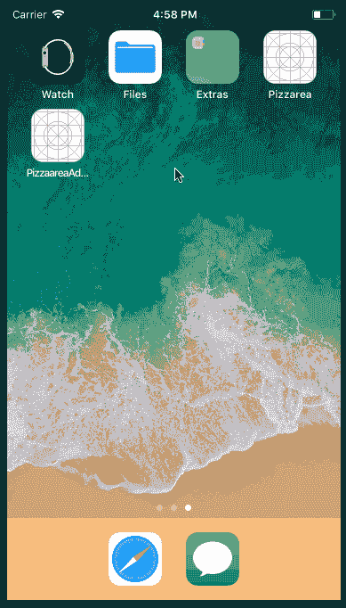
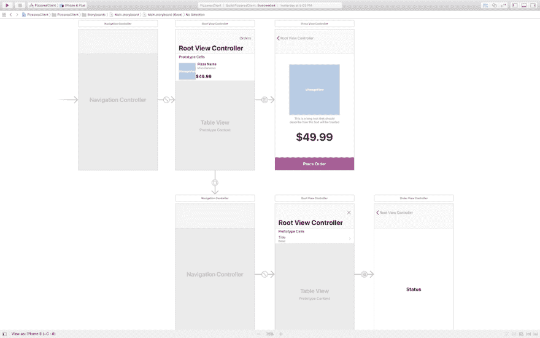
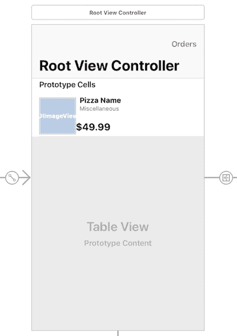
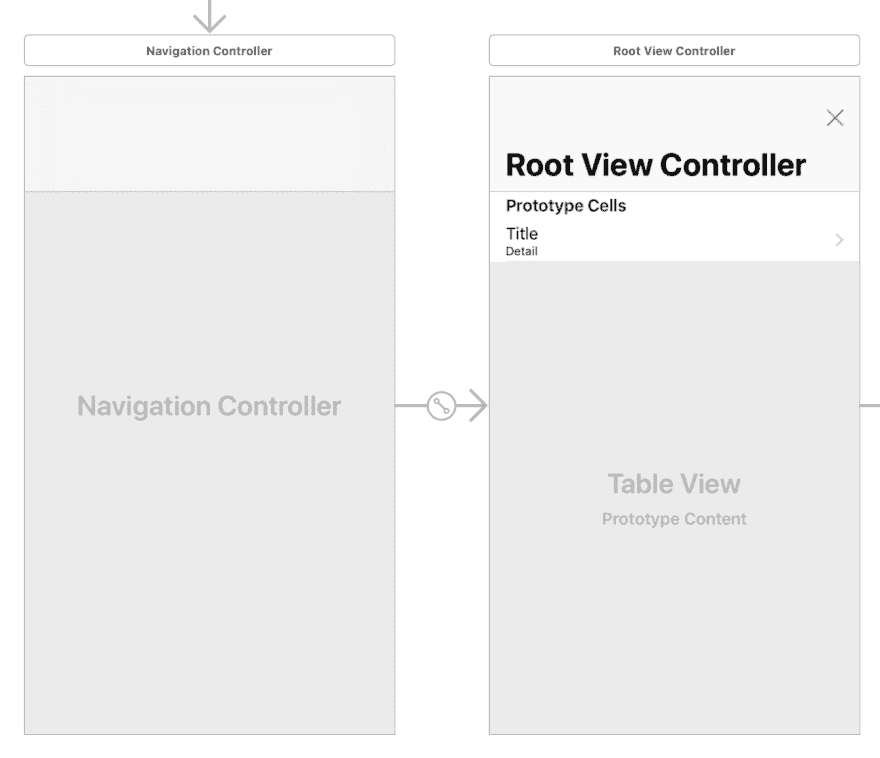
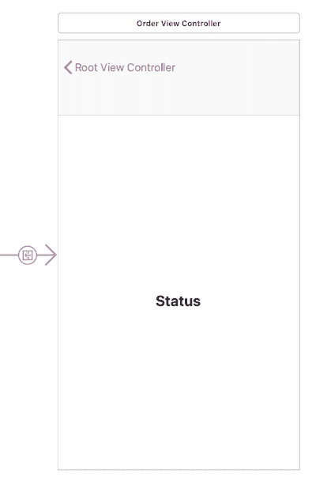
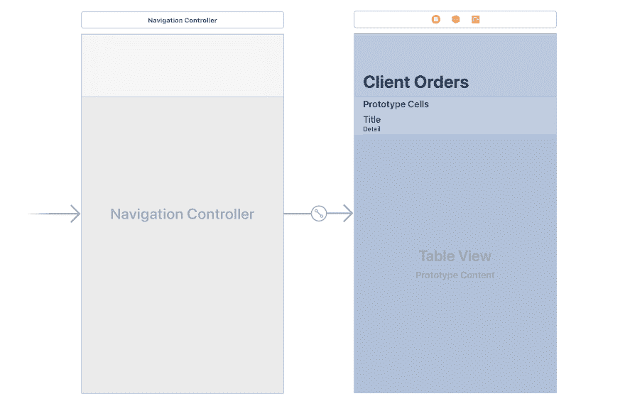
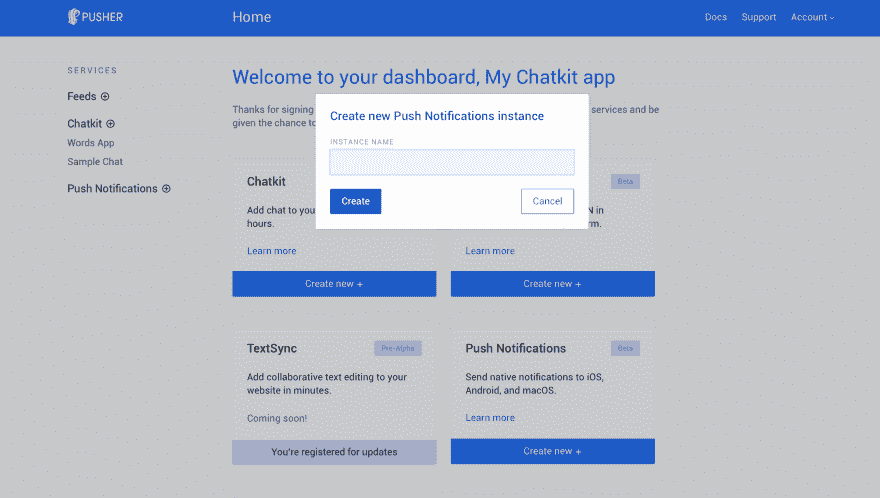
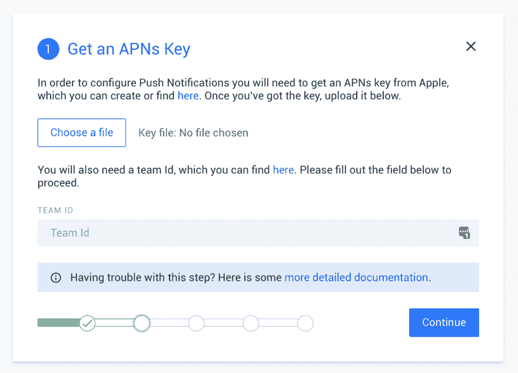
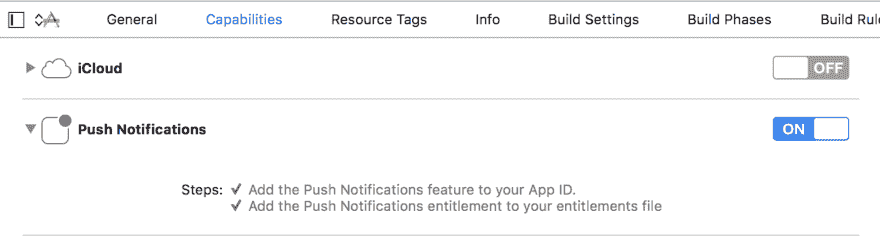
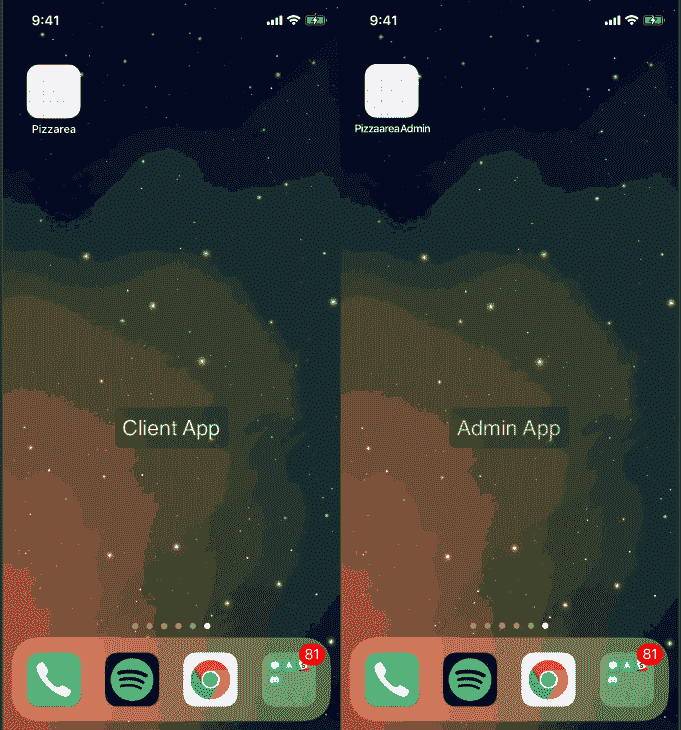

# 如何向食品配送 Swift 应用程序发送推送通知

> 原文：<https://dev.to/neo/how-to-send-push-notifications-to-a-food-delivery-swift-app--22d7>

最后一英里配送市场使得从移动设备订购配送食品并在食品还热的时候送到用户家门口变得很容易。

Deliveroo、Postmates 或 Uber Eats 等市场利用你设备的位置为你提供一份足够近且开放的餐馆列表，这样你就可以尽快收到你的外卖。
w 到
顾客、餐厅和司机之间的这种实时体验依赖于交易推送通知，将订单从厨房无缝地移动到餐桌上。客户希望推送通知能够提醒他们订单何时在路上，何时需要在门口迎接司机。

设置推送通知可能会令人困惑且耗时。然而，有了 [Pusher 的推送通知 API](https://pusher.com/push-notifications) ，这个过程就简单多了，也快多了。

在本文中，我们将考虑如何在 iOS 上构建具有事务推送通知的应用。为此，我们将构建一个虚拟食品配送应用程序。

## 先决条件

*   安装了 Xcode 的 Mac。[在这里下载 Xcode】。](https://developer.apple.com/xcode/)
*   Xcode 使用知识。
*   [Swift](https://developer.apple.com/swift/) 的知识。
*   推销账户。[在这里创建一个](https://dash.pusher.com/authenticate/register?ref=pn-food-delivery-ios)。
*   JavaScript/Node.js 基础知识[(查看本教程)](https://www.w3schools.com/nodejs/default.asp)。
*   Cocoapods [安装在你的机器](https://guides.cocoapods.org/using/getting-started.html)上。

一旦有了要求，就开始吧。

## 构建我们的应用——规划

在开始构建我们的应用程序之前，我们需要对我们希望应用程序如何工作做一些规划。

我们将提出三项申请:

*   后端应用程序(使用 Node.js 的 Web)。
*   客户端应用程序(使用 Swift 的 iOS)。
*   管理应用程序(使用 Swift 的 iOS)。

### 后台应用

这将是 API。为了简单起见，我们不会在 API 中添加任何类型的身份验证。我们将从我们的 iOS 应用程序中调用 API。API 应该能够提供食品库存、订单，并且还能够管理订单。我们还将从后端应用程序发送推送通知。

### 客户端应用

这将是客户将使用的应用程序。这是用户可以点餐的地方。为了简单起见，我们将没有任何种类的认证，一切将直截了当。客户应该能够看到库存，并从库存中订购一个或多个。他们还应该能够看到他们的订单列表和每个订单的状态。

[T2】](https://res.cloudinary.com/practicaldev/image/fetch/s--yZEsyRqV--/c_limit%2Cf_auto%2Cfl_progressive%2Cq_66%2Cw_880/https://images.contentful.com/1es3ne0caaid/7nVr0Y2RlSwyIemmC6A4kY/b0374c809869f779116e31342c275637/food-delivery-notifications-swift-demo-admin.gif)

## 构建后端应用程序(API)

我们首先要构建的是 API。我们将添加支持我们的 iOS 应用程序所需的一切，然后在稍后添加推送通知。

首先，为 API 创建一个项目目录。在该目录中，创建一个名为`package.json`的新文件，并在该文件中粘贴以下内容:

```
 {
      "main": "index.js",
      "scripts": {},
      "dependencies": {
        "body-parser": "^1.18.2",
        "express": "^4.16.2"
      }
    } 
```

Enter fullscreen mode Exit fullscreen mode

接下来在您的终端中运行以下命令:

```
 $ npm install 
```

Enter fullscreen mode Exit fullscreen mode

这将安装所有列出的依赖项。接下来，在与`package.json`文件相同的目录下创建一个`index.js`文件，并粘贴以下代码:

```
 // --------------------------------------------------------
    // Pull in the libraries
    // --------------------------------------------------------

    const app = require('express')()
    const bodyParser = require('body-parser')

    // --------------------------------------------------------
    // Helpers
    // --------------------------------------------------------

    function uuidv4() {
      return 'xxxxxxxx-xxxx-4xxx-yxxx-xxxxxxxxxxxx'.replace(/[xy]/g, function(c) {
        var r = Math.random() * 16 | 0, v = c == 'x' ? r : (r & 0x3 | 0x8);
        return v.toString(16);
      });
    }

    // --------------------------------------------------------
    // In-memory database
    // --------------------------------------------------------

    var user_id = null

    var orders = []

    let inventory = [
        {
            id: uuidv4(),
            name: "Pizza Margherita",
            description: "Features tomatoes, sliced mozzarella, basil, and extra virgin olive oil.",
            amount: 39.99,
            image: 'pizza1'
        },
        {
            id: uuidv4(),
            name: "Bacon cheese fry",
            description: "Features tomatoes, bacon, cheese, basil and oil",
            amount: 29.99,
            image: 'pizza2'
        }
    ]

    // --------------------------------------------------------
    // Express Middlewares
    // --------------------------------------------------------

    app.use(bodyParser.json())
    app.use(bodyParser.urlencoded({extended: false}))

    // --------------------------------------------------------
    // Routes
    // --------------------------------------------------------

    app.get('/orders', (req, res) => res.json(orders))

    app.post('/orders', (req, res) => {
        let id = uuidv4()
        user_id = req.body.user_id
        let pizza = inventory.find(item => item["id"] === req.body.pizza_id)

        if (!pizza) {
            return res.json({status: false})
        }

        orders.unshift({id, user_id, pizza, status: "Pending"})
        res.json({status: true})
    })

    app.put('/orders/:id', (req, res) => {
        let order = orders.find(order => order["id"] === req.params.id)

        if ( ! order) {
            return res.json({status: false})
        }

        orders[orders.indexOf(order)]["status"] = req.body.status

        return res.json({status: true})
    })

    app.get('/inventory', (req, res) => res.json(inventory))
    app.get('/', (req, res) => res.json({status: "success"}))

    // --------------------------------------------------------
    // Serve application
    // --------------------------------------------------------

    app.listen(4000, _ => console.log('App listening on port 4000!')) 
```

Enter fullscreen mode Exit fullscreen mode

上面的代码是一个简单的 Express 应用程序。一切不言自明，并有评论指导你。

在第一条路线`/orders`中，我们显示了内存数据存储中可用的订单列表。在第二条路线中，`POST /orders`我们只是向`orders`的列表中添加一个新订单。在第三条路线中，PUT `/orders/:id`我们只是从订单列表中修改单个订单的状态。在第四条路线`GET /inventory`中，我们列出了数据库中`inventory`列表中的可用库存。

我们现在已经完成了 API，当我们需要添加推送通知代码时，我们将再次访问它。如果您想测试 API 是否在工作，那么在您的终端上运行下面的命令:

```
 $ node index.js 
```

Enter fullscreen mode Exit fullscreen mode

这将启动一个监听端口 4000 的新节点服务器。

## 构建客户端应用程序

我们需要做的下一件事是用 Xcode 构建客户端应用程序。首先，启动 Xcode 并创建一个新的“单一应用程序”项目。我们将我们的项目命名为 **PizzaareaClient** 。

项目创建完成后，退出 Xcode，在刚刚创建的 Xcode 项目的根目录下创建一个名为`Podfile`的新文件。在文件中粘贴以下代码:

```
 platform :ios, '11.0'

    target 'PizzareaClient' do
      use_frameworks!
      pod 'PusherSwift', '~> 5.1.1'
      pod 'Alamofire', '~> 4.6.0'
    end 
```

Enter fullscreen mode Exit fullscreen mode

在上面的文件中，我们指定了项目需要运行的依赖项。**记得把上面的`target`改成你项目的名字**。现在，在您的终端中，运行以下命令来安装依赖项:

```
$ pod install 
```

Enter fullscreen mode Exit fullscreen mode

安装完成后，打开由 Cocoapods 生成的 Xcode 工作空间文件。这应该会重新启动 Xcode。

当 Xcode 重新启动后，打开 Main.storyboard 文件，我们将在其中为我们的客户端应用程序创建故事板。下面是我们如何设计故事板的截图:

[T2】](https://res.cloudinary.com/practicaldev/image/fetch/s---oyHN6UJ--/c_limit%2Cf_auto%2Cfl_progressive%2Cq_auto%2Cw_880/https://images.contentful.com/1es3ne0caaid/5PwFNFslcAioiWMYQgyUCe/55d510f557f21ee1babfa6896b3e3db2/food-delivery-notifications-swift-storyboard.png)

第一个场景是导航视图控制器，它有一个表格视图控制器作为根控制器。导航控制器是应用程序启动时加载的初始控制器。

## 创建披萨列表场景

第二个场景是视图控制器，它列出了我们可用的库存。

[T2】](https://res.cloudinary.com/practicaldev/image/fetch/s--__Z0IJl6--/c_limit%2Cf_auto%2Cfl_progressive%2Cq_auto%2Cw_880/https://images.contentful.com/1es3ne0caaid/2I1uUClu1qgQg8o4eKwYU2/880c43c08c7b45a5d51e0152c131af55/food-delivery-notifications-swift-root-view-controller.png)

在 Xcode 中创建一个名为`PizzaTableListViewController.swift`的新文件，使其成为第二个场景的自定义类，并粘贴以下代码:

```
 import UIKit
    import Alamofire

    class PizzaListTableViewController: UITableViewController {

        var pizzas: [Pizza] = []

        override func viewDidLoad() {
            super.viewDidLoad()

            navigationItem.title = "Select Pizza"

            fetchInventory { pizzas in
                guard pizzas != nil else { return }            
                self.pizzas = pizzas!
                self.tableView.reloadData()
            }
        }

        private func fetchInventory(completion: @escaping ([Pizza]?) -> Void) {
            Alamofire.request("http://127.0.0.1:4000/inventory", method: .get)
                .validate()
                .responseJSON { response in
                    guard response.result.isSuccess else { return completion(nil) }
                    guard let rawInventory = response.result.value as? [[String: Any]?] else { return completion(nil) }

                    let inventory = rawInventory.flatMap { pizzaDict -> Pizza? in
                        var data = pizzaDict!
                        data["image"] = UIImage(named: pizzaDict!["image"] as! String)

                        return Pizza(data: data)
                    }

                    completion(inventory)
                }
        }

        @IBAction func ordersButtonPressed(_ sender: Any) {
            performSegue(withIdentifier: "orders", sender: nil)
        }

        override func numberOfSections(in tableView: UITableView) -> Int {
            return 1
        }

        override func tableView(_ tableView: UITableView, numberOfRowsInSection section: Int) -> Int {
            return pizzas.count
        }

        override func tableView(_ tableView: UITableView, cellForRowAt indexPath: IndexPath) -> UITableViewCell {
            let cell = tableView.dequeueReusableCell(withIdentifier: "Pizza", for: indexPath) as! PizzaTableViewCell

            cell.name.text = pizzas[indexPath.row].name
            cell.imageView?.image = pizzas[indexPath.row].image
            cell.amount.text = "$\(pizzas[indexPath.row].amount)"
            cell.miscellaneousText.text = pizzas[indexPath.row].description

            return cell
        }

        override func tableView(_ tableView: UITableView, heightForRowAt indexPath: IndexPath) -> CGFloat {
            return 100.0
        }

        override func tableView(_ tableView: UITableView, didSelectRowAt indexPath: IndexPath) {
            performSegue(withIdentifier: "pizza", sender: self.pizzas[indexPath.row] as Pizza)
        }

        override func prepare(for segue: UIStoryboardSegue, sender: Any?) {
            if segue.identifier == "pizza" {
                guard let vc = segue.destination as? PizzaViewController else { return }
                vc.pizza = sender as? Pizza
            }
        }    
    } 
```

Enter fullscreen mode Exit fullscreen mode

在`viewDidLoad`方法中，我们调用`fetchInventory`方法，该方法使用`Alamofire`从我们的后端 API 获取库存，然后我们保存对控制器的`orders`属性的响应。

ordersButtonPressed 链接到场景中的 Orders 按钮，这只是用一个已命名的 segue orders 来呈现带有订单列表的场景。

`tableView*`方法实现了`UITableViewDelegate`协议可用的方法，您应该很熟悉。

最后一个方法`prepare`简单地将`pizza`发送给导航视图控制器。这个`pizza`只有在被加载的视图控制器是`PizzaViewController`时才会被发送。

在我们创建第三个场景之前，创建一个`PizzaTableViewCell.swift`类并粘贴到下面:

```
 import UIKit

    class PizzaTableViewCell: UITableViewCell {

        @IBOutlet weak var pizzaImageView: UIImageView!
        @IBOutlet weak var name: UILabel!
        @IBOutlet weak var miscellaneousText: UILabel!
        @IBOutlet weak var amount: UILabel!

        override func awakeFromNib() {
            super.awakeFromNib()
        }
    } 
```

Enter fullscreen mode Exit fullscreen mode

> ⚠️确保第二个场景中单元格的自定义类是 PizzaTableViewCell，可重用标识符是 Pizza。

## 创建披萨视图场景

我们故事板中的第三个场景是披萨视图场景。这是可以查看所选库存的地方。

创建一个`PizzaViewController.swift`文件，使其成为上面场景的自定义类，并粘贴以下代码

```
 import UIKit
    import Alamofire

    class PizzaViewController: UIViewController {

        var pizza: Pizza?

        @IBOutlet weak var amount: UILabel!
        @IBOutlet weak var pizzaDescription: UILabel!
        @IBOutlet weak var pizzaImageView: UIImageView!

        override func viewDidLoad() {
            super.viewDidLoad()

            navigationItem.title = pizza!.name
            pizzaImageView.image = pizza!.image
            pizzaDescription.text = pizza!.description
            amount.text = "$\(String(describing: pizza!.amount))"
        }

        @IBAction func buyButtonPressed(_ sender: Any) {
            let parameters = [
                "pizza_id": pizza!.id,
                "user_id": AppMisc.USER_ID
            ]

            Alamofire.request("http://127.0.0.1:4000/orders", method: .post, parameters: parameters)
                .validate()
                .responseJSON { response in
                    guard response.result.isSuccess else { return self.alertError() }

                    guard let status = response.result.value as? [String: Bool],
                          let successful = status["status"] else { return self.alertError() }

                    successful ? self.alertSuccess() : self.alertError()
                }
        }

        private func alertError() {
            return self.alert(
                title: "Purchase unsuccessful!",
                message: "Unable to complete purchase please try again later."
            )
        }

        private func alertSuccess() {
            return self.alert(
                title: "Purchase Successful",
                message: "You have ordered successfully, your order will be confirmed soon."
            )
        }

        private func alert(title: String, message: String) {
            let alertCtrl = UIAlertController(title: title, message: message, preferredStyle: .alert)

            alertCtrl.addAction(UIAlertAction(title: "Okay", style: .cancel) { action in
                self.navigationController?.popViewController(animated: true)
            })

            present(alertCtrl, animated: true, completion: nil)
        }
    } 
```

Enter fullscreen mode Exit fullscreen mode

在上面的代码中，我们有多个@IBOutlet 和一个@ IBAction。您需要从故事板中将出口和动作链接到控制器。

在 viewDidLoad 中，我们设置了 outlets，以便它们使用从以前的视图控制器发送的 pizza 显示正确的值。buyButtonPressed 方法使用 Alamofire 通过向 API 发送请求来下订单。剩下的方法处理显示来自 API 的错误或成功响应。

### 创建订单列表场景

下一个场景是订单列表场景。在这个场景中，列出了所有订单，以便用户可以看到它们及其状态:

[T2】](https://res.cloudinary.com/practicaldev/image/fetch/s--RfJZQJq3--/c_limit%2Cf_auto%2Cfl_progressive%2Cq_auto%2Cw_880/https://images.contentful.com/1es3ne0caaid/5XWMD6PTvGCY0iqgUQ8mIE/ee92605ef1c099be6f9be6365055730e/food-delivery-notifications-swift-navigation-controller.png)

创建一个`OrderTableViewController.swift`文件，使其成为上面场景的自定义类，并粘贴以下代码:

```
 import UIKit
    import Alamofire

    class OrdersTableViewController: UITableViewController {

        var orders: [Order] = []

        override func viewDidLoad() {
            super.viewDidLoad()
            navigationItem.title = "Orders"

            fetchOrders { orders in
                self.orders = orders!
                self.tableView.reloadData()
            }
        }

        private func fetchOrders(completion: @escaping([Order]?) -> Void) {
            Alamofire.request("http://127.0.0.1:4000/orders").validate().responseJSON { response in
                guard response.result.isSuccess else { return completion(nil) }

                guard let rawOrders = response.result.value as? [[String: Any]?] else { return completion(nil) }

                let orders = rawOrders.flatMap { ordersDict -> Order? in
                    guard let orderId = ordersDict!["id"] as? String,
                          let orderStatus = ordersDict!["status"] as? String,
                          var pizza = ordersDict!["pizza"] as? [String: Any] else { return nil }

                    pizza["image"] = UIImage(named: pizza["image"] as! String)

                    return Order(
                        id: orderId,
                        pizza: Pizza(data: pizza),
                        status: OrderStatus(rawValue: orderStatus)!
                    )
                }

                completion(orders)
            }
        }

        @IBAction func closeButtonPressed(_ sender: Any) {
            dismiss(animated: true, completion: nil)
        }

        override func numberOfSections(in tableView: UITableView) -> Int {
            return 1
        }

        override func tableView(_ tableView: UITableView, numberOfRowsInSection section: Int) -> Int {
            return orders.count
        }

        override func tableView(_ tableView: UITableView, cellForRowAt indexPath: IndexPath) -> UITableViewCell {
            let cell = tableView.dequeueReusableCell(withIdentifier: "order", for: indexPath)
            let order = orders[indexPath.row]

            cell.textLabel?.text = order.pizza.name
            cell.imageView?.image = order.pizza.image
            cell.detailTextLabel?.text = "$\(order.pizza.amount) - \(order.status.rawValue)"

            return cell
        }

        override func tableView(_ tableView: UITableView, heightForRowAt indexPath: IndexPath) -> CGFloat {
            return 100.0
        }

        override func tableView(_ tableView: UITableView, didSelectRowAt indexPath: IndexPath) {
            performSegue(withIdentifier: "order", sender: orders[indexPath.row] as Order)
        }

        override func prepare(for segue: UIStoryboardSegue, sender: Any?) {
            if segue.identifier == "order" {
                guard let vc = segue.destination as? OrderViewController else { return }
                vc.order = sender as? Order
            }
        }
    } 
```

Enter fullscreen mode Exit fullscreen mode

上面的代码类似于上面的 PizzaTableViewController 中的代码。然而，它不是获取库存，而是获取订单，并且不是在最后一个方法中传递比萨饼，而是将订单传递给下一个控制器。控制器还附带了一个 closeButtonPressed 方法，该方法只是关闭控制器并返回到库存列表场景。

### 创建订单状态场景

下一个场景是订单场景。在这个场景中，我们可以看到订单的状态:
[](https://res.cloudinary.com/practicaldev/image/fetch/s--rC-ieENk--/c_limit%2Cf_auto%2Cfl_progressive%2Cq_auto%2Cw_880/https://images.contentful.com/1es3ne0caaid/2X6nPInSrKKCQSaSSucqo4/72a999533dc69e4053b3deb523a9ea59/food-delivery-notifications-swift-status.png)

> ⚠️上面的场景在状态标签的正上方有一个不可见的视图。您需要使用这个视图为控制器创建一个@IBOutlet。

创建一个`OrderViewController.swift`文件，使其成为上面场景的自定义类，并粘贴以下代码:

```
 import UIKit

    class OrderViewController: UIViewController {

        var order: Order?

        @IBOutlet weak var status: UILabel!
        @IBOutlet weak var activityView: ActivityIndicator!

        override func viewDidLoad() {
            super.viewDidLoad()

            navigationItem.title = order?.pizza.name

            activityView.startLoading()

            switch order!.status {
            case .pending:
                status.text = "Processing Order"
            case .accepted:
                status.text = "Preparing Order"
            case .dispatched:
                status.text = "Order is on its way!"
            case .delivered:
                status.text = "Order delivered"
                activityView.strokeColor = UIColor.green
                activityView.completeLoading(success: true)
            }
        }
    } 
```

Enter fullscreen mode Exit fullscreen mode

在上面的代码中，我们在 viewDidLoad 方法中完成了所有的工作。在那里我们有 ActivityIndicator 类，我们接下来将创建它，引用为@IBOutlet。
创建应用程序的其他部分

我们正在使用一个名为 [ActivityIndicator](https://github.com/abdulKarim002/activityIndicator) 的第三方库，但是因为我们这个包不能通过 Cocoapods 获得，所以我们选择自己创建并导入它。在 Xcode 中创建一个名为`ActivityIndicator`的新文件，并将这里回购的代码粘贴到中。

接下来，创建一个新的`Order.swift`文件，并粘贴以下代码:

```
 import Foundation

    struct Order {
        let id: String
        let pizza: Pizza
        var status: OrderStatus
    }

    enum OrderStatus: String {
        case pending = "Pending"
        case accepted = "Accepted"
        case dispatched = "Dispatched"
        case delivered = "Delivered"
    } 
```

Enter fullscreen mode Exit fullscreen mode

最后，创建一个`Pizza.swift`并粘贴以下代码:

```
 import UIKit

    struct Pizza {
        let id: String
        let name: String
        let description: String
        let amount: Float
        let image: UIImage

        init(data: [String: Any]) {
            self.id = data["id"] as! String
            self.name = data["name"] as! String
            self.amount = data["amount"] as! Float
            self.description = data["description"] as! String
            self.image = data["image"] as! UIImage
        }
    } 
```

Enter fullscreen mode Exit fullscreen mode

这就是客户端应用程序的全部内容。我们需要做的最后一件事是修改`info.plist`文件。我们需要向`plist`文件添加一个条目，以允许连接到我们的本地服务器:

[T2】](https://res.cloudinary.com/practicaldev/image/fetch/s--cfKpczhh--/c_limit%2Cf_auto%2Cfl_progressive%2Cq_auto%2Cw_880/https://images.contentful.com/1es3ne0caaid/j8Vt5c32mskcguceeAs0E/f793b048a46325ce1ca09c20e641e0da/food-delivery-notifications-swift-allow-arbitrary-loads.png)

让我们继续讨论管理应用程序。

## 构建管理应用程序

启动 Xcode 的一个新实例，并创建一个新的“单一应用程序”项目。我们将我们的项目命名为 **PizzaareaAdmin** 。

项目创建完成后，退出 Xcode，在刚刚创建的 Xcode 项目的根目录下创建一个名为`Podfile`的新文件。在文件中粘贴以下代码:

```
 platform :ios, '11.0'

    target 'PizzareaAdmin' do
      use_frameworks!
      pod 'PusherSwift', '~> 5.1.1'
      pod 'Alamofire', '~> 4.6.0'
    end 
```

Enter fullscreen mode Exit fullscreen mode

在上面的文件中，我们指定了项目需要运行的依赖项。**记得将上面的`**目标* *`改为你的项目名称* *。现在，在您的终端中，运行以下命令来安装依赖项:

```
 $ pod install 
```

Enter fullscreen mode Exit fullscreen mode

安装完成后，打开由 Cocoapods 生成的 Xcode 工作空间文件。这应该会重新启动 Xcode。

当 Xcode 重新启动后，打开`Main.storyboard`文件，在那里我们将为我们的客户端应用程序创建故事板。下面是我们如何设计故事板的截图:

食品-配送-通知-swift-应用程序-流程

[T2】](https://res.cloudinary.com/practicaldev/image/fetch/s--b-e7L4Ek--/c_limit%2Cf_auto%2Cfl_progressive%2Cq_auto%2Cw_880/https://images.contentful.com/1es3ne0caaid/2jObj403hq68Q22cUYQuKO/930e30909508a05cdabb4552043ad35d/food-delivery-notifications-swift-app-flow.png)

上面我们有一个导航视图控制器，它是初始视图控制器。

## 创建订单列表场景

订单列表场景应该显示客户订单的列表，在那里我们可以根据需要更改每个订单的状态。

在 Xcode 中创建一个名为`OrdersListViewController.swift`的新文件，使其成为第二个场景的自定义类，并粘贴以下代码:

```
 import UIKit
    import Alamofire

    class OrdersTableViewController: UITableViewController {

        var orders: [Order] = []

        override func viewDidLoad() {
            super.viewDidLoad()

            navigationItem.title = "Client Orders"

            fetchOrders { orders in
                self.orders = orders!
                self.tableView.reloadData()
            }
        }

        private func fetchOrders(completion: @escaping([Order]?) -> Void) {
            Alamofire.request("http://127.0.0.1:4000/orders").validate().responseJSON { response in
                guard response.result.isSuccess else { return completion(nil) }

                guard let rawOrders = response.result.value as? [[String: Any]?] else { return completion(nil) }

                let orders = rawOrders.flatMap { ordersDict -> Order? in
                    guard let orderId = ordersDict!["id"] as? String,
                          let orderStatus = ordersDict!["status"] as? String,
                          var pizza = ordersDict!["pizza"] as? [String: Any] else { return nil }

                    pizza["image"] = UIImage(named: pizza["image"] as! String)

                    return Order(
                        id: orderId,
                        pizza: Pizza(data: pizza),
                        status: OrderStatus(rawValue: orderStatus)!
                    )
                }

                completion(orders)
            }
        }

        override func numberOfSections(in tableView: UITableView) -> Int {
            return 1
        }

        override func tableView(_ tableView: UITableView, numberOfRowsInSection section: Int) -> Int {
            return orders.count
        }

        override func tableView(_ tableView: UITableView, cellForRowAt indexPath: IndexPath) -> UITableViewCell {
            let cell = tableView.dequeueReusableCell(withIdentifier: "order", for: indexPath)
            let order = orders[indexPath.row]

            cell.textLabel?.text = order.pizza.name
            cell.imageView?.image = order.pizza.image
            cell.detailTextLabel?.text = "$\(order.pizza.amount) - \(order.status.rawValue)"

            return cell
        }

        override func tableView(_ tableView: UITableView, heightForRowAt indexPath: IndexPath) -> CGFloat {
            return 100.0
        }

        override func tableView(_ tableView: UITableView, didSelectRowAt indexPath: IndexPath) {
            let order: Order = orders[indexPath.row]

            let alertCtrl = UIAlertController(
                title: "Change Status",
                message: "Change the status of the order based on the progress made.",
                preferredStyle: .actionSheet
            )

            alertCtrl.addAction(createActionForStatus(.pending, order: order))
            alertCtrl.addAction(createActionForStatus(.accepted, order: order))
            alertCtrl.addAction(createActionForStatus(.dispatched, order: order))
            alertCtrl.addAction(createActionForStatus(.delivered, order: order))
            alertCtrl.addAction(createActionForStatus(nil, order: nil))

            present(alertCtrl, animated: true, completion: nil)
        }

        private func createActionForStatus(_ status: OrderStatus?, order: Order?) -> UIAlertAction {
            let alertTitle = status == nil ? "Cancel" : status?.rawValue
            let alertStyle: UIAlertActionStyle = status == nil ? .cancel : .default

            let action = UIAlertAction(title: alertTitle, style: alertStyle) { action in
                if status != nil {
                    self.setStatus(status!, order: order!)
                }
            }

            if status != nil {
                action.isEnabled = status?.rawValue != order?.status.rawValue
            }

            return action
        }

        private func setStatus(_ status: OrderStatus, order: Order) {
            updateOrderStatus(status, order: order) { successful in
                guard successful else { return }
                guard let index = self.orders.index(where: {$0.id == order.id}) else { return }

                self.orders[index].status = status
                self.tableView.reloadData()
            }
        }

        private func updateOrderStatus(_ status: OrderStatus, order: Order, completion: @escaping(Bool) -> Void) {
            let url = "http://127.0.0.1:4000/orders/" + order.id
            let params = ["status": status.rawValue]

            Alamofire.request(url, method: .put, parameters: params).validate().responseJSON { response in
                guard response.result.isSuccess else { return completion(false) }
                guard let data = response.result.value as? [String: Bool] else { return completion(false) }

                completion(data["status"]!)
            }
        }
    } 
```

Enter fullscreen mode Exit fullscreen mode

上面的代码类似于客户端应用程序中的`PizzaListTableViewController`中的代码，前面已经解释过了。

有一个`createActionForStatus`是创建和配置`UIAlertAction`对象的助手。有一个`setStatus`方法试图设置订单的状态，然后有一个`updateOrderStatus`方法使用`Alamofire`向 API 发送更新请求。

接下来，创建`Order.swift`和`Pizza.swift`类，就像我们之前在客户端应用程序中所做的一样:

```
 // Order.swift
    import Foundation

    struct Order {
        let id: String
        let pizza: Pizza
        var status: OrderStatus
    }

    enum OrderStatus: String {
        case pending = "Pending"
        case accepted = "Accepted"
        case dispatched = "Dispatched"
        case delivered = "Delivered"
    }

    // Pizza.swift
    import UIKit

    struct Pizza {
        let id: String
        let name: String
        let description: String
        let amount: Float
        let image: UIImage

        init(data: [String: Any]) {
            self.id = data["id"] as! String
            self.name = data["name"] as! String
            self.amount = data["amount"] as! Float
            self.description = data["description"] as! String
            self.image = data["image"] as! UIImage
        }
    } 
```

Enter fullscreen mode Exit fullscreen mode

这就是管理应用程序的全部内容。我们需要做的最后一件事是像在客户端应用程序中一样修改`info.plist`文件。

## 向我们的送餐 iOS 应用添加推送通知

此时，应用程序开箱即可正常工作。我们现在需要向应用程序添加推送通知，以使其更具吸引力，即使用户当前没有使用该应用程序。

⚠️你需要注册[苹果开发者计划](https://developer.apple.com/programs/enroll/)才能使用推送通知功能。此外，推送通知不能在模拟器上运行，因此您需要一个实际的 iOS 设备来测试。

Pusher 的[推送通知 API](https://pusher.com/push-notifications) 对原生 iOS 应用有一流的支持。你的 iOS 应用实例订阅**兴趣**；然后，您的服务器向这些兴趣发送推送通知。订阅该兴趣的每个应用实例都将收到通知，即使该应用当时未在设备上打开。

本节介绍如何设置 iOS 应用程序，以便通过 Pusher 接收关于您的食品交付订单的交易推送通知。

### 配置 APN

Pusher 依靠苹果推送通知服务(APNs)代表你向 iOS 应用用户发送推送通知。当我们发送推送通知时，我们使用您的 APNs 密钥。本页将指导您完成获取 APNs 密钥的过程，以及如何将密钥提供给 Pusher。

点击[这里](https://developer.apple.com/account)进入苹果开发者仪表板，然后创建一个新的密钥，如下所示:

[T2】](https://res.cloudinary.com/practicaldev/image/fetch/s--qprYMqTL--/c_limit%2Cf_auto%2Cfl_progressive%2Cq_66%2Cw_880/https://images.contentful.com/1es3ne0caaid/FRmSzjstAymmY42Yae2Sg/e9bd6cf292c5a671b0cb5b8c43bda1fa/food-delivery-notifications-swift-create-new-key.gif)

创建密钥后，下载它。请妥善保管，因为我们将在下一节用到它。

> ⚠️:你必须妥善保管生成的密钥，因为一旦丢失就无法找回。

### 创建 Pusher 应用程序

接下来，您需要从 Pusher 仪表盘创建一个新的 Pusher Push 通知应用程序。

[T2】](https://res.cloudinary.com/practicaldev/image/fetch/s--WFnGJrpA--/c_limit%2Cf_auto%2Cfl_progressive%2Cq_auto%2Cw_880/https://images.contentful.com/1es3ne0caaid/6It7s8zzpYWWOKSCwIe8eQ/85d5e21f2d2ed7118965b2518c1e7f89/food-delivery-notifications-swift-create-instance.png)

创建应用程序后，您应该会看到一个快速启动向导，它将帮助您设置应用程序。

为了配置推送通知，您需要从 Apple 获得一个 APNs 密钥。这与我们在上一节中下载的密钥相同。获得密钥后，将其上传到快速入门向导。

[T2】](https://res.cloudinary.com/practicaldev/image/fetch/s--vRzafwFh--/c_limit%2Cf_auto%2Cfl_progressive%2Cq_auto%2Cw_880/https://images.contentful.com/1es3ne0caaid/4F5z1zKnWMSUCoq6oUOOQw/d5fbfc2c052a0911a4c1708aa9bccffb/food-delivery-notifications-swift-apns-keys.png)

输入您的 Apple 团队 ID。你可以从[这里](https://developer.apple.com/account/#/membership)获取团队 ID。点击继续进行下一步。

## 更新您的客户端应用程序以支持推送通知

在您的客户端应用程序中，打开`Podfile`并将以下 pod 添加到依赖项列表中:

```
pod 'PushNotifications' 
```

Enter fullscreen mode Exit fullscreen mode

现在像前面一样运行`pod install`命令来获取通知包。安装完成后，创建一个新的类`AppMisc.swift`，并在其中粘贴以下内容:

```
 class AppMisc {
      static let USER_ID = NSUUID().uuidString.replacingOccurrences(of: "-", with: "_")
    } 
```

Enter fullscreen mode Exit fullscreen mode

在上面的小类中，我们为会话生成了一个用户 ID。在实际的应用程序中，您通常会在身份验证后拥有一个实际的用户 ID。

接下来打开`AppDelegate`类并导入`PushNotifications`包:

```
 import PushNotifications 
```

Enter fullscreen mode Exit fullscreen mode

现在，作为`AppDelegate`类的一部分，添加以下内容:

```
 let pushNotifications = PushNotifications.shared

    func application(_ application: UIApplication, didFinishLaunchingWithOptions launchOptions: [UIApplicationLaunchOptionsKey: Any]?) -> Bool {
      self.pushNotifications.start(instanceId: "PUSHER_NOTIF_INSTANCE_ID")
      self.pushNotifications.registerForRemoteNotifications()
      return true
    }

    func application(_ application: UIApplication, didRegisterForRemoteNotificationsWithDeviceToken deviceToken: Data) {
      self.pushNotifications.registerDeviceToken(deviceToken) {
        try? self.pushNotifications.subscribe(interest: "orders_" + AppMisc.USER_ID)
      }
    } 
```

Enter fullscreen mode Exit fullscreen mode

> ** 💡用 PUSHER 应用程序给你的密钥替换 PUSHER_PUSH_NOTIF_INSTANCE_ID。**

在上面的代码中，我们在`application(didFinishLaunchingWithOptions:)`方法中设置了推送通知，然后在`application(didRegisterForRemoteNotificationsWithDeviceToken:) method`中订阅。

接下来，我们需要为应用程序启用推送通知。在 project navigator 中，选择您的项目，并单击 Capabilities 选项卡。[打开开关，启用推送通知](http://http://help.apple.com/xcode/mac/current/#/devdfd3d04a1)。

[T2】](https://res.cloudinary.com/practicaldev/image/fetch/s--jgEuNPNH--/c_limit%2Cf_auto%2Cfl_progressive%2Cq_auto%2Cw_880/https://images.contentful.com/1es3ne0caaid/1mMVY0HdKIqkeM28yuua06/0bdaaf36c998992135cb58e6a8660430/food-delivery-notifications-swift-on-slide.png)

### 更新您的管理应用程序以支持推送通知

您的管理应用程序还需要能够接收推送通知。该过程类似于上面的设置。唯一的区别将是我们在`AppDelegate`中认购的利息，这将是**订单**。

### 更新您的 API 以发送推送通知

推送通知将使用我们用 Node.js 编写的后端服务器 API 发布。为此，我们将使用 [Node.js SDK](https://docs.pusher.com/push-notifications/reference/server-sdk-node) 。`cd`到后端项目目录并运行以下命令:

```
 $ npm install pusher-push-notifications-node --save 
```

Enter fullscreen mode Exit fullscreen mode

接下来，打开`index.js file`并导入`pusher-push-notifications-node package` :

```
 const PushNotifications = require('pusher-push-notifications-node');

    let pushNotifications = new PushNotifications({
        instanceId: 'PUSHER_PUSH_NOTIF_INSTANCE_ID',
        secretKey: 'PUSHER_PUSH_NOTIF_SECRET_KEY'
    }); 
```

Enter fullscreen mode Exit fullscreen mode

接下来，我们要添加一个助手函数，它根据订单状态返回通知消息。在`index.js`中添加以下内容:

```
 function getStatusNotificationForOrder(order) {
        let pizza = order['pizza']
        switch (order['status']) {
            case "Pending":
                return false;
            case "Accepted":
                return `⏳ Your "${pizza['name']}" is being processed.`
            case "Dispatched":
                return `😋🍕 Your "${order['pizza']['name']}" is on it’s way`
            case "Delivered":
                return `🍕 Your "${pizza['name']}" has been delivered. Bon Appetit.`
            default:
                return false;
        }
    } 
```

Enter fullscreen mode Exit fullscreen mode

接下来，在`PUT /orders/:id`路由中，在 return 语句前添加以下代码:

```
 let alertMessage = getStatusNotificationForOrder(order)

    if (alertMessage !== false) {
       pushNotifications.publish([`orders_${user_id}`], {
            apns: { 
                aps: {
                    alert: {
                        title: "Order Information",
                        body: alertMessage,
                    }, 
                    sound: 'default'
                } 
            }
        })
        .then(response => console.log('Just published:', response.publishId))
        .catch(error => console.log('Error:', error));
    } 
```

Enter fullscreen mode Exit fullscreen mode

在上面的代码中，每当订单状态改变时，我们就向`**orders_${user_id}**`兴趣点发送一个推送通知(`user_id`是从客户端生成并传递到后端服务器的 ID)。这将是一个通知，我们的客户端应用程序将获得该通知，因为我们之前订阅了该兴趣。

接下来，在`POST /orders`路由中，在 return 语句前添加以下代码:

```
 pushNotifications.publish(['orders'], {
        apns: {
            aps: {
                alert: {
                    title: "⏳ New Order Arrived",
                    body: `An order for ${pizza['name']} has been made.`,
                },
                sound: 'default'
            }
        }
    })
    .then(response => console.log('Just published:', response.publishId))
    .catch(error => console.log('Error:', error)); 
```

Enter fullscreen mode Exit fullscreen mode

在这种情况下，我们向**订单**发送推送通知。这将被发送到订阅了**订单**的管理应用程序。

这就是使用 Pusher 添加推送通知的全部内容。以下是我们实际应用的屏幕记录:

[T2】](https://res.cloudinary.com/practicaldev/image/fetch/s--FyJ9indo--/c_limit%2Cf_auto%2Cfl_progressive%2Cq_66%2Cw_880/https://images.contentful.com/1es3ne0caaid/1IvWzEqIgkCQAWWo4S6EME/386bf16c07db53a02c44e25513d2e27f/food-delivery-notifications-swift-final-demo.gif)

## 结论

在本文中，我们创建了一个基本的食品交付系统，并使用它来演示如何使用 Pusher 在多个应用程序中使用同一个 Pusher 应用程序发送推送通知。希望你已经学会了如何使用 Pusher 来简化向用户发送推送通知的过程。

这篇文章最初出现在 [Pusher 博客](https://pusher.com/tutorials/food-delivery-notifications-swift/)上。