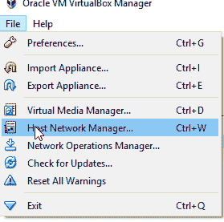
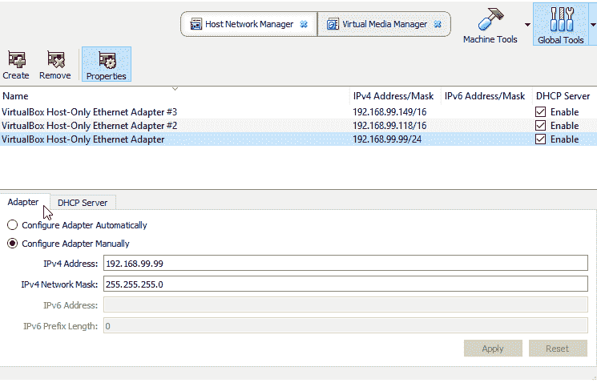
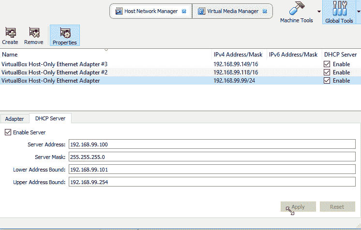
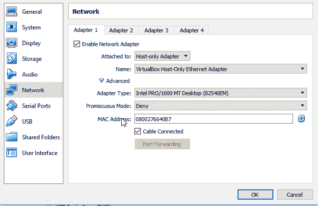
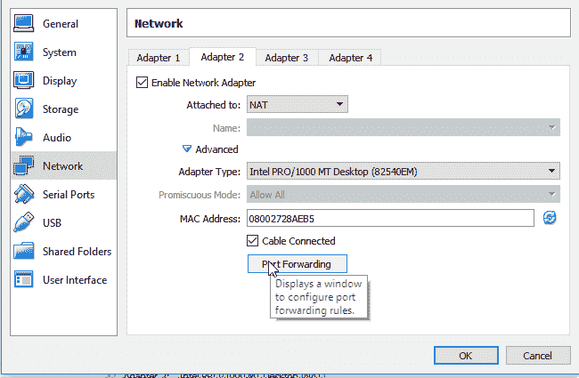
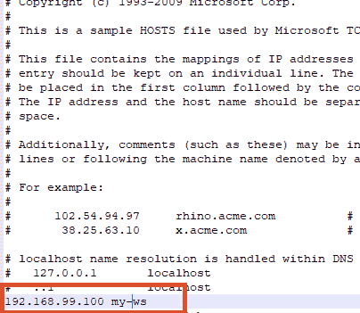

# 如何在虚拟机(虚拟机器)上设置仅主机适配器

> 原文：<https://dev.to/isabolic99/how-to-set-host-only-adapter-on-vm-virtual-box-2jka>

您可以找到许多关于如何设置仅主机适配器的教程，但大多数都不完整，缺少一些东西。所以我决定从我的个人笔记中提供一个循序渐进的指南。

### 1)网卡的配置

在较新版本的 VirtualBox 中从**文件菜单中选择** > **主机网络管理器**。

[T2】](https://res.cloudinary.com/practicaldev/image/fetch/s--ObLmwBFd--/c_limit%2Cf_auto%2Cfl_progressive%2Cq_auto%2Cw_880/https://thepracticaldev.s3.amazonaws.com/i/bi888sd6dfkdoiy0n2yb.png)

创建新的适配器，并设置以下选项:
手动配置适配器。

**ipv4 地址**192 . 168 . 99 . 99
T3】IP v4 网络掩码 255.255.255.0
DHCP 服务器检查
**服务器地址** 192.168.99.100
**服务器掩码** 255.255.255.0
**地址下限** 192.168

您可以随意设置 IP 地址，但要确保其他选项也设置为适当的地址(DHCP 服务器地址、地址下限/上限、conf。虚拟机上的网络接口)

[T2】](https://res.cloudinary.com/practicaldev/image/fetch/s--t7o8PvJs--/c_limit%2Cf_auto%2Cfl_progressive%2Cq_auto%2Cw_880/https://thepracticaldev.s3.amazonaws.com/i/pqtn8ehvhfpkiion8sii.png)

[T2】](https://res.cloudinary.com/practicaldev/image/fetch/s--mX87mKhU--/c_limit%2Cf_auto%2Cfl_progressive%2Cq_auto%2Cw_880/https://thepracticaldev.s3.amazonaws.com/i/abrset9ehd1buawonkj1.png)

### 2)在虚拟机的网络设置中设置适配器

然后，在虚拟机的网络设置中(**机床图标-锤子**，设置两个适配器:

仅适配器 1
主机，vboxnet0

[T2】](https://res.cloudinary.com/practicaldev/image/fetch/s--n0SZsGS3--/c_limit%2Cf_auto%2Cfl_progressive%2Cq_auto%2Cw_880/https://thepracticaldev.s3.amazonaws.com/i/8k2s3c71jzrmnvd4hr5s.png)

适配器 2
NAT

[T2】](https://res.cloudinary.com/practicaldev/image/fetch/s--rJidtzK_--/c_limit%2Cf_auto%2Cfl_progressive%2Cq_auto%2Cw_880/https://thepracticaldev.s3.amazonaws.com/i/q20bnuk69g56m1xi0in5.png)

**也不要忘记点击刷新两个适配器的 mac 地址**

### 3)配置虚拟机

启动虚拟机并通过 VirtualBox 提供的控制台登录。

打开终端并运行以下命令:

```
ls /sys/class/net 
```

Enter fullscreen mode Exit fullscreen mode

这将为您提供虚拟机上适配器的名称。在我的例子中，适配器被命名为 eth1 和 eth 2(lo 是环回接口)。

然后，编辑网络配置。

```
sudo vi /etc/network/interfaces 
```

Enter fullscreen mode Exit fullscreen mode

现在应用以下配置:

```
# The loopback network interface
auto lo
iface lo inet loopback

# The primary network interface host-only adapter
auto eth0
allow-hotplug eth0
iface eth0 inet static
address 192.168.99.100
netmask 255.255.255.0

# The NAT
auto eth1
iface eth1 inet dhcp 
```

Enter fullscreen mode Exit fullscreen mode

之后，我建议重启虚拟机。

就是这样。现在我懒得解释网络接口配置中的每个选项(热插拔等..).你可以谷歌自己。:P

同样，你可以在你的主机的文件中设置主机名(win = > C:\ Windows \ System32 \ drivers \ etc \ hosts，linux => /etc/hosts)这样你就不用每次都通过 ip 地址访问 VM 了。

[T2】](https://res.cloudinary.com/practicaldev/image/fetch/s--QbUM-Poz--/c_limit%2Cf_auto%2Cfl_progressive%2Cq_auto%2Cw_880/https://thepracticaldev.s3.amazonaws.com/i/lfhjq3jpwtmisbzoqtxk.png)

我的 hole 开发环境(和操场)在 VM 上，我在那里安装了 tomcat、apache、db、node.js 等。因为我不想污染我的主机，而且我认为这是模拟生产/测试环境的最佳解决方案。