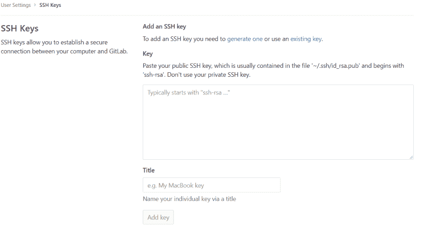

# 如何设置 SSH 密钥并将其用于 GitLab

> 原文：<https://dev.to/sndrx/how-to-set-up-an-ssh-key-and-use-it-in-gitlab--42p1>

### 大家好！

大约 3 个月前，我进入了另一个项目，几乎所有的东西对我来说都是新的。)。那时我唯一知道如何使用的东西是 JavaScript。

显然，这个项目对我来说也是全新的。我之前没用过 VS 代码，无论是 GitLab 还是 Heroku，所以一开始不知道一些基本规则。我做了笔记，但即使笔记就在我眼前，我也不知道当我的笔记本电脑上周死机时，我应该如何使用我的 SSH 密钥连接到 GitLab。

**我想通了，最后！**
....但是我必须把两三篇文章中的信息联系起来。

我想，如果我把这些都放在这里，对遇到同样问题的其他人来说会更容易，或者，对我来说也更容易记住这些事情。

这是我如何设法创建一个 SSH 密钥并使用该密钥连接到我的 GitLab 帐户的:

1)打开 Git Bash ( [下载安装 Git Bash](http://www.techoism.com/how-to-install-git-bash-on-windows/)；您可以使用任何基于`*nix`的命令提示符)。

2)类型

```
 cd ~/.ssh 
```

这将把您带到 Git 的根目录(可能是 C:\ Users[您的用户名])。ssh\在 Windows 上)。

3)在`.ssh`文件夹中你应该会找到这两个文件:`id_rsa`和`id_rsa.pub`。这些文件告诉计算机如何与 GitHub、BitBucket 或任何其他基于 Git 的服务进行通信。

那些文件显然在我的电脑里不见了，所以我不得不创建它们。

<figure>

```
 ssh-keygen -t rsa -C "your_email@example.com" 
```

<figcaption>Type this to create those two files</figcaption>

</figure>

输入该命令后，您将会得到几个问题:

<figure>

```
Enter file in which to save the key (/home/demo/.ssh/id_rsa):
```

<figcaption>You can press enter here, saving the file to the user home (in this case, my example user is called demo).</figcaption>

</figure>

然后将显示以下内容:

<figure>

```
Enter passphrase (empty for no passphrase):
```

<figcaption>The only downside, of course, to having a passphrase, is then having to type it in each time you use the key pair. I suggest you to use a passphrase though, due to security concerns.</figcaption>

</figure>

最后，整个过程看起来像这样:

```
Enter file in which to save the key (/home/demo/.ssh/id_rsa): 
Enter passphrase (empty for no passphrase): 
Enter same passphrase again: 
Your identification has been saved in /home/demo/.ssh/id_rsa.
Your public key has been saved in /home/demo/.ssh/id_rsa.pub.
The key fingerprint is:
4a:dd:0a:c6:35:4e:3f:ed:27:38:8c:74:44:4d:93:67 demo@a
The key's randomart image is:
+--[ RSA 2048]----+
|          .oo.   |
|         .  o.E  |
|        + .  o   |
|     . = = .     |
|      = S = .    |
|     o + = +     |
|      . o + o .  |
|           . o   |
|                 |
+-----------------+
```

公钥现在位于/home/demo/中。私有密钥(标识)现在位于/home/demo/中。ssh/id_rsa。

4)将公钥复制到 GitLab

去打开`id_rsa.pub`文件(你可以使用任何你想要的文本编辑器)。
T3 复制那个文件的全部内容然后打开`https://gitlab.com/profile/keys`。

[T2】](https://res.cloudinary.com/practicaldev/image/fetch/s--4XBz4sLv--/c_limit%2Cf_auto%2Cfl_progressive%2Cq_auto%2Cw_880/https://image.ibb.co/iD6OVf/Capture-For-BLog.png)

将您从`id_rsa.pub`复制的内容粘贴到键输入中(**不要添加多余的空格或字符**)。

给你的密钥起一个描述性的名字，然后**添加密钥**。

5)尝试`git clone`或`git push`。

我真的希望这能帮助一些人，因为这篇文章是我上周需要的，当时我不能把事情联系在一起，而且一切看起来比实际上要困难得多。