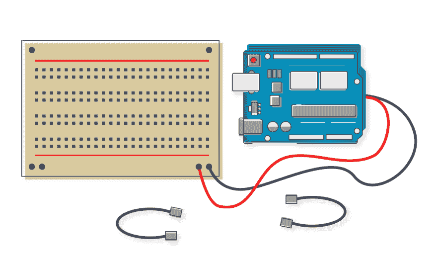
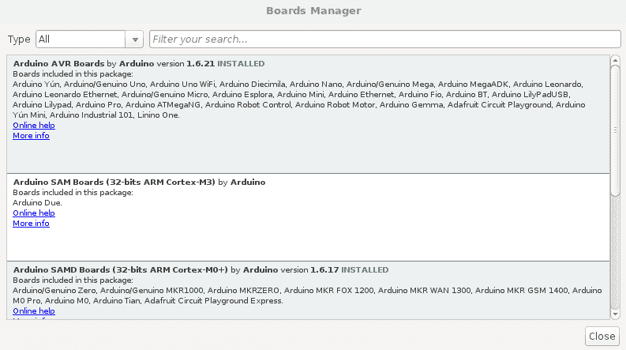
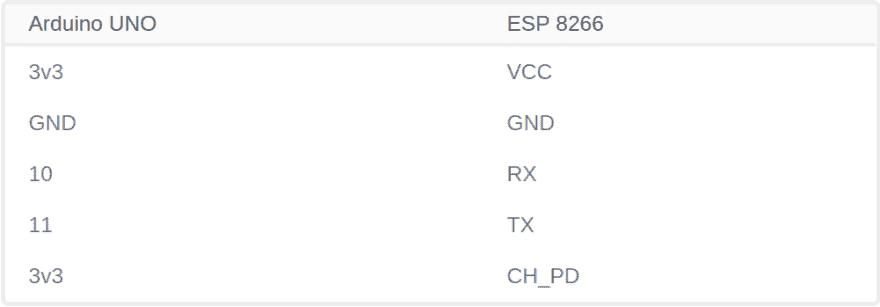
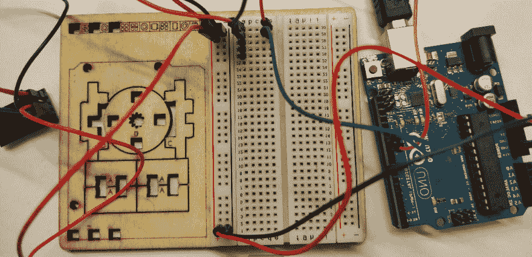

# 如何使用 ESP8266 设置 Arduino UNO 并将事件发布到 Wia

> 原文：<https://dev.to/wiaio/how-to-setup-an-arduino-uno-with-esp8266-and-publish-an-event-to-wia-3pn7>

[T2】](https://res.cloudinary.com/practicaldev/image/fetch/s--ivQvUAtm--/c_limit%2Cf_auto%2Cfl_progressive%2Cq_auto%2Cw_880/https://s3-eu-west-1.amazonaws.com/wia-flarum-bucket/2018-05-29/1527605155-310926-blog-01.png)

### **组件**

完成本教程需要以下组件:

*   Arduino Uno
*   ESP 8266
*   微型 USB 转 USB 电缆
*   通用面包板
*   跳线电缆(公母)

### **设置您的环境**

*   安装 Arduino IDE(集成开发环境)，你可以在这里下载用于 Mac OS X、Windows 和 Linux 的 Arduino IDE

详细说明如下:

*   [为 Windows 安装 Arduino IDE](https://www.arduino.cc/en/Main/Software)
*   [安装用于 Mac 的 Arduino IDE](https://www.arduino.cc/en/Guide/MacOSX)
*   [为 Linux 安装 Arduino IDE](https://www.arduino.cc/en/Guide/Linux)注意:如果你对 Arduino IDE 完全不熟悉，观看[这个视频](https://www.youtube.com/watch?v=nbD_V4QtNvY)会让你更好地理解它是如何工作的。

在 Arduino IDE 中:

*   进入菜单:`Tools > Board > Boards Manager`
*   搜索`Arduino AVR Boards`找到后，点击`Install` 
*   通过转到`Tools > Board`选择`Arduino\Genuino Uno`电路板类型
*   选择显示`Arduino\Genuino Uno`的端口

如果没有显示名称，您可以通过以下步骤找到端口:

#### **LINUX 和 MAC OS X**

*   从[这里](https://www.silabs.com/products/development-tools/software/usb-to-uart-bridge-vcp-drivers)下载并安装 FTDI 驱动。为您的操作系统和体系结构选择合适的版本
*   打开终端窗口并运行命令`ls /dev/tty*`
*   查找名称以`/dev/tty`开头的设备，例如 MAC 上的`/dev/tty.usbmodemPy343431`或 Linux 上的`/dev/ttyUSB0/dev/ttyACM0`

注意:对于 Linux，您可能需要运行下面的两个命令。一旦你完成了，重启你的电脑。这将添加权限，允许您将草图上传到板上。

`sudo usermod -a -G tty ${USER}`
T1】

**窗户**

*   从[这里](https://www.silabs.com/products/development-tools/software/usb-to-uart-bridge-vcp-drivers)下载并安装 FTDI 驱动。为您的操作系统和体系结构选择合适的版本
*   打开 Windows 开始菜单，搜索`Device Manager`
*   Pycom 设备的 COM 端口将被列为`USB Serial Device`或类似的名称
    *   记下 COM 端口(例如 COM4)

### **连接硬件**

要将 Arduino Uno 连接到 ESP 8266，您需要连接以下引脚:
[](https://res.cloudinary.com/practicaldev/image/fetch/s--0aTs2roX--/c_limit%2Cf_auto%2Cfl_progressive%2Cq_auto%2Cw_880/https://s3-eu-west-1.amazonaws.com/wia-flarum-bucket/2018-05-22/1526995407-139516-unoesppins.png)

由于 Ardnuino Uno 采用公跳线，而 ESP 8266 需要母跳线，因此可使用面包板进行连接。它也很有用，因为 ESP 8266 上的`CH_PD`和`VCC`引脚都需要电源。

[T2】](https://res.cloudinary.com/practicaldev/image/fetch/s--Dy02jwH8--/c_limit%2Cf_auto%2Cfl_progressive%2Cq_auto%2Cw_880/https://s3-eu-west-1.amazonaws.com/wia-flarum-bucket/2018-05-22/1526996228-643696-2d9eabd-unobread.png)

### **创建新草图**

在 Arduino IDE 中:

*   点击`File > New`创建一个新草图
*   从下面的示例代码中复制并粘贴`publishEvent.ino`:

```
#include <SoftwareSerial.h>
#include <ArduinoJson.h>

#define RX 10
#define TX 11
String WIFI_SSID = "your-wifi-ssid";       // Your WiFi ssid
String PASSWORD = "your-wifi-password";         // Password
String DEVICE_SECRET_KEY  = "your-device-secret-key";

String HOST = "api.wia.io";
String PATH = "/v1/events";
String PORT = "80";

int countTrueCommand;
int countTimeCommand;
boolean found = false;

SoftwareSerial esp8266(RX, TX);

StaticJsonBuffer<200> jsonBuffer;
JsonObject& root = jsonBuffer.createObject();

void setup() {
  Serial.begin(9600);
  esp8266.begin(115200);
  esp8266.println("AT");
  Serial.println(esp8266.read());
  sendCommandToESP8266("AT", 5, "OK");
  sendCommandToESP8266("AT+CWMODE=1", 5, "OK");
  sendCommandToESP8266("AT+CWJAP=\"" + WIFI_SSID + "\",\"" + PASSWORD + "\"", 20, "OK");
}

void loop() {
  root["name"] = "temperature";
  root["data"] =  21.5;
  String data;
  root.printTo(data);

  String postRequest = "POST " + PATH  + " HTTP/1.1\r\n" +
                       "Host: " + HOST + "\r\n" +
                       "Accept: *" + "/" + "*\r\n" +
                       "Content-Length: " + data.length() + "\r\n" +
                       "Content-Type: application/json\r\n" +
                       "Authorization: Bearer " + DEVICE_SECRET_KEY + "\r\n" +
                       "\r\n" + data;

  sendCommandToESP8266("AT+CIPMUX=1", 5, "OK");
  sendCommandToESP8266("AT+CIPSTART=0,\"TCP\",\"" + HOST + "\"," + PORT, 15, "OK");
  String cipSend = "AT+CIPSEND=0," + String(postRequest.length());
  sendCommandToESP8266(cipSend, 4, ">");
  sendData(postRequest);
  sendCommandToESP8266("AT+CIPCLOSE=0", 5, "OK");
}

void sendCommandToESP8266(String command, int maxTime, char readReplay[]) {
  Serial.print(countTrueCommand);
  Serial.print(". at command => ");
  Serial.print(command);
  Serial.print(" ");
  while (countTimeCommand < (maxTime * 1))
  {
    esp8266.println(command);
    if (esp8266.find(readReplay))
    {
      found = true;
      break;
    }

    countTimeCommand++;
  }

  if (found == true)
  {
    Serial.println("Success");
    countTrueCommand++;
    countTimeCommand = 0;
  }

  if (found == false)
  {
    Serial.println("Fail");
    countTrueCommand = 0;
    countTimeCommand = 0;
  }

  found = false;
}

void sendData(String postRequest) {
  Serial.println(postRequest);
  esp8266.println(postRequest);
  delay(1500);
  countTrueCommand++;
} 
```

Enter fullscreen mode Exit fullscreen mode

*   添加`WIFI_SSID`和`PASSWORD`
*   从 Wia 仪表板(以`d_sk`开头的仪表板)添加带有您的设备密钥的`device_secret_key`
*   `Sketch > Upload`发送到您的 Uno

转到 [Wia 仪表板](https://dashboard.wia.io/spaces)查看传入您设备的数据。

如果您在设置方面需要任何帮助，或者您不理解本教程，请发推特给我们，发电子邮件给 [support@wia.io](//support@wia.io) 或通过对讲机聊天。

### **常见错误**

如果所有 AT 命令都失败，可能是因为您的 ESP 8266 固件版本过时。
请按照教程[这里](https://nodemcu.readthedocs.io/en/latest/en/flash/)用 ESP 闪光器工具闪你的 ESP8266。