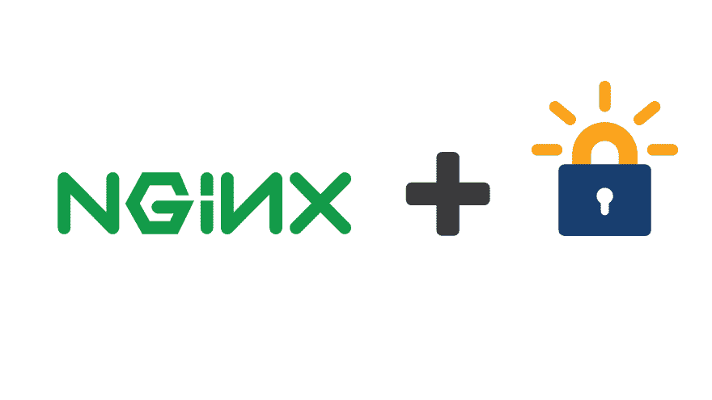

# 如何设置让我们为 Nginx 加密(IPv6/A+ SLL 评级)

> 原文：<https://dev.to/grigorkh/how-to-setup-lets-encrypt-for-nginx-ipv6a-sll-rating-3j0i>

[T2】](https://res.cloudinary.com/practicaldev/image/fetch/s--hFUEG1Ae--/c_limit%2Cf_auto%2Cfl_progressive%2Cq_auto%2Cw_880/https://thepracticaldev.s3.amazonaws.com/i/bmd3ypme13ktdv4d8aid.jpg)

### 如何在 Ubuntu 18.04 上设置 Let's Encrypt for Nginx(包括 IPv6、HTTP/2 和 A+ SLL 评级)

当您不想让 Certbot 编辑您的配置时，有两种模式:

*   [独立](https://certbot.eff.org/docs/using.html#standalone):代替网络服务器应对 ACME 挑战
*   [Webroot](https://certbot.eff.org/docs/using.html#webroot) :需要你的网络服务器从一个已知的文件夹提供挑战。

**Webroot 更好**因为不需要替换 Nginx(绑定 80 端口)来更新证书。

接下来，我们将从`/var/www/mydomain`开始为`mydomain.com`服务，而挑战将从`/var/www/letsencrypt`开始。

* * *

## Nginx 片段

首先，我们创建两个代码片段，以避免在每个虚拟主机配置中重复代码。

创建一个文件`/etc/nginx/snippets/letsencrypt.conf`,包含:

```
location ^~ /.well-known/acme-challenge/ {
    default_type "text/plain";
    root /var/www/letsencrypt;
} 
```

Enter fullscreen mode Exit fullscreen mode

创建一个文件`/etc/nginx/snippets/ssl.conf`,包含:

```
ssl_session_timeout 1d;
ssl_session_cache shared:SSL:50m;
ssl_session_tickets off;

ssl_protocols TLSv1.2;
ssl_ciphers EECDH+AESGCM:EECDH+AES;
ssl_ecdh_curve secp384r1;
ssl_prefer_server_ciphers on;

ssl_stapling on;
ssl_stapling_verify on;

add_header Strict-Transport-Security "max-age=15768000; includeSubdomains; preload";
add_header X-Frame-Options DENY;
add_header X-Content-Type-Options nosniff; 
```

Enter fullscreen mode Exit fullscreen mode

* * *

## Nginx 虚拟主机(仅限 HTTP)

在这一点上我们还没有一个证书，所以这个域只作为 HTTP 服务。

创建一个文件`/etc/nginx/sites-available/mydomain.conf`,包含:

```
server {
    listen 80;
    listen [::]:80 ipv6only=on;
    server_name mydomain.com www.mydomain.com;

    include /etc/nginx/snippets/letsencrypt.conf;

    root /var/www/mydomain;
    index index.html;
    location / {
        try_files $uri $uri/ =404;
    }
} 
```

Enter fullscreen mode Exit fullscreen mode

启用网站:

```
rm /etc/nginx/sites-enabled/default
ln -s /etc/nginx/sites-available/mydomain.conf /etc/nginx/sites-enabled/mydomain.conf 
```

Enter fullscreen mode Exit fullscreen mode

并重新加载 Nginx:

```
sudo systemctl reload nginx 
```

Enter fullscreen mode Exit fullscreen mode

注意让 Nginx 为`http://www.mydomain.com/.well-known/acme-challenge/`和`http://mydomain.com/.well-known/acme-challenge/`提供挑战的线`include /etc/nginx/snippets/letsencrypt.conf;`。

* * *

## 让我们加密客户端

安装客户端:

```
sudo apt-get install letsencrypt 
```

Enter fullscreen mode Exit fullscreen mode

为挑战创建一个文件夹:

```
sudo mkdir -p /var/www/letsencrypt/.well-known/acme-challenge 
```

Enter fullscreen mode Exit fullscreen mode

最后，获取一个证书(不要忘记用您自己的电子邮件地址替换):

```
letsencrypt certonly --webroot -w /var/www/letsencrypt -d www.domain.com -d domain.com --email MY@EMAIL.COM --agree-tos 
```

Enter fullscreen mode Exit fullscreen mode

它会将文件保存在`/etc/letsencrypt/live/www.mydomain.com/`中。

* * *

## Nginx 虚拟主机(仅限 HTTPS)

现在您有了该域的证书，通过编辑文件`/etc/nginx/sites-available/mydomain.conf`并将内容替换为:

```
server {
    listen 80;
    listen [::]:80 ipv6only=on;
    server_name mydomain.com www.mydomain.com;

    include /etc/nginx/snippets/letsencrypt.conf;

    location / {
        return 301 https://www.mydomain.com$request_uri;
    }
}

server {
    server_name www.mydomain.com;
    listen 443 ssl http2;
    listen [::]:443 ssl http2 ipv6only=on;

    ssl_certificate /etc/letsencrypt/live/www.mydomain.com/fullchain.pem;
    ssl_certificate_key /etc/letsencrypt/live/www.mydomain.com/privkey.pem;
    ssl_trusted_certificate /etc/letsencrypt/live/www.mydomain.com/fullchain.pem;
    include /etc/nginx/snippets/ssl.conf;

    root /var/www/mydomain.com;
    index index.html;
    location / {
        try_files $uri $uri/ =404;
    }
}

server {
    listen 443 ssl http2;
    listen [::]:443 ssl http2;
    server_name mydomain.com;

    ssl_certificate /etc/letsencrypt/live/www.mydomain.com/fullchain.pem;
    ssl_certificate_key /etc/letsencrypt/live/www.mydomain.com/privkey.pem;
    ssl_trusted_certificate /etc/letsencrypt/live/www.mydomain.com/fullchain.pem;
    include /etc/nginx/snippets/ssl.conf;

    location / {
        return 301 https://www.mydomain.com$request_uri;
    }
} 
```

Enter fullscreen mode Exit fullscreen mode

然后重新加载 Nginx:

```
sudo systemctl reload nginx 
```

Enter fullscreen mode Exit fullscreen mode

* * *

## 结论

您现在应该能够在`https://www.mydomain.com`看到您的网站。恭喜😃

您现在可以测试您的域名是否有+ SLL 评级:

*   [https://www.ssllabs.com/ssltest/analyze.html?d=mydomain.com](https://www.ssllabs.com/ssltest/analyze.html?d=mydomain.com)
*   [https://www.ssllabs.com/ssltest/analyze.html?d=www.mydomain.com](https://www.ssllabs.com/ssltest/analyze.html?d=www.mydomain.com)

您可以使用续订

```
letsencrypt renew 
```

Enter fullscreen mode Exit fullscreen mode

当被调用时，它将尝试续订在 30 天内到期的证书，因此您可以将该命令放入 cron 中进行自动续订。

如果 letsencrypt 对你有用，可以考虑[捐给 letsencrypt](https://letsencrypt.org/donate/) 或者[捐给 EFF](https://supporters.eff.org/donate/) 。