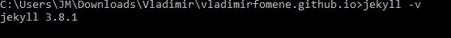
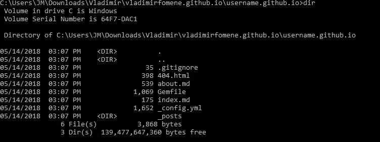
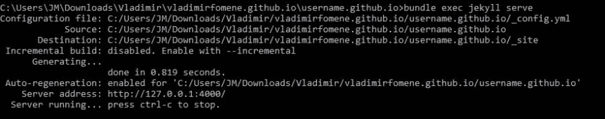
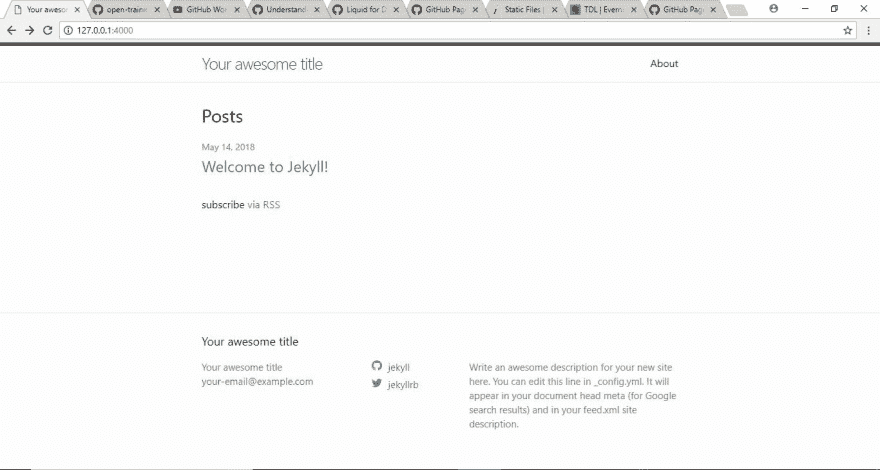
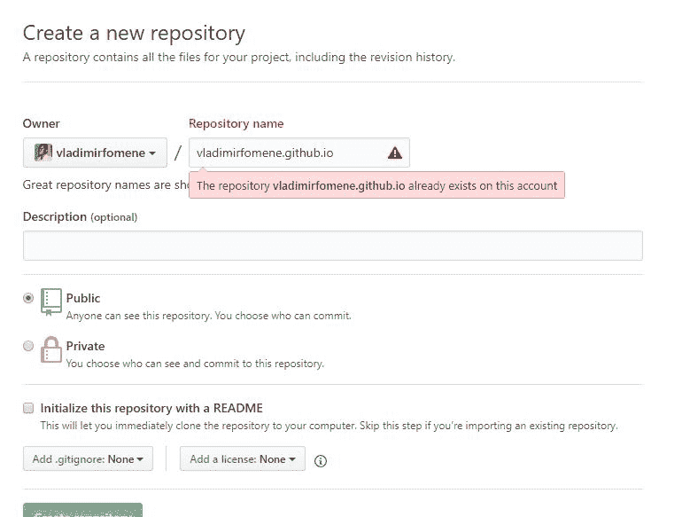

# 如何建立你的博客

> 原文：<https://dev.to/vladimirfomene/how-to-setup-your-blog-4fi6>

## 为什么要博客？

博客是你分享你感兴趣的话题的一种方式。这些话题不一定是技术性的，尽管在我们的案例中它将会是技术性的。根据 T2(大师或老师)的说法，最好的学习方法是教，因此许多人写作是为了边学边教。除此之外，博客将帮助你提高写作技巧，并与更多的技术受众分享你的作品，比如在 [HackerNews](https://news.ycombinator.com/) 、 [dev.to](https://dev.to/) 和其他社区网站上的人。您将学习如何有效地与所有技术背景的人交流您的惊人想法。作为一个博客写手，你也在为自己建立一个记录，这可以给你带来惊人的机会，比如在会议上发言和工作机会。如果你做得很好，当你需要支持的时候，你会建立一个你可以联系的听众。

## 为什么是哲基尔？

Jekyll 是一个用 Ruby 编写的博客框架。它非常简单，易于设置。你可以在不到一天的时间里在网上建立一个博客。是的，你没听错，不到一天。此外，你可以在 [Github 页面](https://pages.github.com/)上用一个`git push`免费托管你的 Jekyll 博客。Hakuna Matata(别担心)，如果你不知道怎么做，我会告诉你。在 Jekyll 中，你可以在文本文件或 markdown 文件中写你的博客文章，Jekyll 将使用 markdown builder 或文本文件生成器自动生成你的 html 页面。这使你可以快速更新你的博客，并轻松地在你的帖子中包含代码片段、图像和视频。Jekyll 还附带了一些预建的[主题](https://pages.github.com/themes/)，你可以用它们来设计和布局你的网站。

## 如何使用 Jekyll？

### 1。在你的电脑上安装 Jekyll

*   请访问 Jekyll 网站，下载与您的操作系统相对应的 Jekyll 版本。我将解释 Windows 操作系统的过程，因为我使用 Windows。

*   如果您还没有 Git，请访问 Git 网站并下载它。安装 Git，不改变任何默认配置。

*   在 [Jekyll 安装页面](https://jekyllrb.com/docs/windows/)使用 Ruby 安装程序下载 Ruby。然后，打开命令提示符，运行`gem install jekyll bundler`安装 Jekyll 和 Bundler。Bundler 是 Ruby 的库下载器。

*   通过在命令提示符下运行以下命令来检查 Jekyll 是否安装正确:
    `jekyll -v`。您应该会看到以下结果:

[T2】](https://res.cloudinary.com/practicaldev/image/fetch/s--50rtHKSc--/c_limit%2Cf_auto%2Cfl_progressive%2Cq_auto%2Cw_880/https://vladimirfomene.github.io/assets/img/jekyll-version.JPG)

*   转到您选择的目录并键入`jekyll new username.github.io`，其中*用户名*是您的 Github 用户名，就像我的例子中的 *vladimirfomene* 。该命令将为您的博客创建一个目录，其中包含一些框架文件和目录。Jekyll 用默认主题( [minima](https://jekyll.github.io/minima/) )创建每一个新博客。

*   然后转到 *username.github.io* 目录，列出内容。您应该会看到以下文件夹和文件:

[T2】](https://res.cloudinary.com/practicaldev/image/fetch/s--WaelL3PN--/c_limit%2Cf_auto%2Cfl_progressive%2Cq_auto%2Cw_880/https://vladimirfomene.github.io/assets/img/directory-structure.JPG)

当有人导航到在你的博客目录中找不到的页面时，404.html 页面就会出现。Jekyll 生成一个*。gitignore* 文件，它列出了 Git 在进行版本控制时应该忽略的所有文件和目录。这个文件的第一行包含一个名为 *_site* 的目录。当您在命令提示符下运行`bundle exec jekyll serve`来启动 Jekyll 服务器以便在浏览器中查看您的站点时，将会生成这个目录。此目录包含生成的博客版本(所有的 markdown 或文本文件都已转换为网页),将提供给浏览器。目录中的 *Gemfile* 被 bundler 用来管理 Jekyll 需要的库。该文件夹还包含一个由 Jekyll 为您创建的 about.md 和 index.md 文件，在为您的博客提供服务时，这些文件将被转换为 html 页面。Index.md 将成为 index.html(主页)，about.md 将成为 about.md 并代表您的 about 页面。 *_config.yml* 文件包含博客的配置。就像博客的标题。url，markdown 解析器，电子邮件和你的博客使用的主题。下面是这篇博客的 *config.yml* 的一部分:

```
title: Code Tiles
email: vladimirfomene@gmail.com
description: >- # this means to ignore newlines until "baseurl:"
  Vladimir Fomene's learnings, repository of ideas, teachings and talks.
baseurl: "" # the subpath of your site, e.g. /blog
url: "" # the base hostname & protocol for your site, e.g. http://example.com
twitter_username: vladimirfomene
github_username:  vladimirfomene

# Build settings
markdown: kramdown
theme: minima
plugins:
  - jekyll-feed 
```

运行`bundle exec jekyll serve`后，您应该看到以下内容:

[T2】](https://res.cloudinary.com/practicaldev/image/fetch/s--Whf5D7Yy--/c_limit%2Cf_auto%2Cfl_progressive%2Cq_auto%2Cw_880/https://vladimirfomene.github.io/assets/img/jekyll-serve.JPG)

这表明您的 Jekyll 服务器正在运行，并在 *127.0.0.1:4000* 为您的博客提供服务。你现在可以在浏览器中输入 *127.0.0.1:4000* 来访问你的博客。您应该看到以下内容:

[T2】](https://res.cloudinary.com/practicaldev/image/fetch/s--GXxvle_Y--/c_limit%2Cf_auto%2Cfl_progressive%2Cq_auto%2Cw_880/https://vladimirfomene.github.io/assets/img/minima-site.JPG)

## 撰写你的第一篇文章

在您的博客目录中，创建一个名为`_posts`的文件夹。你的所有文章都将存放在这个目录中，它们应该遵循以下模式:`YYYY-MM-DD-name-of-post.markdown`，其中 y 代表年，M 代表月，D 代表日。典型的帖子应该如下所示:

```
---
layout: post
title: " \"Welcome to Jekyll!\""
date:   2015-11-17 16:16:01 -0600
categories: jekyll update
---

You’ll find this post in your `_posts` directory. Go ahead and edit it and re-build the site to see your changes. You can rebuild the site in many different ways, but the most common way is to run `bundle exec jekyll serve`, which launches a web server and auto-regenerates your site when a file is updated. 
```

文章顶部虚线之间的部分给出了 Jekyll 关于页面的相关信息，这些信息将在页面呈现过程中使用。在我们的例子中，要使用的*布局*，页面的*标题*，文章所属的*日期*和*类别*。您可以使用以下语法列出任何页面中的所有帖子:

```
<ul>
  
    <li>
      <a href="{{ post.url }}">{{ post.title }}</a>
    </li>
  
</ul> 
```

## [Github 页面上的主机](https://pages.github.com/)

要在 Github 页面上发布您的博客，您需要通过运行`git init`将您的博客目录初始化为本地 Git 存储库。然后，用`git add .`暂存目录内容，用`git commit -m "commit message"`提交。然后转到你的 Github 配置文件，创建一个名为 *username.github.io* 的存储库，其中 *username* 代表你的 *Githubusername* 。

[T2】](https://res.cloudinary.com/practicaldev/image/fetch/s--Qlukure8--/c_limit%2Cf_auto%2Cfl_progressive%2Cq_auto%2Cw_880/https://vladimirfomene.github.io/assets/img/github-repo.JPG)

然后，通过在命令提示符下输入以下命令，将本地存储库连接到远程存储库:`git remote add origin remote-repository-name.git`。通过运行以下命令将本地存储库内容推送到远程存储库:`git push -u origin master`。你现在可以通过访问 *username.github.io* 在线访问你的博客。

暂时就这样了。点击了解更多关于[杰基尔](https://jekyllrb.com/docs/home/)的信息。

## 联系人:

[在 Twitter 上关注我](https://twitter.com/VladimirFomene)

[把我叉在 Github 上](https://github.com/vladimirfomene)

给我发邮件:vladimirfomene@gmail.com