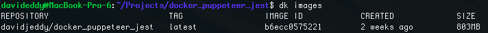
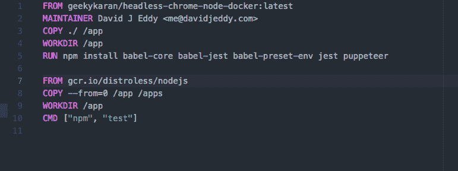
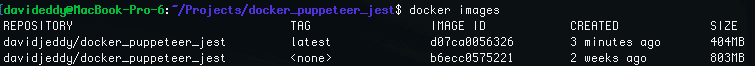

# 如何缩小你的 Docker 图片？

> 原文：<https://dev.to/david_j_eddy/how-to-shrink-your-docker-images-2d2o>

*交叉过账从[https://blog.davidjeddy.com/?p=594](https://blog.davidjeddy.com/?p=594)T3】*

Docker Images，每个人都说越小越好，但是如何在保持功能和调试能力的同时做到这一点呢？嗯，我是这样做的。

*飞行前资源:*

Docker 多阶段构建:[https://docs . docker . com/develop/develop-images/stage-build/# name-your-build-stages](https://docs.docker.com/develop/develop-images/multistage-build/#name-your-build-stages)

Google Distroless 图片:[https://github . com/Google cloud platform/distro less/blob/master/examples/nodejs/docker file](https://github.com/GoogleCloudPlatform/distroless/blob/master/examples/nodejs/Dockerfile)

dock-puppender-jest(无标题 Chrome + Jest 测试图像):[https://hub . docker . com/r/davidjeddy/docker _ puppender _ jest/](https://hub.docker.com/r/davidjeddy/docker_puppeteer_jest/)

*我们需要做的:*

这里是我们开始的地方，一个 800Mb 以上大小的图像只是为了运行 headless Chrome 和 Jest。哎哟。
[T3】](https://res.cloudinary.com/practicaldev/image/fetch/s--jpc-Z9Bs--/c_limit%2Cf_auto%2Cfl_progressive%2Cq_auto%2Cw_880/https://davidjeddy.com/wp-content/uploads/2018/04/Screen-Shot-2018-04-03-at-4.25.06-PM.png)

因此，让我们应用多阶段构建范例，并使用 Google Distroless NodeJs 映像:

现在，我们使用`build . -t davidjeddy/docker_puppeteer_jest`命令重建图像，最终得到大约 400MB 的图像。节省 50%!

现在去掉旧的被打破的臃肿的形象。

*用法:*

正常运行 image 命令，观察与之前相同的预期输出。不幸的是，对于这里的示例项目，需要做更多的工作，因为原始映像没有在应用程序目录中保持依赖关系。

*TL；博士:*

在构建您的服务映像之后，进行一个额外的步骤，将它放到一个发行版基础映像中。嘘，轻松取胜。