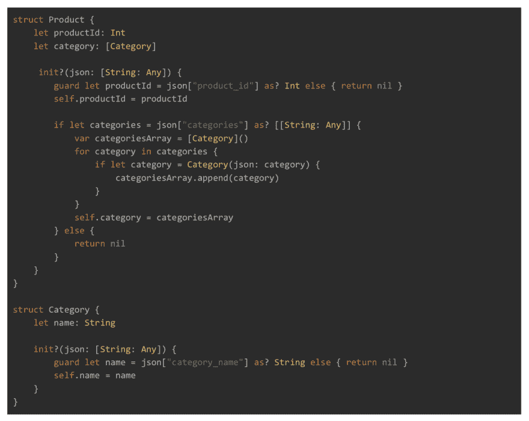
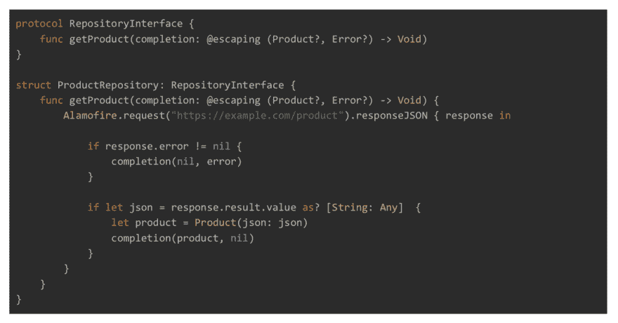
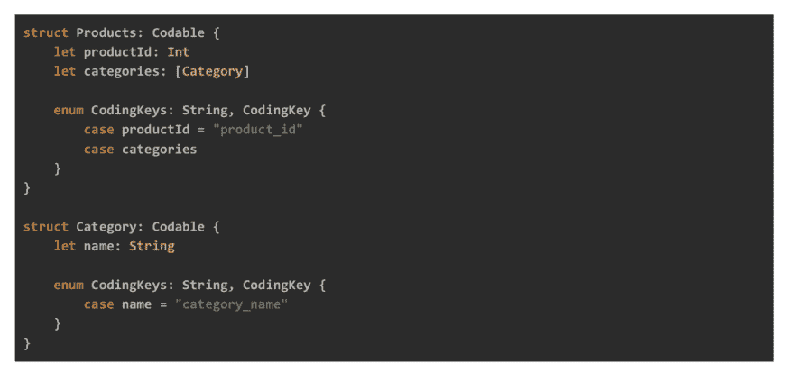
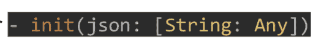
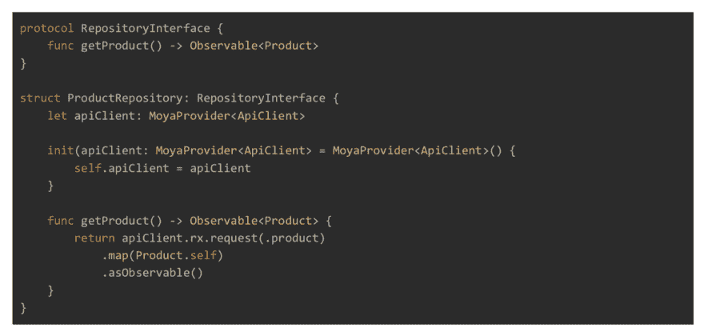

# 如何用 MoyaRx 和 Codable 简化数据层

> 原文：<https://dev.to/apium_hub/how-to-simplify-the-data-layer-with-moyarx-and-codable-2eco>

今天，所有的应用程序都在某种程度上与服务器相连，以显示数据。这就是为什么有一个定义良好的(简单的)客户端实现来避免应用程序这个非常重要的层出现问题是非常重要的。我们还将研究 REST 服务中广泛使用的一种模式，以及我们如何使用 Rx 和 Swift 提供的最新工具对其进行改进。在 [Apiumhub](/) 中，我们决定写一篇关于如何用 MoyaRx 和 Codable 简化数据层的文章，我们希望你会觉得有用！

## 带有 MoyaRx 和 Codable 的数据层

### 数据模型

对于数据模型，使用字典中的构造函数是非常常见的[String: Any]。有像 *SwiftyJSON* 这样的库可以方便字典的使用，在我们的例子中，我们选择使用“guard let”以安全的方式访问值。

[T2】](https://apiumhub.com/wp-content/uploads/2018/07/mobile.png)

### 储存库

存储库层负责封装 REST 客户机的调用。在下面的代码中，Alamofire 被用作 REST 客户端。这个库被广泛用于抽象和简化对 web 服务的调用。Alamofire 内部使用苹果的 NSURLSession api。

[T2】](https://apiumhub.com/wp-content/uploads/2018/07/2.png)

## 用 Codable 和 Moya 改进剩余层

我们的目标之一是简化这一层中涉及的组件。在每个模型中有一个初始化器是昂贵的，并且容易出错。避免使用故障转移初始化器。另一方面，存储库返回一个带有两个可选值的完整闭包，必须在上层(通常是服务)进行检查。

### 带编码的模型

Swift 4 的创新之一是引入了 Codable。可编码协议是现有的*可编码*和*可解码协议*的组合的别名

[T2】](https://apiumhub.com/wp-content/uploads/2018/07/3.png)

该协议简化了数据的编码和解码，您所要做的就是在我们的数据模型中实现它。默认情况下，本机类型和可编码类型的集合已经实现，在创建自己的类型的情况下，它们还应该实现协议。在下面的代码中，我们看到了如何使产品模型实现可编码。

[T2】](https://apiumhub.com/wp-content/uploads/2018/07/4.png)

*可编码的*允许我们定义键值，在这些键值中，它将被枚举的*编码键*编码或解码。该列表必须包括该结构的所有特性。如果您在枚举的 CodingKeys 中省略了模型的任何属性，那么在编码或解码该模型时将不会考虑它。

通过使用代码我们保存了初始化器 

### 储存库使用莫亚

Moya 是一个库，它作为数据层的抽象，在内部使用 *Alamofire* 来发出 *REST 请求*。Moya 提供了许多功能，如:

*   **目标:**以类型化的方式枚举所有端点的规格。
*   **插件:**这些是实现*插件类型*协议的类，它们有不同的方法，在发出 HTTP 请求时执行。其中，它们允许我们拦截请求，修改或记录信息。
*   **EndpointClosures:** 允许您修改已经在目标中定义的端点。
*   **StubClosure:** 允许返回请求的存根，充当一个假服务器。

Moya 有一个名为 MoyaRx 的反应式扩展，它允许将请求的响应封装在可观察的 Rx 中。在下面的代码中，我们看到了 MoyaRx 在前面的存储库实现中是如何使用的。

[T2】](https://apiumhub.com/wp-content/uploads/2018/07/6.png)

## 结论:数据层有 MoyaRx 和 Codable

*   我们已经减少了存储库和模型中生产性代码的数量，从而消除了测试它们的需要。
*   现在使用操作符**–map(d:Decodable)**完成解析。该操作符接收任何符合*可解码*协议的类型，并返回一个映射了对象的可观察对象，如果它在某处失败，我们将收到一个异常，其中包含原因的详细信息。
*   存储库现在返回一个*产品*的可观察值，我们可以使用 Rx 操作符对结果应用任何类型的转换。
*   如果发出请求，我们将收到一个带有响应类型的可观察事件，另一方面，如果请求失败，将发送一个*错误*事件，我们可以通过订阅来恢复。这样，**我们就消除了存储库响应中的可选项。**

如果您有兴趣了解 MoyaRx 和 Codable 的数据层或移动应用程序开发的更多信息，我强烈建议您点击[此处](http://eepurl.com/cC96MY)订阅我们的每月简讯。

## 如果你觉得这篇关于 MoyaRx 和 Codable 的数据层的文章很有趣，你可能会喜欢…

[iOS Objective-C app:成功案例研究](https://dev.to/apium_hub/protected-ios-objective-c-app-cornerjob-successfull-case-study-89e)

[年度移动应用开发趋势](https://dev.to/apium_hub/mobile-app-development-trends-of-the-year)

[Banco Falabella 可穿戴设备案例研究](https://apiumhub.com/tech-blog-barcelona/banco-falabella-wearable-ios-android/)

[移动开发项目](https://apiumhub.com/software-projects-barcelona/)

[面向 iOS 应用的 Viper 架构优势](https://apiumhub.com/tech-blog-barcelona/viper-architecture/)

[为什么是科特林？](https://dev.to/apium_hub/why-kotlin-language-android-why-did-google-choose-kotlin--639)

[软件架构会议](https://dev.to/apium_hub/apiumhub-software-architecture-meetups-in-barcelona-31df)

帖子[如何用 MoyaRx 和 Codable](https://apiumhub.com/tech-blog-barcelona/data-layer-with-moyarx-and-codable/) 简化数据层最早出现在 [Apiumhub](https://apiumhub.com) 上。