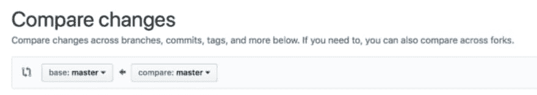

# 如何提交拉式请求

> 原文：<https://dev.to/zellwk/how-to-submit-a-pull-request-4j0g>

[https://www.youtube.com/embed/D9CfagSgdVo](https://www.youtube.com/embed/D9CfagSgdVo)

假设你在`develop`分支上写了一些代码。您已经完成了您正在进行的工作，并且您想要将它合并到`master`分支。

但是你不知道你写的代码是否足够好。在您将代码合并到主分支之前，您希望有人审查您的代码。

您可以通过拉取请求来实现这一点

## 什么是拉取请求？

拉请求是“请求 Git 拉”的简称。

这可能很难理解，所以我们要用一个类比来解释它。

想象一下，你有一箱香蕉要装上船。装载香蕉的唯一方法是:

1.  你让人扔一根绳子下来
2.  你把绳子绑在板条箱上
3.  他们拉起板条箱

当他们拉起箱子时，他们会想检查你的香蕉是否好。如果他们发现一根烂香蕉，他们可能会要求你把那根烂香蕉换成一根好的。

他们也可能认为你所有的香蕉都很烂，并决定扔掉它们。(但让我们希望这不会发生，好吗？)

在这个类比中，一箱香蕉是来自开发分支的代码。船是主枝。水手是来检查你的代码对主分支来说是否足够好。

* *这就是拉请求:在合并到另一个分支之前，你让某人检查你的代码。**

我们使用的类比和实际的拉动请求之间的唯一区别是:你不会让别人帮你扔绳子下来。你自己带绳子，把它绑在港口的香蕉上，然后扔到船上。水手唯一需要做的事情就是检查香蕉。

这就是我们所说的提交拉取请求的含义。

提交拉取请求有两种方式。如何操作取决于您是否拥有对存储库的写访问权限。

## 拥有写权限时提交拉取请求

在我们提交一个拉请求之前，我们需要做一些修改，所以我们有一些东西要合并。在这种情况下，我们将为代码添加一个标题:

```
<!-- The code we're using to submit the pull request -->
<h2>I'm a heading</h2> 
```

您需要将这段代码提交到开发分支中。然后，您需要将它推送到 git 遥控器。

它将出现在我在下图中突出显示的部分。

[T2】](https://res.cloudinary.com/practicaldev/image/fetch/s--G-q0foO9--/c_limit%2Cf_auto%2Cfl_progressive%2Cq_auto%2Cw_880/https://zellwk.cimg/2018/submit-pr/github-auto-pr.png)

如果你看到这条信息，那太好了。点击它。你会省去几个步骤。

如果没有看到，可以点击 Github repo 顶部的 pull request 选项卡。

[T2】](https://res.cloudinary.com/practicaldev/image/fetch/s--PIEc6w0y--/c_limit%2Cf_auto%2Cfl_progressive%2Cq_auto%2Cw_880/https://zellwk.cimg/2018/submit-pr/pull-request-tab.png)

然后，单击绿色按钮“新的拉取请求”。

[T2】](https://res.cloudinary.com/practicaldev/image/fetch/s--Vbi__FqK--/c_limit%2Cf_auto%2Cfl_progressive%2Cq_auto%2Cw_880/https://zellwk.cimg/2018/submit-pr/pull-request-new.png)

你会看到一个写着“比较变化”的页面。

[T2】](https://res.cloudinary.com/practicaldev/image/fetch/s--kB1dC9xx--/c_limit%2Cf_auto%2Cfl_progressive%2Cq_auto%2Cw_880/https://zellwk.cimg/2018/submit-pr/pull-request-compare.png)

要创建拉取请求，您需要将基本分支和比较分支设置为以下内容:

*   `base`:您要合并到的分支
*   `compare`:要合并的分支

在我们的例子中，我们希望合并到 master，所以我们将设置`base`为`master`。我们正在从`develop`合并，所以我们将把`compare`设置为`develop`。

一旦你选择了你的分支，Github 会显示已经提交的列表。在这里，您需要做的是单击“创建拉动式请求按钮”。

[T2】](https://res.cloudinary.com/practicaldev/image/fetch/s--jhG0LE-z--/c_limit%2Cf_auto%2Cfl_progressive%2Cq_auto%2Cw_880/https://zellwk.cimg/2018/submit-pr/pull-request-compare-2.png)

Github 会显示一个页面，上面写着“打开一个拉取请求”。

注意:如果你看到我前面提到的“你的分支已经在 X 分钟前被更新”消息，这就是你要到达的页面。

[T2】](https://res.cloudinary.com/practicaldev/image/fetch/s--vn-J0wcs--/c_limit%2Cf_auto%2Cfl_progressive%2Cq_auto%2Cw_880/https://zellwk.cimg/2018/submit-pr/pull-request-open.png)

您写的标题将是人们在“拉取请求”选项卡中看到的标题。我们将把它设置为“向索引添加标题”。

对于评论，这将是人们点击进入拉取请求时看到的第一条消息。在这种情况下，我们会说“我添加了一个标题。让我知道它好不好？”。

[T2】](https://res.cloudinary.com/practicaldev/image/fetch/s--FjCu8Avg--/c_limit%2Cf_auto%2Cfl_progressive%2Cq_auto%2Cw_880/https://zellwk.cimg/2018/submit-pr/pull-request-open-2.png)

添加标题和消息后，您可以单击页面底部的“创建拉式请求”按钮。

现在，如果您单击顶部的“拉动请求”选项卡，您将看到一个我们刚刚提交的打开的拉动请求。

[T2】](https://res.cloudinary.com/practicaldev/image/fetch/s--7HyAcqc6--/c_limit%2Cf_auto%2Cfl_progressive%2Cq_auto%2Cw_880/https://zellwk.cimg/2018/submit-pr/pull-request-opened.png)

如果您对存储库有写权限，这就是创建拉请求的方式。

如果您没有对存储库的写访问权限，您将不得不创建一个 Fork。让我们暂停一下，谈谈什么是叉子。

## 什么是叉子？

Fork 不是您正在使用的 git 客户机。别糊涂了！

Git 中的 fork 表示基于另一个库的库。

到目前为止，您已经学习了分支，并且您知道可以从另一个分支创建一个分支。(例如，从`master`创建一个`develop`分支)。

同样，一个存储库可以从另一个存储库创建。从另一个存储库创建的存储库称为 fork。

分叉存储库包含主存储库的所有内容(在分叉时)。它包括所有标签和分支。

您拥有分叉的存储库(它赋予您写权限)。这个分叉的存储库仍然会被跟踪到主存储库。您将通过这个被跟踪的链接发出一个拉请求。

让我们看看它在实践中是如何工作的。

## 提交无写权限的拉取请求

注意:您不能派生自己的存储库。我要做的是用一个虚拟账户向你展示它是如何工作的。从现在开始，请注意这两个帐户名:

1.  主账户:`zellwk`
2.  虚拟账户:`zellwk2`。

(我应该创造一个完全不同的名字...但我认为你会很好地理解的。

要派生一个存储库，您可以点击存储库右上角的 fork 按钮。

[T2】](https://res.cloudinary.com/practicaldev/image/fetch/s--8cK98va5--/c_limit%2Cf_auto%2Cfl_progressive%2Cq_auto%2Cw_880/https://zellwk.cimg/2018/submit-pr/na-fork.png)

一旦分叉完成，您将看到一个看起来(几乎)与您分叉的存储库一模一样的存储库。但是有一点不同——如果您查看项目的标题，您可以看到该项目是从另一个存储库中派生出来的。

您拥有对这个分叉存储库的写访问权限。

[T2】](https://res.cloudinary.com/practicaldev/image/fetch/s--N6M7b0Zt--/c_limit%2Cf_auto%2Cfl_progressive%2Cq_auto%2Cw_880/https://zellwk.cimg/2018/submit-pr/na-forked.png)

当我们从一个分叉的存储库中提交一个 pull 请求时，我们会这样做:

1.  创建新分支
2.  在新分支中编写代码
3.  从新分支发送拉请求

但是在本课中，我不打算创建新的分支，因为我必须在我的 Git 客户机上设置虚拟帐户。(这是一个繁琐的过程)。

因此，对于这一课，我们将直接写入`develop`分支。然后，我们将从`develop`分支提交一个拉请求。

在这种情况下，我在`index.html`文件
中添加一个包含以下 HTML 的列表

```
<ul>
  <li>Item 1</li>
  <li>Item 2</li>
  <li>Item 3</li> 
```

注意:在这个例子中，我让`<ul>`标签保持打开状态。我们将在下一课中查看这个拉取请求时发现这个错误。

此更改的提交消息是:`Add list`。

现在，如果您返回到分叉的存储库，您应该能够看到一个名为“new pull request”的按钮。此按钮位于让您切换分支的按钮旁边。

[T2】](https://res.cloudinary.com/practicaldev/image/fetch/s--4x_tdhQu--/c_limit%2Cf_auto%2Cfl_progressive%2Cq_auto%2Cw_880/https://zellwk.cimg/2018/submit-pr/na-pr-button.png)

点击这个新的拉取请求按钮来创建一个拉取请求。

Github 会把你带到一个页面，上面写着“打开一个新的拉取请求”。这个页面看起来像你在上面看到的“打开一个新的拉取请求”页面。

不同的是你需要设置四样东西:

1.  底叉
2.  基础分支
3.  头叉
4.  比较分支

[T2】](https://res.cloudinary.com/practicaldev/image/fetch/s--FG3lTZ2o--/c_limit%2Cf_auto%2Cfl_progressive%2Cq_auto%2Cw_880/https://zellwk.cimg/2018/submit-pr/na-compare.png)

从上面的例子中，我们知道了两件事:

1.  `base`分支是您想要合并到的分支
2.  `compare`分支是您想要合并的分支

从前面的拉请求示例中，我们知道`base`分支是您想要合并到的分支，而`compare`分支是您想要合并的分支。

这意味着我们应该设置以下内容:

1.  基叉:`zellwk/project`
2.  基地分支:`master`
3.  头叉:`zellwk2/project`
4.  比较分支:`develop`

接下来您需要做的是编写拉取请求标题，编写注释，然后单击 New Pull Request 按钮。

[T2】](https://res.cloudinary.com/practicaldev/image/fetch/s--P-CWBq44--/c_limit%2Cf_auto%2Cfl_progressive%2Cq_auto%2Cw_880/https://zellwk.cimg/2018/submit-pr/na-open.png)

并且您已经从一个分叉的存储库中提交了一个拉请求。

[T2】](https://res.cloudinary.com/practicaldev/image/fetch/s--K7_RTIeR--/c_limit%2Cf_auto%2Cfl_progressive%2Cq_auto%2Cw_880/https://zellwk.cimg/2018/submit-pr/na-pr-opened.png)

## 包装完毕

当您提交一个“拉”请求时，在将它们合并到一个分支之前，您要求某人检查您的更改。

创建拉取请求有两种方法。如何操作取决于您是否拥有对存储库的写访问权限。

如果您有写权限，您可以从存储库的页面创建拉请求。

如果您没有写权限，您需要将存储库分支到您自己的页面。然后，从分叉的存储库中创建一个拉请求。

* * *

感谢阅读。这篇文章最初发表在我的博客上。如果你想要更多的文章来帮助你成为一个更好的前端开发者，请注册[我的时事通讯](https://zellwk.com)。