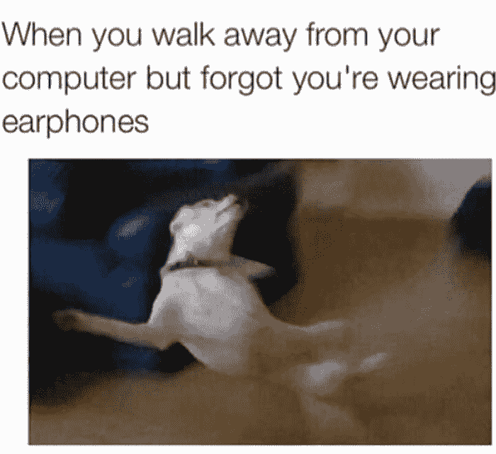
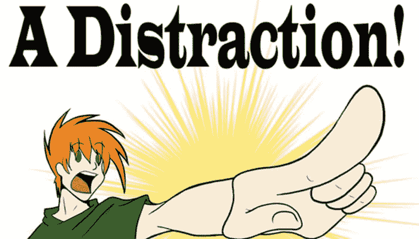

# 如何在嘈杂的办公室环境中生存

> 原文：<https://dev.to/perigk/how-to-survive-a-noisy-office-environment-al2>

这是继冰激凌的美味之后最广为人知的事实。软件工程师绝对讨厌开放式计划或开放式办公室。

它们嘈杂而紧张，令人分心，令人神经崩溃，它们做的最后一件事就是帮助你进入心流状态。除非你很幸运，你的同事知道这种痛苦，并采取相应的行动。

不幸的是，开放式办公室是我们日常工作中不可避免的资源，在未来几年内都是如此，尽管有很多反对的声音。尽管开放计划有一些好处，但我认为坏处更大。

下面是一些帮助你生存的建议

### 买一套好的耳机。

我在以前的一篇文章中提到过这个话题，但我怎么强调都不为过。当生活给了你柠檬，那就做点柠檬汁吧。当你听到噪音时，试着用你的耳机做一些精神隔离。就像这只狗一样:

 

<figcaption>真相</figcaption>

### 让你的邻居知道你的工作规律。

你和谁通话最多？用于工作和非工作目的。通常是周围的开发者和你的技术负责人。如果你是技术负责人，首先是你的晋升，其次，你也少了一个需要担心的人。:)但是，我们也鼓励你在你的队友中推广这样的良好实践。

比如说，你正在用一种类似番茄工作法的技术工作。让他们知道，除非是非常紧急的事情，否则你最多想在 X 分钟内再次分心。通常，人们会尊重这一点。如果他们等不及，那么公司聊天应用程序上的一条消息通常会完成这项工作。

### 多休息片刻

如果你正在使用一种类似番茄工作法的技术，这是你生产力系统的一部分。但是如果没有，请确保你做更多这样的事情。休息有助于你更好地休息，如果你休息得更好，就不太可能屈服于愚蠢的干扰。

T3】谢谢 CareerAddict.com

### 改变你的时间

先到办公室，或者最后离开。不是对你的经理示好，而是因为，2 小时的[深度工作(强烈推荐的书)](https://amzn.to/2yC7eT8)比 8 小时的半工作半专注有更好的结果。

### 如果以上都不行，那就待在家里。

尽管不是每个人都一样，但总的来说，在家工作会让你更有效率。

 

<figcaption>这个！！</figcaption>

有很多人在家工作，但他们实际上想完成工作。如果你的雇主在工作地点上很灵活，那么偶尔可以离开家一天。

### 最后但同样重要的是，尊重他人。

隔壁办公室的本并不总是做一些不好和粗鲁的事情，或者珍无缘无故地大喊大叫。有一个机会，你可能就是这里的工人。

**因此，请确保应用以下内容(至少，这不是一个详尽的列表):**

*   如果你想告诉一个“邻居”，确保尽可能少的人能听到，从而分散注意力(即使它不是一个秘密)。
*   你的手机和电脑的扬声器都应该静音。
*   即使你的电脑上连接了耳机，也要确保耳机的音量不会大到打扰到你旁边的人(当然，还会损伤你的耳朵)。
*   如果你有一部台式电话，你可能无法让它静音，但让它以低音量响起只能引起积极的反馈。
*   如果你想粉碎 200 张纸，那就在早上做，而不是在 12 点大家都在工作的时候。
*   把你的私人物品带出办公区。私人电话应该在巷子里或外面打，在厨房吃午饭等
*   尊重你的时间承诺，不要迟到(至少没有重要的理由)

我可以持续几天..这里的黄金法则是，正如金属乐队会说的那样，T2 会以其人之道还治其人之身

### 结束了

感谢您花时间阅读这篇文章。我真的希望听到你对我们都关心的事情的最佳建议。在那之前，开业快乐。

*原载于 https://perigk.github.io/**。*

* * *