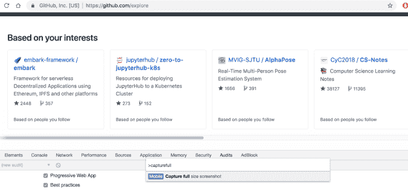

# 如何在没有扩展的情况下在 Chrome 中进行整页截图

> 原文：<https://dev.to/fatosmorina/how-to-take-full-page-screenshots-in-chrome-without-extensions-3n3>

 我们花了相当多的时间使用网络浏览器，有时可能需要在您的浏览器中获取一个完整页面的截图。我最近了解到，谷歌 Chrome 可以选择不使用任何额外的扩展来做到这一点。在本文中，我们将看到如何做到这一点。

首先，我们需要在 Chrome 内部打开 DevTools。我们可以通过以下步骤打开它:主菜单(右上角三个竖点)>*更多工具* > *开发者工具*。我们也可以使用以下键盘快捷键打开:Windows 和 Linux 中的 Control+Shift+I 或者 Mac 中的 Command+Option+I。我们也可以通过在页面的任意位置单击鼠标右键并选择*检查*来打开它。

然后我们需要打开命令菜单。我们可以通过在 Windows 和 Linux 中按 Control+Shift+P 或者在 Mac 中按 Command+Shift+P 来实现。

然后我们需要编写并选择*捕捉全尺寸截图*。完成后，我们应该得到一个 PNG 作为整个页面的截图。

这就是我的快速提示。这看起来很简单，但我认为它非常有用。

帖子[如何在没有扩展的情况下在 Chrome 中抓取整页截图](https://www.fatosmorina.com/how-to-take-full-page-screenshots-in-chrome-without-extensions/)首先出现在 [Fatos Morina](https://www.fatosmorina.com) 上。