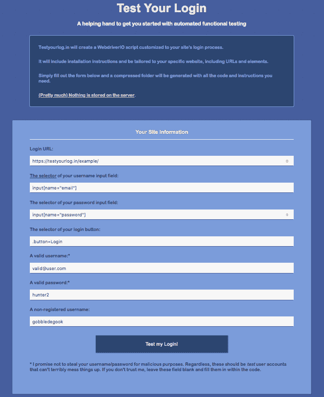
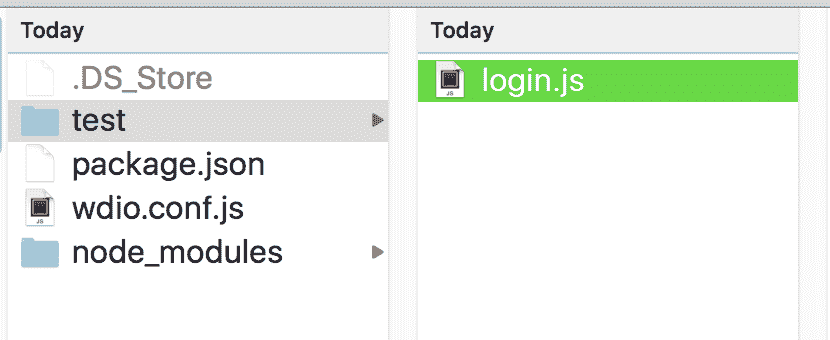
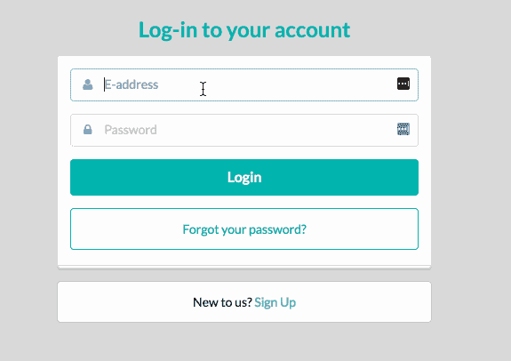
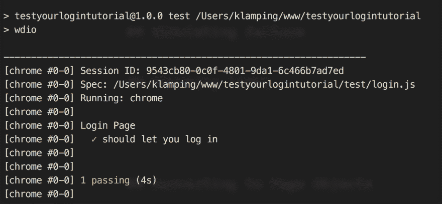

# 如何测试你的登录页面

> 原文：<https://dev.to/klamping/how-to-test-that-login-page-of-yours-1bpe>

“是的，我很想开始测试，但出于某种原因，我就是不愿意”。

这句话我听过很多次，我自己也说过很多次了。

事实上，我在之前的一篇文章中写到了这个问题:

[](/klamping) [## 为什么你不写 UI 测试

### 凯文夹紧

#testing #webdev #productivity #agile](/klamping/why-youre-not-writing-ui-tests-5fdd)

虽然有很多关于如何编写一个基本的自动化测试的教程，但它们似乎并没有让人们克服最初的阻力。

它们只是一个太简单的例子，不能真正应用到一个真实的网站上。像“我应该检查什么？”以及“我该如何组织？”通常会阻止人们前进。

所以我有了一个想法:如果我为开发人员组织一组测试，让他们走出第一步，会怎么样？

如果有人可以访问一个网站，回答几个提示，并接受一组测试来开始他们的工作，会怎么样？

我觉得那会很酷！

# 确定一个起点

为了做到这一点，我需要一个几乎所有网站都共享的功能。

几乎所有网站都有的一件事是什么？登录表单。

所以我匆匆做了一个登陆页面，人们可以在那里注册更新，然后我让这个想法渗透了一点(真的，我只是太忙了，没有时间做视频教程)。有几个人签了名，这足以向我表明人们对这个想法感兴趣。

我终于开始构建功能，并建立了网站 [https://testyourlog.in](https://testyourlog.in)

[T2】](https://res.cloudinary.com/practicaldev/image/fetch/s--FUkyA2AL--/c_limit%2Cf_auto%2Cfl_progressive%2Cq_auto%2Cw_880/https://images2.imgbox.com/c2/37/4siUIF7Y_o.png)

去试试吧，如果有帮助就告诉我。我希望得到您的反馈。

如果你愿意，你可以直接去那里，忽略这篇文章的其余部分。

但是如果你想知道细节，这里有一个完整的、深入的关于如何为你的登录页面编写测试的教程。

# 《测试你的登录》WebdriverIO 教程

## 视频版

不久前我在 YouTube 上做了一个直播，如果你喜欢视频格式(像我一样)，也许你会喜欢视频教程胜过下面的文字。或者你可以两个都去！
[https://www.youtube.com/embed/dl-YnA_njXo](https://www.youtube.com/embed/dl-YnA_njXo)T2】

## 文字版

### 第一步:安装 WebdriverIO

如果你没有使用过 [WebdriverIO](https://webdriver.io) ，我会很快解释它是一个功能测试自动化框架。它允许您编写要在浏览器中执行的页面操作，并验证这些操作是否达到了预期的效果。

我喜欢 WebdriverIO 有很多原因，但我会在另一篇文章中介绍这些原因:

[](/klamping) [## WebdriverIO 如何让测试变得值得

### 凯文夹紧

#testing #javascript #webdev #node](/klamping/how-webdriverio-makes-testing-worth-it)

在我开始安装 WebdriverIO 之前，您需要有一个最新版本的 NodeJS，并且在 NPM 包中。

我不会讨论第一项(它因系统而异，已经有很多教程了)，但是如果你没有 NPM 软件包，你可以通过打开命令提示符并运行:
来快速设置一个

```
npm init -y 
```

Enter fullscreen mode Exit fullscreen mode

只要你有了这两样东西，你就可以通过运行普通的 NPM 命令 :
来安装 WebdriverIO

```
npm i --save-dev webdriverio 
```

Enter fullscreen mode Exit fullscreen mode

### 运行 WebdriverIO

我曾经建议人们[在他们的`package.json`脚本部分](https://www.keithcirkel.co.uk/how-to-use-npm-as-a-build-tool/)添加一个命令，但是现在我选择了一个更简单的解决方案， [npx](https://medium.com/@maybekatz/introducing-npx-an-npm-package-runner-55f7d4bd282b) 。

您只需:
即可运行 WebdriverIO CLI

```
npx wdio 
```

Enter fullscreen mode Exit fullscreen mode

### 配置

第一次运行该命令时，它会检查一个`wdio.conf.js`文件。

因为我们还没有创建一个，所以 WebdriverIO 足够聪明，能够找出原因并帮助我们完成这个过程。以下是我选择的答案:

*   您希望在哪里执行测试？**在我的本地机器上**
*   您想使用哪个框架？**摩卡**
*   要我帮你安装框架适配器吗？**是**
*   你的测试规格在哪里？**。/test/**/*。js**
*   你想用哪个记者？**规格-[https://github.com/webdriverio/wdio-spec-reporter](https://github.com/webdriverio/wdio-spec-reporter)T3】**
*   要不要我帮你安装记者库？**是**
*   是否要向测试设置中添加服务？**selenium-standalone-[https://github . com/web driver io/wdio-selenium-standalone-service](https://github.com/webdriverio/wdio-selenium-standalone-service)**
*   我能为你安装服务吗？**是**
*   日志详细程度**无声**
*   如果命令失败，截图应该保存在哪个目录下？**。/errorShots/**
*   基本 url 是什么？**http://testyourlog.in/example**

[T2】](https://res.cloudinary.com/practicaldev/image/fetch/s--ANhTL0An--/c_limit%2Cf_auto%2Cfl_progressive%2Cq_66%2Cw_880/https://thepracticaldev.s3.amazonaws.com/i/jzu9jel85gc66vgrvwx7.gif)

您可能想要用您想要验证的任何页面替换测试 URL。

在最后一个问题之后，WebdriverIO 将安装我们的依赖项并生成我们的配置文件。尽管我们的第一次测试还有一些步骤要做。

### 文件夹&文件设置

我们告诉 WebdriverIO，我们已经将测试存储在了`test`文件夹中。如果您还没有创建该文件夹，请继续创建。然后，创建一个名为`login.js`的文件，并在您喜欢的文本编辑器中打开它。

[T2】](https://res.cloudinary.com/practicaldev/image/fetch/s--EfpKUN-l--/c_limit%2Cf_auto%2Cfl_progressive%2Cq_auto%2Cw_880/https://images2.imgbox.com/59/ce/ymjLbV1L_o.png)

可以设置 WebdriverIO 使用 Mocha，这是我之前在配置回答里做的。这有助于组织我们的测试和处理测试结果。

Mocha 使用两个函数,`describe`和`it`,向测试套件添加层次。如果你对它们不熟悉，[看看官方文件](https://mochajs.org/#getting-started)和我对它们的看法:

[](/klamping) [## 与 WebdriverIO 和摩卡一起开车兜风

### 凯文夹紧

#webdev #javascript #node](/klamping/take-a-drive-with-webdriverio-and-mocha-14e)

为了我们的需要，我们将设置如下:

```
describe('Login Page', function () {
  it('should let you log in', function () {
    // our tests will go here
  })
}) 
```

Enter fullscreen mode Exit fullscreen mode

你确实需要`describe`和`it`，因为这是摩卡的等级制度。`it`进入`describe`区块。我们将在`it`块内部进行测试。

## 一切准备就绪，准备跳舞

好了，我们已经配置好了 WebdriverIO，并且我们的测试文件已经准备好了。让我们编写第一个测试。

我们正在检查一个基本的“快乐路径”场景:用户输入一个活动帐户的有效凭证。

[T2】](https://res.cloudinary.com/practicaldev/image/fetch/s--FmLV06A1--/c_limit%2Cf_auto%2Cfl_progressive%2Cq_66%2Cw_880/https://images2.imgbox.com/f2/ed/KPgmxGGw_o.gif)

该测试有四个独特的步骤:

1.  转到登录页面
2.  输入有效的凭据
3.  单击提交
4.  验证我们已登录

让我们一次看一个。

### 进入登录页面

在 WebdriverIO 中移动到不同页面的基本方法是使用[`url`命令](http://webdriver.io/api/protocol/url.html)。如果你向它传递文本，WebdriverIO 会告诉浏览器到那个特定的网页。

您可以传入您想要测试的页面的完整 URL，但是因为我们已经定义了要测试的域(参见上面的配置生成)，所以我们必须传入的只是路径。

那样子:

```
it('should let you log in', function () {
  browser.url('./');
}) 
```

Enter fullscreen mode Exit fullscreen mode

您使用的路径将取决于您的登录页面所在的位置。也许它是你主页的一部分(就像我们的主页一样)。也许是一些用户没有希望记住的复杂网址。

不管是什么，用对的就行:)

### 输入有效凭证

现在我们已经进入了带有登录表单的登录页面，我们需要输入用户名/电子邮件和密码。

我们为此需要使用的命令叫做[‘setValue’](http://webdriver.io/api/action/setValue.html)。它通过接受[一个元素选择器](http://webdriver.io/guide/usage/selectors.html)和一个文本值来插入所述元素。

```
it('should let you log in', function () {
  browser.url('/');
  browser.setValue('input[name="email"]', 'valid@user.com');
  browser.setValue('input[name="password"]', 'hunter2');
}) 
```

Enter fullscreen mode Exit fullscreen mode

对于我们的元素选择器，我们使用 HTML 元素和 HTML 属性的组合。如果你不熟悉在 WebdriverIO 中选择元素的[，你肯定会想要仔细阅读它。](http://blog.kevinlamping.com/selecting-elements-in-webdriverio/)

同样，用适合你的站点的东西更新你的选择器和凭证。

### 点击提交

好了，我们已经转到登录页面并输入了我们的凭据。让我们完成登录。

有一个“submitForm”命令，但它已被否决，所以我们只需点击“登录”按钮。

我们可以通过使用[`click`命令](http://webdriver.io/api/action/click.html)来‘点击’和元素。这很有道理，对吧？

除了调用命令之外，我们需要做的就是传入一个选择器，定义我们想要单击的元素。这将触发 Webdriver 模拟鼠标左键单击该元素的中心。

```
it('should let you log in', function () {
  browser.url('/');
  browser.setValue('input[name="email"]', 'valid@user.com');
  browser.setValue('input[name="password"]', 'hunter2');
  browser.click('.button=Login');
}) 
```

Enter fullscreen mode Exit fullscreen mode

哇，那个选择器是什么？！原来，[你可以通过那些元素包含的文本选择元素](http://webdriver.io/guide/usage/selectors.html#Element-with-certain-text)。

WebdriverIO 太酷了。

### 验证我们已登录

如果一切顺利，我们现在应该登录了。但是我们如何真正知道呢？

如果我们要运行我们的测试，登录页面会快速闪过，我们可能会错过视觉验证事情按计划进行。

相反，我们将使用“断言”来检查我们的状态。

我所知道的解释断言的最简单的方法是这样说:

1.  你给计算机一些未知的值(比如一个变量)
2.  你给计算机一个已知的值(比如数字 9)
3.  你告诉计算机验证这两个值之间的关系。示例:
    *   变量应该等于 9
    *   该变量不应等于 9
    *   变量应该大于 9

如果变量的值是 8，只有第二个断言会通过(8 不等于 9)。

通常变量是你想测试的一些代码函数的结果。也许你有一个计算一个数的平方的函数(叫做`calcSquare`)。

您的断言将是:

```
assert.equal(calcSquare(3), 9); // 9 == 9
assert.notEqual(calcSquare(2), 9); // 4 != 9 
```

Enter fullscreen mode Exit fullscreen mode

假设`calcSquare`函数工作正常，这两个断言都将通过。

在 WebdriverIO 中，我们可以以多种方式使用断言。对于我们当前的需求，我们希望验证我们所在页面的 url 是:

*   与登录 url 不同
*   与登录后的网址相同

第一个是更一般的测试，如果登录没有登录就把你带到另一个页面(例如，“忘记密码”页面)，可能会导致误报(测试在不应该通过的时候通过)。

第二个选项更好，但是需要知道您登录的页面的 url。

谢天谢地，我知道我例子的 URL。但为了以防万一，我会给你们看这两个断言。

首先，我们需要获得我们现在所在页面的 URL(web driver 足够聪明，可以在提交登录表单后等待页面重新加载)。

我们用[命令`getUrl`和](http://webdriver.io/api/property/getUrl.html)得到 url。

```
it('should let you log in', function () {
  browser.url('/');
  browser.setValue('input[name="email"]', 'valid@user.com');
  browser.setValue('input[name="password"]', 'hunter2');
  browser.click('.button=Login');

  const pageUrl = browser.getUrl();
}) 
```

Enter fullscreen mode Exit fullscreen mode

我们不向`getUrl`命令传递任何值。我们简单地将它的结果赋给一个`pageUrl`常数。

有了它，我们现在可以运行我们的断言:

```
it('should let you log in', function () {
  browser.url('/');
  browser.setValue('input[name="email"]', 'valid@user.com');
  browser.setValue('input[name="password"]', 'hunter2');
  browser.click('.button=Login');

  const pageUrl = browser.getUrl();
  assert.notEqual(pageUrl, 'http://testyourlog.in/example/');
  assert.equal(pageUrl, 'http://testyourlog.in/example/logged-in.html?email=valid%40user.com&password=hunter2');
}) 
```

Enter fullscreen mode Exit fullscreen mode

我在这里包含了两种断言类型，但是您实际上只需要包含一种。

等等。

这个神奇的`assert`从何而来？

还没找到。

是的，我忽略了加载[节点的‘断言’库](https://nodejs.org/api/assert.html)的细节。

谢天谢地，这很容易。只需拍摄到您的文件顶部，并添加:

```
const assert = require('assert'); 
```

Enter fullscreen mode Exit fullscreen mode

现在你准备好参加派对了。

下面是完整的脚本，以便于参考:

```
const assert = require('assert');

describe('Login Page', function () {
  it('should let you log in', function () {
    browser.url('/');
    browser.setValue('input[name="email"]', 'valid@user.com');
    browser.setValue('input[name="password"]', 'hunter2');
    browser.click('.button=Login');

    const pageUrl = browser.getUrl();
    assert.notEqual(pageUrl, 'http://testyourlog.in/example/');
    assert.equal(pageUrl, 'http://testyourlog.in/example/logged-in.html?email=valid%40user.com&password=hunter2');
  });
}); 
```

Enter fullscreen mode Exit fullscreen mode

## 让我们开始测试吧！

我们已经写好了测试和断言。是时候尝试一下了。

在终端窗口(或者命令提示符，如果你喜欢这样称呼它的话)，再次运行你的`npx wdio`命令。

如果一切设置正确，你会看到一个火狐浏览器在你的屏幕上弹出。

希望你的测试完成并通过。

[T2】](https://res.cloudinary.com/practicaldev/image/fetch/s--3tSTv0zr--/c_limit%2Cf_auto%2Cfl_progressive%2Cq_auto%2Cw_880/https://images2.imgbox.com/a1/66/hHtz0hmC_o.png)

## 现在就这样

在我们的登录页面上还有更多要测试的，我们也想尝试使用页面对象。但这是我目前能打出来的全部内容(可能也是你有时间阅读的全部内容)。

[官方 testyourlog.in 生成器](https://testyourlog.in/)包括可视化回归测试、TravisCI 集成和页面对象支持，都是比较高级的科目。

我在我的免费 YouTube 频道和我在 T2 的特殊视频教程中都谈到了这些话题。

如果您有兴趣查看运行 testyourlog.in 的代码，可以通过 GitHub 获得:

## /[测试布局等](https://github.com/klamping/testyourlog.in)中的扣带扣带扣带扣带扣带扣带扣带扣带扣带扣带扣带扣带扣带扣带扣带扣带扣带扣带扣带扣带扣带扣带扣带扣带扣带扣带扣带扣带扣带扣带扣带扣带扣带扣带扣带扣带扣带扣带扣带扣带扣带扣带扣带扣

### 一个自动生成 WebdriverIO 脚本来测试你的登录/注册表单的工具

<article class="markdown-body entry-content container-lg" itemprop="text">

# testyourlog.in

一个自动生成 WebdriverIO 脚本来测试你的登录/注册表单的工具

</article>

[View on GitHub](https://github.com/klamping/testyourlog.in)