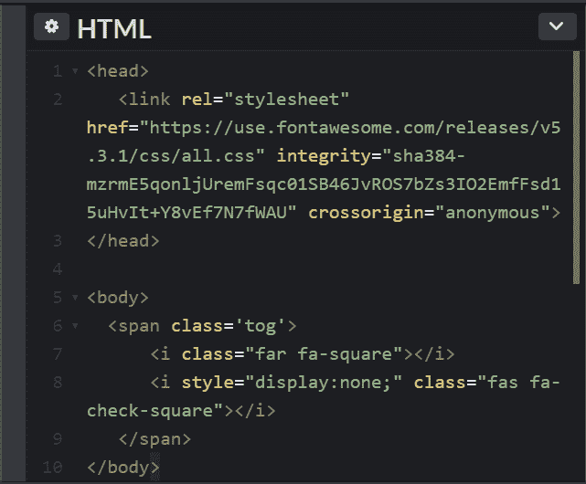
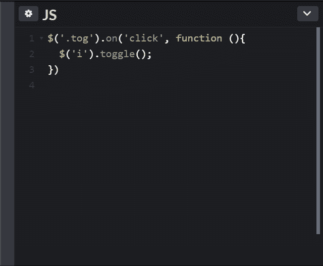

# 点击时如何在图像间切换

> 原文：<https://dev.to/trilemaestro92/how-to-toggle-between-images-on-click-ml4>

你好吗，程序员？感谢您阅读我写的关于学习如何点击切换图片的文章。

让我们开始吧！

## HTML

[T2】](https://res.cloudinary.com/practicaldev/image/fetch/s--5fKX6EZU--/c_limit%2Cf_auto%2Cfl_progressive%2Cq_auto%2Cw_880/https://thepracticaldev.s3.amazonaws.com/i/0dcwyehim8sya3apq3nq.PNG)

1.  这里我们有一个简单的 HTML 文档，带有一个样式表链接，链接到我在头部使用的图标。

2.  在正文中，我有 2 个我想要切换的图标/图像。在这种情况下，它是一个复选框和一个未选中的框。这两个图标都包装在一个 **span** 标记 class name = 'tog '中。

3.  如果你仔细看第 8 行。我使用**显示确保*选中的*框样式是隐藏的:无**。

## 现在让我们看看 Javascript 的内部

[T2】](https://res.cloudinary.com/practicaldev/image/fetch/s--Kr_UBoSy--/c_limit%2Cf_auto%2Cfl_progressive%2Cq_auto%2Cw_880/https://thepracticaldev.s3.amazonaws.com/i/sworwl9lc4tx4hrc6w0d.PNG)

除了 Javascript，我还使用了一些 jQuery 方法。

1.  在选择器上，我选择了 **span** 标签类。然后点击它将运行一个**功能**。

2.  **功能**正在选择一个 *i* 标签，该标签是选中和取消选中图标的标签。

3.  最后，我使用**切换**功能在两个图标之间切换。

这是 PZ！

您可以在这里测试它！
[https://codepen.io/anon/pen/qMzyyw](https://codepen.io/anon/pen/qMzyyw)