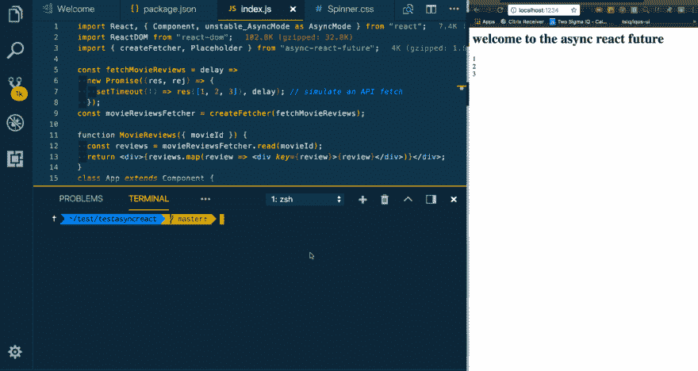

# 尝试在 5 分钟内反应悬念

> 原文：<https://dev.to/swyx/how-to-try-react-suspense-in-5-minutes-474c>

# 免责声明

我只是在自己搞乱这件事，与 React 团队没有任何关系。我这样做只是为了在公共场合学习，也可能节省其他人的时间。

# 真的，不要尝试这样做，尤其是如果你是一个初学者，绝对不要在生产中使用它

# 这只是为了好玩和熏陶

* * *

### 短版

```
git clone https://github.com/sw-yx/tryasyncreact.git
cd tryasyncreact
yarn
npm start 
```

* * *

### 少短版

从一个空文件夹开始...

```
yarn init -y
yarn add react@canary react-dom@canary simple-cache-provider async-react-future 
```

是我发布的高级 API 库，它只包含了 Dan Abramov 演示的功能和组件的社区实现。你可以查看[消息来源](https://github.com/sw-yx/async-react-future)，也可以在我的新闻追踪回购、 [fresh-async-react](https://github.com/sw-yx/fresh-async-react/) 了解其他信息。

除了 Webpack，我们还将使用 [ParcelJS v1.7](https://medium.com/@devongovett/parcel-v1-7-0-9aac0c505837) 来捆绑和运行我们的应用程序，以确保您的包裹版本是最新的(`parcel -V`)。package 1.7 做了一些我们不想要的自动安装魔术，所以我们要写一个 npm 脚本来禁用它(这个标志没有记录，花费了我一些时间)。为了省去你的麻烦，这里是你应该有的最后一个`package.json`:

```
{
  "name": "testasyncreact",
  "version": "1.0.0",
  "main": "index.js",
  "author": "sw-yx <myemail@gmail.com>",
  "license": "MIT",
  "scripts": {
    "start": "parcel index.html --no-cache --no-autoinstall"
  },
  "dependencies": {
    "async-react-future": "0.0.1",
    "react": "^16.4.0-alpha.0911da3",
    "react-dom": "^16.4.0-alpha.0911da3",
    "simple-cache-provider": "^0.3.0"
  }
} 
```

* * *

库里奥。现在，我们遵循标准 [ParcelJS 入门](https://parceljs.org/getting_started.html)工作流程的其余部分:

`index.html` :

```
<html>
<body>
  <div id="root"></div>
  <script src="./index.js"></script>
</body>
</html> 
```

* * *

`index.js` :

```
import React, { Component, unstable_AsyncMode as AsyncMode } from "react";
import ReactDOM from "react-dom";
import { createFetcher, Placeholder } from "async-react-future";

const fetchdata = delay =>
  new Promise((res, rej) => {
    setTimeout(() => res([1, 2, 3]), delay); // simulate an API fetch
  });
const dataFetcher = createFetcher(fetchdata);

function DataComponent({ timeForAPItoResolve }) {
  const nums = dataFetcher.read(timeForAPItoResolve);
  return <div>{nums.map(num => <div key={num}>{num}</div>)}</div>;
}
class App extends Component {
  render() {
    return (
      <AsyncMode>
        <Placeholder delayMs={1000} fallback={<div>Loading....</div>}>
          <div>
            <h1>welcome to the async react future </h1>
            <DataComponent timeForAPItoResolve={2000} />
          </div>
        </Placeholder>
      </AsyncMode>
    );
  }
}

ReactDOM.render(<App />, document.getElementById("root")); 
```

也就这样了！点击`npm start`并检查时髦的异步加载！

[T2】](https://res.cloudinary.com/practicaldev/image/fetch/s--Qhghsf2i--/c_limit%2Cf_auto%2Cfl_progressive%2Cq_66%2Cw_880/https://user-images.githubusercontent.com/6764957/38276875-710bfb48-3764-11e8-8324-7f51d660080b.gif)

# 尝试更多的东西

出口更多在 [JSConf 冰岛会谈](https://www.youtube.com/watch?v=v6iR3Zk4oDY)中演示过的东西。以下是完整列表:

*   `createFetcher`
*   `Placeholder`
*   `Component.deferSetState`
*   `Loading`

这些都是完全未经测试，使用风险自担。我将尝试在 [async-react-future](https://github.com/sw-yx/async-react-future) 的自述文件中添加使用示例。当然，你也可以像其他人一样写你自己的版本。如果你想出了很酷的东西，来[发布到`fresh-async-react`！](https://github.com/sw-yx/fresh-async-react)

如果您想了解更多信息，请点击查看我的幻灯片和我的 React 悬念备忘单。尽情享受吧！