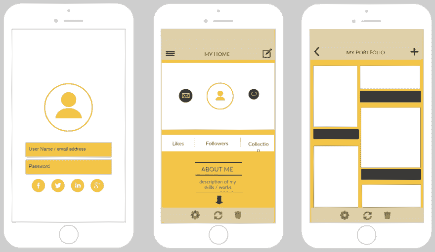
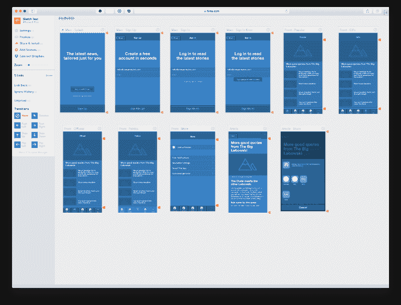
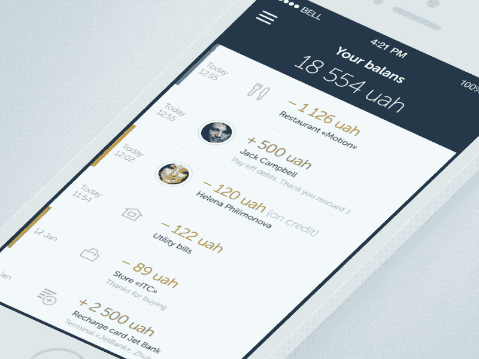

# 为什么使用设计模型工具可以改进您的项目工作流程

> 原文：<https://dev.to/_robynedgar/how-to-use-design-mockup-tools-to-improve-your-project-workflows--3738>

*供稿 [Alex Verdurmen](https://www.linkedin.com/in/alex-verdurmen-11198613/) ，Hifyre*

每个开发人员都知道，没有什么比完成一个项目后，当界面设计人员改变一个小细节并对代码库进行重大修改时，不得不重新访问它更令人沮丧的了。Flinto 和其他 UX/UI 设计模型工具使这种挫败感可以忽略不计，同时优化了开发人员和设计人员在项目上的时间。

### 那么 Flinto 是如何工作的呢？

这是设计师和可用性专家轻松模拟和演示应用程序初步功能的一种方式。使用 Flinto 创建的设计可以是非常基础的基于线框的设计，也可以是完全开发的艺术。无论如何，该工具都可以轻松地让公司在应用程序中演示互动，而不仅仅是初始屏幕。

[T2】](https://res.cloudinary.com/practicaldev/image/fetch/s--N35SXLv6--/c_limit%2Cf_auto%2Cfl_progressive%2Cq_auto%2Cw_880/https://cdn-images-1.medium.com/max/800/1%2AuAeR8dPb3c1oxxnazGNR1Q.png)

从操作上来说，我们在 [Hifyre](https://hifyre.com) 在计划和执行之间的开发阶段早期使用我们的原型软件。这是一个优秀的工具，它赋予了产品开发早期阶段的所有发现、规划和业务目标映射以生命。通过以这种方式处理我们的项目，我们很快给正在构建的应用程序带来活力，并验证我们在整个初始阶段所做的假设。与如何使用它同样重要的是，Flinto 允许我们在不投入大量时间开发实际产品的情况下构建项目原型，并且从长远来看，通过试错过程最终会浪费时间和金钱。由于设计模型工具的效用，我们逐渐将这一步骤引入到我们的每一个即将到来的项目中。

### 作为一名开发人员，设计模型工具如何让我的工作变得更容易？

[T2】](https://res.cloudinary.com/practicaldev/image/fetch/s--T6GsmnNt--/c_limit%2Cf_auto%2Cfl_progressive%2Cq_66%2Cw_880/https://cdn-images-1.medium.com/max/800/1%2A9Kpu60QUzUw_FCVVZjYD_g.gif)

像 Flinto 这样的工具的最大价值是，它让参与产品开发过程的每个人都变得更容易，从构思到执行。

对客户来说，它让我们能够销售有触觉的想法。他们说一张图片抵得上 1000 个字，当我们提出功能和具体的用户流时，拥有一些可以触摸、感受和实际互动的东西，比试图通过静态屏幕讨论和演示想法要走得远得多。

对于设计团队来说，像 Flinto 这样的工具允许他们充实想法，而不必投入大量的时间和精力让生产团队的人来构建它。他们可以自己快速测试和验证一个想法，同时在初步构思阶段迭代或转向新的想法。

对于开发团队来说，模拟设计就像一张蓝图，有助于在实际构建产品时消除大量猜测。最初的设计给每个人一个机会，看看最初提出的想法是否给了开发人员一组明确定义的任务。假设是这样的话，开发人员和设计人员可以协同前进，而不是等待来来回回的决定。

对于客户和管理团队来说，它满足了运营目标，如提高效率和确保客户获得最佳投资回报。当从构建过程中消除了模糊性，并且定义好的计划有了清晰的最终结果，它允许更平滑的执行流程，最终保持开发成本降低，预算一致，并且每个人都在同一页面上。

从更一般的层面来说，原型设计与其说是关于工具，不如说是关于工具所促进的过程。在我们的蓝图阶段使用类似 Flinto 的东西，对于满足我们内部和客户的许多运营目标大有帮助。在规划阶段，我们可以适当地建立预算，向我们的团队清楚地传达交付成果，并确保我们所构建的产品不仅仅是客户想要的，而且性能良好，投资回报率最大化。

### Flinto 是唯一这样的工具吗？

一点也不。其他类似的工具也存在。例如，我们在设计中遇到的一些工具是草图、漫威和 Adobe 每一个都有优点和缺点。

### *附加资源:*

[从图形到产品设计](https://medium.com/the-almanac/pivoting-from-graphic-to-product-design-d85b9affe959)作者[安德拉·克罗夫特](https://twitter.com/andreacrofts)
[原型制作工具](http://prototypingtools.co/)
[Flinto 中一个绝妙的项目示例](https://www.uplabs.com/posts/weather-app-challange)
[UX 工具](https://uxdesign.cc/ux-user-research-and-user-testing-tools-2d339d379dc7)
[Flinto 中的快速 iOS 原型制作](http://blog.mengto.com/quick-ios-prototyping-flinto/)
[草图中的 11 个原型制作技巧](https://www.invisionapp.com/blog/11-tips-for-prototyping-with-sketch/)

## [像素化原型](https://www.viget.com/articles/prototyping-mobile-animations-with-pixate/)

我们提到我们在招人了吗？[取得联系](https://hifyre.bamboohr.com/jobs/)。