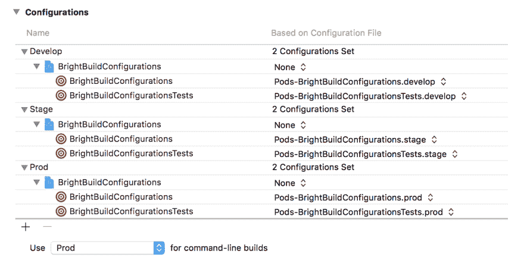
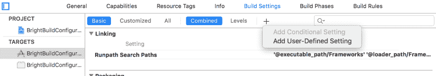
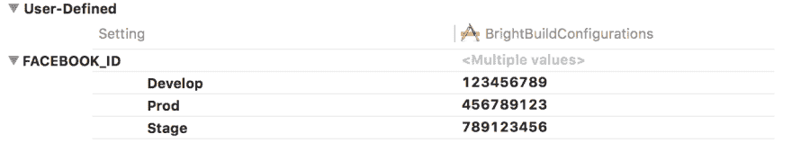
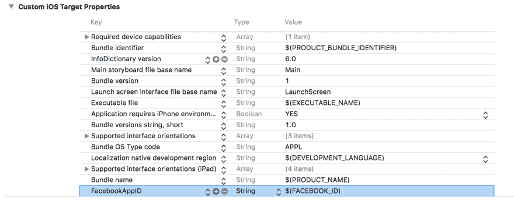
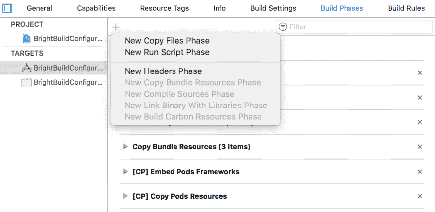
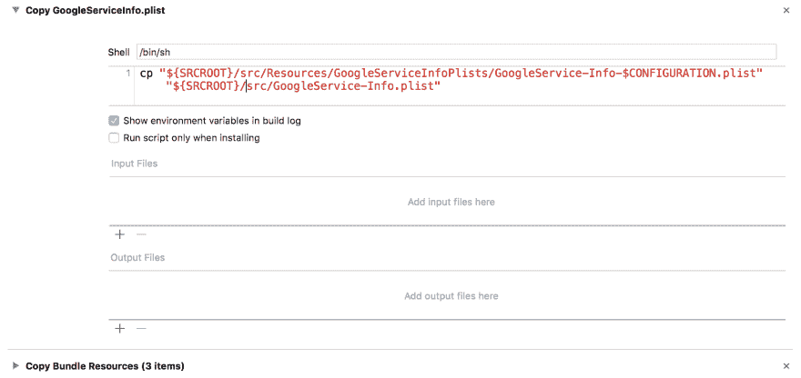
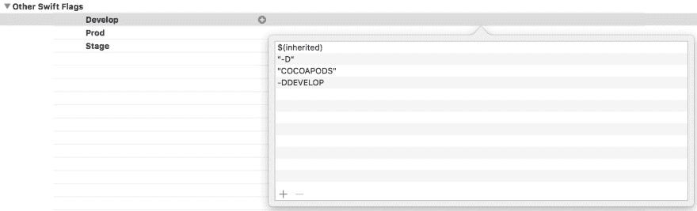

# 如何为每个构建配置使用不同的 Google 配置

> 原文：<https://dev.to/brightdevs/how-to-use-different-google-configurations-for-each-build-config-2fnh>

如果你曾经在 iOS 上使用过 [Google Sign-In](https://developers.google.com/identity/sign-in/ios/start) 、 [Firebase](https://firebase.google.com/docs/ios/) 或 [Google Analytics](https://developers.google.com/analytics/devguides/collection/ios/v3/) ，你应该对一个`GoogleService-Info.plist`配置文件很熟悉。使用属性列表文件而不是在代码中手动设置每个必需的属性非常方便，尤其是在同时使用多个 Google 服务并且配置不断增长的情况下。但是你有没有想过如何将它应用到多种环境中？

## 环境

为了在 iOS 应用程序中设置多个环境，我使用了**构建配置**。默认情况下，每个 iOS 应用都有两种构建配置:调试和发布。在我们的项目中，我们通常有三个:

*   Develop -为开发人员提供的应用程序，启用了调试功能，通常连接到 Stage 后端。
*   与 Stage 后端连接的 Stage 签名应用程序，用于早期试飞测试。
*   Prod 签署的应用程序连接到生产后端，在试飞的 UAT(用户验收测试)后发布到商店。

您可以在项目设置中定义构建配置([项目]→信息)。

[T2】](https://res.cloudinary.com/practicaldev/image/fetch/s--L_jyrJ7V--/c_limit%2Cf_auto%2Cfl_progressive%2Cq_auto%2Cw_880/https://thepracticaldev.s3.amazonaws.com/i/sj5tk6yc4onlnifs7k7e.png)

#### 用户自定义设置

构建配置让您可以轻松地为每个配置使用不同的**用户定义设置**。您可以在目标构建设置的底部定义这些([目标]→构建设置)。

[T2】](https://res.cloudinary.com/practicaldev/image/fetch/s--2mF1WRvO--/c_limit%2Cf_auto%2Cfl_progressive%2Cq_auto%2Cw_880/https://thepracticaldev.s3.amazonaws.com/i/jx7hafw0z6gzogdvfv5x.png)

[T2】](https://res.cloudinary.com/practicaldev/image/fetch/s--cXlplyG0--/c_limit%2Cf_auto%2Cfl_progressive%2Cq_auto%2Cw_880/https://thepracticaldev.s3.amazonaws.com/i/xmfnhfkwj3btqmoltvtw.png)

您可以分别在 **Info.plist** 文件中使用用户定义的设置。

[T2】](https://res.cloudinary.com/practicaldev/image/fetch/s--VXPCF0iz--/c_limit%2Cf_auto%2Cfl_progressive%2Cq_auto%2Cw_880/https://thepracticaldev.s3.amazonaws.com/i/w0lwe9li0ucn5gdblejc.png)

在上面的例子中，应用程序将为每个构建配置使用不同的`FacebookAppID`属性。`FacebookAppID`属性由 iOS 版[脸书 SDK](https://developers.facebook.com/docs/ios/)自动使用，但您也可以在代码中直接引用这些值:

```
if let path = Bundle.main.path(forResource: "Info", ofType: "plist"),
   let dict = NSDictionary(contentsOfFile: path) as? [String: AnyObject] {
    // read values from dict
} 
```

Enter fullscreen mode Exit fullscreen mode

## 谷歌配置

有人可能认为您可以用`GoogleService-Info.plist`配置文件做同样的事情。**不幸的是，您不能从自定义属性列表文件**中读取用户定义的设置，您只能在目标构建设置中定义的 Info.plist 文件中这样做。

考虑到只能有一个`GoogleService-Info.plist`文件，并且不可能从自定义中读取用户定义的设置。plist 文件，你如何为每个环境设置不同的 Google 配置？

[T2】](https://res.cloudinary.com/practicaldev/image/fetch/s--YcDk12u1--/c_limit%2Cf_auto%2Cfl_progressive%2Cq_auto%2Cw_880/https://thepracticaldev.s3.amazonaws.com/i/dkfbwmcetfxi2777mtst.jpeg)

## 运行脚本进行救援

幸运的是，您可以添加新的**运行脚本阶段**到目标构建阶段，这些阶段将**复制一个正确的 Google 配置文件**到默认的`GoogleService-Info.plist`位置。

[T2】](https://res.cloudinary.com/practicaldev/image/fetch/s--LFgtcaeQ--/c_limit%2Cf_auto%2Cfl_progressive%2Cq_auto%2Cw_880/https://thepracticaldev.s3.amazonaws.com/i/c37bberc1ch7jk1xd84z.png)

这个脚本非常简单，它只使用指向构建配置的预定义的`CONFIGURATION`变量从资源中复制一个 plist 文件。在上面列出的构建配置中，它用资源中存储的以下文件之一替换了`GoogleService-Info.plist`文件内容:

*   谷歌服务-信息-开发. plist
*   谷歌服务-信息-Stage.plist
*   GoogleService-Info-Prod.plist

```
cp "${SRCROOT}/src/Resources/GoogleServiceInfoPlists/GoogleService-Info-$CONFIGURATION.plist" "${SRCROOT}/src/GoogleService-Info.plist" 
```

Enter fullscreen mode Exit fullscreen mode

`SRCROOT`也是预定义的，它指向项目位置。

注意`src/GoogleService-Info.plist`必须添加到目标**的复制捆绑资源**构建阶段，而 Google 配置文件则不一定要从资源中复制。

#### 小心！

更新`GoogleServiceInfo.plist`文件的运行脚本必须在复制包资源阶段之前被拖拽**。否则，它将无法工作，因为将使用默认的 Google 配置文件。**

[T2】](https://res.cloudinary.com/practicaldev/image/fetch/s--PiU3UzuQ--/c_limit%2Cf_auto%2Cfl_progressive%2Cq_auto%2Cw_880/https://thepracticaldev.s3.amazonaws.com/i/ygft8jmbdobg26ypn44h.png)

## 替代品

或者，您可以直接在代码中设置 Google Client ID 和其他 Google 配置属性，例如:

```
GIDSignIn.sharedInstance().clientID = "CLIENT_ID" 
```

Enter fullscreen mode Exit fullscreen mode

要为每个环境保留不同的 Google 配置，您可以根据构建配置读取适当的 Google plist 文件，或者自行存储 Google 配置，无需属性列表文件。

要在运行时确定构建配置，您可以在目标构建设置中使用**其他 Swift 标志**。为每个构建配置添加一个以`-D`开始的环境标志，比如`-DDEVELOP`。

[T2】](https://res.cloudinary.com/practicaldev/image/fetch/s--irmXrnJd--/c_limit%2Cf_auto%2Cfl_progressive%2Cq_auto%2Cw_880/https://thepracticaldev.s3.amazonaws.com/i/2szxoas8zipoxcsxebsf.png)

然后，您可以轻松地确定运行时的构建配置:

```
#if DEVELOP
    // Develop
#elseif STAGE
    // Stage
#elseif PROD
    // Prod
#endif 
```

Enter fullscreen mode Exit fullscreen mode

这篇文章的灵感来自于[这个 StackOverflow 主题](https://stackoverflow.com/q/34067120/1570496)。

最初发布于 [brightinventions.pl](https://brightinventions.pl/blog/)

作者 Mateusz Klimczak,《推动事物前进》@光明的发明

[推特](https://twitter.com/Klimczak_M)，[邮件](//mateusz.klimczak@brightinventions.pl)