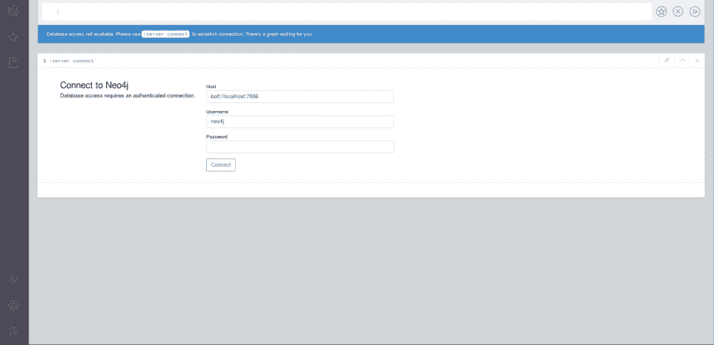
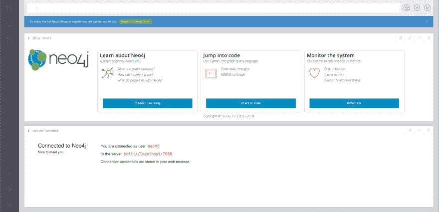

# 如何使用 docker 同时运行多台 neo4j 服务器

> 原文：<https://dev.to/rohitfarmer/how-to-use-docker-to-run-multiple-neo4j-servers-simultaneously-3cmo>

Neo4J 图形数据库服务器一次只能挂载一个数据库。要运行 neo4j 服务器的多个实例，并在其上安装不同的数据库，一种有效的方法是使用 [neo4j docker 映像](https://hub.docker.com/_/neo4j/)。同时使用多台 neo4j 服务器的关键是为 http、https 和 bolt 连接使用不同的端口，这对于 docker 镜像来说相对容易。出于我的目的，我还必须配置 neo4j，使其能够从非默认位置访问数据库。

**第一步:安装 neo4j docker 镜像。**

假设你已经安装了 docker，并且你正在 Linux 环境下工作:

```
docker pull neo4j 
```

Enter fullscreen mode Exit fullscreen mode

**第二步:运行 neo4j docker 镜像。**

默认情况下，neo4j docker 镜像挂载以下文件夹:

```
home: /var/lib/neo4j
config: /var/lib/neo4j/conf
logs: /var/lib/neo4j/logs
plugins: /var/lib/neo4j/plugins
import: /import
data: /var/lib/neo4j/data
certificates: /var/lib/neo4j/certificates
run: /var/lib/neo4j/run 
```

Enter fullscreen mode Exit fullscreen mode

这些目录可能对应于系统中已经存在的目录。在我的例子中，我已经有一个 neo4j 社区服务器在我的机器上运行，所以所有这些位置都在那里，并被服务器使用。因此，我必须提供一个可以提供相同信息的自定义位置。如果您没有安装服务器版本，并且只打算使用 docker 映像，这些位置就不会在您的计算机中。据我所知，上述文件夹中最重要的是数据，这是您的实际数据库将被创建/存储的地方，import 用于放置 CSV 文件，conf 用于放置 neo4j.conf 文件。

下面的命令将运行 neo4j docker 映像，负责在非默认端口上运行服务器，并从所需位置创建或挂载所需的文件夹。

```
docker run --detach --name=my-neo4j --rm --env=NEO4J_AUTH=none \
--publish=7475:7474 --publish=7476:7473 --publish=7688:7687 \
--volume=$HOME/neo4j/data:/data \
--volume=$HOME/neo4j/import:/import \
--volume=$HOME/neo4j/conf:/conf \
neo4j 
```

Enter fullscreen mode Exit fullscreen mode

*分解上述命令。*

docker run …… neo4j 就是运行 neo4j docker 镜像。

–detach 在后台运行容器并返回提示。

–name = my-neo4j 为 docker 实例指定所需的名称，否则 docker 将选择一个随机名称，如果我们出于某种原因希望在将来引用该会话，该名称可能不太容易记住。

–RM 在会话终止时从列表中删除 docker 实例。如果我们想重用同一个名字，这是很有用的。

–env = NEO4J _ AUTH = none 设置无密码登录 NEO4J 数据库的环境。

–publish = 7475:7474–publish = 7476:7473–publish = 7688:7687 将默认的 http、https 和 bolt 端口发布/转发到所需的端口。在这种情况下，http、https 和 bolt 端口将分别被转发到所需的 7475、7476 和 7687。

–volume = $ HOME/neo4j/data:/data \

–volume = $ HOME/neo4j/import:/import \

–volume = $ HOME/neo4j/conf:/conf \

挂载数据库创建或访问所需的位置。

*注意:如果您是第一次运行此命令，它将创建在–volume tag 中提到的文件夹。否则，它会将现有的文件夹挂载到 neo4j docker 默认值中。*

如果没有返回错误，那么您的 neo4j 服务器正在运行，并且应该已经映射到所需的端口和文件夹。

**第三步。检查 docker 和 neo4j 服务器的运行状态。**

查看当前正在运行的 docker 会话。

```
docker ps 
```

Enter fullscreen mode Exit fullscreen mode

这会给你一个类似这样的输出:

```
CONTAINER ID IMAGE COMMAND CREATED STATUS PORTS NAMES
1afa157d9caa neo4j "/sbin/tini -g -- ..." 36 minutes ago Up 36 minutes 7473/tcp, 0.0.0.0:7475->7474/tcp, 0.0.0.0:7688->7687/tcp my-neo4j 
```

Enter fullscreen mode Exit fullscreen mode

要终止此会话:

```
docker kill my-neo4j 
```

Enter fullscreen mode Exit fullscreen mode

要检查 neo4j 运行状态，请执行下列操作:打开 web 浏览器，然后导航至

[http://localhost:7475](http://localhost:7475) (或您在步骤 2 中用于转发的端口)

它应该会呈现如下所示的页面:

[T2】](https://res.cloudinary.com/practicaldev/image/fetch/s--BmM_90yg--/c_limit%2Cf_auto%2Cfl_progressive%2Cq_auto%2Cw_880/https://rohitfarmer.github.img/neo4j-1.png)

将 bolt 端口更改为 7688(或您在步骤 2 中用于转发的端口)，将密码字段留空(因为我们在步骤 2 中要求不进行身份验证)，然后单击连接。

它应该将您连接到默认的 graph.db 数据库，看起来应该如下所示。

[T2】](https://res.cloudinary.com/practicaldev/image/fetch/s--pSJBx-20--/c_limit%2Cf_auto%2Cfl_progressive%2Cq_auto%2Cw_880/https://rohitfarmer.github.img/neo4j-2.png)