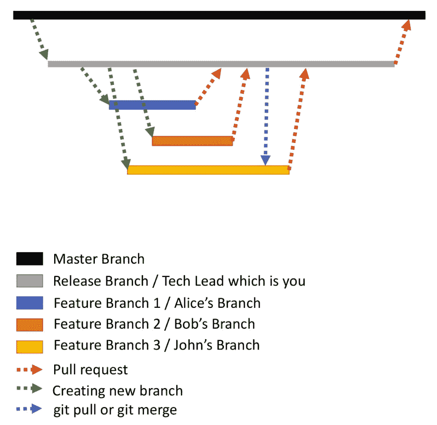
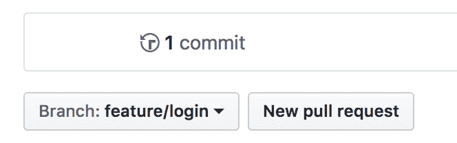
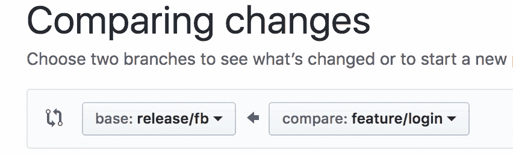

# 如何高效使用 git

> 原文：<https://dev.to/adityasridhar/how-to-use-git-efficiently-2pfa>

**本帖原载于[medium.freecodecamp.org](https://medium.freecodecamp.org/how-to-use-git-efficiently-54320a236369)T3】**

*代码昨天还在工作，但今天不行了*

*代码被删除*

一个奇怪的 bug 突然出现，没人知道是怎么回事

如果你曾经遇到过以上任何一种情况，那么**这篇文章就是为你准备的**。

除了知道`git add`、`git commit`和`git push`，Git 中还有一堆其他重要的技术。了解这些从长远来看会有很大帮助。在这里，我将介绍一些能让你充分利用 Git 的东西。

# Git 工作流

每当多个开发人员参与一个项目时，就有必要为 Git 使用正确的工作流。在这里，我将介绍一个在有多个开发人员的大型项目中非常有效的工作流。

[T2】](https://res.cloudinary.com/practicaldev/image/fetch/s--H185MmZ2--/c_limit%2Cf_auto%2Cfl_progressive%2Cq_auto%2Cw_880/https://thepracticaldev.s3.amazonaws.com/i/0l3ujkyk8qt0s843gl2s.jpg)

<figcaption>Hopefully this workflow chart I created will help you visualize the process :)</figcaption>

## 方案

突然之间，你成了一个项目的技术负责人，你计划在这个项目中打造下一个脸书。该团队有三名开发人员:

1.  爱丽丝:有一年的工作经验，懂编程

2.  鲍勃:有一年的经验，懂编程

3.  约翰:有三年的经验，非常了解编程

4.  **你**:被指派为这个项目的技术负责人

# Git 中的开发过程

## 主分支

1.  主分支应该始终拥有生产中现有代码的副本。

2.  没有人——包括技术主管——应该直接在主分支中编码，因为它是生产代码的副本。

3.  实际代码是在其他分支中编写的。

## 发布分支

1.  当项目开始时，要做的第一件事是为项目创建一个**发布分支**。发布分支是从**主分支**创建的。

2.  与这个项目相关的所有代码都将在**发布分支**中。发布分支只是一个前缀为**发布/** 的普通分支。

3.  让我们把这个例子的发布分支叫做 **release/fb** 。

4.  可能有多个项目运行在同一个代码基础上。因此，对于每个项目，都会创建一个单独的发布分支。假设还有一个项目在并行运行。那么这个项目可以有一个单独的发布分支，比如**发布/信使**

5.  拥有一个发布分支的原因是同一个代码库可以有多个并行运行的项目——项目之间不应该有冲突。

## 特征分支

1.  对于应用程序中构建的每个特征，都会创建一个单独的**特征分支**。这确保了特性可以独立构建

2.  特征分支与任何其他分支一样，只是带有前缀 **feature/**

3.  现在，你作为技术领导者，已经要求爱丽丝为脸书建立一个登录屏幕。所以她为此创建了一个新的功能分支。让我们调用功能分支**功能/登录**。Alice 只会在这个功能分支中编写完整的登录代码。

4.  特征分支通常是从**发布分支**创建的

5.  Bob 的任务是构建“朋友”请求页面。因此 Bob 创建了一个名为 **feature/friendrequest** 的特性分支

6.  John 的任务是构建新闻提要。因此，John 创建了一个名为 **feature/newsfeed** 的功能分支

7.  所有开发人员都在他们各自的特性分支中编码。到目前为止一切顺利　‘😃

8.  现在，假设 Alice 完成了她的任务，登录代码也准备好了。她需要将她的代码从她的特性分支**特性/登录**发送到发布分支**发布/反馈**。这是通过**拉请求**来完成的。

## 拉取请求

首先，不要将拉请求与`git pull`混淆。

开发人员不能将代码直接推入发布分支。在进入**发布**分支之前，技术主管需要审查**特性**代码。这是通过拉请求完成的。

Alice 可以在 GitHub 中提出 pull 请求，如下所示——这些步骤专门针对 GitHub。

[T2】](https://res.cloudinary.com/practicaldev/image/fetch/s--ZTuLJbgF--/c_limit%2Cf_auto%2Cfl_progressive%2Cq_auto%2Cw_880/https://thepracticaldev.s3.amazonaws.com/i/y58hquwl94qraoxf8wbz.jpg)

在分支名称的右边有一个名为“新拉取请求”的选项。点击该按钮将打开一个新的屏幕，如下所示:

[T2】](https://res.cloudinary.com/practicaldev/image/fetch/s--1-ytkqIO--/c_limit%2Cf_auto%2Cfl_progressive%2Cq_auto%2Cw_880/https://thepracticaldev.s3.amazonaws.com/i/litrn6co16a5we576qyu.jpg)

这里:

*   **比较**分支应该是爱丽丝的特色分支**特色/登录**

*   **基地**分支应为发布分支**发布/fb** 。

完成后，Alice 需要输入拉动请求的标题和描述，最后单击“创建拉动请求”。Alice 还需要为这个拉取请求分配一个审核者。因为你是技术主管，所以她输入你的名字作为审核人。

然后，技术主管审查拉请求中的代码，并将来自**特性**分支的代码合并到**发布**分支中

所以现在你已经将代码从**特性/登录**分支合并到**发布/反馈**分支，爱丽丝很高兴她的代码被合并了。😃

## 代码冲突😠

1.  鲍勃也完成了他的代码，并从**功能/朋友请求**向**发布/反馈**提交了一个拉请求。

2.  由于发布分支已经有登录代码，所以会发生**代码冲突**。解决这些代码冲突并合并代码是评审者的责任。在这种情况下，作为技术负责人，您需要解决这些代码冲突并合并代码。

3.  现在，John 也完成了他的代码，并希望将他的代码添加到 release 分支。但是约翰非常擅长处理代码冲突。约翰将最新的代码从 **release/fb** 分支带入他自己的特性分支 **feature/newsfeed** (通过 git pull 或 git merge)。约翰解决了所有存在的冲突。现在**功能/新闻订阅**分支也拥有了**发布/fb** 中的所有代码。

4.  最后，John 提出了一个拉取请求。这次 pull 请求中没有代码冲突，因为 John 已经解决了它们。

所以有两种方法解决代码冲突:

*   第一种方法:拉请求的审查者需要解决代码冲突。
*   第二种方法:开发人员确保来自发布分支的最新代码被合并到特性分支中，并自己解决冲突。

在企业项目中，初学者可以从第一种方法开始，最终转向第二种方法。第二种方法是首选方法

## 又是主分支

一旦项目完成，来自**发布**分支的代码被合并回**主**分支。然后将代码部署到生产环境中。因此，生产中的代码和主分支中的代码总是同步的。这也确保了对于任何未来的项目，最新的代码在**主**中可用。

# 参考

更多关于拉取请求的信息在[这里](https://help.github.com/articles/creating-a-pull-request/)。

# 祝贺😄

您现在已经了解了 git 工作流。Git 还有一些其他的概念，比如修改提交和重置基础，这些也很有用。但是 Git 工作流对于大型项目的成功非常重要。

对于小项目来说，这种工作流程看起来像是一种开销。所以在小项目中可以使用其他替代方案。

### 欢迎在 LinkedIn 与我联系，或者在 T2 Twitter 关注我。

### 如果你喜欢这篇文章，你可以去我的网站[https://adityasridhar.com](https://adityasridhar.com)看看其他类似的文章