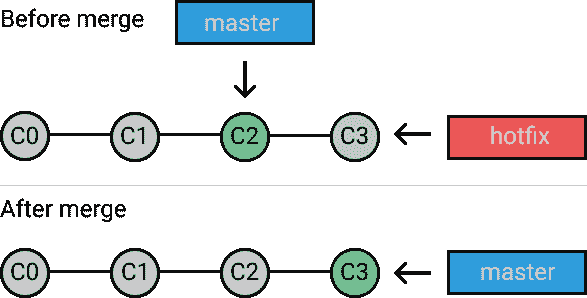
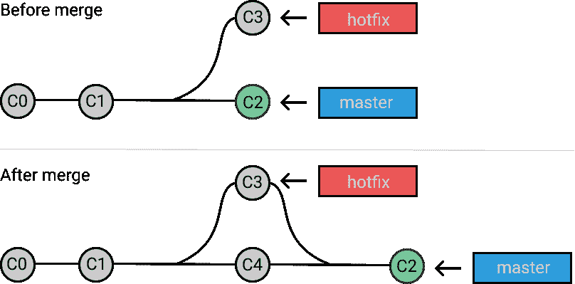

# Git Merge 如何使用 Git Merge【正确的方法】

> 原文：<https://dev.to/neshaz/how-to-use-git-merge-the-correctway-25pd>

将**特性**隔离到不同的分支对于任何严肃的开发者来说都是至关重要的实践。通过分离每个特性、错误修正或工作实验，你将*避免许多问题*并且*保持你的开发分支干净*。

在某个时候，一段代码会达到一种状态，在这种状态下，您会希望将它与项目的其余部分集成在一起。这就是 **git merge** 命令的用武之地。

## 准备合并

让我们假设您想要将 **分支修复程序**合并到您的**主分支**中。

在开始之前，如何确保你已经准备好合并你的更改？

1.  使用`git fetch`检查您的本地存储库是否与来自远程服务器的最新变更保持一致。
2.  一旦获取完成`git checkout master`。
3.  通过执行`git pull`，确保主分支拥有最新的更新。
4.  签出到应该接收变更的分支，在我们的例子中是 master。

## 合并

一旦**准备**完成，你就可以用`git merge hotfix`命令开始合并。

### 快进合并

当在您想要合并的[分支](https://kolosek.com/git-branches/)之间有一条线性路径时，就会发生**快速向前合并**。如果主服务器还没有**分叉**，它不会创建新的提交，而是将主服务器指向热修复分支的最新提交。来自 hotfix 分支的所有提交现在在 master 中可用。

[T2】](https://res.cloudinary.com/practicaldev/image/fetch/s--HONWfz3J--/c_limit%2Cf_auto%2Cfl_progressive%2Cq_auto%2Cw_880/https://storage.kraken.io/kk8yWPxzXVfBD3654oMN/f16f8fab3708f8cc7a3c05ffe237d87d/git-merge-fast-forward.png)

然而，如果分支已经分叉，则 **[快进合并](https://sandofsky.cimg/fast_forward.pdf)** 是不可能的。在这种情况下，你要使用一个**三路合并**。

### 三路合并

当没有到目标分支的线性路径时，Git 别无选择，只能通过**三向合并**来组合它们。这种合并使用额外的提交将两个分支联系在一起。

[T2】](https://res.cloudinary.com/practicaldev/image/fetch/s--JFcDtV-y--/c_limit%2Cf_auto%2Cfl_progressive%2Cq_auto%2Cw_880/https://storage.kraken.io/kk8yWPxzXVfBD3654oMN/05519eb0e9dfe087a82f55caa32d54d5/git-merge-three-way-merge.png)

> 测试一下！用一个 [RSpec 测试](https://kolosek.com/rails-rspec-setup/)分支创建你自己的项目，同时在 master 中编辑[控制器测试](https://kolosek.com/rspec-controller-test/)。现在，试着合并。

## 如何处理合并冲突

当你试图合并的两个分支都改变了同一个文件的同一个部分时，就会发生合并冲突，Git 将无法决定使用哪个版本。

例如，如果文件`example.rb`是在同一个 Git 存储库的不同分支的相同行上编辑的，或者如果该文件被删除，当您试图合并这些分支时，您将得到一个**合并冲突错误**。在继续之前，合并冲突必须用一个**新提交**来解决。

*[合并冲突](https://git-scm.com/book/en/v2/Git-Branching-Basic-Branching-and-Merging)只会发生在三路合并的情况下。*

1.  **生成需要解析的文件列表**:`git status`

```
# On branch master
# You have unmerged paths.
#   (fix conflicts and run "git commit")
# Unmerged paths:
#   (use "git add ..." to mark resolution)
# both modified: example.rb
# no changes added to commit (use "git add" and/or "git commit -a") 
```

1.  当遇到**冲突行**时，Git 将使用**可视指示器**编辑受影响文件的内容，这些指示器标记冲突内容的两边。这些视觉标记是:
    *   `<<<<<<<` - **冲突标记**，冲突从这条线之后开始。
    *   `=======` - **将**你的变化与其他分支的变化区分开来。
    *   `>>>>>>>` -冲突行的结尾。

```
<<<<<<< HEAD(master)
conflicted text from HEAD(master)
=======
conflicted text from hotfix
>>>>>>> hotfix 
```

1.  决定你是想让**只保留**你的补丁或者主版本，还是写一个**全新的**代码。请在合并更改之前删除冲突标记。
2.  当你准备好合并时，你所要做的就是在冲突的文件上运行`git add` [命令](https://kolosek.com/git-commands-tutorial-part2/)来告诉 Git 它们已经解决了。
3.  用`git commit`提交您的更改以生成合并提交。

希望这能帮助你更好地理解如何合并你的分支和处理冲突。

本文原载于 [Kolosek 博客](https://kolosek.com/git-merge/?utm_source=dvt)。