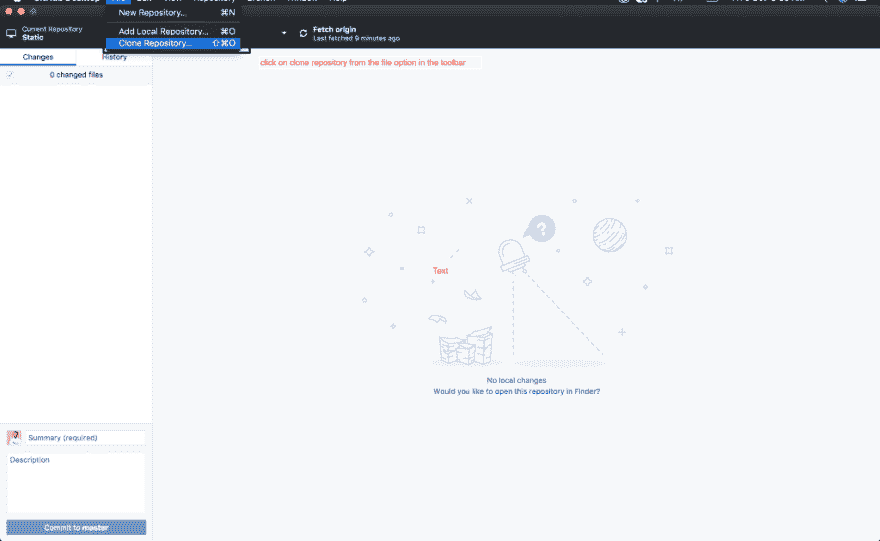

# 如何配合 Gitlab 使用 Github 桌面

> 原文：<https://dev.to/sheddy_nathan/how-to-use-github-desktop-with-gitlab-2o0n>

<figure> 

<figcaption>图像 src = " [Techefeed](https://www.techefeed.com/internet/get-started-github-desktop/) "</figcaption>

</figure>

GitHub Desktop 是从 Windows 和 OS X 为项目做贡献的一种快速而简单的方式，无论您是经验丰富的用户还是新用户，GitHub Desktop 旨在简化您的 GitHub 中的所有流程和工作流。GitHub Desktop 是一款开源的基于电子的 GitHub 应用。它是用 TypeScript 编写的，使用 React。

> 来源:[https://www . tech efeed . com/internet/get-started-github-desktop/](https://www.techefeed.com/internet/get-started-github-desktop/)

它有许多令人惊叹的功能，例如:

1.  轻松地将提交归因于合作者

2.  签出具有拉式请求的分支并查看配置项状态

3.  语法突出显示差异

4.  扩展的图像差异支持

5.  广泛的编辑器和外壳集成

6.  这是开源的

我个人更喜欢使用 Github Desktop 作为我的主要 git 客户端，而不是源码树或 Gitkraken。

上周，我工作的[公司](https://legalrobot.com)决定将其所有代码库从 Github 转移到 [Gitlab](https://gitlab.com) 。原因是 Gitlab 具有开箱即用的功能，如内置在系统中的集成 DevOps，不像 Github 那样需要自己完成所有这些工作。

在 gitlab 之前，我们使用了 5 种不同的工具，集成它们的复杂性已经失控，而且非常昂贵，试图将 New Relic、Codeship、Github、Jenkins、Chef 和 Terraform 结合在一起一点也不好玩……更不用说数字海洋、AWS、Azure 和 MongoDB 云了

我已经习惯了 GitHub 的环境，因为这是我一直工作的地方，但我认为这是一个适应新环境的挑战。

我已经准备好迁移到 Gitlab 但是我还没有准备好离开 GitHub Desktop，所以我决定使用 Gitlab 和 GitHub Desktop。我开始研究如何使用它们，然后我的老板给了我一个非常有用的资源，见下面的链接:

> [https://community . reclaim hosting . com/t/using-github-desktop-with-git lab/876](https://community.reclaimhosting.com/t/using-github-desktop-with-gitlab/876)

它帮助很大，但它缺少一个重要的步骤，即如何使用 GitHub Desktop 和启用了 2FA(双因素认证)的 Gitlab Repo。

所以让我们从头回顾一下这些步骤，然后我会加入至关重要的一步。

> 免责声明:这些步骤仅对 GitHub 桌面原生用户有效

**第一步:**

一、下载 GitHub 桌面[这里](https://desktop.github.com)

二。去你的 Gitlab repo

三。点击设置

<figure> 

<figcaption>带圈设置</figcaption>

</figure>

**第二步:**

我们现在要做的是为 GitHub 桌面生成一个访问令牌。

点击设置后

I .点击访问令牌

[T2】](https://res.cloudinary.com/practicaldev/image/fetch/s--WvsvC3Ux--/c_limit%2Cf_auto%2Cfl_progressive%2Cq_auto%2Cw_880/https://cdn-images-1.medium.com/max/1024/1%2AXMmRvjhDqy0XXygAJnlpTg.png)

二。生成访问令牌

[T2】](https://res.cloudinary.com/practicaldev/image/fetch/s--NtfeJVkk--/c_limit%2Cf_auto%2Cfl_progressive%2Cq_auto%2Cw_880/https://cdn-images-1.medium.com/max/1024/1%2Adddg6tBT8yqSPURwiPcqsA.png)

三。复制您的新访问令牌并将其保存在某个地方，因为我们稍后会用到它:

[T2】](https://res.cloudinary.com/practicaldev/image/fetch/s--NklqXEiW--/c_limit%2Cf_auto%2Cfl_progressive%2Cq_auto%2Cw_880/https://cdn-images-1.medium.com/max/1024/1%2AYglJK_c8xxKTwBzvj_-q_w.png)

**第三步:**

I .转到您的存储库，选择 https 并复制链接，

[T2】](https://res.cloudinary.com/practicaldev/image/fetch/s--l1TD5B0N--/c_limit%2Cf_auto%2Cfl_progressive%2Cq_auto%2Cw_880/https://cdn-images-1.medium.com/max/1024/1%2ACCSybMcpqoSO2yEzEWVXDA.png)

二。从文件栏打开 GitHub 桌面，选择克隆存储库

[T2】](https://res.cloudinary.com/practicaldev/image/fetch/s--yQulPnvj--/c_limit%2Cf_auto%2Cfl_progressive%2Cq_auto%2Cw_880/https://cdn-images-1.medium.com/max/1024/1%2Am9ca14FUXJJoTCfy-xN6sg.png)

三。选择它后，会弹出一个模式，选择 URL，将我们从 gitlab 复制的 https 链接放在 URL 字段中，并选择目标文件夹。

[T2】](https://res.cloudinary.com/practicaldev/image/fetch/s--IY8ZFoHC--/c_limit%2Cf_auto%2Cfl_progressive%2Cq_auto%2Cw_880/https://cdn-images-1.medium.com/max/1024/1%2A5Hs2sv0w9MHwhk8ozqp5TQ.png)

四。填写完所有这些字段后，选择 clone

动词 （verb 的缩写）在克隆时，它会弹出一个名为*认证失败，*的模式，然后你会被要求输入你的用户名和密码。

**不适用:**您的用户名主要是您的电子邮件地址或您用于访问 gitlab 组织或回购的任何用户名。

不及物动词那么您的密码将是我们之前创建的个人访问令牌，所以请到您可能存储它的地方粘贴它。

七。之后，点击登录或认证，如果一切顺利，你应该会看到这样的东西

<figure> 

<figcaption>【克隆(你的项目回购名称)</figcaption>

</figure>

之后，你会看到这个

[T2】](https://res.cloudinary.com/practicaldev/image/fetch/s--reJlyJcA--/c_limit%2Cf_auto%2Cfl_progressive%2Cq_auto%2Cw_880/https://cdn-images-1.medium.com/max/1024/1%2AQLnUBwAQtYyuwUNuG7S_3w.png)

然后，您可以从原点获取，查看所有分支，并将其用作您的首选 git 客户端。

**以上就是 GitHub 桌面如何使用 Gitlab。**

如果你有任何问题或者你不明白任何步骤，请随时在 twitter 上联系我，或者在评论区提出你的问题。

谢谢！！！