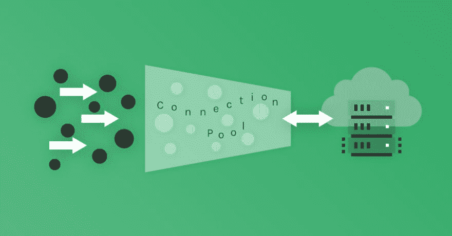
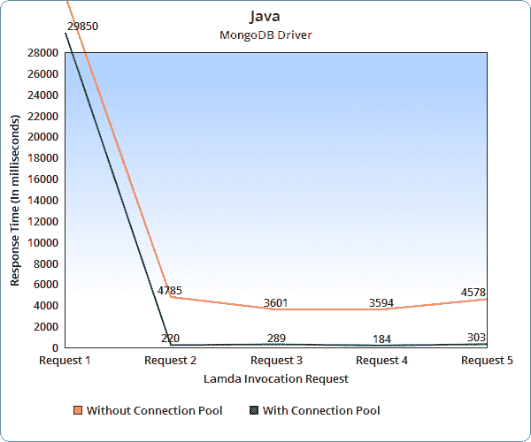
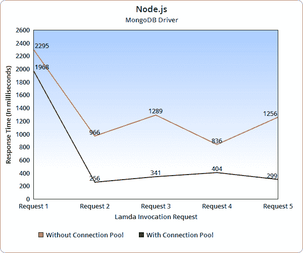

# 如何在 AWS Lambda 上使用 MongoDB 连接池

> 原文：<https://dev.to/scalegrid/how-to-use-mongodb-connection-pooling-on-aws-lambda-43h6>

[T2】](https://scalegrid.io/blog/how-to-use-mongodb-connection-pooling-on-aws-lambda/?utm_campaign=Blog%20-%20How%20to%20Use%20MongoDB%20Connection%20Pooling%20on%20AWS%20Lambda&utm_source=Dev.to%20-%20MongoDB%20Connection%20Pooling%20Blog&utm_medium=Dev.to%20-%20MongoDB%20Connection%20Pooling%20Blog&utm_term=Dev.to%20-%20MongoDB%20Connection%20Pooling%20Blog&utm_content=Dev.to%20-%20MongoDB%20Connection%20Pooling%20Blog)

在本文中，我们将向您展示如何使用 Node.js 和 Java 驱动程序在 AWS Lambda 上使用 MongoDB 连接池。

## 什么是 AWS Lambda？

**[AWSλ](https://aws.amazon.com/lambda/)**是由 **[亚马逊 Web 服务](https://aws.amazon.com/)** 提供的事件驱动的无服务器计算服务。它允许用户在没有任何管理任务的情况下运行代码，不像 **[EC2 实例](https://aws.amazon.com/ec2/)** 那样，用户负责供应服务器、扩展、高可用性等。相反，您只需上传代码并设置事件触发器，AWS Lambda 会自动处理所有其他事情。

AWS Lambda 支持多种运行时，包括**[node . js](https://nodejs.org/en/)**，**[Python](https://www.python.org/)**，**[Java](https://java.com/en/)**，以及**[Go](https://golang.org/)**。可以由 AWS 服务直接触发，如**[【S3】](https://aws.amazon.com/s3/)****[DynamoDB](https://aws.amazon.com/dynamodb/)****[Kinesis](https://aws.amazon.com/kinesis/)****[SNS](https://aws.amazon.com/sns/)**在我们的例子中，我们使用 AWS API 网关来触发 Lambda 函数。

## 什么是连接池？

打开和关闭数据库连接是一项开销很大的操作，因为它涉及到 CPU 时间和内存。如果应用程序需要为每个操作打开一个数据库连接，那么这将对性能产生严重影响。

如果我们有一堆在缓存中保持活动的数据库连接会怎么样？每当应用程序需要执行数据库操作时，它可以从缓存中借用一个连接，执行所需的操作，然后将连接交还给缓存。通过使用这种方法，我们可以节省每次建立新连接所需的时间，并重用这些连接。这种缓存被称为 **[连接池](https://en.wikipedia.org/wiki/Connection_pool)** 。

在大多数 MongoDB 驱动程序中，连接池的大小是可配置的，默认的池大小因驱动程序而异。例如，在 Node.js 驱动程序中是 5，而在 Java 驱动程序中是 100。连接池的大小决定了驱动程序在给定时间可以处理的最大并行请求数。如果达到连接池的限制，任何新的请求都将等待，直到现有的请求完成。因此，需要仔细选择池的大小，考虑要实现的应用程序负载和并发性。

## AWS Lambda 中的 MongoDB 连接池

在本文中，我们将向您展示涉及 Node.js 和用于 MongoDB 的 Java 驱动程序的示例。对于本教程，我们使用托管在 ScaleGrid 上的 MongoDB，使用 AWS EC2 实例。设置只需要不到 5 分钟，在这里就可以 **[创建免费 30 天试用](https://console.scalegrid.io/users/register)** 开始使用。

### Java 驱动程序 MongoDB 连接池

下面是在 AWS Lambda 处理函数中使用 Java 驱动程序启用 MongoDB 连接池的代码:

```
 public class LambdaFunctionHandler
        implements RequestHandler<APIGatewayProxyRequestEvent, APIGatewayProxyResponseEvent> {

    private MongoClient sgMongoClient;
    private String sgMongoClusterURI;
    private String sgMongoDbName;

    @Override
    public APIGatewayProxyResponseEvent handleRequest(APIGatewayProxyRequestEvent input, Context context) {
        APIGatewayProxyResponseEvent response = new APIGatewayProxyResponseEvent();
        response.setStatusCode(200);

        try {
            context.getLogger().log("Input: " + new Gson().toJson(input));
            init(context);
            String body = getLastAlert(input, context);
            context.getLogger().log("Result body: " + body);
            response.setBody(body);
        } catch (Exception e) {
            response.setBody(e.getLocalizedMessage());
            response.setStatusCode(500);
        }

        return response;
    }

    private MongoDatabase getDbConnection(String dbName, Context context) {
        if (sgMongoClient == null) {
            context.getLogger().log("Initializing new connection");
            MongoClientOptions.Builder destDboptions = MongoClientOptions.builder();
            destDboptions.socketKeepAlive(true);
            sgMongoClient = new MongoClient(new MongoClientURI(sgMongoClusterURI, destDboptions));
            return sgMongoClient.getDatabase(dbName);
        }
        context.getLogger().log("Reusing existing connection");
        return sgMongoClient.getDatabase(dbName);
    }

    private String getLastAlert(APIGatewayProxyRequestEvent input, Context context) {
        String userId = input.getPathParameters().get("userId");
        MongoDatabase db = getDbConnection(sgMongoDbName, context);
        MongoCollection coll = db.getCollection("useralerts");
        Bson query = new Document("userId", Integer.parseInt(userId));
        Object result = coll.find(query).sort(Sorts.descending("$natural")).limit(1).first();
        context.getLogger().log("Result: " + result);
        return new Gson().toJson(result);
    }

    private void init(Context context) {
        sgMongoClusterURI = System.getenv("SCALEGRID_MONGO_CLUSTER_URI");
        sgMongoDbName = System.getenv("SCALEGRID_MONGO_DB_NAME");
    }

} 

```

这里，连接池是通过在处理函数外部声明一个 **sgMongoClient** 变量来实现的。只要重复使用同一个容器，在处理程序方法之外声明的变量在调用之间保持初始化。对于 AWS Lambda 支持的任何其他编程语言都是如此。

### Node.js 驱动程序 MongoDB 连接池

对于 Node.js 驱动程序，在全局范围内声明连接变量也可以达到同样的效果。但是，有一个特殊的设置，没有它连接池是不可能的。该参数是属于 Lambda 的上下文对象的 callbackWaitsForEmptyEventLoop。将此属性设置为 false 将使 AWS Lambda 冻结进程和任何状态数据。这是在回调被调用后不久完成的，即使事件循环中有事件。

下面是在 AWS Lambda 处理函数中使用 Node.js 驱动程序启用 MongoDB 连接池的代码:

```
 'use strict'

var MongoClient = require('mongodb').MongoClient;

let mongoDbConnectionPool = null;
let scalegridMongoURI = null;
let scalegridMongoDbName = null;

exports.handler = (event, context, callback) => {

    console.log('Received event:', JSON.stringify(event));
    console.log('remaining time =', context.getRemainingTimeInMillis());
    console.log('functionName =', context.functionName);
    console.log('AWSrequestID =', context.awsRequestId);
    console.log('logGroupName =', context.logGroupName);
    console.log('logStreamName =', context.logStreamName);
    console.log('clientContext =', context.clientContext);
 **// This freezes node event loop when callback is invoked
    context.callbackWaitsForEmptyEventLoop = false;** 
    var mongoURIFromEnv = process.env['SCALEGRID_MONGO_CLUSTER_URI'];
    var mongoDbNameFromEnv = process.env['SCALEGRID_MONGO_DB_NAME'];
    if(!scalegridMongoURI) {
    if(mongoURIFromEnv){
        scalegridMongoURI = mongoURIFromEnv;
    } else {
        var errMsg = 'Scalegrid MongoDB cluster URI is not specified.';
        console.log(errMsg);
        var errResponse = prepareResponse(null, errMsg);
        return callback(errResponse);
    }           
    }

    if(!scalegridMongoDbName) {
    if(mongoDbNameFromEnv) {
                scalegridMongoDbName = mongoDbNameFromEnv;
    } else {
        var errMsg = 'Scalegrid MongoDB name not specified.';
        console.log(errMsg);
        var errResponse = prepareResponse(null, errMsg);
        return callback(errResponse);
    }
    }

    handleEvent(event, context, callback);
};

function getMongoDbConnection(uri) {

    if (mongoDbConnectionPool && mongoDbConnectionPool.isConnected(scalegridMongoDbName)) {
        console.log('Reusing the connection from pool');
        return Promise.resolve(mongoDbConnectionPool.db(scalegridMongoDbName));
    }

    console.log('Init the new connection pool');
    return MongoClient.connect(uri, { poolSize: 10 })
        .then(dbConnPool => { 
                            mongoDbConnectionPool = dbConnPool; 
                            return mongoDbConnectionPool.db(scalegridMongoDbName); 
                          });
}

function handleEvent(event, context, callback) {
    getMongoDbConnection(scalegridMongoURI)
        .then(dbConn => {
            console.log('retrieving userId from event.pathParameters');
            var userId = event.pathParameters.userId;
            getAlertForUser(dbConn, userId, context);
        })
        .then(response => {
            console.log('getAlertForUser response: ', response);
            callback(null, response);
        })
        .catch(err => {
            console.log('=> an error occurred: ', err);
            callback(prepareResponse(null, err));
        });
}

function getAlertForUser(dbConn, userId, context) {

    return dbConn.collection('useralerts').find({'userId': userId}).sort({$natural:1}).limit(1)
        .toArray()
        .then(docs => { return prepareResponse(docs, null);})
        .catch(err => { return prepareResponse(null, err); });
}

function prepareResponse(result, err) {
    if(err) {
        return { statusCode:500, body: err };
    } else {
        return { statusCode:200, body: result };
    }
} 

```

## AWS Lambda 连接池分析和观察

为了验证使用连接池的性能和优化，我们对 Java 和 Node.js Lambda 函数进行了一些测试。使用 AWS API 网关作为触发器，我们以每次迭代 50 个请求的突发调用函数，并确定每次迭代中请求的平均响应时间。对 Lambda 函数重复了这个测试，最初不使用连接池，后来使用连接池。

[T2】](https://scalegrid.io/blog/how-to-use-mongodb-connection-pooling-on-aws-lambda/?utm_campaign=Blog%20-%20How%20to%20Use%20MongoDB%20Connection%20Pooling%20on%20AWS%20Lambda&utm_source=Dev.to%20-%20MongoDB%20Connection%20Pooling%20Blog&utm_medium=Dev.to%20-%20MongoDB%20Connection%20Pooling%20Blog&utm_term=Dev.to%20-%20MongoDB%20Connection%20Pooling%20Blog&utm_content=Dev.to%20-%20MongoDB%20Connection%20Pooling%20Blog)

[T2】](https://scalegrid.io/blog/how-to-use-mongodb-connection-pooling-on-aws-lambda/?utm_campaign=Blog%20-%20How%20to%20Use%20MongoDB%20Connection%20Pooling%20on%20AWS%20Lambda&utm_source=Dev.to%20-%20MongoDB%20Connection%20Pooling%20Blog&utm_medium=Dev.to%20-%20MongoDB%20Connection%20Pooling%20Blog&utm_term=Dev.to%20-%20MongoDB%20Connection%20Pooling%20Blog&utm_content=Dev.to%20-%20MongoDB%20Connection%20Pooling%20Blog)

上面的图表显示了每次迭代中请求的平均响应时间。您可以在这里看到使用连接池执行数据库操作时响应时间的差异。使用连接池的响应时间要低得多，因为连接池只初始化一次并重用连接，而不是为每个数据库操作打开和关闭连接。

Java 和 Node.js Lambda 函数之间唯一显著的区别是冷启动时间。

### 什么是冷启动时间？

冷启动时间是指 AWS Lambda 函数初始化所用的时间。当 Lambda 函数收到第一个请求时，它将初始化容器和所需的流程环境。在上面的图表中，请求 1 的响应时间包括冷启动时间，根据用于 AWS Lambda 功能的编程语言，该时间有很大的不同。

### 我需要担心冷启动时间吗？

如果您使用 AWS API 网关作为 Lambda 函数的触发器，那么您必须考虑冷启动时间。如果 AWS Lambda 集成函数没有在给定的时间范围内初始化，API 网关响应将出错。API 网关集成超时范围从 50 毫秒到 29 秒。

在 Java AWS Lambda 函数的图表中，您可以看到第一个请求花费了超过 29 秒，因此，API 网关响应出错。与其他支持的编程语言相比，使用 Java 编写的 AWS Lambda 函数的冷启动时间更长。为了解决这些冷启动时间问题，您可以在实际调用之前触发一个初始化请求。另一种方法是在客户端重试。这样，如果请求由于冷启动时间而失败，重试将会成功。

### AWS Lambda 函数在不活动期间会发生什么？

在我们的测试中，我们还观察到 AWS Lambda 托管容器在一段时间不活动时会被停止。这一间隔从 7 分钟到 20 分钟不等。因此，如果您的 Lambda 函数不经常使用，那么您需要考虑通过触发心跳请求或在客户端增加重试次数来保持它们的活性。

### 当我同时调用 Lambda 函数时会发生什么？

如果 Lambda 函数被并发调用，那么 Lambda 将使用许多容器来服务请求。默认情况下，AWS Lambda 提供 1000 个请求的无保留并发，并且可以针对给定的 Lambda 函数进行配置。

这是您需要注意连接池大小的地方，因为并发请求可能会打开太多的连接。因此，您必须保持连接池大小对于您的函数来说是最佳的。但是，一旦容器被停止，就会根据 MongoDB 服务器的超时释放连接。

## AWS Lambda 连接池结论

Lambda 函数是无状态和异步的，通过使用数据库连接池，您将能够向它添加状态。然而，这只会在容器被重用时有所帮助，让您节省大量时间。使用 AWS EC2 的连接池更容易管理，因为单个实例可以毫无问题地跟踪其连接池的状态。因此，使用 AWS EC2 大大降低了数据库连接耗尽的风险。AWS Lambda 被设计为当它可以直接访问 API 而不必连接到数据库引擎时工作得更好。

T5】！【若 LTE IE 8】>

[T3】//&lt；！[CDATA[<br>hbspt . CTA . load(3848622，&# 39；EEC 15 eab-7aa 3-4664-9347-cebd 196 D8 ed 4&# 39；, {});<br>//]]&gt；<！-结束 HubSpot 行动号召代码- >](https://cta-redirect.hubspot.com/cta/redirect/3848622/eec15eab-7aa3-4664-9347-cebd196d8ed4)