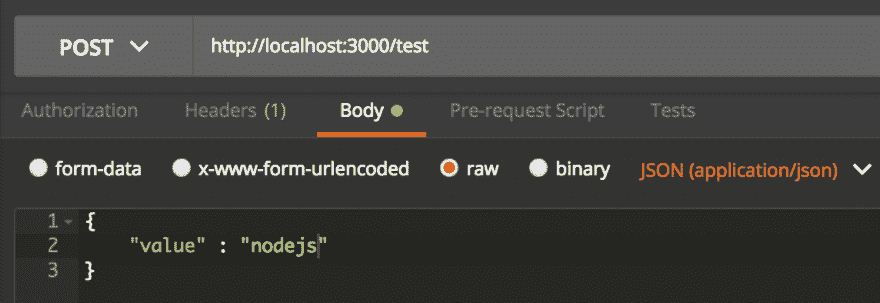

# 没有框架和外部库如何使用 NodeJS

> 原文：<https://dev.to/adityasridhar/how-to-use-nodejs-without-frameworks-and-external-libraries-5fn2>

**本帖原载于[adityasridhar.com](https://adityasridhar.com/posts/how-to-use-nodejs-without-frameworks-and-external-libraries)T3】**

NodeJS 最常用于 Express framework。NodeJS 还使用了许多其他外部库。

这些框架和库与 NodeJS 一起使用的原因是为了使开发更加容易和快速。

在进行任何实际项目时，最好在需要的地方使用框架和库，以实现更快的开发😄

也就是说，在这篇文章中，我将展示如何在不使用 express framework 或任何其他外部库的情况下用 NodeJS 构建简单的 REST API。本文将只使用 NodeJS 本身提供的那些功能。

这样做的原因是为了展示如何在没有框架和库的情况下使用 NodeJS😄。这也将给出一个关于 NodeJS 如何工作的更好的想法😄

# 先决条件

从[https://nodejs.org](https://nodejs.org)安装节点

# 代码

这篇文章的代码可以在我的 [github repo](https://github.com/aditya-sridhar/simple-rest-apis-nodejs-without-frameworks) 中找到。

# 让我们从代码开始😄

创建一个名为**simple-rest-APIs-nodejs-without-frameworks**的文件夹。这将是我们的 NodeJS 项目文件夹。

进入项目文件夹，使用`npm init`使项目成为节点项目。执行此操作的命令是

```
cd simple-rest-apis-nodejs-without-frameworks
npm init 
```

# package.json

运行`npm init`之后，在项目文件夹中创建了一个 **package.json** 文件。

json 有关于你的项目的信息，比如项目名称，版本，描述等等。另外，package.json 是您添加节点依赖项的地方。在本文中，我们不会有任何依赖，因为我们只使用 NodeJS 本身提供的功能。

# 第一个 API

## server.js

在项目文件夹中创建一个名为 **server.js** 的文件。这将是我们应用程序的起点。

将以下代码复制到 server.js

```
const hostname = '127.0.0.1';
const port = 3000;

const server = require('./controller.js');

server.listen(port, hostname, () => {
    console.log(`Server running at http://${hostname}:${port}/`);
}); 
```

这段代码实际上依赖于一个名为 **controller.js** 的文件，我们很快就会添加这个文件。
这段代码告诉服务器需要监听**端口 3000** 和**本地主机**

服务器创建在 **controller.js** 中完成

## controller.js

这是我们将在其中创建服务器和定义 rest 端点的文件。创建一个名为 **controller.js** 的文件

让我们先在 **controller.js**
中创建一个 GET 端点

```
const http = require('http');
const url = require('url');

module.exports = http.createServer((req, res) => {

    var service = require('./service.js');
    const reqUrl = url.parse(req.url, true);

    // GET Endpoint
    if (reqUrl.pathname == '/sample' && req.method === 'GET') {
        console.log('Request Type:' +
            req.method + ' Endpoint: ' +
            reqUrl.pathname);

        service.sampleRequest(req, res);
    } 
}); 
```

首先导入 **http** 和 **url** 模块。这些模块都是 NodeJS 自己提供的。

http 模块能够创建 web 应用程序。它支持客户端和服务器操作。

**url** 模块帮助解析 url

行`http.createServer((req, res) => {`表示需要创建一个 http 服务器，其中**请求作为 req，响应作为 res**

**module.exports** 用于将该文件导出为一个模块。这就是为什么我们可以使用`const server = require('./controller.js');`在 **server.js** 中导入 **controller.js**

可以看出，这个文件需要 **service.js** 这个我们后面会讲到。

代码`const reqUrl = url.parse(req.url, true);`获取请求 url 并解析它，以便我们可以在其上运行一些 url 函数。

我们要创建的第一个端点是一个端点 url 为 **/sample** 的 **GET** 端点

为了进行 url 路由，如果 else 条件为，我们将使用

 **行`if (reqUrl.pathname == '/sample' && req.method === 'GET') {`检查被请求的 url 是否是 **/sample** ，还检查请求类型是否是 **GET**

这个 get 请求的逻辑存在于 **service.sampleRequest(req，res)中；**是在 **service.js** 中定义的功能

## service.js

这是实际的 api 逻辑将出现的地方。创建一个名为 **service.js** 的文件。

将下面的代码复制到 **service.js**

```
const url = require('url');

exports.sampleRequest = function (req, res) {
    const reqUrl = url.parse(req.url, true);
    var name = 'World';
    if (reqUrl.query.name) {
        name = reqUrl.query.name
    }

    var response = {
        "text": "Hello " + name
    };

    res.statusCode = 200;
    res.setHeader('Content-Type', 'application/json');
    res.end(JSON.stringify(response));
}; 
```

这段代码检查请求 URL 是否有一个名为 **name** 的查询参数，并将其存储在 name 变量中。如果没有查询参数，则默认为字符串**世界**

响应状态设置为 **200** ，响应内容类型为 **JSON** ，最后使用`res.end(JSON.stringify(response));`返回响应

由于**响应变量**是一个 JSON 对象，我们在发回 http 响应之前，对它使用 **JSON.stringify** 将其转换成字符串

现在我们可以使用命令
运行应用程序

```
node server.js 
```

## 测试

为了测试端点，使用 **postman** 。你可以从[这里](https://www.getpostman.com/)下载

在 postman 中选择 Get request 并键入 url 作为**[http://localhost:3000/sample？](http://localhost:3000/sample?name=aditya)name = aditya**并点击发送

[T2】](https://res.cloudinary.com/practicaldev/image/fetch/s--ud5WuKPb--/c_limit%2Cf_auto%2Cfl_progressive%2Cq_auto%2Cw_880/https://thepracticaldev.s3.amazonaws.com/i/bt3itvkuqu5tt85zlgdm.jpg)

该请求的输出如下所示

```
{
    "text": "Hello aditya"
} 
```

现在输入网址为**[http://localhost:3000/sample](http://localhost:3000/sample)**并点击发送

该请求的输出如下所示

```
{
    "text": "Hello World"
} 
```

# 第二个 API

在本节中，我们将构建第二个 API，它是一个 **POST** 请求。此外，如果用户点击一些随机的网址，我们将需要指出这是一个无效的路线。我们将在这里添加逻辑。

## controller.js

将 **controller.js** 中的代码更新为如下所示的代码

```
const http = require('http');
const url = require('url');

module.exports = http.createServer((req, res) => {

    var service = require('./service.js');
    const reqUrl = url.parse(req.url, true);

    // GET Endpoint
    if (reqUrl.pathname == '/sample' && req.method === 'GET') {
        console.log('Request Type:' +
            req.method + ' Endpoint: ' +
            reqUrl.pathname);

        service.sampleRequest(req, res);

        // POST Endpoint
    } else if (reqUrl.pathname == '/test' && req.method === 'POST') {
        console.log('Request Type:' +
            req.method + ' Endpoint: ' +
            reqUrl.pathname);

        service.testRequest(req, res);

    } else {
        console.log('Request Type:' +
            req.method + ' Invalid Endpoint: ' +
            reqUrl.pathname);

        service.invalidRequest(req, res);

    }
}); 
```

post 端点将拥有 url **/test** 。这段代码有一个条件来检查**/测试**端点。
用于**/测试**端点的逻辑将在 **service.testRequest(req，res)中；**哪个在 **service.js**

该代码还有一个针对无效路由的 else 条件。无效路由的逻辑在 **service.invalidRequest(req，res)中处理；**

## service.js

将下面这段代码添加到 **service.js** 中。不要删除 service.js 中的现有代码，请将此代码添加到现有代码的下方。

```
exports.testRequest = function (req, res) {
    body = '';

    req.on('data', function (chunk) {
        body += chunk;
    });

    req.on('end', function () {

        postBody = JSON.parse(body);

        var response = {
            "text": "Post Request Value is " + postBody.value
        };

        res.statusCode = 200;
        res.setHeader('Content-Type', 'application/json');
        res.end(JSON.stringify(response));
    });
}; 
```

对于 POST 请求，调用端点时会给出一个输入 POST 主体。

在代码中，我们需要从请求中获取 POST 主体。

下面的代码做了这个

```
req.on('data', function (chunk) {
    body += chunk;
}); 
```

该请求以**流**的形式出现。这段代码获取数据流，并不断将其附加到**主体**。

只有在流式传输完成并且收到完整的 **post 主体**后，才会执行`req.on('end', function () {`。

这段代码将输入的 post 主体转换成 JSON 格式，这样我们就可以使用其中的值。

在代码中，我们使用了**正文**中的**值**字段。

响应的设置类似于我们对 GET 请求的设置。

## 无效请求的逻辑

将下面这段代码添加到 **service.js** 中。不要删除 service.js 中的现有代码，请将此代码添加到现有代码的下方。

```
exports.invalidRequest = function (req, res) {
    res.statusCode = 404;
    res.setHeader('Content-Type', 'text/plain');
    res.end('Invalid Request');
}; 
```

对于无效请求，状态被设置为 **404** ，内容类型被设置为**文本**。实际发回的内容是**无效请求**

## 测试

去找邮递员。选择请求类型为 **POST** 并键入以下 URL**T3】http://localhost:3000/testT5。**

[T2】](https://res.cloudinary.com/practicaldev/image/fetch/s--Ul9FQ868--/c_limit%2Cf_auto%2Cfl_progressive%2Cq_auto%2Cw_880/https://thepracticaldev.s3.amazonaws.com/i/42ddmr7pqn70e6eeav1n.jpg)

同时选择**体**、 **raw** 和**应用/json** ，如图所示

输入贴体如下

```
{
    "value" : "nodejs"
} 
```

点击邮递员发送

API 输出如下所示

```
{
    "text": "Post Request Value is  nodejs"
} 
```

您也可以尝试使用无效的请求。在 postman 中选择 **GET** 并输入 url 为**[http://localhost:3000/test 123](http://localhost:3000/test123)**

对此的响应将是**无效文本**

# 恭喜恭喜😄

您现在知道了如何在 NodeJS 中创建 REST API，而无需使用任何框架或外部库😄

**在实际项目中，尽可能使用框架或库来使开发周期变得更容易和更快**

### 欢迎在 [LinkedIn](https://www.linkedin.com/in/aditya1811/) 与我联系，或在 [twitter](https://twitter.com/adityasridhar18) 关注我。

### 如果你喜欢这个帖子，你可以去我的网站【https://adityasridhar.com T2】查看其他类似的帖子**