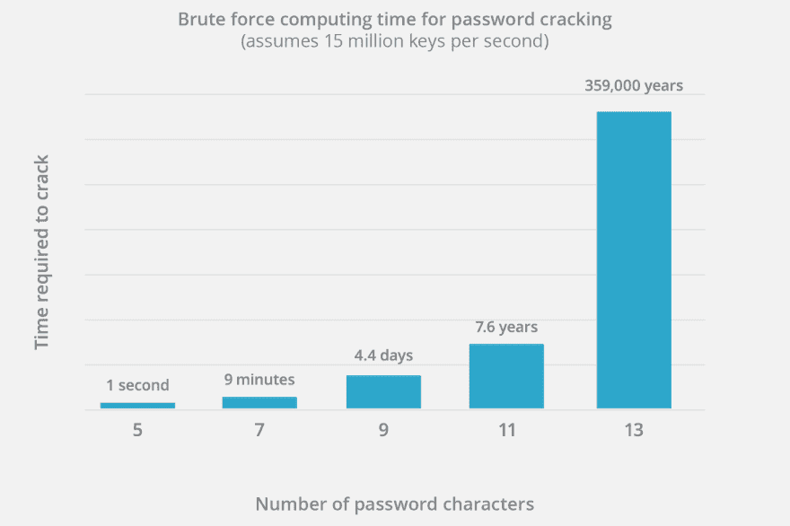

# 如何正确使用密码

> 原文：<https://dev.to/quantumsheep/how-to-use-passwords-properly-7j0>

密码有不同的用途:

*   “我的记忆力没那么好”(也叫“我不在乎了”的方法)，密码像`qwerty`或`123456`或字面上的`password`
*   使用社交信息的那个，例如:`199105Bob`
*   好的那些

说实在的，前两个根本不安全，一点也不安全。但是“好的那些”呢？嗯，他们就是我们正在谈论的。

可能有时候你会怀疑自己的密码是否足够安全，希望自己的账号不会被别人以任何方式冒用。首先，我们需要看看可以通过哪些攻击来找到您的密码。

# 蛮力攻击

这种方法是用来尝试每一种可能的方式找到你的密码。它没有被经常使用，因为它需要大量的时间和能量来实现，这取决于目标的密码长度。

密码越长，尝试各种可能性的时间就越长。

# 字典攻击

虽然暴力攻击会尝试每一个可能的字符，但安全研究人员找到了一种方法来逃避无用的尝试，并专注于常用的密码。

字典攻击使用预定义密码列表，而不是随机字符。甚至可以添加规则来匹配目标的信息，并删除可能无效的密码，如其出生日期、姓名等...这就是社会工程学。

为了防止这种方法，不要在你的密码中使用明显的个人信息，并且[检查它是否已经在数据库](https://haveibeenpwned.com/passwords)中。

# 您的网络浏览器保存的密码

也许你在使用互联网时使用了“记住我的密码”选项。虽然这个选项用起来很舒服，但是它一点也不安全。

网络浏览器对你的密码进行加密，但他们也对密码进行解密以填充密码输入，为了做到这一点，他们使用一个存储的密钥。那么为什么我们不能破译它们呢？嗯，我们可以，像 LaZagne 这样的工具就是证明，这就是为什么你不应该使用这个选项。

[T2】](https://res.cloudinary.com/practicaldev/image/fetch/s--n4YVjYOl--/c_limit%2Cf_auto%2Cfl_progressive%2Cq_auto%2Cw_880/https://thepracticaldev.s3.amazonaws.com/i/e9bjobtx6lybvuyajhjq.png)

# 方案

既然我已经告诉了您的密码是如何被破解的，那么我必须告诉您如何创建强密码，而这些强密码不会成为使用的灾难。

## 密码管理器

那些是帮助你管理密码的软件。它们的最佳用途是导出你的密码和一个文件(可以使用 [WarShield](https://dev.to/quantumsheep/protect-your-data-with-warshield-3n6i) 或其他东西以安全的方式传输)。

*   [Dashlane](https://www.dashlane.com/en) -非常受欢迎，并且自己主持
*   [金库](https://www.vaultproject.io/) -开源一号

你可以在网上找到很多密码管理器，也许你会找到符合你需求的。

## 易记强密码

你的账户的梦想，黑客的噩梦，可以肯定的是你可以记住句子。用我们大脑的能力来创造密码怎么样？

这种方法不需要随便一句话，只要尽量做出逻辑就可以了。我将创建约翰·莱蒙，一个住在伦敦阿比街 41 号的人，他的密码是`MniJL@Il41ab&`。我看见你，在你的屏幕后面，一张脸说“那是什么鬼？”，第一次使用这样的密码可能很难，但很容易记住。

这个句子是`My name is John Lemmon and I live at 41 Abbey Street`，符号(`&`)是一个随机字符，后面没有逻辑。

如你所见，创建一个非常强的密码是非常容易的，而且每次你需要记住它的时候都不用担心。

# 结论

今天，没有安全密码是没有任何借口的。

我认为学校应该有计算机安全意识，教育孩子们在数字世界中保护他们的数据。在未来的几年里，它将不断发展，越来越多的人正在学习安全，安全战争将永远不会结束。

保护您的数据安全。