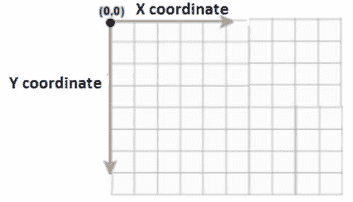
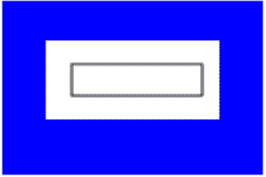

# 如何在 JavaScript 中使用 HTML5 Canvas 元素

> 原文：<https://dev.to/educationecosystem/how-to-use-the-html5-canvas-element-with-javascript-267n>

(本文原载于我的博客[此处](https://blog.liveedu.tv/how-to-use-the-html5-canvas-element-with-javascript/))。

在 HTML5 被引入 web 开发人员的世界之前，事情是没有生气的，不令人满意的，并且实现起来很复杂。例如，任何需要创建图形和动画的开发人员都被迫依赖像 Flash 插件或 Java 插件这样的工具——这是一件既麻烦又令人头晕的事情。

Nikitka 有超过七年的 web 开发经验，目前正在向人们传授他的技能，他说“强大的 HTML5 元素 Canvas 的出现扭转了局面，使开发人员能够完成以前难以完成的动作。”

## 什么是 HTML5 画布？

Canvas 是一个 HTML5 元素，它允许您使用无处不在的 JavaScript 编程语言轻松而强大地动态绘制图形。

**元素只作为图形的容器；因此，您应该使用 JavaScript 来呈现图形。**

 **您可以使用 Canvas 元素在 web 应用程序上实现各种目标，包括绘制图形、创建 HTML Canvas 动画、开发游戏或创建照片——所有这些都不依赖于其他外部工具。

令人惊讶的是，Canvas 作为一个 API 可用，并且它被大多数现代浏览器和平台所支持。此外，它是跨平台兼容的。因此，您可以一次创建一个应用程序，并将其部署到任何地方—在 PC 或移动设备上。

## 让我们来看一个画布标记代码

下面是 HTML5 Canvas 元素的一个简单标记:

```
<canvas width="320" height="160" id="canvasExample"></canvas> 
```

Enter fullscreen mode Exit fullscreen mode

在上面的代码中可以看到，Canvas 元素允许两个特定的属性:**宽度**和**高度**。如果您没有为这两个属性提供值，画布将采用其默认值 300 像素的宽度和 150 像素的高度。

**id** 属性用于标识 JavaScript 代码中的 Canvas 元素。此外，您可以包括其他 CSS 样式属性，以使画布绘制区域更具交互性和可见性，如填充、背景色或边框——就像任何其他 HTML 元素一样。

## 如何在画布上画画

要在画布上创建图形，首先需要使用文档对象模型(DOM)来定位它。

并且， **id** 属性将帮助您识别匹配的目标位置(在这个 HTML Canvas 示例中，id 是“Canvas example”)。

最初，元素是空白的。因此，为了展示某些东西，JavaScript 脚本应该在绘制之前获取渲染上下文。

Canvas 元素有一个内置的 DOM 方法，称为 **getContext** 。它是一个 JavaScript 函数，用于访问渲染上下文及其绘制方法。这个函数接受一个参数，这个参数通常是 2D 图形上下文(定义为“2d”)。

## JavaScript 画布代码示例

例如，要在画布上创建一个矩形，您需要以下属性和函数:

*   **fill style = " color "**—为形状添加颜色；否则，它将具有默认的黑色
*   **fillRect(x，y，width，height)**—绘制一个填充的矩形
*   **strokeRect(x，y，width，height)**—给出矩形的轮廓
*   **clearRect(x，y，width，height)**—清除指定的矩形部分，使其完全透明

为了定义坐标，使用画布网格或坐标系。在这个系统中，原始尺寸位于画布区域的左上角，坐标为(0，0)。*

因此，X 坐标将向右移动，而 Y 坐标将向下移动。距离以像素为单位。

下图显示了画布网格系统的工作原理:

[T2】](https://res.cloudinary.com/practicaldev/image/fetch/s--5LP7fq3Q--/c_limit%2Cf_auto%2Cfl_progressive%2Cq_auto%2Cw_880/https://thepracticaldev.s3.amazonaws.com/i/1o3vda6ux11i3jk14awi.png)

上述用于创建矩形的每个函数都采用以下参数来表示坐标和尺寸:

*   x 给出从左上角到右边的水平位置
*   y 给出从左上角到底部的垂直位置
*   宽度给出矩形的宽度
*   height 给出矩形的高度

下面是一个绘制矩形的 JavaScript canvas 教程示例代码:

```
<!DOCTYPE html>
<html>
<head>
JavaScript HTML5 Canvas Example </head> <body onload="canvasExample()">
    <canvas width="320" height="160" id="canvasExample"></canvas> <script>
    function canvasExample(){
        //identify the Canvas element via the DOM
        var canvas = document.getElementById("canvasExample");
        //checking for Canvas browser compatibility
        if(canvas.getContext){
            //Use getContext to specify the rendering context
            var context = canvas.getContext('2d');
            //setting of color
            context.fillStyle = "blue";
            //creating the rectangle
            context.fillRect(50,50,150,250);
            context.clearRect(75,75,100,50);
            context.strokeRect(90,90,75,20);

        }else{
            //providing a fallback option
            alert("Please a Canvas-Supporting Web Browser");
        }
    }
</script> </body> </html> 
```

Enter fullscreen mode Exit fullscreen mode

下面是浏览器上的输出:

[T2】](https://res.cloudinary.com/practicaldev/image/fetch/s--72LdbILO--/c_limit%2Cf_auto%2Cfl_progressive%2Cq_auto%2Cw_880/https://thepracticaldev.s3.amazonaws.com/i/ofb10lmqk65gyet5esrn.png)

这是 JavaScript 脚本中发生的情况:

*   画布元素首先通过 DOM 识别
*   定义了上下文
*   fillRect()函数产生一个 150 x 250 像素的矩形
*   然后，clearRect()函数从中心删除一个 100×50 像素的矩形
*   最后，strokeRect()函数在清除的区域内构造一个 75×20 像素的矩形

## 包装完毕

如这个 HTML5 Canvas 示例所示，这个元素允许您使用 JavaScript 在 web 浏览器上动态呈现图形。

Canvas 非常棒，因为它是完全开源的，高度交互式的，非常灵活。这是您为您的应用程序增添活力并提高其性能所需要的。

因此，你需要[学习它是如何工作的](https://www.liveedu.tv/guides/programming/javascript/)并把你的网络开发技能提升到一个新的水平。

万事如意。**