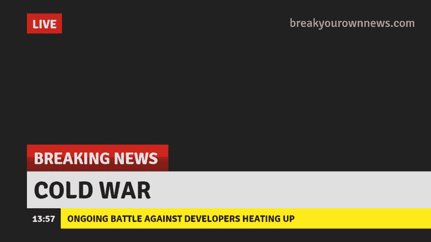

# 如何对你的开发者发动冷战

> 原文：<https://dev.to/spirodonfl/how-to-wage-cold-war-on-your-developers--17n0>

[T2】](https://res.cloudinary.com/practicaldev/image/fetch/s--sCZ8TNnK--/c_limit%2Cf_auto%2Cfl_progressive%2Cq_auto%2Cw_880/https://thepracticaldev.s3.amazonaws.com/i/mssm83yx4sawkeys200k.png)

在整篇文章之前，我想先说一下我的轶事经历。并不是每个人或每个公司都按照将要描述的方法运作。但是如果你想知道如何让你的开发人员退避三舍，因为他们无法忍受和你一起工作或者为你工作，那么这篇文章应该可以提供一些思路。

我将提到两家不同的公司，它们是迄今为止发动这场战争的最佳范例。奇怪的是，有一家公司最终成了我工作过的最好的公司，我渴望回到那种工作中去。我会让你选择哪一个。

# 不负责任

公司 A 有一个网站，网站上的图片对用户体验至关重要。

这些图像来自另一个来源，首席执行官编写了一个系统，将这些图像放入网络安装的文件夹中。这些图像通常尺寸很大，有时数量很大。

这位首席执行官还编写了一个 cron 脚本来检查何时不再需要图像并删除它们。

清理脚本从未被检查过。在我加入之前，人们就认为这是可行的。事实并非如此。不久，网络安装卷的磁盘空间就达到了极限。

这严重破坏了网站。排队我花了几个不眠之夜试图修复和恢复系统。

我不得不离开朋友和家人的时间没有得到任何认可，因为首席执行官不愿花十分钟检查清理脚本的功能。没有人认识或承认他自己的错误。它只是…就在那里，它只是发生了，它什么也不是。

# 承担过多的责任

还记得为 A 公司拍摄的照片吗？还记得我如何不眠不休地工作来帮助修复它吗？首席执行官在快结束的时候进来，重新做了一堆我没有和我商量就做的工作。他在我之前解决了问题(因为我不得不睡午觉),成为了英雄。他造成了这个巨大的问题，从我们上次停止的地方继续，重复我的努力，然后把修复的功劳归于他自己。

在 B 公司，我们有一个巨大的数百万美元的项目，而我们的开发团队太小了。我们至少应该有十几个开发人员，而我们只有四到六个。

不管怎样，我抱怨了几个月，关于我们团队的规模以及这对我们项目的意义。突然，当我们的客户因为我们的进展缓慢而变得焦躁不安时，其中一位经理带来了两个以上的开发人员。他因认识到这种需要并鼓励他们这样做而受到表扬。我不确定我的抱怨落在了哪里，但感觉好像没人理睬。经理也晚了几个月。当他采取行动时，这个项目已经停止了。

# 制造筒仓

在 A 公司，我们有一个初级开发人员，他在不同的情况下可能表现得不好。首席执行官编写了我们正在开发的网站的代码，他不是开发者。他的代码是意大利面条。认知负荷是疯狂的。完全没有惯例。没有任何前后一致的地方。读起来也很糟糕。我可以自信地说，这是我一生中见过的最糟糕的代码和结构。我不希望它发生在任何人身上。不过，CEO 认为他很棒，我们的初级开发人员与他的任务密切相关，所以他们经常一起工作。结果大三无法成长。他所要看的只是代码和结构的废墟。他无法超越。

曾经有一段时间，我们的初级开发人员被认为是我工作效率的拖累，他们把我们分开，并指示我再也不要帮助他。我几乎每天都在帮助这个年轻人。我会回答问题，审查他的代码，帮助他学习和抵制他在代码和结构中看到的负面废话。然而，问题的答案不是帮助这个开发人员，而是讨论他们如何解雇他，并最终切断他与我的联系，我是一个真心想帮助他的人。

在 B 公司，尽管公司本身在任何给定的时间都有至少 20 个或更多的开发人员在工作，但只有 4 到 6 个被分配到我们人手不足的数百万美元的项目中。这些开发人员不仅不知道他们的同事在做什么，而且反过来也一样。在较低的层次上，因为我们没有我们需要的资源，项目的开发人员最终被限制在代码的某些方面。我们的时间很紧，十几个人的项目只有四个人，这是最好的情况。对于开发人员来说，专门化和停留在他们原来的地方比旋转知识更快。整整一年过去了，这些可怜的开发人员被困在一个巨大的项目中，什么也没学到。在一年的时间里什么也学不到，对于 web 开发人员甚至是一般的开发人员来说，可能是一声丧钟。

# 挤压思想

在 A 公司，我记不清有多少次想法因为我自己都无法解释的原因被首席执行官断然拒绝。公司雇佣了某些领域的专家来引进他们的知识。他们随后会提出建议，首席执行官通常会在公开场合压制这些建议，有时是在激烈的争论中。

数据库和代码一样混乱。我记得，在某一点上，这是如此令人苦恼，我建议我们采取某些不需要在同一个数据库中的表(如我们有的 CRM ),并慢慢地将其分成更易于管理的部分。立即没有。

这个主题不仅在我身上反复出现，在其他开发人员身上也是如此，他们经常被证明是正确的，还有公司里其他具有不同专业知识的人。

这也带出了一点:阻断学习机会。当你不断提出完全合理的想法，而且往往会有助于改善很多事情，但不断被告知不，你就被封锁了。失去了尝试新事物或运用现有知识的机会，也失去了展示自己价值和贡献的机会。

# 在推销中过度承诺

在 A 公司，我们不得不去争取那个数百万美元的项目。嗯，当销售团队去做的时候，客户会问这样的问题“你有我们需要的 X，Y，Z 系统来使这个项目成功吗？”销售团队说“是的”,你可以猜到，我们没有。

我知道这有时是销售过程的一部分，也是整个“假装直到你成功”的一部分。但是，在这种情况下，系统是复杂和庞大的，并且有许多移动部件和法律要求。

不仅如此，这一代价最终是由开发人员付出的，他们不得不跳到一个人员不足、高度复杂的项目上，然后看着它全部崩溃和失败。

# 项目人员不足

在公司 A，我们管理着一个相当大的网站，有很多移动的部分。我们有三个人。初级，中级，高级。我们需要更多。即使多几个大三学生也会有很大的帮助。相反，这位首席执行官强迫人力资源部贴出一个神奇的高级开发人员独角兽，他可以做后端，前端，全栈，UI，SEO，UX 等等。任何不符合标准的人都会被立即淘汰。

在 B 公司，这个我已经详细讲过了，就不多说了。但是这花费了我(和其他几个人)每周 100 个小时的工作时间，试图在给定的时间内完成我们的工作量。持续这样做八个月左右是不可持续的。但这是我们为没有足够的开发人员来帮助我们以及管理层忽视这个问题而付出的代价。

# 暗箭伤人

在公司 A，网络安装驱动器已满(第二次是因为首席执行官第一次没有做好修复工作，他的代码也没有正确工作)，因此图像不再显示。又一次，我不得不修理它。

然而，后来，我听说首席执行官告诉人们，包括人力资源部的人，由于某种原因，图像被破坏了，因为我显然在数据库上运行了一些错误的查询。他不仅无法提供这一说法的证据，而且我从未收到他或我的直接经理对此的任何反馈。他们没有直接来找我解决问题，而是更乐意将我的错误传播给公司的其他人(不管是真是假)。这直接关系到…

# 在背后议论

我们在 A 公司的初级开发人员因为很多原因而难以跟上。我已经解释了大部分原因，但还有更多。

绩效评估是一个绝佳的时机，可以告诉他哪里在努力，帮助他改进，或者询问公司如何帮助他变得更好。猜猜这种情况发生了多少次？零次。完全为零。

相反，我私下了解了管理层的谈话，他们说他是垃圾，几个月来，他们急于解雇他。他们没有支持他，给他机会为自己辩护和说话，而是根本不听他的话，抓住机会把他扫地出门。

我一直在想“如果他们在他背后这样谈论他，我不知道他们在说我什么？”

# 错误地判断表现

在 A 公司，我们的业绩是通过有多少联系人询问我们的服务来衡量的。它也是根据我们开发时间的多少来衡量的。这说不通。

不能仅仅根据产品所有者和用户体验领域的成功来判断开发人员。如果你被要求构建一个看起来完全合理的功能，但是在用户交互方面没有预期的效果，开发者不能对此负责。至少不完全是。还有其他人参与了那个决定。

取消奖金或责备开发人员完成了他们上级的要求，但却没有达到要求的效果，这本身就是一种失败。

评判开发者的标准可以留到下次。

# 不善社交

在 A 公司，我数不清 CEO 表现出完全无视基本社会结构的次数。他认为自己凌驾于所有人之上。

有一次我们出去吃了一顿过期的午餐，因为我创建了一个系统，每月为公司节省了数千美元。其他开发人员支持我，所以我们都受益于昂贵的牛排午餐。这是一个很好的增进感情和相互了解的机会。相反，在我们坐下后，首席执行官问道:“好吧，你有什么问题？”。桌子变得安静了。我们不知道他是什么意思。我是高级开发人员，在这个街区呆过一段时间，我意识到他认为这是一次午餐，我们会问这位非常重要的首席执行官一堆商业问题，以了解他有多聪明和商业头脑。

我们是开发商。不是首席执行官。也许我们中的一些人对这种事情感兴趣，但这不是时间或地点。

不管怎样，他进入了一个关于商业目标和我们需要在开发团队中做什么来建立底线的话题。排队剩下的午餐泡汤了。

有一次，我让我怀孕的妻子来办公室见团队。我想让人们更好地了解我和我的家人。

我妻子特意为整个办公室买了些好吃的，然后进来了。每个人都用欢迎的微笑和介绍来迎接她。

介入后两秒，CEO 做什么？戴上耳机去工作，甚至在我妻子离开后也不再和我们有任何瓜葛。

我有更多的故事来说明 CEO 是如何与开发人员打交道的，实际上，也是如何与普通员工打交道的。但是，可以说，培养团队精神和应用社会规范是他的职责，他清楚地表明了这一点。有时他会破坏人们的信任，传播开发者私下告诉他的私人知识。或者，当开发人员不同意他的技术观点时，他会大喊大叫，破口大骂，冲出大楼，摔门而去。

# 结论

与你的开发者进行冷战并不难，我也是其中的一员。从那以后，A 公司失去了所有的开发人员(包括我), B 公司失去了一个数百万美元的项目，这对他们的声誉造成了一点伤害。

不是所有的工作都很容易。不是所有的工作都有趣。不是每个人都能和睦相处。但是有一些基本和基本的东西，任何人都可以遵循和应用，以帮助事情变得更好。

在另一篇文章中，我将回顾开发人员如何与他们的雇主(或客户)进行冷战。我已经把事情搞砸了。我也应该坦诚相待，这才公平。