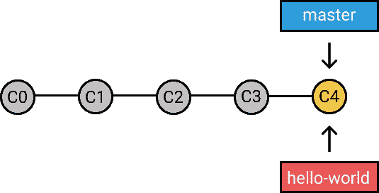
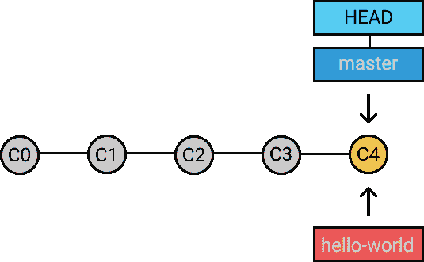
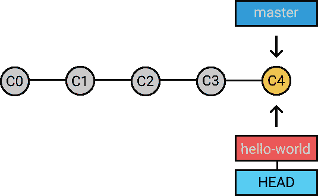
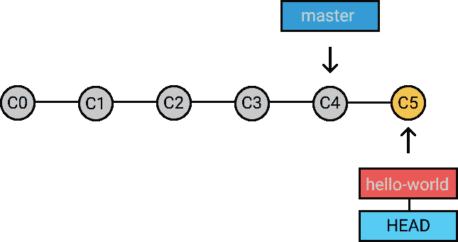
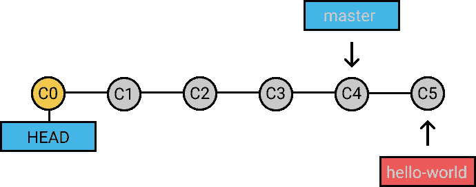
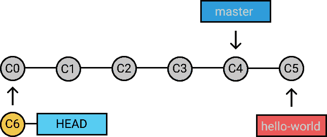
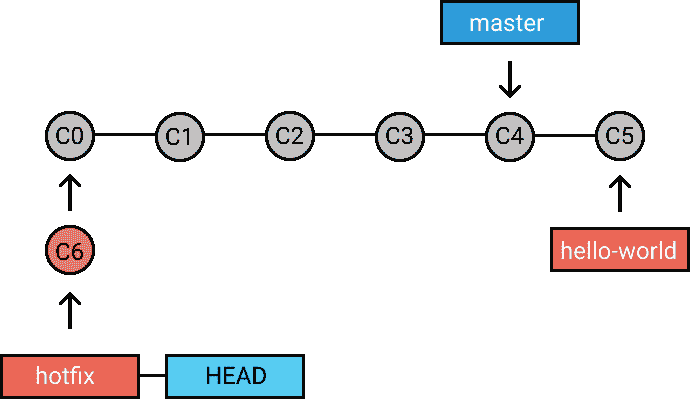

# 如何使用 Git 分支

> 原文：<https://dev.to/neshaz/how-to-work-with-git-branches-30c0>

在当今时代，大多数软件开发公司都在一个**协作环境**中工作，在这个环境中，几个开发人员贡献相同的源代码。有些人会修复错误，而其他人会实现新的和不同的功能。问题出现了，*如何维护同一个代码库的不同版本？*

这就是**分支函数**大放异彩的地方！Branch 允许每个开发人员通过从原始代码库创建一个新的分支来**隔离**他/她的工作。

## 什么是分支？

**分支是一条独立的发展线。**它作为一个**指针**指向你的下一次提交。每当创建一个[新分支](https://git-scm.com/book/en/v2/Git-Branching-Basic-Branching-and-Merging)时，Git 都会创建一个新指针，同时保持原始代码库不变。

当您在存储库中第一次提交时，默认情况下，Git 会自动创建一个**主分支**。在您决定创建并切换到另一个分支之前，您进行的下一次提交都将转到主分支。

## 创建分支

让我们从[创建一个新的分支](https://kolosek.com/git-commands-tutorial-part2/) : `git branch hello-world`开始。

> 这只产生了**新的分支**。要开始处理它，您需要切换到带有`git checkout`的分支。现在，你已经准备好使用标准的`git add`和`git commit`命令了。

您可以看到两个不同的分支指向同一个提交。*Git 如何知道哪个分支当前被检出？*这就是**头部指针**发挥作用的地方！

[T2】](https://res.cloudinary.com/practicaldev/image/fetch/s--54PaglrC--/c_limit%2Cf_auto%2Cfl_progressive%2Cq_auto%2Cw_880/https://storage.kraken.io/kk8yWPxzXVfBD3654oMN/c67bce46b37a3ed035ab3578caae4721/git-branch-head-master.png)

**HEAD** 总是指向当前检出的分支或提交。在我们的例子中，它是主人。让我们看看会发生什么。

[T2】](https://res.cloudinary.com/practicaldev/image/fetch/s--fcF9G9M7--/c_limit%2Cf_auto%2Cfl_progressive%2Cq_auto%2Cw_880/https://storage.kraken.io/kk8yWPxzXVfBD3654oMN/2e1d719f1b70ee891cea0486f745d8ae/git-branch-head-hello.png)

可以看到，头部现在指向的是`hello-world`分支，而不是 master。下一步是修改一些文件，[用`git commit -m "commit message"`创建一个新的提交]((https://kolosek.com/git-commands-tutorial-part2/))

[T2】](https://res.cloudinary.com/practicaldev/image/fetch/s--D-_dH5ka--/c_limit%2Cf_auto%2Cfl_progressive%2Cq_auto%2Cw_880/https://storage.kraken.io/kk8yWPxzXVfBD3654oMN/0b7f7d3500d892133946f6f05109ebca/git-branch-new-commit.png)

在分支`hello-world`中创建了一个**新提交 C5** 。指针总是指向我们签出的那个分支中的最新提交。`hello-world`分支的变化不影响任何其他分支。*分支使你能够将自己的工作与其他人隔离开来。*

> 通常的做法是为每个任务创建一个新的分支**(例如，错误修复、新特性等)，这是一个好的做法，因为它允许其他人容易地识别出**期望什么样的**变化，并且也用于回溯目的以理解为什么特定的代码变化被实现。你可以在 [Git 傻瓜入门指南](https://backlog.com/git-tutorial/stepup/stepup1_1.html)阅读更多内容。**

创建您自己的 **Ruby on Rails** 项目并试用它！在不同的分支上进行 [Rspec 测试](https://kolosek.com/rails-rspec-setup/)，并提交变更。

## 超然的头

正如我们之前说过的，HEAD 总是指向当前检出的分支或提交。**签出**到一个提交，看看`git checkout C0`会发生什么。

[T2】](https://res.cloudinary.com/practicaldev/image/fetch/s--TFhZ14_B--/c_limit%2Cf_auto%2Cfl_progressive%2Cq_auto%2Cw_880/https://storage.kraken.io/kk8yWPxzXVfBD3654oMN/7cb2c78e7074fe052eb153b19907c4b2/git-branch-checkout-commit.png)

现在，矛头指向了 C0。我们当前签出到一个远程分支。*可以在签出提交时创建新的提交吗？*是时候找出答案了！`git commit -m "commit message"`

[T2】](https://res.cloudinary.com/practicaldev/image/fetch/s--FAN_-VxP--/c_limit%2Cf_auto%2Cfl_progressive%2Cq_auto%2Cw_880/https://storage.kraken.io/kk8yWPxzXVfBD3654oMN/9088288889fb85fbf6a1c895bb2c53dc/git-granch-head-detached.png)

头部被分离，并随着每个新创建的提交一起移动。新创建的提交`C6`指向`C0`，它现在表现得像一个分支，但它不是。

> 任何分支或标签都无法到达的提交将在 30 天后被垃圾收集并从存储库中删除。
> 
> 为了避免这种情况，我们只需要为新创建的提交和签出创建一个新的分支。`git checkout -b hotfix C6`。

[T2】](https://res.cloudinary.com/practicaldev/image/fetch/s--bSm9r0JG--/c_limit%2Cf_auto%2Cfl_progressive%2Cq_auto%2Cw_880/https://storage.kraken.io/kk8yWPxzXVfBD3654oMN/d617a0d49810d7489e9a7cc75c59ab03/git-branch-hotfix.png)

当你解决新问题时，一定要使用分支，以避免干扰同事的功能！

这篇文章最初发表在 [Kolosek 博客](https://kolosek.com/git-branches/)上。