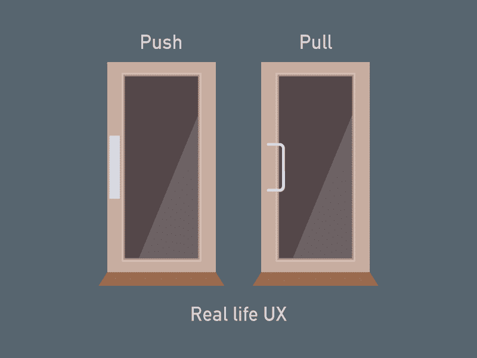
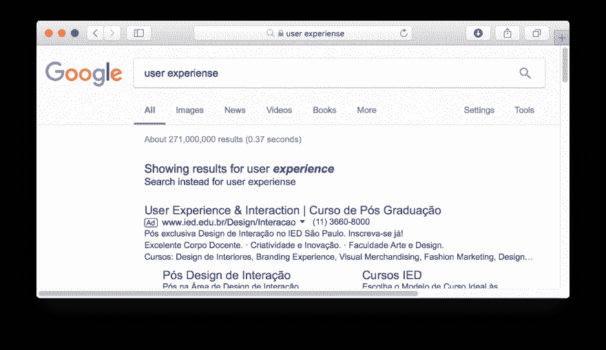

# UX 如何发展你的业务

> 原文：<https://dev.to/vinibrsl/how-ux-can-grow-you-business-208f>

用户体验在今天是生死存亡的问题。了解什么是 UX，如何通过您的业务改善用户体验，以及为什么您应该关注它。

# 这是什么用户体验？

用户体验，或称 UX，是用户与你的公司、服务和产品互动的总体方面，即消费起来有多容易和愉快。这与互联网无关，但是你可以将用户体验应用到你的网站中。

> UX 就是一切。它一直是，但它被低估了，投资不足。——伊万·威廉姆斯，推特的联合创始人

## UX 不是说说看的。

用户体验不是你的产品看起来有多漂亮。UX 是关于互动的。拥有一个好看的页面是很重要的，但是如果你的用户不知道如何与你的服务交互，它的形状就一点也不重要了。

## UX 不是数字。

[T2】](https://res.cloudinary.com/practicaldev/image/fetch/s--gl9Rdedl--/c_limit%2Cf_auto%2Cfl_progressive%2Cq_auto%2Cw_880/https://cdn-images-1.medium.com/max/1600/1%2AnJZO6i76hgWvrGclbqGIgw.png)

用户体验可以应用于网站和移动应用程序等数字服务。但远不止如此。用户体验也是关于用户与你的业务的互动。

你有没有拉开过本该推开的门？那不是你的错。你是用户，门可能有一个坏的 UX。

## UX 可以拓展你的业务。

> 88%的网上购物者在经历了糟糕的体验后不太可能再次光顾某个网站。

用户体验就是关心用户交互。如果你的业务是基于用户的，你应该关心他在使用你的服务时的体验。

# 提高 UX。

你的用户使用你的产品感觉如何？如果答案是否定的，你就有大问题了。当考虑 UX 时，你必须考虑用户。

向您的产品提出以下问题:

## 有用吗？

你提供的产品或服务有效吗？这是您首先要解决的问题。它必须是实用的，而不是花哨或好看的。

如果这是一个 web 应用程序，请确保它在 web 和移动设备中功能齐全并经过优化。

## 快吗？

> 90%的用户表示，由于性能不佳，他们停止使用某个应用程序。

用户不耐烦了。如果你的产品比其他产品慢，你的用户就会离开。用户希望网站在 2 秒或更短时间内加载。如果超过 4 秒，他们就会放弃网站或卸载应用程序。我这样做了，你可能也不知道。UX 是基于实验和验证的。

## 是否无障碍？

> 52%的用户表示，糟糕的移动体验让他们不太可能与公司合作。

你提供的内容必须能被你的目标受众中的每一个人所理解。儿童、盲人、年轻人、老年人、Mac、PC、iOS、Android 和更多变体。

## 用起来有多难？

> 79%的人不喜欢他们在一个网站上找到的东西，他们会回去搜索另一个网站。

用户都是傻逼。向他们提供易于使用的产品。如果不容易，那就让它变得容易学会使用。

## 你的产品是如何为用户错误做准备的？

[T2】](https://res.cloudinary.com/practicaldev/image/fetch/s--QsB5HNcx--/c_limit%2Cf_auto%2Cfl_progressive%2Cq_auto%2Cw_880/https://cdn-images-1.medium.com/max/1600/1%2AHoLuug8zjvT55D6Pkxj4Cw.png)

还是那句话，用户很蠢。他们会失败。这就是为什么谷歌有一个人人都用的自动纠错功能。甚至你的 iPhone 键盘也有这个自动修正功能。

## 奖金:你的产品如何影响用户？

这不是 UX 的建议，更像是商业建议。你的产品或服务解决的是大问题还是小问题？这就是你衡量影响力的方式。这是关于同理心的。如果你想建立用户忠诚度，解决他的一个大问题。

# 我为什么要关心？

如果你让你的用户在使用你的产品时感觉更好，结果会很明显。用户期待你的网站提供良好的体验。还是那句话，事关生死存亡。

问问酒店业就知道了！Airbnb 正在通过提供高质量、以用户为中心和更便宜的服务击败酒店。

拉丁美洲运营商服务怎么样？他们正在被 WhatsApp 服务击败，WhatsApp 服务更便宜，在性能、可访问性和整体 UX 方面好几十亿倍(LatAm 运营商服务相当糟糕)。连我 90 岁的奶奶都在 WhatsApp 上给我发短信。这很容易，也很容易。

根据 BemParaná的说法，在巴西库里蒂巴，优步司机比普通出租车司机还多。人们经常使用优步，由于定价过高和糟糕的用户体验，出租车几乎绝迹。优步让它给乘客带来了豪华的体验。巴西的普通出租车从不提供水瓶、薄荷糖、口香糖和公平的车费。这就是为什么他们被优步、Cabify 和 99(一个本地拼车应用)毁掉了。

> 如果你不跳到新的，你就会死。—微软首席执行官塞特亚·纳德拉