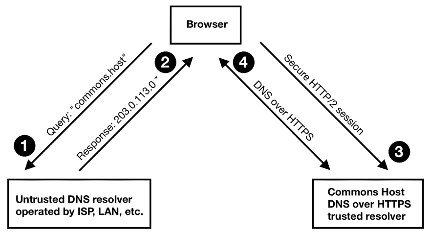

# 我们如何在 10 天内用 20 多台全球边缘服务器构建 DOH CDN。

> 原文：<https://dev.to/commonshost/how-we-built-a-doh-cdn-with-20-global-edge-servers-in-10-days-1man>

就在几个月前，[Commons Host static hosting CDN](https://commons.host)推出了一个单一的边缘服务器。如今，全球有超过 20 台边缘服务器。大多数是廉价的基于 ARM 的微服务器，由志愿贡献者在商品互联网连接(通常是千兆光纤)上托管。另一些是位于云数据中心的虚拟机，提供类似的性能。

[T2】](https://res.cloudinary.com/practicaldev/image/fetch/s--8ULTaaH8--/c_limit%2Cf_auto%2Cfl_progressive%2Cq_auto%2Cw_880/https://thepracticaldev.s3.amazonaws.com/i/m18r6n1l7aeh4u90u6qx.png)

*图示:公共主机 CDN 边缘服务器地图(现场& WIP)*

## 因为我们可以

Kenny 和我在部署自动化方面努力工作。这允许将边缘服务器数量从一位数扩展到两位数。

有了这些工具，我们决定在同一个边缘服务器网络上并行构建和部署一个全新的服务。

我们选择通过 HTTPS 实现 [DNS，简称 DOH。DNS 解析非常适合 Commons 主机服务器网络的优势和限制。全球覆盖带来的低延迟，以及最低的硬件要求。](https://datatracker.ietf.org/doc/draft-ietf-doh-dns-over-https/)

## DNS，遇见 HTTP。HTTP，满足 DNS。

构建 HTTP CDN 需要了解域名系统(DNS)。按互联网规范，DNS 是古老的；比万维网或 HTTP 早很多年。

像 HTTP 或 DNS 这样的标准是互联网工程任务组的工作成果。该组织通过公共邮件列表提供了一个开放的、供应商中立的讨论平台。IETF 还举办会议，每年举行三次，轮流在美洲、欧洲和亚洲举行。

[T2】](https://res.cloudinary.com/practicaldev/image/fetch/s---iLAx4nv--/c_limit%2Cf_auto%2Cfl_progressive%2Cq_auto%2Cw_880/https://www.ietf.org/medimg/download.original.jpg)

*图片:IETF 100 会议的一个环节*

在我们居住的新加坡举行的第 100 届 IETF 大会上，一份名为“HTTPS 域名系统”的草案被提交并引起了激烈的讨论。与会者挤满了会议厅。这是 DNS 和 HTTP 专家之间的世界会议。甚至 DOH 的作者都是来自 DNS ( [Paul Hoffman](https://www.icann.org/profiles/28869) 、 [ICANN](https://www.icann.org) )和 HTTP ( [Patrick McManus](https://twitter.com/mcmanusducksong) ，然后是 [Mozilla](https://www.mozilla.org) 现在是 [Fastly](https://www.fastly.com) )的受人尊敬的领导者。

去年我有幸参加了 IETF 100。这次令人羞愧的经历给人留下了深刻的印象。实施 DOH 也是对这个社区的个人贡献。

## DOH 能有多难？

HTTP 服务器存在。DNS 服务器存在。所以我们就用胶带把两者粘在一起？嗯，基本上，是的。

在好奇心的驱使下，Kenny 在温习 Node.js 和阅读 DOH 草案规范 tabula rasa 的同时编写了第一个 DOH 实现。

在接下来的几天里，我们重写并重构了代码。最后，我们为 Node.js web 服务器构建了一个名为 [Playdoh](https://github.com/qoelet/playdoh) 的中间件。

[T2】](https://res.cloudinary.com/practicaldev/image/fetch/s--TSUxdqBe--/c_limit%2Cf_auto%2Cfl_progressive%2Cq_auto%2Cw_880/https://thepracticaldev.s3.amazonaws.com/i/sx388h6aqfgfoe8hws38.png)

*截图: [Playdoh GitHub 库](https://github.com/qoelet/playdoh)T3】*

Playdoh 在像 Firefox 这样的 doh 客户端和传统的 DNS 服务器之间中继原始的 UDP 消息。Playdoh 是 150 行的 doh 胶带，有 300 行的测试来确保它粘住。

## 部署 DNS 解析器

为了提供全球 DOH 服务，每个边缘服务器都需要运行自己的缓存 DNS 解析器。解析器处理 DNS 查询并缓存响应，以便用户从更快的未来查找中受益。

[T2】](https://res.cloudinary.com/practicaldev/image/fetch/s--Mx2l6qP5--/c_limit%2Cf_auto%2Cfl_progressive%2Cq_auto%2Cw_880/https://thepracticaldev.s3.amazonaws.com/i/q9bhz969n7iv929caqe5.png)

通过与 CDN 行业的朋友交谈，我们了解到了 [Knot Resolver](https://www.knot-resolver.cz) 。Knot Resolver 是由捷克共和国 DNS 注册中心( [CZ)开发的开源软件。网卡](https://www.nic.cz)。有趣的是，Knot Resolver 还支持 1.1.1.1 的[公共 DNS 服务。其他人推荐使用](https://1.1.1.1)[未绑定](https://nlnetlabs.nl/projects/unbound/about/)或[绑定](https://www.isc.org/downloads/bind/)作为解析器。我们还可以在一个混合的网络中运行它们，以获得不同的弹性。

花了几天时间来调整 Knot Resolver 的配置并自动化其部署。这包括远程升级所有边缘服务器的操作系统。一个涉及 ARM 服务器定制供应商内核的冒险提议。对于海外无人值守的物理机，没有按下复位按钮或打开电源开关的选项。唯一的解决方案是使用 vagger/Virtualbox 或在备用硬件上，在试运行环境中进行不懈的仔细测试。最终，我们消除了各种服务器配置之间的细微差异。

这比编写 Playdoh 代码更耗时，也更具技术挑战性。正如[合并请求描述](https://gitlab.com/commonshost/ansible/merge_requests/33)中记录的那样，我们的知识和经验在不断增长。下次这就容易了。

那么 DOH CDN 是如何服务 DNS 流量的呢？

## 自举 DOH CDN:任播 IP vs 地域 DNS

用户需要能够轻松地配置他们的 DNS 设置，并连接到附近的 DNS 服务器进行低延迟查找。

传统的公共 DNS 服务使用昂贵的任播 IP 网络。用户被路由到全球众多边缘服务器中的一个。它们共享相同的 IP 地址，但在互联网交换中使用 BGP 宣布不同的路由。ISP 将通过最短路径路由用户。遗憾的是，由于成本和管理开销，这并不容易实现。

他们也选择容易记忆的 IP 地址。谷歌拥有 8.8.8.8，Cloudflare 拥有 1.1.1.1，Quad9 (IBM)拥有 9.9.9.9，等等。他们的 IPv6 地址不太人性化，但原理是一样的。

对于 DOH，DNS 解析器地址是一个熟悉的 URL，而不是 IP 地址。此 URL 包含域名，因此可以使用签名的 TLS 证书来保护连接。例如: [https://commons.host](https://commons.host)

因此 *DNS 本身*被用于通过 HTTPS 服务将流量定向到 DNS。鸡还是蛋？不完全是。

DOH 通过引导解析器主机名的初始 DNS 查找来工作。这种 DNS 查找仍然由传统的 DNS 服务器处理，如 ISP 或本地服务器。然后，HTTPS 连接将使用该域的签名 TLS 证书来保护。ISP 处恶意(或有故障)DNS 服务器的任何篡改都会导致连接尝试失败。因此没有向 DOH 客户端暴露被篡改的响应的风险。

[T2】](https://res.cloudinary.com/practicaldev/image/fetch/s--lNdKyalE--/c_limit%2Cf_auto%2Cfl_progressive%2Cq_auto%2Cw_880/https://thepracticaldev.s3.amazonaws.com/i/jnm5fzak7l5xi7w4sgd3.png)

*图:DOH 引导序列*

引导程序:

1.  浏览器使用一个标准的、可能不可信的 DNS 服务器对 Commons 主机 DOH 服务器主机名执行 DNS 查找。
2.  DNS 服务器使用最近的公共主机边缘服务器的 IP 地址进行响应。
3.  浏览器与边缘服务器建立 HTTP/2 连接。TLS 证书确保加密和验证的连接。
4.  随后的 DNS 查找在 HTTP/2 连接中进行隧道传输，以防止被第三方窥探或篡改。

*显示的 IP 地址是一个示例。实际地址基于位置和其他性能指标来确定特定用户的最佳边缘服务器。

## 安全性呢？

运行公共 DNS 服务通常充满了安全问题。一个开放的解析器，接受来自互联网上任何人的 DNS 查询，对于 DDoS 僵尸网络和其他恶意行为者来说是一个方便的流量放大器。

放大攻击的工作原理是在一个小的 DNS 查询中欺骗源地址，这样大的 DNS 响应就会被发送到一个不幸的目标。攻击者使用公共 DNS 服务器生成数倍于他们自己的带宽，并将其瞄准目标，同时隐藏自己是发起者。大多数人永远不会想运行这样的服务，事实上，许多 ISP 出于这个原因会阻止端口 53 上的入站 UDP 流量。

DOH 消除了欺骗问题。HTTPS 连接需要安全握手，因此流量不会被欺骗或误导。任何响应总是传递到正确的源，使 DOH 免受扩增攻击。

## 生活在边缘

运行公共 DOH 服务比传统的 DNS 开放解析器容易得多。预计许多组织会提供这样的服务。

Commons 主机网络的一个好处是任何人都可以赞助和托管一个边缘服务器。这带来了本地 CDN 优势，以及运行亚毫秒级延迟(即 LAN) DOH 服务器的绝佳方式。这样做可以提高您的 DNS 查找速度，同时为您的本地社区服务。[有兴趣就联系](https://twitter.com/commonshost)。

## 使用 Commons 主机 DOH

目前 Firefox 是使用 DOH 最简单的方法。

[T2】](https://res.cloudinary.com/practicaldev/image/fetch/s--4MHaQy5m--/c_limit%2Cf_auto%2Cfl_progressive%2Cq_auto%2Cw_880/https://thepracticaldev.s3.amazonaws.com/i/6aqdoym2i14w2zsekwio.png)

*截图:DOH 的火狐网络设置*

1.  在**首选项**屏幕中，打开**连接设置**对话框。
2.  选中复选框:**启用 HTTPS DNS**
3.  输入网址:`https://commons.host`

更多的 DOH 浏览器/操作系统支持和桥接解决方案有望很快推出。Chrome 似乎有一个 DOH 实现正在进行中。

## 最后一件事:自定义域 DOH 解析器

Commons 主机支持自定义域上的 DOH 服务！

在 Commons 主机上部署自定义域就像使用域名管理提供商将 CNAME DNS 记录指向`commons.host`一样简单。

Commons Host 使用 Geo DNS 将域`commons.host`指向最适合全球任何用户的边缘服务器。每台边缘服务器都有自己的公共 IP 地址。边缘 web 服务器运行 Playdoh 中间件，该中间件基于 HTTP 头处理 doh 请求，而常规 web 请求则通过。同一个域和同一个边缘服务器可以同时服务于 web 和 DOH 流量。

只需部署一个带有自定义域的网站，并使用您的个人 URL 作为 DOH 解析器端点。例如:`https://www.$yourdomain.com`

选择特定的 Commons 主机边缘服务器作为 DOH 端点也是如此。每个都可以通过国家代码、机场代码和递增计数器直接寻址。例如:`https://us-lax-1.commons.host`直接连接洛杉矶边缘服务器。