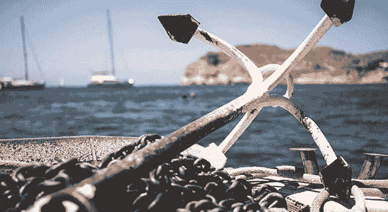
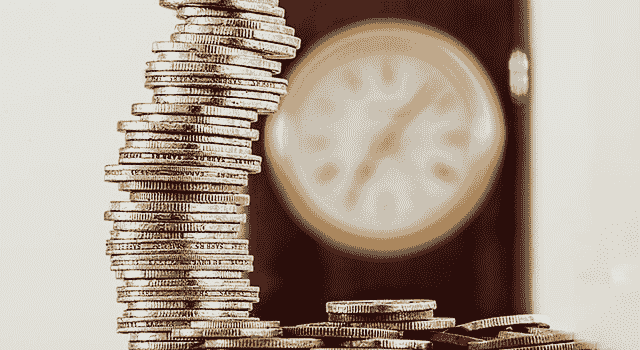
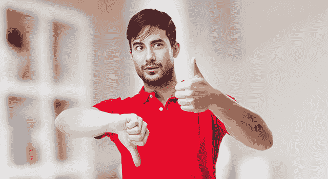
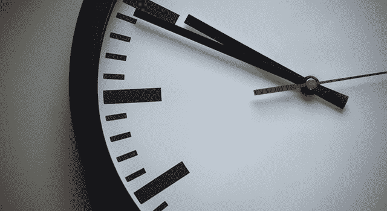

# 我们如何做决定

> 原文：<https://dev.to/actitime/how-we-make-decisions-4920>

我们如何做决定？做这件事有“正确”和“错误”的方法吗？是什么让成功的经理和企业主成为伟大的决策者？决策是一项艰难的工作。这是艰难的，有风险的，而且要求很高。它决定了整个企业和事业的成败，而且似乎不受任何规则的约束。

作为任何工作的关键部分，决策是心理学家和神经科学家彻底研究过的。在这个问题上似乎没有盲点。

同时，仍然有一些方面听起来违反直觉或者不清楚。围绕决策制定，存在常见的误解、有争议的想法和有争议的观点。所以让我们试着弄清楚一些。

## 决策和情绪

最大的不确定性是理智和情感的比例。我们知道情绪驱动的决策是糟糕的(只记得一个蹒跚学步的孩子爬上高高的架子去拿糖果)——但事实证明，没有情绪，决策能力完全退化。

神经学家安东尼奥·达马西奥注意到，处理情绪的大脑部分受损的患者经常犹豫不决。

他的一个病人名叫埃利奥特，是一位成功的商人。但是，在切除了推进他负责处理情绪的额叶的脑瘤后，他不再表现出任何情绪反应。

与此同时，他变得甚至无法做出日常决定。他彻底考虑了每一个细节，这导致无法有效地做出决定——因为没有一个选项会引起任何情绪反应。

随后的一项研究显示了一种趋势。与埃利奥特类似的受伤患者都有这种情感麻木和无法做出决定的组合。所以，在情绪和有效决策之间有一些重要的东西。

我们通常称之为直觉。它比理性更有效，而且令人惊讶的是，它是做出正确决定的可靠方法。它有助于发现什么是你的最佳利益，并最终成为良好判断的基础。

## 直觉:朋友还是敌人？

我们一直被教导要依赖合理的东西:利弊清单、如果/那么逻辑、估计、计算。但在现实中，我们让大脑中非理性的部分来计算并不罕见。对我们的决定是好是坏？

直觉是我们跳过所有逻辑推理，瞬间得出结论的能力。这样的见解在发生时可以节省时间和精力，但是对于一个明智的决策者来说，依靠它们是正确的方式吗？

事实上，有时我们只需要一些细节就能看到全貌。但是遗漏了一些重要的东西会完全扭曲它，误导你。因此，不要仅仅依靠直觉，要确保手头有尽可能多的细节来做出明智的决定。

## 决策的陷阱

甚至当我们的[决策](https://www.actitime.com/dist/img/blog/estimating-and-forecasting.png)过程合理且符合逻辑时，我们也会陷入影响最终结果的常见思维陷阱。我们以前的经验和在我们周围传播的信息会产生偏见——它们会在我们的推理中造成缺陷。以下是其中的一些。

### 1。抛锚陷阱。

[T2】](https://res.cloudinary.com/practicaldev/image/fetch/s--V7_u4bC8--/c_limit%2Cf_auto%2Cfl_progressive%2Cq_auto%2Cw_880/https://www.actitime.com/dist/img/blog/anchor-blog-post.png)

当你已经有一些参考数字时，估计任何事情都比较容易。当你对这个问题有一个模糊的想法时，这就特别棘手了。这种陷阱在价格谈判中被广泛使用(并且经常有效)，当卖方“仅仅为了规模”而设定过高的价格时。他们并不真的期望买方同意支付他们的初始价格，但由此产生的金额通常高于其他情况。如何避免锚定？在咨询他人之前，从自己的角度看待问题，从不同的来源寻求信息，在采取任何行动或谈判之前，仔细思考自己的立场。

### 2。现状陷阱。

[T2】](https://res.cloudinary.com/practicaldev/image/fetch/s--HiXL0mgo--/c_limit%2Cf_auto%2Cfl_progressive%2Cq_auto%2Cw_880/https://www.actitime.com/dist/img/blog/status-quo.png)

简而言之，我们倾向于保持事物不变。适应新环境要求很高，而且总是害怕失败。在商业中，等待和犹豫往往会导致错失良机。这经常发生在投资中:投资者宁愿等待观望，而不是冒险投资。然而，对资本来说，等待可能比将其投入高风险事业更糟糕。为了避免现状的陷阱，提醒自己你的目标，问问自己如果现状不是现实，你会怎么做，永远不要把现状当成你唯一的选择。

### 3。沉没成本陷阱。

[T2】](https://res.cloudinary.com/practicaldev/image/fetch/s--WlePJlRB--/c_limit%2Cf_auto%2Cfl_progressive%2Cq_auto%2Cw_880/https://www.actitime.com/dist/img/blog/sunk-cost.png)

这是为了证明我们之前的选择是正确的，即使(尤其是)是错误的。我们过去的决定就像经济学家所说的“沉没成本”——不可收回的投资——一样，每一个新的决定都受到它们的影响。这种偏见经常出现在银行业:当借款人遇到财务问题时，贷款人会向他们提供额外的资金，即使很明显这些成本永远无法收回。为了避免沉没成本陷阱，倾听那些没有参与事件早期发展的人，不要害怕尽早承认你的错误，不要让对失败的恐惧影响你的思考和决定。

### 4。确认证据陷阱。

[T2】](https://res.cloudinary.com/practicaldev/image/fetch/s--BRw1vxRI--/c_limit%2Cf_auto%2Cfl_progressive%2Cq_auto%2Cw_880/https://www.actitime.com/dist/img/blog/Confirming-evidence.png)

这是为我们下意识倾向的选择寻找理由。这并不是说潜意识的选择总是一个糟糕的选择——只是要确保你的决定是明智的。对自己的动机要诚实，为自己的决定寻找反驳的理由，或者让别人来帮你做这些，当寻求建议时，不要问那些会引起确认证据的引导性问题。

### 5。框架陷阱。

[T2】](https://res.cloudinary.com/practicaldev/image/fetch/s--ofauowrS--/c_limit%2Cf_auto%2Cfl_progressive%2Cq_auto%2Cw_880/https://www.actitime.com/dist/img/blog/framing-trap.png)

框定问题是在很大程度上定义最终决策的第一步。关键的想法是适当地构建它:关注正确的事情，相关的参考点，以及适当的术语。让我们来看看由丹尼尔·卡内曼和阿莫斯·特沃斯基制定的经典实验，有人提出如下建议:

三艘驳船沉没了，每艘船载有价值 20 万美元的货物。你不能拯救全部三个，但是一部分货物仍然可以被拯救。这两个选项你会选哪个？

计划 A:保存三艘驳船中一艘的货物，价值 20 万美元。

方案 B:有三分之一的概率拯救所有三艘驳船价值 600.00 美元的货物，但有三分之二的概率什么也拯救不了。

不出所料，70%的参与者选择了“风险更小”的 A 计划——尽管两个选项的潜在结果是一样的。这些选择只是框架不同而已。为了避免框架错误，总是试图找到几个不同的框架，不要自动接受默认框架，如果其他人建议现成的框架，用不同的框架挑战他们。"

### 6。估计和预测陷阱。

[T2】](https://res.cloudinary.com/practicaldev/image/fetch/s---ChbBSyT--/c_limit%2Cf_auto%2Cfl_progressive%2Cq_auto%2Cw_880/https://www.actitime.com/dist/img/blog/estimating-and-forecasting.png)

我们中没有多少人擅长估算，但我们仍然让估算来指导我们的思考和决策。过度自信和过度谨慎都是不好的，因为受它们影响的估计与现实几乎没有共同之处。为了避免与估计和预测相关的失败，对你的估计和它们的准确性保持诚实，记住以前的事件会影响你的估计，并且总是考虑超出你的估计的极端情况。

该列表仅包含最常见的陷阱。它们更多，但防范所有陷阱的最佳方法是一样的:意识到它们，尽早识别它们，并做出深思熟虑的选择。

## 克服优柔寡断

像其他工作一样，做决定需要时间。但是当谈到优柔寡断时，考虑每个选项并选择最佳选项的过程可能会变成浪费时间。如何避免？有三个简单的规则要遵循:

1.  利用习惯做日常决定。这样你就完全避免了决策过程，节省了你的时间和精力。

2.  使用 if / then 逻辑将不可预测的选择常规化。如果一个特定的事件发生，那么你会以特定的方式做出反应。

3.  使用计时器来减少权衡决定的时间开销，避免推迟决定。如果有几个同样有吸引力的选择，但没有明确的答案，这种方法很有用。

## 总结

做决定并不总是容易的，但它对成功至关重要。决策是一种技能，并且没有提高的极限。意识到它隐藏的机制和陷阱有助于避免典型的错误，做出更好的选择和更明智的决定。