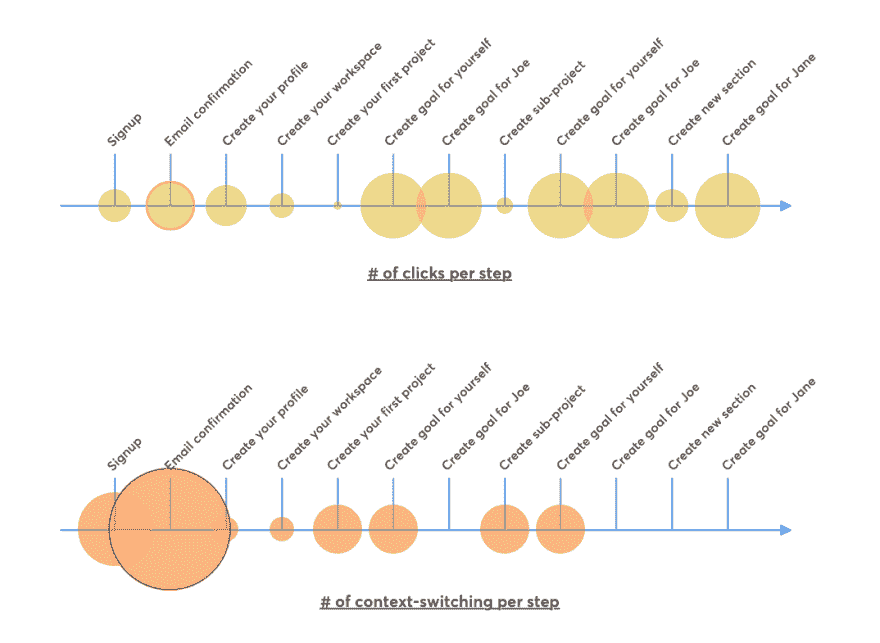
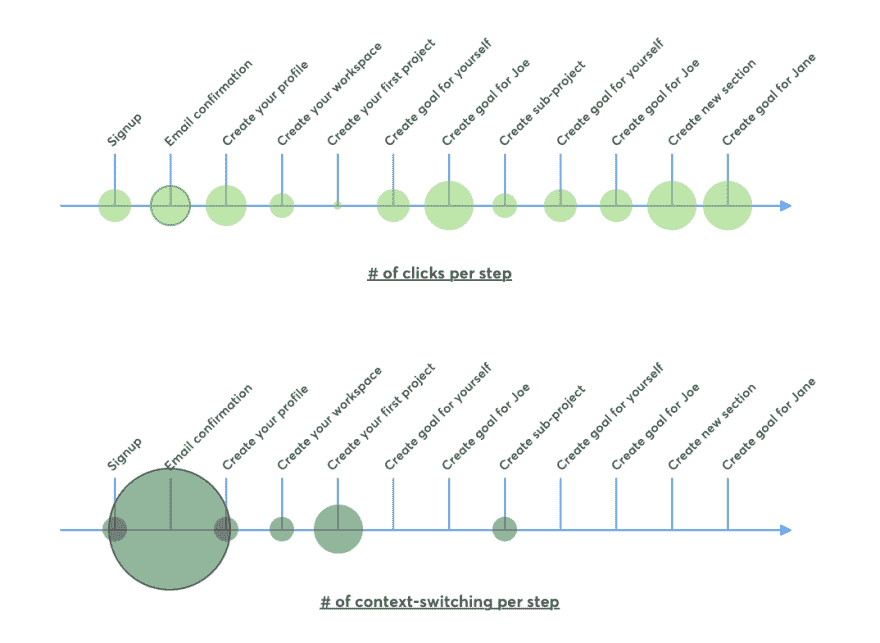
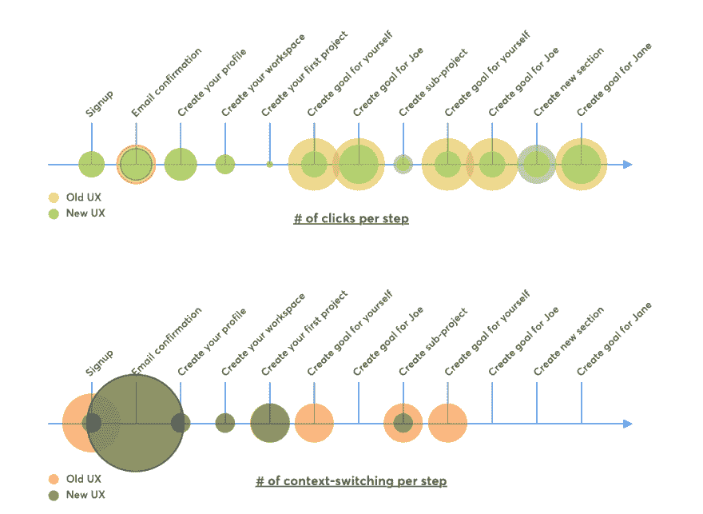

# 我们如何衡量简单性以确保用户可以用更少的资源做更多的事情

> 原文：<https://dev.to/tability/how-we-measure-simplicity-to-make-sure-users-can-do-more-with-less-c1n>

我不太愿意在这里分享这篇文章，因为它更多的是关于 UX，而不是教授一些软件开发的新知识。我认为它仍然是相关的，因为我们在一天结束时都在积累经验。

* * *

在 Squadlytics，我们致力于简化。见鬼，我会更进一步说，这是我们存在的理由，我们已经建立了一个小框架来帮助测量我们产品中的摩擦。

### 等等，什么是 Squadlytics？

我们的平台通过提供关于目标和结果的持续反馈，帮助团队保持专注。我们交谈过的大多数团队都有他们非常关心的目标。他们努力寻找前进的最佳路径，并努力交付最好的作品。

但随着他们的成长，分享进展和了解人们的表现变得困难。你要么使用一个电子表格，它会在公司的所有其他文档中丢失。或者你不得不建立一个笨重的绩效管理系统，这个系统使用起来很复杂，而且会降低反馈的速度。

我们相信我们可以用一个简单、轻量级的解决方案让我们的用户更快乐。我们希望帮助团队了解什么是优先事项，以及他们进展如何。那我们就闪开。

## 我们如何把简单当作一种特性

### 定义衡量简单性的框架

当你发布一个新的功能时，衡量它的成功是相当容易的。您查看分析事件，并将其与您的预期进行比较。衡量添加到产品中的东西的影响是很简单的。

但是当你谈到简化事情，消除行为时，很难理解你移动了多少指针，因为我们缺乏这方面的衡量标准。对我们来说，量化结果(有多少用户注册)比量化过程(用户注册需要付出多少努力)要容易得多。

我们没有想出一个复杂的公式，而是决定看看我们案例中的两件事:

*   完成一个步骤需要点击多少次？
*   你切换了多少次上下文？

然后，我们权衡了这两种行为，认为上下文切换的痛苦是点击的 3 倍。这纯粹是武断的，可以讨论，但目标是反映从一个屏幕到另一个屏幕比点击同一个页面更烦人。所以我们以这个结束:

> 摩擦指数=点击次数+ 3 次上下文切换

### 定义用户流量

一旦我们有了框架，我们必须选择一个用户流来度量。签约后，我们不想停止在最低限度。重复一些核心动作会让我们更好地理解用户经历了什么。

如果你在每个动作的一个实例上停下来，你很容易产生错觉，认为你的过程已经足够好了。但是如果创建一个页面需要点击十几次，如果这是你的产品中经常执行的任务，这将很快成为一种痛苦。

所以我们的场景是这样的:

*   一位用户(您)想要注册 Squadlytics，与两位同事 Joe 和 Jane 一起尝试一下。
*   他们希望一个项目有两个目标(一个为自己，一个为 Joe)。
*   他们想要一个包含 2 个部分和 3 个目标的子项目(1 个为自己，1 个为 Joe，1 个为 Jane)。

这个流程将允许我们涵盖注册、入职、目标创建和邀请。它没有考虑第二个用户的体验，因为我们关注的是第一个用户。

### 建立基线

两周前我们测量了我们的摩擦指数(FI ),结果如下。请注意，我们计算的是最大点击次数，而不是最佳路径。我的意思是，即使你可以按 enter 键提交表单，我们也可以用点击来提交。

| # | 步骤 | 点击 | 上下文切换 | 上下文切换加权(x3) |
| --- | --- | --- | --- | --- |
| one | 签约雇用 | four | three | nine |
| Two | 电子邮件确认 | six | five | Fifteen |
| three | 创建您的个人资料 | five | one | three |
| four | 创建您的工作空间 | three | one | three |
| five | 创建您的第一个项目 | one | Two | six |
| six | 为自己创造目标 | eight | Two | six |
| seven | 为 Joe 创建目标 | eight | Zero | Zero |
| eight | 创建子项目 | Two | Two | six |
| nine | 为自己创造目标 | eight | Two | six |
| Ten | 为 Joe 创建目标 | eight | Zero | Zero |
| Eleven | 创建新部分 | four | Zero | Zero |
| Twelve | 为 Jane 创建目标 | eight | Zero | Zero |
|  | 总数 | Sixty-five | Eighteen | Fifty-four |

老实说，当我第一次看到这些数字的时候，我简直不敢相信这个简单的流程需要 65 次点击和 18 个屏幕。🤯。这是查看数据的另一种方式:每一步循环都与点击或屏幕数量成正比。

[T2】](https://res.cloudinary.com/practicaldev/image/fetch/s--PyBMAE9V--/c_limit%2Cf_auto%2Cfl_progressive%2Cq_auto%2Cw_880/https://thepracticaldev.s3.amazonaws.com/i/zorythc6ovugcnux7sc6.png)

这真的让我感觉很糟糕，但我们有一些工作。我们的 FI 是 119，我们需要减少这个数字。

## 我们为改善用户体验所做的事情

### 减少上下文切换

当用户第一次使用你的产品时，让他们一步一步地经历通常是有用的。但是，如果你保持大量的重复动作，它会很快变得痛苦。

我们的一个例子是创建新项目，我们带您到一个项目表单，然后回到新创建的项目。我们改变了方法，只要你一点击`create`按钮，就自动生成项目。然后，您可以直接从页面上编辑项目标题和其他设置。

### 更好的行内编辑

电子表格的一个优点是，你只需点击一个单元格就可以更新它的值。当用户只想更改一个参数时，这比显示包含多个条目的整个表单要容易得多。

我们在项目视图中实现了内联编辑，这样您就可以更改大多数目标、部分和项目参数，而不必转到另一个屏幕或触发弹出窗口。

### 选择默认值

在创建目标时，我们不会总是要求用户填写所有字段，而是保留之前为所有者、分数和截止日期输入的值。这有助于减少在一个序列中创建多个目标时所需的点击次数，因为其中一些值很可能保持不变。

### 关注右边的字段

很多点击都浪费在点击表单的第一个字段上。只要有意义，我们就切换到自动对焦。同样，它看起来可能什么都不是，但在规模上，它可能会成为 UX 的负担。

## 结果

经过 2 周的工作，这就是指标改进的方式。

| # | 步骤 | 点击 | 上下文切换 | 上下文切换加权(x3) |
| --- | --- | --- | --- | --- |
| one | 签约雇用 | four | one | three |
| Two | 电子邮件确认 | five | five | Fifteen |
| three | 创建您的个人资料 | five | one | three |
| four | 创建您的工作空间 | three | one | three |
| five | 创建您的第一个项目 | one | Two | six |
| six | 为自己创造目标 | four | Zero | Zero |
| seven | 为 Joe 创建目标 | six | Zero | Zero |
| eight | 创建子项目 | three | one | three |
| nine | 为自己创造目标 | four | Zero | Zero |
| Ten | 为 Joe 创建目标 | four | Zero | Zero |
| Eleven | 创建新部分 | six | Zero | Zero |
| Twelve | 为 Jane 创建目标 | six | Zero | Zero |
|  | 总数 | Fifty-one | Eleven | Thirty-three |

我们新的摩擦指数是 84，比之前的体验提高了约 30%。如果你问我，我觉得还是太多了，而且很多都与电子邮件确认步骤有关。但是我非常高兴地看到，我们将创建目标和项目的成本削减了一半，因为这是人们经常用产品做的事情。

[T2】](https://res.cloudinary.com/practicaldev/image/fetch/s--abBGqQyF--/c_limit%2Cf_auto%2Cfl_progressive%2Cq_auto%2Cw_880/https://thepracticaldev.s3.amazonaws.com/i/2oxpyj0qy34qmuq4wl99.png)

从视觉上，我们可以看到切换上下文的步骤更少了，而且我们减少了许多地方的点击次数。

[T2】](https://res.cloudinary.com/practicaldev/image/fetch/s--3xKCBSfm--/c_limit%2Cf_auto%2Cfl_progressive%2Cq_auto%2Cw_880/https://thepracticaldev.s3.amazonaws.com/i/ck8et4hqrbt0mgbnq61l.png)

## 数据不能说明一切

重要的是，不要盲目地看数字，在不了解背景的情况下设定崇高的目标。如果你看绝对数字，它去除了用户体验的所有复杂性，并且它没有帮助理解保持事物简单所需的投资。

[T2】](https://res.cloudinary.com/practicaldev/image/fetch/s--IUSzyHwe--/c_limit%2Cf_auto%2Cfl_progressive%2Cq_auto%2Cw_880/https://thepracticaldev.s3.amazonaws.com/i/fqb5rpjnm68feu3e1n45.png)

重要的是挖掘细节，看看每一步都发生了什么。在我们的例子中，我们突出显示了电子邮件确认步骤。这是因为这意味着我们在那一点上失去了对体验的控制，事情可能比我们想象的要糟糕得多。

另一件事是，许多减少摩擦的想法来自于与我们的用户交谈和观察他们使用产品。有时候你不能偷工减料，最好有更多的点击、屏幕或步骤来解释你的产品的价值。其他时候，你会注意到你在没有意识到的情况下制造了新的痛苦。

## 让用户事半功倍

正如我在介绍中所说，简单对我们来说是一个至关重要的特性。这是我们区别于市场的方式，对我们来说，确保我们帮助客户更快地完成更多工作是至关重要的。

如果有的话，我希望这篇文章能鼓励你看看你的产品，并尝试测量你自己的摩擦指数。

* * *

[Squadlytics](https://squadlytics.com) 是一个持续的反馈平台，帮助团队保持项目正常进行。我们消除了共享目标的摩擦，并使更新变得容易。