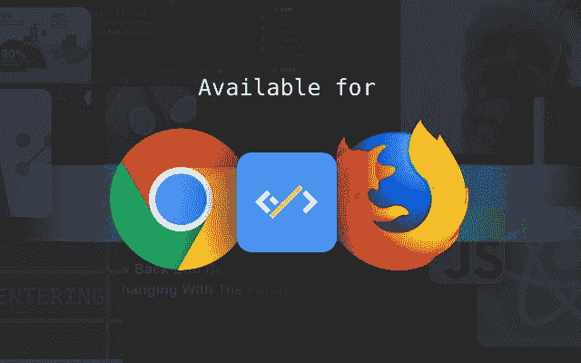

# 我们如何在一个周末内迁移到无服务器

> 原文：<https://dev.to/idoshamun/how-we-migrated-to-serverless-in-a-weekend-4b09>

在 [Daily 的](https://www.dailynow.co/)架构中，一个至关重要的元素是摄取后管道。管道必须订阅新帖子的各种 RSS 和 HTML 订阅源，抓取帖子以获取元数据信息(图片链接、发布时间、作者等)，最后下载、处理并上传帖子图片到 CDN。当然，一切都是实时运行的，以便在文章发表的那一刻提供最新的文章。

直到最近，这个架构还由运行在可抢占机器上的 Akka 流集群提供支持，以降低云成本。Akka 集群负责从发现到将文章发送到中央应用服务器以存储在数据库中的所有事情。对于那些不了解 Akka 的人来说，它是一个强大的并发应用程序 JVM 框架，Akka Stream 专门让您以流的方式构建数据处理管道。我喜欢使用它，但我觉得这一次有点矫枉过正，因为 Akka 是一个有状态应用程序，与无状态应用程序相比，它带来了很多 DevOps 挑战。当谈到可伸缩性时，您必须确保集群节点可以发现彼此，监视要困难得多。

这种情况是对简单性的呼唤，我决定重构一切，但这一次我必须分离关注点，构建无状态工人并监控一切，这样我才能睡得安稳。

* * *

### 分离顾虑

首先，让我们分离关注点，这对于我们的用例来说非常简单:

*   帖子发现—订阅 RSS 或其他订阅源，寻找新帖子。
*   Post enrichment —使用更丰富的信息(如作者、关键字、图像等)丰富从提要接收的基本信息。
*   图像处理——下载帖子图像，将其缩放到相关大小，创建一个占位符，并将所有内容上传到 CDN

### 无国籍&脱钩

第二，我希望不同的工人将是无国籍的，并且彼此分离。每个工人只有一项任务要完成，仅此而已。

进入 Cloud Pub/Sub，我决定使用 Cloud Pub/Sub 在工人之间传递消息，因为它是由 Google Cloud 提供的托管消息队列。显然，可伸缩性不是托管服务的问题，而且除了负责提供下一个任务并接收结果(这是另一个工作任务)的发布/订阅之外，工作人员不需要认识任何人。每个工作人员只需在帖子中添加更多信息，直到帖子准备好，中央应用服务器将其添加到数据库中。

### 使之发生

让我们把****做好，把它造好！当时，Google Cloud Functions 对 nodejs 6 的支持处于测试阶段，在 Google 标准中，这很像 GA，所以我决定尝试一下，因为它要求我构建所有无状态的东西，并且它会根据云发布/订阅负载自动扩展工作人员。

对于 post discovery，我发现了一个名为 [Superfeedr](https://superfeedr.com) 的服务，它完全可以做到这一点，我所需要的就是构建一个 HTTP webhook，它由 Superfeedr 通知，并向 Pub/Sub 发送一条消息。

我只用了一个周末的时间来编写和部署一切。我最终完成了三个项目，每个项目大约有 100 行代码，包括云函数样板代码。该系统现在非常灵活，因为我可以单独部署每个功能，管理自己的依赖关系，发布/订阅使一切容错等等。

我目前体验到的云功能的一个显著缺点是没有部署策略(蓝/绿、滚动更新等)，但对我的用例来说，它没有其他好处重要。

### 监控

为了晚上睡得安稳，我必须设置适当的监控和警报，这样我就可以确保一切正常，我们的用户可以实时收到最新消息。

我使用 Stackdriver 作为我的监控平台。我向云函数添加了 Stackdriver Trace，以确保我可以在中央仪表板中看到错误，并设置警报规则。此外，我根据发布/订阅中未确认消息的比例设置警报，这意味着我的一个服务不工作，需要特别关注。最后，我定义了定制的日志度量来更容易地跟踪错误。

现在，当一些不好的事情发生时，我会立即得到通知，我可以尽快修复它。

* * *

这是我们的迁移故事，我认为它非常快，大部分是在一个周末完成的。监控是后来添加的，当然，在此过程中也进行了错误修复。最终的结果是一个有弹性的系统，可以向 Daily 发送实时帖子！

* * *

[*感谢每日*](https://www.dailynow.co/) *开发者可以专注于代码而不是搜索新闻。只需打开一个新标签，即可立即访问所有这些帖子以及更多内容。*

[T2】](https://app.dailynow.co/download)

* * *